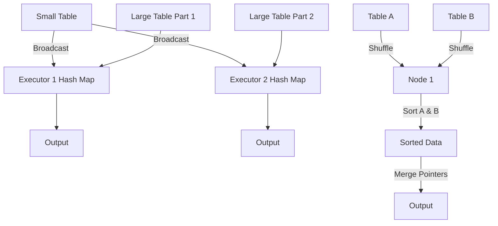

# Joining Data

**Joining in Spark combines two datasets based on a common key, utilizing different distributed algorithms depending on data size, layout, and cluster configuration.**

## Why It Matters
Joins are the backbone of relational data processing. However, unlike a traditional single-node SQL database, joining two massive datasets in a distributed cluster requires moving vast amounts of data across the network (shuffling). Choosing the wrong join strategy can lead to network congestion, extreme memory pressure, and jobs that simply hang forever. Mastering Spark joins means understanding the physical execution strategies Spark uses under the hood.

## How It Works

### RDD Join APIs
For Pair RDDs, Spark provides standard join operations that match SQL semantics:
- `join()`: Inner join.
- `leftOuterJoin()`: Includes all keys from the left RDD.
- `rightOuterJoin()`: Includes all keys from the right RDD.
- `fullOuterJoin()`: Includes all keys from both RDDs.

### Spark SQL Join Strategies
Spark SQL (DataFrames/Datasets) is much smarter than the RDD API. The Catalyst Optimizer automatically selects one of several physical execution plans based on the size of the tables:

1. **Broadcast Hash Join (BHJ)**:
   - **How**: The smaller table is pulled to the driver, broadcasted to all executors, and kept in memory as a hash map. The larger table streams through, looking up matches.
   - **When**: Used when one table is small enough to fit in executor memory (default limit is 10MB, controlled by `spark.sql.autoBroadcastJoinThreshold`).
   - **Benefit**: **Zero shuffles!** Extremely fast.

2. **Shuffle Sort-Merge Join (SMJ)**:
   - **How**: Both tables are shuffled across the network so records with the same key end up on the same node. Both partitions are then sorted by the key, and merged by iterating through them sequentially.
   - **When**: The default strategy for joining two large tables in Spark 2.3+.
   - **Benefit**: Highly scalable and handles datasets that exceed memory limits because the sorting phase can spill to disk.

3. **Shuffle Hash Join**:
   - **How**: Data is shuffled, and the smaller partition on each node is built into an in-memory hash map.
   - **When**: Used when one side is small enough to fit in memory *per partition*, but too large to broadcast overall. Often disabled in favor of SMJ.

## Flow Diagram



## Data Visualization

### RDD Join Outcomes

**Left RDD (A)**: `[(1, "Apple"), (2, "Banana")]`
**Right RDD (B)**: `[(1, "Red"), (3, "Orange")]`

| Join Type | Code | Result |
|-----------|------|--------|
| **Inner** | `A.join(B)` | `[(1, ("Apple", "Red"))]` |
| **Left Outer** | `A.leftOuterJoin(B)`| `[(1, ("Apple", "Red")), (2, ("Banana", None))]` |
| **Right Outer**| `A.rightOuterJoin(B)`| `[(1, ("Apple", "Red")), (3, (None, "Orange"))]`|
| **Full Outer** | `A.fullOuterJoin(B)`| `[(1, ("Apple", "Red")), (2, ("Banana", None)), (3, (None, "Orange"))]` |

## Code Example

```python
from pyspark.sql import SparkSession
from pyspark.sql.functions import broadcast

spark = SparkSession.builder.appName("JoinStrategies").getOrCreate()

# Create large and small DataFrames
large_df = spark.range(1, 10000000).toDF("user_id")
small_df = spark.createDataFrame([(1, "Admin"), (2, "User"), (3, "Guest")], ["user_id", "role"])

# 1. Default Join (Spark will likely choose Broadcast Hash Join automatically 
# because small_df is tiny, but we can force it for safety).
# Without broadcast hint, if statistics are missing, it might do a heavy Sort-Merge.
joined_df = large_df.join(broadcast(small_df), "user_id", "left_outer")
joined_df.explain() 
# Physical Plan will show: BroadcastHashJoin

# 2. Sort Merge Join
# Let's turn off auto-broadcast to force a Sort-Merge Join
spark.conf.set("spark.sql.autoBroadcastJoinThreshold", "-1")

smj_df = large_df.join(small_df, "user_id", "inner")
smj_df.explain()
# Physical Plan will show: SortMergeJoin -> Sort -> Exchange (Shuffle)

# 3. RDD Join Example
sc = spark.sparkContext
rdd1 = sc.parallelize([(1, "A"), (2, "B")])
rdd2 = sc.parallelize([(1, "X"), (3, "Z")])

inner_join_result = rdd1.join(rdd2).collect()
print(f"RDD Inner Join: {inner_join_result}")
# Output: [(1, ('A', 'X'))]
```

## Common Pitfalls
* **Data Skew in Joins**: If one key (e.g., `user_id = null`) represents 50% of the left table, that 50% will be sent to a single executor during a Sort-Merge join, causing extreme slowdowns (straggler task) or OOM. Fix by filtering nulls, or salting the skewed keys.
* **Cartesian/Cross Joins**: Joining without a join condition (or an accidental full cross join) results in `M * N` records. Spark will throw a safety error unless you explicitly enable cross joins, as this can instantly crash a cluster.
* **Not using Broadcast hints**: When joining a massive table with a 50MB lookup table, Spark might default to Sort-Merge because 50MB exceeds the default 10MB limit. Using the `broadcast()` hint forces the faster strategy.

## Key Takeaway
**Optimize joins by eliminating shuffles wherever possible; always broadcast small tables, and pre-partition or salt large tables when relying on Sort-Merge joins to prevent data skew.**
