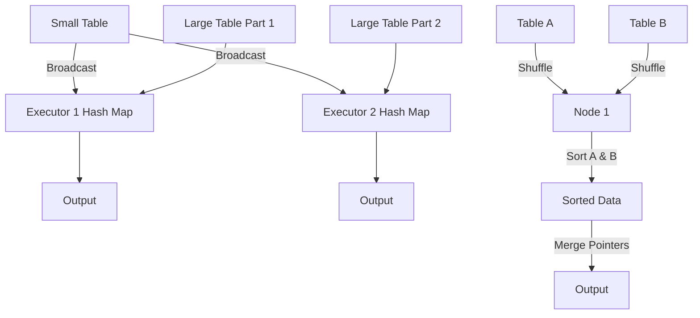

# Joining Data

**Joining in Spark combines two datasets based on a common key, utilizing different distributed algorithms depending on data size, layout, and cluster configuration.**

## Why It Matters
Joins are the backbone of relational data processing. However, unlike a traditional single-node SQL database, joining two massive datasets in a distributed cluster requires moving vast amounts of data across the network (shuffling). Choosing the wrong join strategy can lead to network congestion, extreme memory pressure, and jobs that simply hang forever. Mastering Spark joins means understanding the physical execution strategies Spark uses under the hood.

## How It Works

### RDD Join APIs
For Pair RDDs, Spark provides standard join operations that match SQL semantics:
- `join()`: Inner join.
- `leftOuterJoin()`: Includes all keys from the left RDD.
- `rightOuterJoin()`: Includes all keys from the right RDD.
- `fullOuterJoin()`: Includes all keys from both RDDs.

### Spark SQL Join Strategies
Spark SQL (DataFrames/Datasets) is much smarter than the RDD API. The Catalyst Optimizer automatically selects one of several physical execution plans based on the size of the tables:

1. **Broadcast Hash Join (BHJ)**:
   - **How**: The smaller table is pulled to the driver, broadcasted to all executors, and kept in memory as a hash map. The larger table streams through, looking up matches.
   - **When**: Used when one table is small enough to fit in executor memory (default limit is 10MB, controlled by `spark.sql.autoBroadcastJoinThreshold`).
   - **Benefit**: **Zero shuffles!** Extremely fast.

2. **Shuffle Sort-Merge Join (SMJ)**:
   - **How**: Both tables are shuffled across the network so records with the same key end up on the same node. Both partitions are then sorted by the key, and merged by iterating through them sequentially.
   - **When**: The default strategy for joining two large tables in Spark 2.3+.
   - **Benefit**: Highly scalable and handles datasets that exceed memory limits because the sorting phase can spill to disk.

3. **Shuffle Hash Join**:
   - **How**: Data is shuffled, and the smaller partition on each node is built into an in-memory hash map.
   - **When**: Used when one side is small enough to fit in memory *per partition*, but too large to broadcast overall. Often disabled in favor of SMJ.

## Flow Diagram



## Data Visualization

### RDD Join Outcomes

**Left RDD (A)**: `[(1, "Apple"), (2, "Banana")]`
**Right RDD (B)**: `[(1, "Red"), (3, "Orange")]`

| Join Type | Code | Result |
|-----------|------|--------|
| **Inner** | `A.join(B)` | `[(1, ("Apple", "Red"))]` |
| **Left Outer** | `A.leftOuterJoin(B)`| `[(1, ("Apple", "Red")), (2, ("Banana", None))]` |
| **Right Outer**| `A.rightOuterJoin(B)`| `[(1, ("Apple", "Red")), (3, (None, "Orange"))]`|
| **Full Outer** | `A.fullOuterJoin(B)`| `[(1, ("Apple", "Red")), (2, ("Banana", None)), (3, (None, "Orange"))]` |

## Code Example

```python
from pyspark.sql import SparkSession
from pyspark.sql.functions import broadcast

spark = SparkSession.builder.appName("JoinStrategies").getOrCreate()

# Create large and small DataFrames
large_df = spark.range(1, 10000000).toDF("user_id")
small_df = createDataFrame([(1, "Admin"), (2, "User"), (3, "Guest")], ["user_id", "role"])

# 1. Default Join (Spark will likely choose Broadcast Hash Join automatically 
# because small_df is tiny, but we can force it for safety).
# Without broadcast hint, if statistics are missing, it might do a heavy Sort-Merge.
joined_df = large_df.join(broadcast(small_df), "user_id", "left_outer")
joined_df.explain() 
# Physical Plan will show: BroadcastHashJoin

# 2. Sort Merge Join
# Let's turn off auto-broadcast to force a Sort-Merge Join
spark.conf.set("spark.sql.autoBroadcastJoinThreshold", "-1")

smj_df = large_df.join(small_df, "user_id", "inner")
smj_df.explain()
# Physical Plan will show: SortMergeJoin -> Sort -> Exchange (Shuffle)

# 3. RDD Join Example
sc = spark.sparkContext
rdd1 = sc.parallelize([(1, "A"), (2, "B")])
rdd2 = sc.parallelize([(1, "X"), (3, "Z")])

inner_join_result = rdd1.join(rdd2).collect()
print(f"RDD Inner Join: {inner_join_result}")
# Output: [(1, ('A', 'X'))]
```

## Common Pitfalls
* **Data Skew in Joins**: If one key (e.g., `user_id = null`) represents 50% of the left table, that 50% will be sent to a single executor during a Sort-Merge join, causing extreme slowdowns (straggler task) or OOM. Fix by filtering nulls, or salting the skewed keys.
* **Cartesian/Cross Joins**: Joining without a join condition (or an accidental full cross join) results in `M * N` records. Spark will throw a safety error unless you explicitly enable cross joins, as this can instantly crash a cluster.
* **Not using Broadcast hints**: When joining a massive table with a 50MB lookup table, Spark might default to Sort-Merge because 50MB exceeds the default 10MB limit. Using the `broadcast()` hint forces the faster strategy.

## Key Takeaway
**Optimize joins by eliminating shuffles wherever possible; always broadcast small tables, and pre-partition or salt large tables when relying on Sort-Merge joins to prevent data skew.**


---

## 🎓 Deep Learning Questions

### Q1: Why Was This Concept Introduced?
Joining data in distributed computing historically meant writing complex MapReduce jobs. Hadoop MapReduce required painful "Reduce-side joins" that shuffled massive amounts of data across the network, leading to immense disk I/O and network bottlenecks. Alternatively, "Map-side joins" were difficult to configure and required manual cache distribution. Spark introduced highly optimized, built-in join mechanisms to overcome these bottlenecks. By performing in-memory computation and leveraging the Catalyst Optimizer in Spark SQL, Spark can dynamically select the most efficient physical execution strategy (such as Broadcast Hash Joins) at runtime, drastically reducing network shuffles and disk writes.

### Q2: What Exactly Is This Concept and How Does It Work?
A join is an operation that combines records from two datasets based on a common key. In Spark, the challenge is that data is partitioned across multiple nodes. To join data accurately, Spark must ensure that records with the same key end up on the same physical machine. 
If both tables are large, Spark performs a **Shuffle Sort-Merge Join (SMJ)**: it shuffles data across the network by key, sorts the partitions, and merges matching rows. 
If one table is small, Spark performs a **Broadcast Hash Join (BHJ)**: it copies (broadcasts) the entire small table to every executor node's memory, allowing the large table partitions to stream through and look up matches without any shuffling.

### Q3: Where Should This Concept Be Used?
Joins are ubiquitous in data engineering and analytics:
- **E-commerce:** Joining massive "Orders" fact tables with smaller "Customer" or "Product" dimension tables to enrich transaction data with customer demographics (perfect for Broadcast joins).
- **Banking:** Merging daily transaction logs with historical account balances to detect fraud or compute daily interest.
- **Healthcare:** Correlating patient demographic data with electronic health records (EHR) and billing data to track readmission rates.
- **Log Analysis:** Joining web server logs with IP-to-Geo databases to determine user locations.

### Q4: Where Should This Concept NOT Be Used?
- **Without Pre-Filtering:** Do not join full historical tables if you only need the last 30 days. Always filter datasets *before* joining.
- **Massive Cross Joins (Cartesian Products):** Joining a 1-million-row table with a 1-million-row table without a key condition results in 1 trillion rows. This will easily crash your cluster.
- **Highly Skewed Keys:** If 80% of your records share the same key (e.g., `status = 'ACTIVE'`), joining on this key sends 80% of data to a single executor. Salting or isolating skewed keys is required.

### Q5: How Is This Concept Different from Hadoop?

| Aspect | Hadoop MapReduce | Apache Spark |
|--------|------------------|--------------|
| **Architecture** | Disk-bound execution; intermediate shuffles heavily written to disk. | In-memory execution; relies on Catalyst Optimizer to pick strategies. |
| **Processing Model** | Manual Map-side or Reduce-side joins written in Java. | Declarative SQL or DataFrame API; handles execution plans automatically. |
| **Memory Usage** | Very low, highly reliant on disk I/O. | Heavy memory usage; optimized for RAM with disk spillover only when needed. |
| **Fault Tolerance** | Recomputes from disk via HDFS. | Recomputes missing partitions via RDD lineage. |
| **Scalability** | Excellent for batch, but slow. | Excellent, but requires careful memory tuning. |
| **Ease of Development** | Very complex; requires hundreds of lines of code. | Simple one-liners (`df1.join(df2, "key")`). |
| **Advantages** | Can run reliably on limited hardware. | Extremely fast, flexible execution plans, zero-shuffle broadcast joins. |
| **Disadvantages** | Slow, rigid, verbose syntax. | OOM (Out of Memory) errors common if data skew is mishandled. |

### Q6: How Can This Concept Be Related to a Traditional RDBMS?

| RDBMS SQL Concept | Spark DataFrame Equivalent | What It Does |
|-------------------|----------------------------|--------------|
| `INNER JOIN` | `df.join(other, key, 'inner')` | Returns records with matching keys in both DataFrames. |
| `LEFT OUTER JOIN` | `df.join(other, key, 'left')` | Returns all records from the left, with matched or nulls from the right. |
| `RIGHT OUTER JOIN`| `df.join(other, key, 'right')` | Returns all records from the right, with matched or nulls from the left. |
| `FULL OUTER JOIN` | `df.join(other, key, 'full')` | Returns all records from both sides, padding non-matches with nulls. |
| `CROSS JOIN` | `df.crossJoin(other)` | Returns the Cartesian product of both DataFrames (every combination). |
| `WHERE IN (...)` | `df.join(other, key, 'left_semi')`| Returns records from the left that have a match in the right (columns from right are dropped). |
| `WHERE NOT IN (...)` | `df.join(other, key, 'left_anti')`| Returns records from the left that do *not* have a match in the right. |

### Q7: What Happens Behind the Scenes?
1. **Driver**: The Catalyst Optimizer evaluates the join query. It checks the table statistics (size in bytes).
2. **Strategy Selection**: If one table is < 10MB (default), it selects Broadcast Hash Join. Otherwise, Sort-Merge Join.
3. **Execution (Sort-Merge)**: 
   - **Shuffle Phase**: The cluster hashes the join keys and shuffles data over the network. 
   - **Sort Phase**: Executors sort their respective partitions by the join key.
   - **Merge Phase**: The sorted partitions are iterated over linearly to merge matching rows.
4. **Execution (Broadcast)**:
   - The small table is sent to the Driver, which broadcasts it to all Executors. No shuffle occurs.

```text
Sort-Merge Join Flow:
[Table A] --(Hash Shuffle)--> Node 1 [Sort] \
                                              ---> [Merge] ---> Output
[Table B] --(Hash Shuffle)--> Node 1 [Sort] /
```

### Q8: Performance Considerations, Best Practices, and Common Mistakes

| Category | Recommendation | Why It Matters |
|----------|----------------|----------------|
| **Performance** | Use Broadcast Joins for small dimension tables. | Eliminates network shuffles, reducing execution time by orders of magnitude. |
| **Optimization** | Filter early (Predicate Pushdown). | Don't join 5 years of data if you only need yesterday's. Reduces shuffle payload. |
| **Best Practice** | Use `left_semi` or `left_anti` for existence checks. | Far more efficient than outer joins followed by `isNotNull` filters. |
| **Common Mistake**| Ignoring Data Skew (e.g., null keys). | Causes straggler tasks and OOM errors on a single executor. |
| **Debugging** | Check `df.explain()` before running. | Verifies whether the Catalyst Optimizer chose SMJ or Broadcast as intended. |

### Q9: Interview Questions

**Beginner**
1. **What is a Broadcast join in Spark?**
   *Answer:* It's an optimized join where a small dataset is copied (broadcast) to all executors, avoiding a network shuffle of the larger dataset.
2. **What is the default join type in Spark?**
   *Answer:* Inner join.
3. **What is a Cartesian or Cross join?**
   *Answer:* A join that produces every combination of rows from two tables (M x N). It is highly expensive and often disastrous on large datasets.

**Intermediate**
1. **How do you resolve a Data Skew issue during a join?**
   *Answer:* Filter out nulls before joining, or use a "salting" technique by appending random numbers to the skewed key to distribute it across multiple partitions.
2. **When does Spark choose a Sort-Merge Join over a Broadcast Join?**
   *Answer:* When both tables are larger than the `spark.sql.autoBroadcastJoinThreshold` (default 10MB) and cannot safely fit in executor memory.
3. **What is the difference between a Left Outer Join and a Left Semi Join?**
   *Answer:* A Left Outer Join includes columns from both tables, filling nulls for missing matches. A Left Semi Join only returns columns from the left table where a match exists on the right.

**Advanced**
1. **Explain the physical execution phases of a Shuffle Sort-Merge Join.**
   *Answer:* Data from both tables is hash-partitioned and shuffled across the network. Each node sorts its received partitions by key, then merges the sorted datasets sequentially.
2. **How does Spark handle joining two tables that are already bucketed and sorted by the join key?**
   *Answer:* Spark can skip the expensive shuffle and sort phases entirely (Shuffle-free Sort-Merge Join), directly merging the partitions.
3. **Can you broadcast a table that is 2 GB in size? What are the risks?**
   *Answer:* You can by increasing the broadcast threshold, but the Driver must collect the 2GB table and broadcast it to all nodes. This risks Driver OOM and network flooding.

**Scenario-Based**
1. **Your Spark job hangs at 99% during a join. What is happening?**
   *Answer:* This is a classic symptom of Data Skew. One partition has disproportionately more data than others, creating a "straggler task".
2. **You need to find all users in Table A who have NEVER made a purchase in Table B. How do you do this efficiently?**
   *Answer:* Use a `left_anti` join on the user ID. It acts as an optimized "NOT EXISTS" filter without pulling unnecessary data from Table B.

### Q10: Complete Real-World Example

**Business Problem:** Netflix wants to enrich a massive stream of daily viewing logs with a small reference table containing movie metadata (titles and genres).
**Sample Dataset:** `viewing_logs` (Billions of rows), `movies_dim` (10,000 rows).

```python
from pyspark.sql import SparkSession
from pyspark.sql.functions import broadcast

# Initialize Spark
spark = SparkSession.builder.appName("NetflixDataEnrichment").getOrCreate()

# 1. Create the massive fact table (simulated)
view_data = [
    (101, "u1", 45), (102, "u2", 120), (101, "u3", 30), 
    (103, "u4", 90), (102, "u1", 10)
]
viewing_logs = spark.createDataFrame(view_data, ["movie_id", "user_id", "watch_minutes"])

# 2. Create the small dimension table
movie_metadata = [
    (101, "The Matrix", "Sci-Fi"),
    (102, "Inception", "Sci-Fi"),
    (103, "The Godfather", "Crime")
]
movies_dim = spark.createDataFrame(movie_metadata, ["movie_id", "title", "genre"])

# 3. Perform a Broadcast Hash Join (Enrichment)
# We use a broadcast hint since movies_dim is very small. 
# This prevents viewing_logs from being shuffled across the network.
enriched_logs = viewing_logs.join(
    broadcast(movies_dim), 
    on="movie_id", 
    how="left"
)

# Show the execution plan to verify BroadcastHashJoin
enriched_logs.explain()

# Display results
enriched_logs.show()

'''
Expected Output:
+--------+-------+-------------+-------------+------+
|movie_id|user_id|watch_minutes|        title| genre|
+--------+-------+-------------+-------------+------+
|     101|     u1|           45|   The Matrix|Sci-Fi|
|     102|     u2|          120|    Inception|Sci-Fi|
|     101|     u3|           30|   The Matrix|Sci-Fi|
|     103|     u4|           90|The Godfather| Crime|
|     102|     u1|           10|    Inception|Sci-Fi|
+--------+-------+-------------+-------------+------+
'''
```

### 💡 Key Takeaways
- Joins combine distributed datasets based on a common key.
- Spark SQL abstracts physical execution (Broadcast vs Sort-Merge) from the user.
- Broadcast joins are the holy grail of join performance; they eliminate shuffles.
- Sort-Merge joins are robust and scalable but incur heavy network and disk I/O.
- Data skew is the most common cause of failed or stuck join operations.

### ⚠️ Common Misconceptions
- **"Spark always chooses the best join."** If statistics are missing, Spark might fall back to a Sort-Merge join for a tiny dataset. Always hint when certain.
- **"Outer joins are the same as Semi/Anti joins."** Semi/Anti joins are specialized filters; they do not duplicate rows or pull columns from the right side.
- **"Increasing broadcast threshold fixes everything."** Broadcasting a massive table will crash your Driver node.

### 🔗 Related Spark Concepts
- Catalyst Optimizer
- Data Skew and Salting
- Shuffling and Partitioning
- Bucketing (for Shuffle-Free Joins)

### 📚 References for Further Reading
- Apache Spark Official Documentation
- Learning Spark (O'Reilly)
- Spark: The Definitive Guide (O'Reilly)
