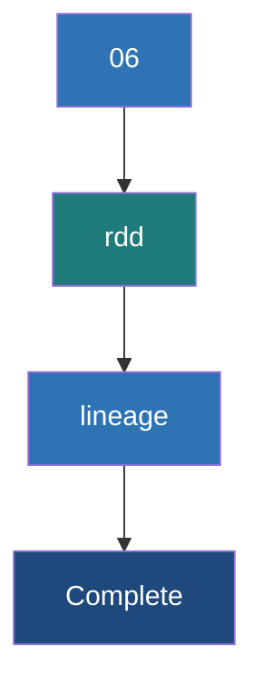

# RDD Lineage and DAG

**RDD Lineage is the logical execution plan of transformations in Spark, represented as a Directed Acyclic Graph (DAG), which enables lazy evaluation and guarantees data fault tolerance without replication.**

## Why It Matters
In traditional systems like Hadoop MapReduce, intermediate data is constantly written to and read from disk to ensure fault tolerance. Spark is exponentially faster because it keeps intermediate data in memory. But what happens if a node crashes and loses that memory? Instead of replicating data, Spark relies on **Lineage**: it simply remembers the exact sequence of transformations required to build that specific piece of lost data and recalculates it from the original source. Understanding lineage is key to debugging performance and understanding how Spark recovers from failure.

## How It Works

### Lazy Evaluation
When you apply a transformation (e.g., `map()`, `filter()`) to an RDD, Spark does *not* execute the computation immediately. Instead, it creates a new RDD that acts as a pointer to the parent RDD, adding the transformation to a graph. This graph of parent-child relationships is the RDD Lineage. 

### Narrow vs Wide Dependencies
The connections between RDDs in the lineage come in two forms:
1. **Narrow Dependency**: Each partition of the parent RDD is used by at most one partition of the child RDD. (e.g., `map`, `filter`). These can be pipelined together on a single node without network movement.
2. **Wide Dependency (Shuffle)**: Multiple child partitions depend on multiple parent partitions. (e.g., `groupByKey`, `reduceByKey`, `join`). These require a full network shuffle and break the execution into separate **Stages**.

### The DAG (Directed Acyclic Graph)
When you call an **Action** (e.g., `collect()`, `saveAsTextFile()`), the DAGScheduler takes the RDD Lineage and builds a physical execution plan (the DAG). It looks at the wide dependencies and uses them as boundaries to chop the lineage into physical Stages.

## Flow Diagram



## Data Visualization

### Lineage and Fault Tolerance

Imagine Node B crashes, losing Partition 2 of RDD 3. 

| RDD State | Dependency Type | How Spark Recovers Partition 2 |
|-----------|-----------------|---------------------------------|
| `RDD 3` (Lost) | -- | Spark looks at lineage: `RDD 3` comes from `RDD 2.filter()` |
| `RDD 2` | Narrow | Spark looks at lineage: `RDD 2` comes from `RDD 1.map()` |
| `RDD 1` | Narrow | Spark reads *only* Partition 2's block from HDFS. |
| **Recovery** | -- | Spark re-runs `map` and `filter` ONLY on Partition 2 on a new node. Partition 1 is unaffected! |

If the lost partition resulted from a Wide Dependency, Spark would have to go back to the previous stage and re-fetch the shuffled data (or even re-run the previous stage if the shuffle files were lost).

## Code Example

```python
from pyspark import SparkContext, SparkConf

conf = SparkConf().setAppName("LineageExample").setMaster("local[*]")
sc = SparkContext(conf=conf)

# Read raw data
rdd1 = sc.parallelize([
    "ERROR: System crash", 
    "INFO: User logged in", 
    "ERROR: Out of memory"
])

# Transformation 1 (Narrow)
rdd2 = rdd1.filter(lambda line: "ERROR" in line)

# Transformation 2 (Narrow)
rdd3 = rdd2.map(lambda line: (line.split(":")[0], 1))

# Transformation 3 (Wide - Shuffle)
rdd4 = rdd3.reduceByKey(lambda x, y: x + y)

# Let's inspect the lineage using toDebugString
print(rdd4.toDebugString().decode("utf-8"))

# The output will look something like this:
# (8) PythonRDD[4] at reduceByKey at <ipython-input-1>
#  |  MapPartitionsRDD[3] at mapPartitions at PythonRDD.scala
#  |  ShuffledRDD[2] at reduceByKey at <ipython-input-1>
#  +-(8) PairwiseRDD[1] at reduceByKey at <ipython-input-1>
#     |  PythonRDD[0] at RDD at PythonRDD.scala
#     |  ParallelCollectionRDD[0] at parallelize at SparkContext.scala

# Nothing has actually executed yet! 
# The execution only starts when we call an action:
results = rdd4.collect()
```

## Common Pitfalls
* **Long Lineages**: If you run iterative algorithms (like machine learning or graph processing) in a loop with hundreds of map/filter transformations, the DAG becomes massive. This causes StackOverflow errors in the driver when it tries to compile the DAG. Use `.checkpoint()` to truncate the lineage and save state to HDFS.
* **Recomputation Expense**: If you have an RDD that takes 30 minutes to compute, and you run `rdd.count()` and then `rdd.collect()`, Spark will recalculate the entire 30-minute lineage *twice*. Use `rdd.cache()` or `rdd.persist()` to save the evaluated data in memory to break the lineage recomputation loop.
* **Ignoring the Web UI**: The DAG visualizer in the Spark Web UI is the best tool for identifying exactly where shuffles are happening. Not using it leads to blind optimization.

## Key Takeaway
**Spark's lazy evaluation and RDD lineage (DAG) allow it to optimize execution plans and provide blazing-fast fault tolerance without the heavy disk I/O of traditional data replication.**
