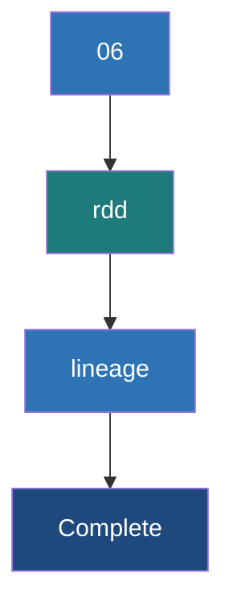

# RDD Lineage and DAG

**RDD Lineage is the logical execution plan of transformations in Spark, represented as a Directed Acyclic Graph (DAG), which enables lazy evaluation and guarantees data fault tolerance without replication.**

## Why It Matters
In traditional systems like Hadoop MapReduce, intermediate data is constantly written to and read from disk to ensure fault tolerance. Spark is exponentially faster because it keeps intermediate data in memory. But what happens if a node crashes and loses that memory? Instead of replicating data, Spark relies on **Lineage**: it simply remembers the exact sequence of transformations required to build that specific piece of lost data and recalculates it from the original source. Understanding lineage is key to debugging performance and understanding how Spark recovers from failure.

## How It Works

### Lazy Evaluation
When you apply a transformation (e.g., `map()`, `filter()`) to an RDD, Spark does *not* execute the computation immediately. Instead, it creates a new RDD that acts as a pointer to the parent RDD, adding the transformation to a graph. This graph of parent-child relationships is the RDD Lineage. 

### Narrow vs Wide Dependencies
The connections between RDDs in the lineage come in two forms:
1. **Narrow Dependency**: Each partition of the parent RDD is used by at most one partition of the child RDD. (e.g., `map`, `filter`). These can be pipelined together on a single node without network movement.
2. **Wide Dependency (Shuffle)**: Multiple child partitions depend on multiple parent partitions. (e.g., `groupByKey`, `reduceByKey`, `join`). These require a full network shuffle and break the execution into separate **Stages**.

### The DAG (Directed Acyclic Graph)
When you call an **Action** (e.g., `collect()`, `saveAsTextFile()`), the DAGScheduler takes the RDD Lineage and builds a physical execution plan (the DAG). It looks at the wide dependencies and uses them as boundaries to chop the lineage into physical Stages.

## Flow Diagram



## Data Visualization

### Lineage and Fault Tolerance

Imagine Node B crashes, losing Partition 2 of RDD 3. 

| RDD State | Dependency Type | How Spark Recovers Partition 2 |
|-----------|-----------------|---------------------------------|
| `RDD 3` (Lost) | -- | Spark looks at lineage: `RDD 3` comes from `RDD 2.filter()` |
| `RDD 2` | Narrow | Spark looks at lineage: `RDD 2` comes from `RDD 1.map()` |
| `RDD 1` | Narrow | Spark reads *only* Partition 2's block from HDFS. |
| **Recovery** | -- | Spark re-runs `map` and `filter` ONLY on Partition 2 on a new node. Partition 1 is unaffected! |

If the lost partition resulted from a Wide Dependency, Spark would have to go back to the previous stage and re-fetch the shuffled data (or even re-run the previous stage if the shuffle files were lost).

## Code Example

```python
from pyspark import SparkContext, SparkConf

conf = SparkConf().setAppName("LineageExample").setMaster("local[*]")
sc = SparkContext(conf=conf)

# Read raw data
rdd1 = sc.parallelize([
    "ERROR: System crash", 
    "INFO: User logged in", 
    "ERROR: Out of memory"
])

# Transformation 1 (Narrow)
rdd2 = rdd1.filter(lambda line: "ERROR" in line)

# Transformation 2 (Narrow)
rdd3 = rdd2.map(lambda line: (line.split(":")[0], 1))

# Transformation 3 (Wide - Shuffle)
rdd4 = rdd3.reduceByKey(lambda x, y: x + y)

# Let's inspect the lineage using toDebugString
print(rdd4.toDebugString().decode("utf-8"))

# The output will look something like this:
# (8) PythonRDD[4] at reduceByKey at <ipython-input-1>
#  |  MapPartitionsRDD[3] at mapPartitions at PythonRDD.scala
#  |  ShuffledRDD[2] at reduceByKey at <ipython-input-1>
#  +-(8) PairwiseRDD[1] at reduceByKey at <ipython-input-1>
#     |  PythonRDD[0] at RDD at PythonRDD.scala
#     |  ParallelCollectionRDD[0] at parallelize at SparkContext.scala

# Nothing has actually executed yet! 
# The execution only starts when we call an action:
results = rdd4.collect()
```

## Common Pitfalls
* **Long Lineages**: If you run iterative algorithms (like machine learning or graph processing) in a loop with hundreds of map/filter transformations, the DAG becomes massive. This causes StackOverflow errors in the driver when it tries to compile the DAG. Use `.checkpoint()` to truncate the lineage and save state to HDFS.
* **Recomputation Expense**: If you have an RDD that takes 30 minutes to compute, and you run `rdd.count()` and then `rdd.collect()`, Spark will recalculate the entire 30-minute lineage *twice*. Use `rdd.cache()` or `rdd.persist()` to save the evaluated data in memory to break the lineage recomputation loop.
* **Ignoring the Web UI**: The DAG visualizer in the Spark Web UI is the best tool for identifying exactly where shuffles are happening. Not using it leads to blind optimization.

## Key Takeaway
**Spark's lazy evaluation and RDD lineage (DAG) allow it to optimize execution plans and provide blazing-fast fault tolerance without the heavy disk I/O of traditional data replication.**


---

## 🎓 Deep Learning Questions

### Q1: Why Was This Concept Introduced?
Before Spark, Hadoop MapReduce handled fault tolerance by writing intermediate results directly to a distributed file system (HDFS) with multiple data replicas. This approach was highly reliable but excessively slow due to heavy disk I/O and network replication for every single step. Spark introduced the concept of RDD Lineage and the Directed Acyclic Graph (DAG) to keep intermediate data in memory safely. By merely logging the *computational steps* (the lineage) instead of saving the physical data, Spark overcomes the slow disk write bottlenecks of Hadoop while maintaining a way to recover lost data dynamically. If a node crashes, Spark replays the lineage DAG to regenerate only the lost partitions from the original source.

### Q2: What Exactly Is This Concept and How Does It Work?
RDD Lineage is essentially a logical execution plan. It is a graph of all parent-child relationships created when transformations (like `map` or `filter`) are chained together. Because transformations are lazy, Spark does not execute them immediately; it simply builds this Directed Acyclic Graph (DAG). 

When an action (like `collect` or `saveAsTextFile`) is called, the DAGScheduler converts this logical plan into a physical execution plan. It looks at the lineage dependencies. It groups "narrow dependencies" (where data doesn't cross partitions, like `map`) into a single "Stage." When it encounters a "wide dependency" (where data must move across the network, like `reduceByKey`), it cuts the graph, forcing a shuffle boundary and starting a new Stage.

### Q3: Where Should This Concept Be Used?
Understanding Lineage and DAGs is critical in every production Spark deployment across all industries:
- **Streaming Platforms (Netflix)**: Managing lineage in long-running Spark Streaming jobs to prevent the lineage from growing infinitely by checkpointing.
- **Log Analytics (Uber)**: Identifying narrow vs. wide dependencies to optimize the DAG, minimizing shuffles while aggregating huge log files.
- **Financial Modeling (Banking)**: When building iterative risk models, understanding that un-cached data forces the DAG to recompute the entire history on every iteration, helping engineers know exactly when to apply `.cache()`.

### Q4: Where Should This Concept NOT Be Used?
While lineage is fundamental to Spark, relying entirely on lineage for fault tolerance is an anti-pattern in highly iterative algorithms (like PageRank or K-Means clustering). If you run 500 iterations of a machine learning model without checkpointing, the DAG lineage grows with each loop. Eventually, the driver cannot track or serialize the massive lineage graph, leading to a `StackOverflowError`. In these scenarios, lineage should be deliberately truncated by using `.checkpoint()` to write the intermediate state to stable storage (HDFS/S3), which breaks the lineage chain.

### Q5: How Is This Concept Different from Hadoop?
| Aspect | Hadoop MapReduce | Apache Spark |
|--------|------------------|--------------|
| **Architecture** | strict map-then-reduce stages | Generalized Directed Acyclic Graph (DAG) |
| **Fault Tolerance** | Data is written to HDFS (replicated 3x) after every job. | Recomputes lost partitions on-the-fly using RDD Lineage. |
| **Performance** | Slower due to constant disk I/O and replication overhead. | Extremely fast because intermediate data stays in memory. |
| **Processing Model** | Physical steps executed sequentially. | Lazy evaluation creates a logical plan before execution. |
| **Scalability** | High, robust for batch. | High, with in-memory optimizations. |
| **Memory Usage** | Minimal caching, reliant on disk. | High memory utilization for caching intermediate RDDs. |
| **Typical Use Cases**| Nightly batch ETL processes. | Iterative machine learning, interactive analytics, streaming. |
| **Ease of Development**| Verbose, manual chaining of jobs. | Clean API chaining, automatically optimized by DAGScheduler. |
| **Advantages** | Can process data larger than cluster memory natively. | 10x-100x faster for multi-pass data workflows. |
| **Disadvantages** | Very high latency for iterative tasks. | Long lineages can cause StackOverflow; memory pressure. |

### Q6: How Can This Concept Be Related to a Traditional RDBMS?
| Spark Concept | RDBMS SQL Equivalent | Explanation |
|---------------|----------------------|-------------|
| **RDD Lineage / DAG** | **SQL Query Execution Plan** | In SQL, writing a query does not run it instantly; the engine builds an execution plan. In Spark, transformations build a DAG logical plan. |
| **Action** | **Query Execution (Execute/Commit)** | The DB executes the query plan and fetches rows. Spark executes the DAG when an action is called. |
| **Narrow Dependency**| **Row-level Operations (Scalar functions)**| Operations applied to single rows independently without grouping (e.g., `UPPER(name)`), just like `map()`. |
| **Wide Dependency** | **GROUP BY / JOIN / ORDER BY** | Operations requiring data to be shuffled across the network/disk to group related keys together. |

### Q7: What Happens Behind the Scenes?
1. **Driver**: The user defines transformations (e.g., `map`, `filter`), and the Driver builds a logical RDD Lineage graph.
2. **Action Trigger**: The user calls an action (e.g., `count()`).
3. **DAGScheduler**: The logical lineage is converted into a physical DAG of Stages. It identifies wide dependencies (shuffles) and uses them to divide the graph into Stage 1, Stage 2, etc.
4. **TaskScheduler**: The stages are divided into Tasks based on the number of partitions.
5. **Executors**: The tasks are shipped to the Executors to run on the actual data partitions.
6. **Execution**: If a task fails, the DAGScheduler simply resubmits that specific task based on the lineage.

```text
[ Logical RDD Lineage ]
RDD1 --> (map) --> RDD2 --> (filter) --> RDD3 --> (reduceByKey) --> RDD4

[ Physical DAG Execution ]
Stage 1 (Narrow)                          Stage 2 (Wide)
[ RDD1(p1) -> map -> filter -> RDD3(p1) ] -- Shuffle --\ 
                                                        --> [ RDD4(p1) -> reduce ]
[ RDD1(p2) -> map -> filter -> RDD3(p2) ] -- Shuffle --/
```

### Q8: Performance Considerations, Best Practices, and Common Mistakes
| Category | Recommendation | Why It Matters |
|----------|----------------|----------------|
| **Optimization** | Chain narrow dependencies together. | Spark pipelines multiple narrow transformations (like a `map` followed by a `filter`) into a single task, avoiding memory overhead. |
| **Best Practice** | Use `.cache()` when an RDD is used by multiple actions. | Calling multiple actions on the same RDD forces the entire lineage to be re-evaluated from scratch each time. Caching breaks this loop. |
| **Common Mistake** | Forgetting to checkpoint iterative machine learning algorithms. | Lineages that grow to thousands of steps will crash the Driver with a `StackOverflowError` during DAG compilation. |
| **Production Tips**| Use the Spark Web UI DAG visualizer. | It visually highlights exact shuffle boundaries, helping you identify which operations are causing network bottlenecks. |

### Q9: Interview Questions
#### Beginner
1. **What is RDD Lineage in Spark?** 
   It is a logical execution plan represented as a graph of parent-child relationships between RDDs.
2. **How does Spark achieve fault tolerance without data replication?**
   If a partition is lost, Spark uses the lineage to remember the exact transformations needed to recompute that partition from the original source.
3. **What is the difference between a narrow and a wide dependency?**
   Narrow dependencies process partitions independently on a single node (e.g., `map`). Wide dependencies require data to be shuffled across the network (e.g., `groupByKey`).

#### Intermediate
4. **When does Spark actually construct and execute the physical DAG?**
   The DAG is constructed and executed only when an Action (like `collect()` or `save()`) is called, due to lazy evaluation.
5. **How does the DAGScheduler divide the lineage into Stages?**
   It traverses the lineage graph and cuts it into physical Stages wherever it encounters a wide dependency (shuffle boundary).
6. **How can you view the lineage of an RDD in PySpark?**
   By calling `rdd.toDebugString()`, which prints the execution plan and dependency tree.

#### Advanced
7. **What happens to the lineage if you cache an RDD?**
   Caching effectively truncates the lineage from an execution perspective. If the cached RDD is available in memory, Spark reads it directly instead of evaluating the upstream lineage. If the memory is lost, it falls back to the lineage.
8. **Why might a Spark job throw a `StackOverflowError` before any tasks are actually executed?**
   If the lineage is incredibly long (e.g., an iterative algorithm without checkpointing), the Driver runs out of memory just trying to traverse and compile the DAG.
9. **Explain the difference between `checkpoint()` and `cache()` regarding lineage.**
   `cache()` keeps the lineage intact (it can still recompute if memory is lost). `checkpoint()` saves data to disk (HDFS) and permanently deletes the upstream lineage to save Driver memory.

#### Scenario-Based
10. **You have an RDD that reads from S3, maps, filters, and then you call `.count()`. Ten minutes later, you call `.collect()` on the same RDD. The total run time is double what you expected. Why?**
    Because you didn't cache the RDD after the filter. Spark discarded the intermediate data after the `.count()` and re-evaluated the entire lineage from S3 again for the `.collect()`.

### Q10: Complete Real-World Example
**Business Problem**: An e-commerce company (like Amazon) wants to process web server access logs to count how many times different error types occurred. They want to see the lineage of the operation to ensure no unnecessary shuffles occur.

**Dataset**: A simple list of log lines containing INFO, WARN, and ERROR tags.

```python
from pyspark import SparkContext, SparkConf

# 1. Initialize Spark
conf = SparkConf().setAppName("LogLineageDAG").setMaster("local[*]")
sc = SparkContext(conf=conf)

# 2. Load Raw Data (Action simulates reading a file)
# Narrow Dependency: parallelize
raw_logs_rdd = sc.parallelize([
    "2023-10-01 10:00:01 ERROR: Database connection failed",
    "2023-10-01 10:00:05 INFO: User login successful",
    "2023-10-01 10:01:02 ERROR: Timeout exception",
    "2023-10-01 10:02:15 WARN: CPU usage high"
])

# 3. Filter for ERROR logs only
# Narrow Dependency: filter operations do not require shuffling
error_logs_rdd = raw_logs_rdd.filter(lambda line: "ERROR" in line)

# 4. Extract just the error type (the word after ERROR:)
# Narrow Dependency: map operations operate on single partitions
error_types_rdd = error_logs_rdd.map(lambda line: (line.split(":")[3].strip(), 1))

# 5. Aggregate to count occurrences of each error type
# Wide Dependency: reduceByKey requires a network shuffle to group keys!
error_counts_rdd = error_types_rdd.reduceByKey(lambda a, b: a + b)

# 6. Print the Lineage (DAG) before executing
print("--- RDD Lineage ---")
print(error_counts_rdd.toDebugString().decode('utf-8'))

# 7. Execute the Action
print("\n--- Execution Results ---")
results = error_counts_rdd.collect()
for error, count in results:
    print(f"Error: {error} | Count: {count}")
    
sc.stop()
```

**Step-by-Step Execution Walkthrough:**
1. Spark lazily builds the lineage graph as `parallelize -> filter -> map -> reduceByKey`.
2. `toDebugString()` is called, printing the logical plan showing the `ShuffledRDD` boundary.
3. `collect()` is called, triggering the DAGScheduler.
4. The DAGScheduler creates Stage 1 encompassing the narrow dependencies (`parallelize`, `filter`, `map`).
5. The DAGScheduler creates Stage 2 starting at the wide dependency (`reduceByKey`).
6. Executors run Stage 1, shuffle the data across the network, run Stage 2, and return the output.

### 💡 Key Takeaways
- RDD Lineage is the logical map of transformations required to build an RDD.
- Spark's fault tolerance comes from re-running the lineage to recalculate lost data, rather than replicating it.
- Narrow dependencies (map, filter) can be pipelined in memory; wide dependencies (reduceByKey) require a network shuffle.
- The DAGScheduler splits the logical lineage into physical execution Stages at shuffle boundaries.
- Extremely long lineages can cause driver crashes and should be truncated using `.checkpoint()`.

### ⚠️ Common Misconceptions
- **"Spark is fast because it never writes to disk."** Spark *does* write to disk during shuffles. It is fast because it keeps *intermediate* narrow-dependency data in memory.
- **"Caching is the same as Checkpointing."** Caching retains the lineage graph; checkpointing truncates and deletes the upstream lineage permanently.
- **"A DAG is only built when you write a complex script."** Spark builds a DAG for every single action you trigger, no matter how simple.

### 🔗 Related Spark Concepts
- Transformations and Actions
- Spark Execution Architecture (Driver, Executors)
- Shuffles and Partitioning
- RDD Persistence (Cache vs. Persist)
- Checkpointing

### 📚 References for Further Reading
- Apache Spark Official Documentation: RDD Programming Guide
- Learning Spark (O'Reilly): Chapter 4 on Spark Execution
- Spark: The Definitive Guide (O'Reilly): Chapter 15 on how Spark runs on a cluster
