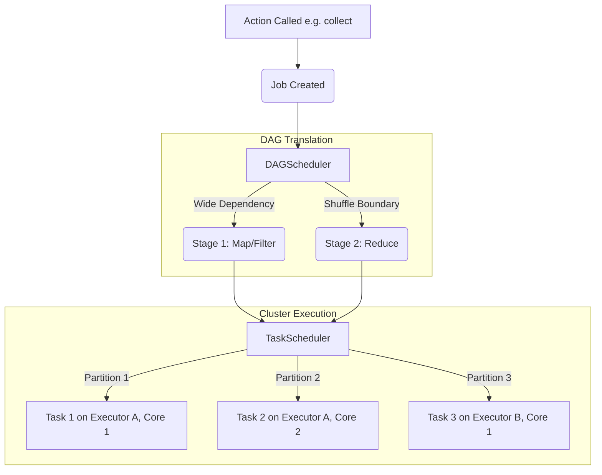

# Spark Stages and Tasks

**Stages and Tasks form the physical execution model of Apache Spark; a Job is divided into Stages at shuffle boundaries, and each Stage is divided into parallel Tasks mapped to data partitions.**

## Why It Matters
Understanding the Job -> Stage -> Task hierarchy is the secret to reading the Spark Web UI, diagnosing bottlenecks, and tuning performance. When a job runs slowly, it's never the whole job that is slow; it is a specific Stage, and often a single straggling Task within that stage. Knowing how the DAGScheduler and TaskScheduler distribute work allows you to optimize memory allocation, CPU core usage, and data locality.

## How It Works

### The Hierarchy
1. **Application**: The highest level, defined by the `SparkContext`. Can contain multiple Jobs.
2. **Job**: Triggered whenever an **Action** (e.g., `collect`, `write`) is called on an RDD/DataFrame.
3. **Stage**: A Job is broken into Stages by the **DAGScheduler**. A Stage is a set of transformations with Narrow Dependencies that can be executed as a pipeline without shuffling. A shuffle (Wide Dependency) marks the boundary between Stages.
4. **Task**: The smallest unit of work, scheduled by the **TaskScheduler**. One Stage creates *exactly one Task per partition of data*. A task runs the stage's pipeline of transformations on a single partition of data on a single executor core.

### Task Locality
To minimize network overhead, the TaskScheduler attempts to send the computation (the Task code) to the node where the data already lives.
- **PROCESS_LOCAL**: Data is in the same JVM memory (cached). (Best)
- **NODE_LOCAL**: Data is on the same physical machine, but might require disk read.
- **RACK_LOCAL**: Data is on a different machine on the same server rack.
- **ANY**: Data must be pulled across the network from anywhere. (Worst)

### Speculative Execution
If 999 tasks finish in 10 seconds, but 1 task takes 5 minutes (due to a faulty network card or noisy neighbor on a shared cluster), Spark can enable **Speculative Execution**. It will launch a duplicate of the slow task on a different node. Whichever finishes first is kept, and the other is killed.

## Flow Diagram



## Data Visualization

### Deconstructing a Spark Job

Let's assume a dataset with 4 partitions, running a map, a filter, and a reduceByKey.

| Level | Count | Explanation |
|-------|-------|-------------|
| **Job** | 1 | Triggered by the final action (e.g., `save()`) |
| **Stage 0 (Map side)**| 1 | Contains the `map`, `filter`, and partial reduce combine. |
| **Tasks in Stage 0**| 4 | One task for each of the 4 partitions. They run in parallel. |
| **Shuffle Boundary**| -- | Data is written to disk and shuffled across the network. |
| **Stage 1 (Reduce)**| 1 | Contains the final `reduceByKey` aggregation. |
| **Tasks in Stage 1**| 200 | Assuming default `spark.sql.shuffle.partitions=200`, there will be 200 tasks here. |

## Code Example

```python
from pyspark.sql import SparkSession
import time

spark = SparkSession.builder \
    .appName("StagesAndTasks") \
    .config("spark.speculation", "true") \
    .config("spark.speculation.multiplier", "1.5") \
    .getOrCreate()
sc = spark.sparkContext

# Create an RDD with 4 partitions
data = sc.parallelize(range(1, 1000000), numSlices=4)

def simulate_straggler(iterator):
    # Simulate a slow task on partition 3
    # Speculative execution should kick in and re-launch this task
    import random
    if random.random() < 0.25: 
        time.sleep(10) 
    yield sum(iterator)

# Stage 0: mapPartitions
# This will spawn 4 Tasks.
sums_rdd = data.mapPartitions(simulate_straggler)

# Stage 1: reduce
# Because this requires bringing the 4 sums together to the driver,
# it is a different stage (though 'reduce' as an action is handled slightly differently than reduceByKey)
total = sums_rdd.reduce(lambda a, b: a + b)

print(f"Total: {total}")
# If you check the Spark UI at http://localhost:4040, you will see:
# - 1 Job
# - 2 Stages (often a ResultStage and ShuffleMapStage depending on the op)
# - In Stage 0, you might see 5 tasks if speculation was triggered (4 original + 1 speculative backup)
```

## Common Pitfalls
* **Not enough tasks**: If you have 100 executor cores but your data only has 10 partitions, Stage 1 will only generate 10 tasks. 90 cores will sit idle. Ensure partitions >= cores (usually 2-3x cores is optimal).
* **Straggler Tasks (Data Skew)**: You look at the Spark UI and see a Stage is 99% complete. 199 out of 200 tasks took 5 seconds. Task 200 takes 2 hours. This is usually data skew (one key is massive), not a hardware issue, so speculative execution won't fix it.
* **Too Many Stages**: Using complex operations iteratively (e.g., in a Python `for` loop) can create hundreds of stages. The TaskScheduler takes time to distribute tasks. If a task executes in 1ms but takes 5ms to schedule, 80% of your cluster time is spent just coordinating.

## Key Takeaway
**Spark scales by dividing Jobs into Stages based on shuffles, and Stages into parallel Tasks based on data partitions; matching partition count to cluster cores is vital for maximizing parallel execution.**
