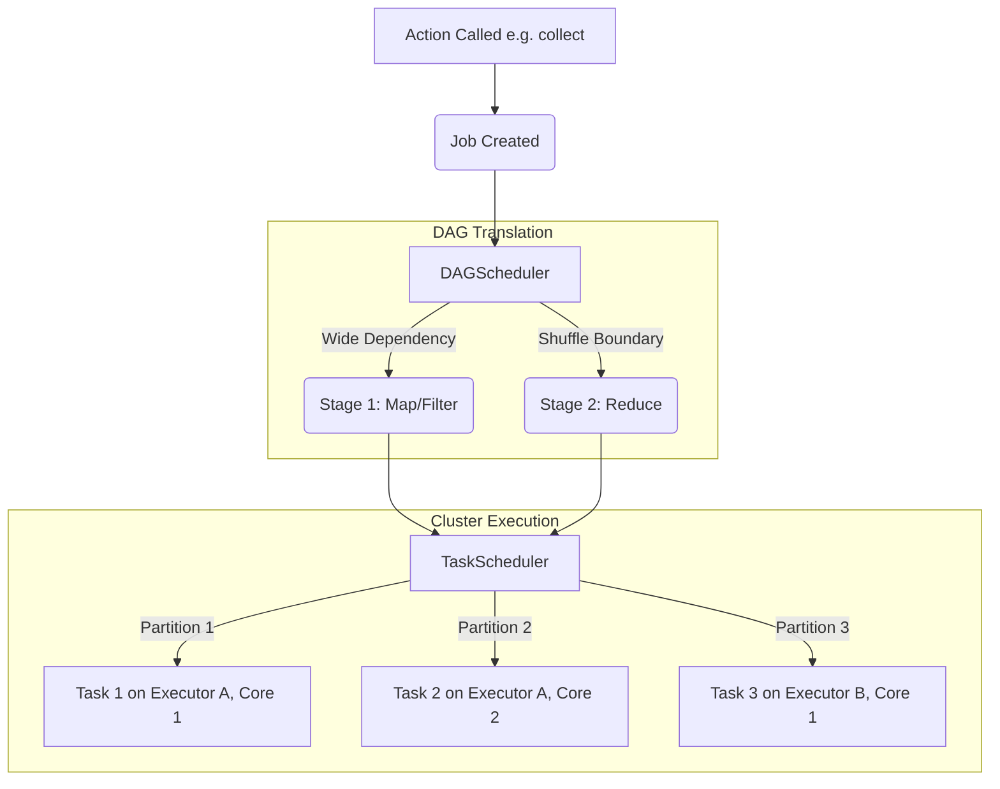

# Spark Stages and Tasks

**Stages and Tasks form the physical execution model of Apache Spark; a Job is divided into Stages at shuffle boundaries, and each Stage is divided into parallel Tasks mapped to data partitions.**

## Why It Matters
Understanding the Job -> Stage -> Task hierarchy is the secret to reading the Spark Web UI, diagnosing bottlenecks, and tuning performance. When a job runs slowly, it's never the whole job that is slow; it is a specific Stage, and often a single straggling Task within that stage. Knowing how the DAGScheduler and TaskScheduler distribute work allows you to optimize memory allocation, CPU core usage, and data locality.

## How It Works

### The Hierarchy
1. **Application**: The highest level, defined by the `SparkContext`. Can contain multiple Jobs.
2. **Job**: Triggered whenever an **Action** (e.g., `collect`, `write`) is called on an RDD/DataFrame.
3. **Stage**: A Job is broken into Stages by the **DAGScheduler**. A Stage is a set of transformations with Narrow Dependencies that can be executed as a pipeline without shuffling. A shuffle (Wide Dependency) marks the boundary between Stages.
4. **Task**: The smallest unit of work, scheduled by the **TaskScheduler**. One Stage creates *exactly one Task per partition of data*. A task runs the stage's pipeline of transformations on a single partition of data on a single executor core.

### Task Locality
To minimize network overhead, the TaskScheduler attempts to send the computation (the Task code) to the node where the data already lives.
- **PROCESS_LOCAL**: Data is in the same JVM memory (cached). (Best)
- **NODE_LOCAL**: Data is on the same physical machine, but might require disk read.
- **RACK_LOCAL**: Data is on a different machine on the same server rack.
- **ANY**: Data must be pulled across the network from anywhere. (Worst)

### Speculative Execution
If 999 tasks finish in 10 seconds, but 1 task takes 5 minutes (due to a faulty network card or noisy neighbor on a shared cluster), Spark can enable **Speculative Execution**. It will launch a duplicate of the slow task on a different node. Whichever finishes first is kept, and the other is killed.

## Flow Diagram



## Data Visualization

### Deconstructing a Spark Job

Let's assume a dataset with 4 partitions, running a map, a filter, and a reduceByKey.

| Level | Count | Explanation |
|-------|-------|-------------|
| **Job** | 1 | Triggered by the final action (e.g., `save()`) |
| **Stage 0 (Map side)**| 1 | Contains the `map`, `filter`, and partial reduce combine. |
| **Tasks in Stage 0**| 4 | One task for each of the 4 partitions. They run in parallel. |
| **Shuffle Boundary**| -- | Data is written to disk and shuffled across the network. |
| **Stage 1 (Reduce)**| 1 | Contains the final `reduceByKey` aggregation. |
| **Tasks in Stage 1**| 200 | Assuming default `spark.sql.shuffle.partitions=200`, there will be 200 tasks here. |

## Code Example

```python
from pyspark.sql import SparkSession
import time

spark = SparkSession.builder \
    .appName("StagesAndTasks") \
    .config("spark.speculation", "true") \
    .config("spark.speculation.multiplier", "1.5") \
    .getOrCreate()
sc = spark.sparkContext

# Create an RDD with 4 partitions
data = sc.parallelize(range(1, 1000000), numSlices=4)

def simulate_straggler(iterator):
    # Simulate a slow task on partition 3
    # Speculative execution should kick in and re-launch this task
    import random
    if random.random() < 0.25: 
        time.sleep(10) 
    yield sum(iterator)

# Stage 0: mapPartitions
# This will spawn 4 Tasks.
sums_rdd = data.mapPartitions(simulate_straggler)

# Stage 1: reduce
# Because this requires bringing the 4 sums together to the driver,
# it is a different stage (though 'reduce' as an action is handled slightly differently than reduceByKey)
total = sums_rdd.reduce(lambda a, b: a + b)

print(f"Total: {total}")
# If you check the Spark UI at http://localhost:4040, you will see:
# - 1 Job
# - 2 Stages (often a ResultStage and ShuffleMapStage depending on the op)
# - In Stage 0, you might see 5 tasks if speculation was triggered (4 original + 1 speculative backup)
```

## Common Pitfalls
* **Not enough tasks**: If you have 100 executor cores but your data only has 10 partitions, Stage 1 will only generate 10 tasks. 90 cores will sit idle. Ensure partitions >= cores (usually 2-3x cores is optimal).
* **Straggler Tasks (Data Skew)**: You look at the Spark UI and see a Stage is 99% complete. 199 out of 200 tasks took 5 seconds. Task 200 takes 2 hours. This is usually data skew (one key is massive), not a hardware issue, so speculative execution won't fix it.
* **Too Many Stages**: Using complex operations iteratively (e.g., in a Python `for` loop) can create hundreds of stages. The TaskScheduler takes time to distribute tasks. If a task executes in 1ms but takes 5ms to schedule, 80% of your cluster time is spent just coordinating.

## Key Takeaway
**Spark scales by dividing Jobs into Stages based on shuffles, and Stages into parallel Tasks based on data partitions; matching partition count to cluster cores is vital for maximizing parallel execution.**


---

## 🎓 Deep Learning Questions

### Q1: Why Was This Concept Introduced?
Before Apache Spark, the Hadoop MapReduce paradigm enforced a strict execution model: every operation required a Map phase followed by a Reduce phase, with mandatory disk I/O between them. If a complex job needed five map-reduce passes, data was written to and read from the physical disk five times. Spark introduced the DAG (Directed Acyclic Graph) execution engine and the concept of **Stages** and **Tasks** to solve this inefficiency. By chaining narrow dependencies (like `map`, `filter`, and `project`) into a single Stage, Spark can perform multiple transformations in memory (pipelining) without intermediate disk writes. The concept of Tasks allows Spark to split these stages into granular, parallel units of work that map directly to data partitions, achieving massive parallelism and minimizing I/O overhead.

### Q2: What Exactly Is This Concept and How Does It Work?
The Job-Stage-Task hierarchy is Spark's physical execution plan. 
- When an **Action** is called, the Spark Driver creates a **Job**.
- The **DAGScheduler** analyzes the logical plan and splits the Job into **Stages** at shuffle boundaries (where data must move across the cluster, like in `groupByKey`). 
- Each Stage consists of operations that can be pipelined together. The DAGScheduler then hands these Stages to the **TaskScheduler**.
- The TaskScheduler breaks the Stage into **Tasks**. A Task is a single thread of execution applied to a single partition of data. If a Stage processes an RDD with 100 partitions, Spark creates 100 Tasks. These tasks are sent to Executors to be processed on individual CPU cores.

### Q3: Where Should This Concept Be Used?
Understanding Stages and Tasks is essential for **tuning, debugging, and scaling Spark applications** in any production environment (like Netflix for recommendation pipelines or Uber for real-time ETAs). 
- **Cluster Sizing:** You use the concept of Tasks to determine how many CPU cores you need. If a Stage consistently produces 200 Tasks, you want a cluster with enough cores to run them efficiently in parallel.
- **Performance Troubleshooting:** When a job is slow, data engineers look at the Spark Web UI's "Stages" tab. Identifying a Stage with an unusually long execution time, or a single "straggler" Task that runs much longer than others, points directly to data skew or hardware issues.

### Q4: Where Should This Concept NOT Be Used?
While you can't "choose" not to use Stages and Tasks (they are built into Spark's core), there are anti-patterns in how you *influence* them:
- **Avoid Excessive Micro-Tasks:** Having millions of tiny partitions creates millions of Tasks. The overhead of the TaskScheduler assigning and tracking these Tasks can exceed the time spent executing them.
- **Avoid Megatasks:** Having very few partitions for massive datasets results in a few massive Tasks that run out of memory (OOM). 
- **Misusing Speculative Execution:** Do not rely on speculative execution (re-launching slow Tasks) to fix **data skew**. Speculation is for hardware/network hiccups. If one key has 90% of your data, the duplicate task will take just as long to process it.

### Q5: How Is This Concept Different from Hadoop?
| Aspect | Hadoop MapReduce | Apache Spark |
|--------|------------------|--------------|
| **Architecture** | Rigid Map and Reduce phases. | Flexible DAG, pipelined Stages. |
| **Performance** | High disk I/O between every Map/Reduce step. | In-memory execution within Stages. |
| **Processing Model** | Step-by-step sequential execution. | Pipelining transformations into Tasks. |
| **Memory Usage** | Heavy reliance on physical disk for intermediate data. | Maximizes RAM usage for intermediate steps. |
| **Fault Tolerance** | Recomputes from disk. | Recomputes lost partitions via lineage graphs (DAG). |
| **Scalability** | High scale, but slow for iterative ML algorithms. | High scale, 10x-100x faster for iterative algorithms. |
| **Ease of Development** | Verbose Java code. | Declarative transformations (DataFrame/SQL). |
| **Typical Use Cases** | Batch log processing. | Machine Learning, ETL, Streaming. |
| **Advantages** | Very stable for massive batch jobs. | Blazing fast, highly expressive API. |
| **Disadvantages** | Slow, rigid execution model. | Prone to OutOfMemory (OOM) errors if untuned. |

### Q6: How Can This Concept Be Related to a Traditional RDBMS?
| Spark Concept | RDBMS Equivalent | Explanation |
|---------------|------------------|-------------|
| **Job** | Complete Query Execution | The overarching execution of a `SELECT` statement yielding results. |
| **Stage** | Query Plan Step (e.g., Hash Join) | A major phase of the query plan, often requiring a sort or data movement. |
| **Task** | Parallel Worker Thread | An individual database thread processing a specific chunk of rows. |
| **Shuffle Boundary** | Temp Table / Hash Distribution | Moving data across nodes or threads to perform aggregations or joins. |
| **DAGScheduler** | Query Optimizer | Translates SQL into an optimized physical execution plan. |

### Q7: What Happens Behind the Scenes?
1. **Driver**: Translates the logical plan into a physical execution plan (DAG).
2. **DAGScheduler**: Walks the DAG backwards from the action, splitting it into Stages at every Wide Dependency (shuffle).
3. **TaskScheduler**: Takes the Stages and generates Tasks based on the number of data Partitions. It considers Task Locality (trying to send code to where the data is).
4. **Executors**: Receive the Tasks and execute them on individual CPU cores.
5. **Shuffle**: When a Stage ends, Tasks write intermediate results to local disk. The next Stage's Tasks fetch this data across the network.

```text
Driver Program
      │
      ▼
DAGScheduler ──(Splits Job at Shuffles)──► Stage 1 (Narrow Deps)
                                              │
                                              ▼
                                       TaskScheduler
                                              │
                                              ├─► Task 1 (Partition 1) ─► Executor A
                                              ├─► Task 2 (Partition 2) ─► Executor A
                                              └─► Task 3 (Partition 3) ─► Executor B
```

### Q8: Performance Considerations, Best Practices, and Common Mistakes
| Category | Recommendation | Why It Matters |
|----------|----------------|----------------|
| **Performance Impact** | Aim for 2-3 tasks per CPU core. | Ensures all cores are busy and handles minor task duration variances efficiently. |
| **Optimization** | Leverage Task Locality. | Sending 10KB of code to the data is millions of times faster than moving 10GB of data to the code. |
| **Best Practices** | Tune `spark.sql.shuffle.partitions`. | The default is 200. For large datasets, this generates too few Tasks (OOM). Increase it (e.g., 2000) for heavy shuffles. |
| **Common Mistakes** | Confusing Data Skew with Hardware Stragglers. | If one task is slow because it has 10x more data (skew), speculation won't help. You must salt the data. |
| **Production Tips** | Monitor the "Tasks" metric in the UI. | If GC (Garbage Collection) time exceeds 10% of Task execution time, give executors more memory. |
| **Debugging** | Watch for massive shuffle writes. | If a Stage has tiny read but massive shuffle write, you might be doing an unintended cartesian product. |

### Q9: Interview Questions
**Beginner**
1. **What is the difference between a Stage and a Task in Spark?**
   A Stage is a grouping of transformations without shuffles. A Task is the execution of that Stage on a single partition of data.
2. **What determines the number of Tasks in a Stage?**
   The number of partitions in the RDD or DataFrame being processed in that Stage.
3. **What causes a Job to split into multiple Stages?**
   Wide dependencies, which require a data shuffle (e.g., `join`, `groupByKey`).

**Intermediate**
1. **Explain the role of the DAGScheduler vs the TaskScheduler.**
   The DAGScheduler splits the logical graph into physical Stages based on shuffle boundaries. The TaskScheduler takes those Stages and launches individual Tasks on Executors, optimizing for data locality.
2. **What does "Task Locality" mean, and what is `PROCESS_LOCAL`?**
   Task Locality is Spark's effort to run computation where the data physically resides. `PROCESS_LOCAL` means the data is cached in the same JVM executing the Task, avoiding all network/disk I/O.
3. **If you have 100 partitions and 10 executor cores, how many tasks will run concurrently?**
   10 tasks will run concurrently. As they finish, the remaining 90 tasks will be scheduled onto the available cores.

**Advanced**
1. **How does Speculative Execution work, and when is it a bad idea to enable it?**
   Speculative execution re-launches abnormally slow tasks on different nodes to bypass hardware issues. It is a bad idea to enable it when dealing with heavy data skew, as the duplicate task will take just as long, wasting resources.
2. **Why might you see a Stage with zero Shuffle Read but massive Shuffle Write?**
   This usually occurs in the Stage immediately preceding a Wide Dependency (a ShuffleMapStage). It reads the source data, applies narrow transformations, and writes the output to disk so the next stage can pull it.
3. **If a Task fails halfway through, does the entire Stage fail?**
   No. The TaskScheduler will automatically retry the failed Task on a different Executor (usually up to 4 times by default). Only if all retries fail does the Stage (and Job) fail.

**Scenario-Based**
1. **You notice in the Spark UI that your cluster has 500 cores, but only 200 tasks are active during a shuffle join. What is wrong and how do you fix it?**
   The `spark.sql.shuffle.partitions` config is likely set to its default (200). You should increase it to at least 1000-1500 (2-3x the core count) to fully utilize the cluster and prevent idle cores.
2. **Stage 3 of your job takes 1 hour. Looking closely, 99 tasks finish in 1 minute, but 1 task takes 59 minutes. How do you troubleshoot this?**
   This is classic data skew. You should identify the key causing the skew, perhaps by sampling the data or checking the UI for the partition size. Fix it using techniques like salting the keys or using a broadcast join if applicable.

### Q10: Complete Real-World Example
**Business Problem:** A streaming service (like Netflix) needs to analyze millions of user viewing records to find the total watch time per movie genre. The cluster is large, so ensuring proper parallel task execution is critical.

**Dataset Description:** A CSV of viewing records with columns `user_id`, `movie_id`, `genre`, and `watch_minutes`. 

**PySpark Code:**
```python
from pyspark.sql import SparkSession
from pyspark.sql.functions import sum, col

# 1. Initialize SparkSession
# Tuning shuffle partitions to ensure we generate enough Tasks for our cluster
spark = SparkSession.builder \
    .appName("TaskExecutionAnalysis") \
    .config("spark.sql.shuffle.partitions", "500") \
    .getOrCreate()

# 2. Load Data (Stage 0 begins)
# Assuming the raw data loads into 100 partitions naturally from HDFS
df = spark.read.csv("hdfs://path/to/viewing_data.csv", header=True, inferSchema=True)

# 3. Narrow Transformations (Still Stage 0)
# Filtering out invalid records. No shuffle needed. 
# Spark pipelines the CSV read and the filter into a single Task per partition.
clean_df = df.filter(col("watch_minutes") > 0)

# 4. Wide Transformation (Ends Stage 0, begins Stage 1)
# GroupBy requires a shuffle. 
# Stage 0 Tasks will write intermediate output to local disks.
# Stage 1 Tasks will fetch this data. Because we set shuffle.partitions=500, Stage 1 will have exactly 500 Tasks.
genre_totals = clean_df.groupBy("genre").agg(sum("watch_minutes").alias("total_minutes"))

# 5. Action (Triggers the Job)
# Collect brings the final reduced data back to the Driver.
results = genre_totals.collect()

for row in results:
    print(f"Genre: {row['genre']} | Total Minutes: {row['total_minutes']}")
```

**Step-by-step execution walkthrough:**
1. The `collect()` action triggers the creation of a Job.
2. The DAGScheduler identifies the `groupBy` as a shuffle boundary and creates two Stages.
3. Stage 0 (Map/Filter): The TaskScheduler launches 100 Tasks (based on the 100 HDFS blocks/partitions). Each task reads a chunk of data, filters it, computes partial genre sums, and writes shuffle files to local disk.
4. Stage 1 (Reduce): The TaskScheduler launches 500 Tasks (based on our config). These tasks reach across the network, fetch their assigned genre keys from the 100 executors, compute the final sums, and send results to the driver.

**Expected Output:**
```text
Genre: Action | Total Minutes: 45030200
Genre: Comedy | Total Minutes: 38920100
...
```

**Performance Notes:**
By explicitly setting `spark.sql.shuffle.partitions` to 500, we ensure that the heavy aggregation stage is broken into 500 distinct Tasks, preventing any single task from running out of memory and keeping a multi-core cluster fully occupied.

### 💡 Key Takeaways
- A Job is triggered by an Action.
- A Stage is a set of transformations divided by Shuffle boundaries.
- A Task is the execution of a Stage on a single partition of data.
- The DAGScheduler translates logical plans to Stages; the TaskScheduler translates Stages to Tasks.
- Matching your partition count to your cluster's CPU cores is the most critical tuning step for Task performance.

### ⚠️ Common Misconceptions
- **"More tasks always mean faster execution."** False. Too many tasks introduce scheduling overhead that ruins performance.
- **"Speculative execution fixes data skew."** False. A duplicate task processing a massive skewed partition will take just as long as the original.
- **"All Stages have the same number of Tasks."** False. Stage 0 might have 10 Tasks based on input files, while Stage 1 has 200 Tasks based on the shuffle partitions configuration.

### 🔗 Related Spark Concepts
- Spark Execution Plan (Logical vs Physical)
- Data Partitioning and Skew
- Shuffle Architecture
- Spark Web UI Navigation

### 📚 References for Further Reading
- Apache Spark Official Documentation
- Learning Spark (O'Reilly)
- Spark: The Definitive Guide (O'Reilly)
