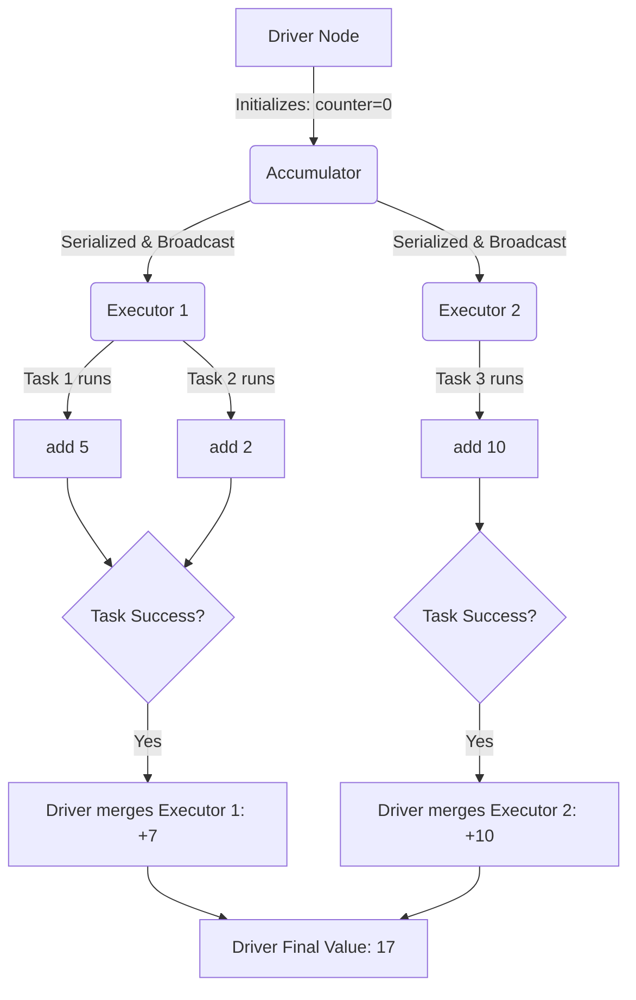

# Accumulators

**Accumulators are distributed, write-only variables that allow executor nodes to safely add data (like counters or metrics) which can then be read exclusively by the driver node.**

## Why It Matters
When working with distributed systems, you cannot use standard global variables (e.g., a simple Python `counter = 0`). Because Spark sends copies of your functions to multiple executor JVMs, modifying a global variable in a function only changes the local copy on that specific executor; the driver node will never see the update. Accumulators provide a thread-safe, distributed mechanism to aggregate information across the cluster, making them essential for debugging, tracking bad records, or collecting custom metrics without interrupting the main data processing flow.

## How It Works

### The Mechanism
1. The driver defines the Accumulator and initializes it with a zero value.
2. The Accumulator is serialized and shipped to the executors along with the task code.
3. As tasks process data, they call `.add()` on the Accumulator. **Executors cannot read the value of the Accumulator.** It is strictly write-only for them.
4. When a task successfully completes, Spark sends the task's accumulator updates back to the driver.
5. The driver merges the updates from all successful tasks to compute the final value.

### Built-in vs Custom
- **Built-in**: Spark provides standard accumulators for primitive types: `LongAccumulator`, `DoubleAccumulator`, and `CollectionAccumulator` (for collecting lists of items).
- **Custom**: You can create complex accumulators (e.g., calculating a distributed mathematical vector) by extending `AccumulatorV2` (in Scala/Java) or subclassing `AccumulatorParam` (in Python) and defining how to add elements and merge accumulators.

## Flow Diagram



## Data Visualization

### Why Global Variables Fail in Spark

**Goal**: Count blank lines in an RDD.

| Approach | Executor 1 Action | Executor 2 Action | Driver Result | Why? |
|----------|-------------------|-------------------|---------------|------|
| **Standard Variable (`counter += 1`)** | Local `counter` = 5 | Local `counter` = 8 | `counter` = 0 | Driver's variable was never updated; changes were local to JVMs. |
| **Accumulator (`acc.add(1)`)** | Local delta = +5 | Local delta = +8 | `acc.value` = 13 | Spark framework safely transmitted and merged the deltas. |

## Code Example

```python
from pyspark.sql import SparkSession

spark = SparkSession.builder.appName("AccumulatorExample").getOrCreate()
sc = spark.sparkContext

# 1. Initialize Accumulators on the driver
blank_line_acc = sc.accumulator(0)
corrupt_record_acc = sc.accumulator(0)

data = [
    "user1,sale,100", 
    "", 
    "user2,sale,200", 
    "user3,refund,BAD_DATA", 
    ""
]
rdd = sc.parallelize(data, 2)

# 2. Use inside a transformation (or map)
def process_record(line):
    # We must reference the global accumulators
    global blank_line_acc, corrupt_record_acc
    
    if not line:
        blank_line_acc.add(1)
        return None
    
    parts = line.split(",")
    if len(parts) == 3:
        try:
            amount = int(parts[2])
            return (parts[0], parts[1], amount)
        except ValueError:
            corrupt_record_acc.add(1)
            return None
    return None

# Apply transformation
parsed_rdd = rdd.map(process_record).filter(lambda x: x is not None)

# WARNING: At this point, accumulator values are 0! 
# Transformations are lazy. Nothing has executed.
print(f"Before action - Blank lines: {blank_line_acc.value}")

# 3. Trigger Action
results = parsed_rdd.collect()

# Now the accumulators have the correct values
print(f"After action - Blank lines: {blank_line_acc.value}")
print(f"After action - Corrupt records: {corrupt_record_acc.value}")
print(f"Valid results: {results}")
```

## Common Pitfalls
* **Double Counting in Transformations**: If you use an accumulator inside a transformation (like `map` or `filter`), and a node crashes causing Spark to re-evaluate the task, the accumulator will be incremented *again*. For absolute accuracy, only use accumulators inside **Actions** (like `foreach`), because Spark guarantees accumulators in actions are updated exactly once.
* **Reading on Executors**: Trying to call `accumulator.value` inside a `map` function. This will throw an exception because executors do not have the global state; they only hold local deltas.
* **Lazy Evaluation Confusion**: Checking the value of an accumulator immediately after defining a `.map()` transformation. The value will be zero until an action (like `collect` or `save`) forces the DAG to execute.

## Key Takeaway
**Accumulators are the only safe way to aggregate global counters across a Spark cluster, but to avoid double-counting due to task failures, they should ideally be incremented inside actions rather than lazy transformations.**
