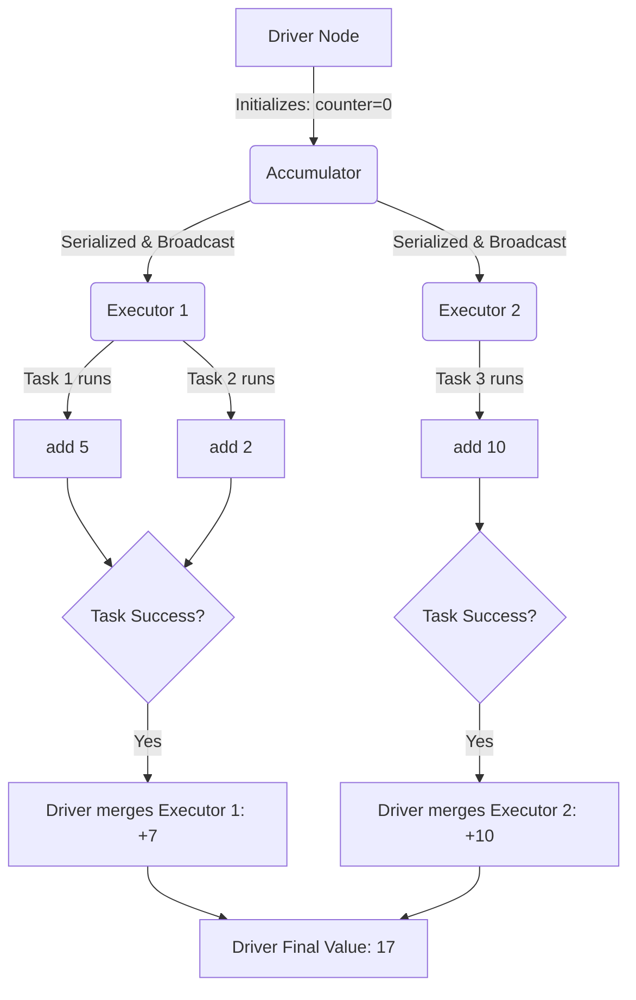

# Accumulators

**Accumulators are distributed, write-only variables that allow executor nodes to safely add data (like counters or metrics) which can then be read exclusively by the driver node.**

## Why It Matters
When working with distributed systems, you cannot use standard global variables (e.g., a simple Python `counter = 0`). Because Spark sends copies of your functions to multiple executor JVMs, modifying a global variable in a function only changes the local copy on that specific executor; the driver node will never see the update. Accumulators provide a thread-safe, distributed mechanism to aggregate information across the cluster, making them essential for debugging, tracking bad records, or collecting custom metrics without interrupting the main data processing flow.

## How It Works

### The Mechanism
1. The driver defines the Accumulator and initializes it with a zero value.
2. The Accumulator is serialized and shipped to the executors along with the task code.
3. As tasks process data, they call `.add()` on the Accumulator. **Executors cannot read the value of the Accumulator.** It is strictly write-only for them.
4. When a task successfully completes, Spark sends the task's accumulator updates back to the driver.
5. The driver merges the updates from all successful tasks to compute the final value.

### Built-in vs Custom
- **Built-in**: Spark provides standard accumulators for primitive types: `LongAccumulator`, `DoubleAccumulator`, and `CollectionAccumulator` (for collecting lists of items).
- **Custom**: You can create complex accumulators (e.g., calculating a distributed mathematical vector) by extending `AccumulatorV2` (in Scala/Java) or subclassing `AccumulatorParam` (in Python) and defining how to add elements and merge accumulators.

## Flow Diagram



## Data Visualization

### Why Global Variables Fail in Spark

**Goal**: Count blank lines in an RDD.

| Approach | Executor 1 Action | Executor 2 Action | Driver Result | Why? |
|----------|-------------------|-------------------|---------------|------|
| **Standard Variable (`counter += 1`)** | Local `counter` = 5 | Local `counter` = 8 | `counter` = 0 | Driver's variable was never updated; changes were local to JVMs. |
| **Accumulator (`acc.add(1)`)** | Local delta = +5 | Local delta = +8 | `acc.value` = 13 | Spark framework safely transmitted and merged the deltas. |

## Code Example

```python
from pyspark.sql import SparkSession

spark = SparkSession.builder.appName("AccumulatorExample").getOrCreate()
sc = spark.sparkContext

# 1. Initialize Accumulators on the driver
blank_line_acc = sc.accumulator(0)
corrupt_record_acc = sc.accumulator(0)

data = [
    "user1,sale,100", 
    "", 
    "user2,sale,200", 
    "user3,refund,BAD_DATA", 
    ""
]
rdd = sc.parallelize(data, 2)

# 2. Use inside a transformation (or map)
def process_record(line):
    # We must reference the global accumulators
    global blank_line_acc, corrupt_record_acc
    
    if not line:
        blank_line_acc.add(1)
        return None
    
    parts = line.split(",")
    if len(parts) == 3:
        try:
            amount = int(parts[2])
            return (parts[0], parts[1], amount)
        except ValueError:
            corrupt_record_acc.add(1)
            return None
    return None

# Apply transformation
parsed_rdd = rdd.map(process_record).filter(lambda x: x is not None)

# WARNING: At this point, accumulator values are 0! 
# Transformations are lazy. Nothing has executed.
print(f"Before action - Blank lines: {blank_line_acc.value}")

# 3. Trigger Action
results = parsed_rdd.collect()

# Now the accumulators have the correct values
print(f"After action - Blank lines: {blank_line_acc.value}")
print(f"After action - Corrupt records: {corrupt_record_acc.value}")
print(f"Valid results: {results}")
```

## Common Pitfalls
* **Double Counting in Transformations**: If you use an accumulator inside a transformation (like `map` or `filter`), and a node crashes causing Spark to re-evaluate the task, the accumulator will be incremented *again*. For absolute accuracy, only use accumulators inside **Actions** (like `foreach`), because Spark guarantees accumulators in actions are updated exactly once.
* **Reading on Executors**: Trying to call `accumulator.value` inside a `map` function. This will throw an exception because executors do not have the global state; they only hold local deltas.
* **Lazy Evaluation Confusion**: Checking the value of an accumulator immediately after defining a `.map()` transformation. The value will be zero until an action (like `collect` or `save`) forces the DAG to execute.

## Key Takeaway
**Accumulators are the only safe way to aggregate global counters across a Spark cluster, but to avoid double-counting due to task failures, they should ideally be incremented inside actions rather than lazy transformations.**


---

## 🎓 Deep Learning Questions

### Q1: Why Was This Concept Introduced?
Before Accumulators, standard global variables in a distributed environment led to silent failures. In a traditional single-machine environment, a global counter is shared across threads. However, in Spark, closures (functions like `map` or `filter`) are serialized and sent to multiple separate worker nodes. If a worker modifies a standard variable, it only modifies its local copy; the driver's variable remains unchanged. This made tracking metrics, like counting corrupted rows or tracking data anomalies during processing, impossible without writing the data to an external database or introducing expensive `reduce` operations. Accumulators overcome this limitation by providing a thread-safe, distributed mechanism to aggregate write-only metrics across the cluster and reliably merge them back to the driver node.

### Q2: What Exactly Is This Concept and How Does It Work?
An Accumulator is a distributed, write-only variable provided by Spark for aggregating information across executors. The driver node defines and initializes the accumulator (e.g., to zero). Spark then ships this accumulator to the executor JVMs along with the tasks. As executors process partitions of data, they call `.add()` to update their local, task-specific copy of the accumulator. Executors cannot read the accumulator's value—they can only write to it. Once a task successfully completes, the executor sends the delta (the accumulated value for that task) back to the driver. The driver then merges all the deltas from successful tasks to compute the final aggregate value, which can be safely read on the driver node.

### Q3: Where Should This Concept Be Used?
Accumulators are ideal for tracking metadata, debugging, and operational metrics without interrupting the main data processing pipeline. 
- **Healthcare & Retail:** Counting the number of records with missing or corrupted fields (e.g., missing patient IDs or invalid SKUs) during an ETL job.
- **Banking:** Tracking the volume of transactions that fall outside a specific business rule threshold for compliance auditing.
- **Uber & Netflix:** Collecting telemetry data or counting specific application events (e.g., dropped user sessions or delayed sensor readings) while simultaneously running the primary analytics workloads. 

### Q4: Where Should This Concept NOT Be Used?
Accumulators should **not** be used for core business logic or when you need exact accuracy within lazy transformations (like `map` or `filter`). If a node crashes or a partition is recomputed due to a shuffle failure, Spark will re-execute the task. If the accumulator was incremented in a transformation, it will be incremented twice, leading to double-counting. Additionally, they should never be used if executors need to read the running total to make a decision—executors cannot read accumulator values. If you need robust distributed state management or exactly-once aggregation, use the DataFrame `groupBy`/`agg` API or structured streaming state stores instead.

### Q5: How Is This Concept Different from Hadoop?

| Aspect | Hadoop MapReduce | Apache Spark |
|---|---|---|
| **Architecture** | Uses MapReduce Counters defined via `Enum` or string groups. | Uses Accumulator variables defined programmatically in the driver. |
| **Performance** | Counters are updated at the end of task execution and sent to JobTracker. | Accumulator deltas are sent to the driver when tasks complete, highly optimized in memory. |
| **Processing Model** | Disk-heavy, Map and Reduce phases. | Memory-centric, updated across DAG stages. |
| **Memory Usage** | Small overhead per node, managed by JobTracker. | Negligible overhead, strictly managed by the Driver JVM. |
| **Fault Tolerance** | MapReduce handles re-execution; counters may also suffer from double-counting if not handled. | Spark handles re-execution; guarantees exactly-once updates *only* when used in Actions. |
| **Scalability** | High, but JobTracker can become a bottleneck with thousands of counters. | High, though excessive unique accumulators can burden the driver memory. |
| **Ease of Development** | Verbose setup requiring specific Hadoop context APIs. | Simple variable initialization and `.add()` syntax in Python/Scala. |
| **Typical Use Cases** | Tracking bad records, Map/Reduce input/output records. | Debugging, tracking anomalies, profiling Spark jobs. |
| **Advantages** | Built-in system-level counters are very robust. | Native integration with Spark's lazy evaluation and functional APIs. |
| **Disadvantages** | Difficult to create dynamic custom counters on the fly. | Prone to double-counting if misused in transformations. |

### Q6: How Can This Concept Be Related to a Traditional RDBMS?

| Spark Concept | Traditional RDBMS Equivalent | Explanation |
|---|---|---|
| **Accumulator** | Global User-Defined Variable / Output Parameter | A variable (e.g., `@@ROWCOUNT` or custom `@counter`) that tracks metrics across operations without storing them in a table. |
| **Driver Node** | Database Server / Master Thread | The central coordinator that initializes the variable and reads its final merged value. |
| **Executors** | Worker Threads / Parallel Query Execution | Parallel threads processing data and incrementing their local counters before merging them. |
| **`.add()` Operation** | `SET @counter = @counter + 1` | Incrementing the shared metric during record processing. |

### Q7: What Happens Behind the Scenes?
1. **Driver:** The user creates an accumulator (e.g., `acc = sc.accumulator(0)`). The driver registers it and prepares it for distribution.
2. **DAG & Scheduler:** The job is divided into Stages and Tasks. The accumulator's initial state is serialized along with the task closures.
3. **Tasks & Executors:** Tasks run on executor nodes. As a task processes a partition, it calls `acc.add()`. The executor maintains a thread-safe local delta for this accumulator.
4. **Task Completion:** When the task finishes successfully, the executor sends the delta value back to the driver via heartbeat mechanisms or task result messages.
5. **Shuffle & Memory:** Accumulator updates bypass the standard shuffle mechanism. They are lightweight metadata messages.
6. **Driver Merge:** The driver receives the deltas and adds them to its master copy.

```text
[Driver (acc=0)] 
       | (Serialize & Broadcast)
       v
+-----------------------+   +-----------------------+
| Executor 1            |   | Executor 2            |
| Task A: acc.add(2)    |   | Task C: acc.add(1)    |
| Task B: acc.add(3)    |   | Task D: acc.add(4)    |
| (Local Delta: 5)      |   | (Local Delta: 5)      |
+-----------------------+   +-----------------------+
       |                           |
       | (Send Delta on Success)   |
       v                           v
[Driver Merges: 0 + 5 + 5 = 10]
```

### Q8: Performance Considerations, Best Practices, and Common Mistakes

| Category | Recommendation | Why It Matters |
|---|---|---|
| **Best Practice** | Use accumulators only inside Actions (e.g., `foreach`). | Spark guarantees exactly-once evaluation for actions. If used in transformations, task re-execution will cause double counting. |
| **Best Practice** | Do not read accumulators on executors. | Executors only have access to their local task deltas. Attempting to read the value will cause a runtime exception. |
| **Performance** | Avoid creating thousands of accumulators. | Each accumulator's updates must be serialized and sent to the driver. Too many can cause driver OOM or network bottlenecks. |
| **Common Mistake** | Reading an accumulator before an action is called. | Because transformations are lazy, the accumulator will read `0` until an action triggers the DAG execution. |
| **Optimization** | Use built-in primitive accumulators when possible. | `LongAccumulator` and `DoubleAccumulator` are highly optimized and avoid boxing/unboxing overhead compared to custom collection accumulators. |

### Q9: Interview Questions

**Beginner**
1. **What is an accumulator in Spark?**
   It is a distributed, write-only variable used to aggregate metrics (like counts) across executors and send the final result to the driver.
2. **Can an executor read the value of an accumulator?**
   No, executors can only add to an accumulator. Only the driver can read the final value.
3. **Why shouldn't you use a normal Python global variable for counting in Spark?**
   Because the normal variable is copied to each executor JVM. Modifying it locally won't update the driver's master copy.

**Intermediate**
1. **What happens if you use an accumulator inside a `map` transformation and a node fails?**
   Spark will recompute the lost partition on another node, causing the accumulator to be incremented again (double counting).
2. **How do accumulators handle lazy evaluation?**
   Accumulators are not updated until an action is called. If you check the value immediately after a transformation, it will be its initial value (e.g., zero).
3. **What is the difference between an accumulator and a broadcast variable?**
   Broadcast variables are read-only and used to send large reference data to executors. Accumulators are write-only by executors and used to send metrics back to the driver.

**Advanced**
1. **How does Spark guarantee exactly-once updates for accumulators in actions but not in transformations?**
   For actions, Spark tracks task completion specifically for the result. If a task fails, its updates are discarded before merging. For transformations, intermediate data might be partially cached or recomputed independently of the final job result, making strict tracking computationally prohibitive.
2. **How would you implement a custom accumulator?**
   By extending `AccumulatorV2` in Scala/Java or subclassing `AccumulatorParam` in Python. You must define methods for `reset`, `add`, `merge`, and `isZero`.
3. **Can an accumulator be used in Spark SQL/DataFrames?**
   Yes, but typically only via UDFs (User Defined Functions). However, because Catalyst heavily optimizes and re-orders execution, accumulator behavior in UDFs can be extremely unpredictable and is generally discouraged.

**Scenario-Based**
1. **You are processing 10 TB of JSON logs. You want to count the number of malformed JSON lines without stopping the job. How do you do it?**
   Initialize a long accumulator on the driver. Use a `foreach` action (or map, if you accept approximate counts) to parse the JSON. In the `except` block for parse errors, call `acc.add(1)`. Read the accumulator on the driver after the job finishes.
2. **Your team complains that their accumulator is showing 1.5x the expected count. What is the likely cause?**
   They are incrementing the accumulator inside a transformation (like `map`), and Spark is re-executing tasks due to failures, preemptions, or intentional re-evaluations (e.g., spilling to disk).

### Q10: Complete Real-World Example

**Business Problem:**
Netflix needs to process a massive batch of daily user viewing logs. While processing the data for analytics, they want to track how many log entries have invalid formatting and how many belong to a deprecated client version, without halting the main ETL pipeline or running separate aggregations.

**Sample Dataset (CSV-like):**
```text
user101,view,stranger_things,v2.0
user102,view,the_crown,v1.0
user103,ERROR_CORRUPT_DATA
user104,view,witcher,v2.0
user105,view,black_mirror,v1.0
```

**PySpark Code:**
```python
from pyspark.sql import SparkSession

# Initialize Spark Session
spark = SparkSession.builder.appName("NetflixLogParser").getOrCreate()
sc = spark.sparkContext

# Initialize Accumulators on the Driver
corrupt_logs_acc = sc.accumulator(0)
deprecated_client_acc = sc.accumulator(0)

# Sample Data
logs = [
    "user101,view,stranger_things,v2.0",
    "user102,view,the_crown,v1.0",
    "user103,ERROR_CORRUPT_DATA",
    "user104,view,witcher,v2.0",
    "user105,view,black_mirror,v1.0"
]

# Create RDD
log_rdd = sc.parallelize(logs, 2)

def process_log(line):
    # Reference the global accumulators
    global corrupt_logs_acc, deprecated_client_acc
    
    parts = line.split(",")
    if len(parts) != 4:
        # Increment corrupt log counter
        corrupt_logs_acc.add(1)
        return None
    
    user, action, show, version = parts
    if version == "v1.0":
        # Increment deprecated client counter
        deprecated_client_acc.add(1)
        
    return (user, show)

# Use foreach (an ACTION) to guarantee exactly-once accumulator updates
# We process the data and simultaneously update metrics.
log_rdd.foreach(lambda line: process_log(line))

# After the action completes, the driver reads the merged values safely
print(f"Total Corrupt Logs Found: {corrupt_logs_acc.value}")
print(f"Total Deprecated Client (v1.0) Hits: {deprecated_client_acc.value}")
```

**Step-by-step execution:**
1. The driver registers `corrupt_logs_acc` and `deprecated_client_acc`.
2. Data is parallelized into 2 partitions.
3. The `foreach` action triggers job execution.
4. Executors process the lines. When `user103` is parsed, `corrupt_logs_acc` adds 1 locally. When `user102` and `user105` are parsed, `deprecated_client_acc` adds 1 locally.
5. Task results and accumulator deltas are sent back to the driver.
6. The driver merges the deltas and prints the exact counts.

**Expected Output:**
```text
Total Corrupt Logs Found: 1
Total Deprecated Client (v1.0) Hits: 2
```

**Performance Notes:**
Because we used `foreach` (an Action), Spark guarantees the accumulators are updated exactly once, avoiding double-counting if a task is re-run. This approach avoids heavy shuffles or `groupBy` clauses just to count errors.

### 💡 Key Takeaways
- Accumulators are distributed, write-only counters used primarily for debugging and metrics.
- Executors cannot read accumulator values; only the driver can.
- Avoid using accumulators in transformations (`map`, `filter`) to prevent double-counting upon task re-execution.
- Use accumulators in actions (`foreach`) for exactly-once guarantees.
- Accumulators bypass the standard Spark shuffle, making them very efficient for simple aggregation.

### ⚠️ Common Misconceptions
- **"Accumulators can replace group-by logic."** No, they are for simple metrics, not for building key-value aggregations for output data.
- **"You can read the accumulator in a task to make a decision."** False. Executors can only write to them.
- **"Accumulators immediately show values."** False. They only reflect updates after an action triggers job execution.

### 🔗 Related Spark Concepts
- Broadcast Variables
- Lazy Evaluation (Transformations vs. Actions)
- RDDs (Resilient Distributed Datasets)
- Spark UI Metrics

### 📚 References for Further Reading
- Apache Spark Official Documentation
- Learning Spark (O'Reilly)
- Spark: The Definitive Guide (O'Reilly)
