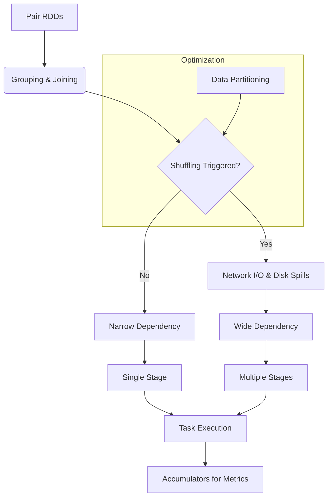

# Chapter 4: The Spark API in Depth

**Mastering the foundational APIs of Apache Spark, understanding internal execution mechanisms, and learning to write performant distributed data processing applications.**

## Why It Matters
While basic RDD and DataFrame operations get you started, building production-grade Spark applications requires a deep understanding of what happens under the hood. Chapter 4 dives into the core mechanisms that dictate performance: shuffling, partitioning, complex joins, and the Spark execution model. Understanding these concepts is the difference between a Spark job that runs in 5 minutes and one that crashes after 5 hours with OutOfMemory errors.

## How It Works

### Learning Objectives
1. **Pair RDDs**: Understand how key-value data structures unlock powerful grouping and joining operations.
2. **Data Partitioning**: Master the art of controlling data layout across the cluster to minimize network I/O.
3. **Shuffling**: Learn what shuffling is, why it's the most expensive operation in Spark, and how to avoid it.
4. **Grouping and Sorting**: Compare `groupByKey`, `reduceByKey`, and `aggregateByKey` for optimal aggregation.
5. **Joining Data**: Explore various join strategies (Broadcast, Sort-Merge, Shuffle Hash) and when Spark uses them.
6. **RDD Lineage and DAG**: Visualize how Spark builds execution plans and ensures fault tolerance through lazy evaluation.
7. **Stages and Tasks**: Deconstruct the Spark execution model to understand how work is distributed to executors.
8. **Accumulators**: Use write-only variables for distributed counters and debugging without compromising performance.

### How These Topics Connect
The concepts in this chapter build upon each other logically:
- You start with **Pair RDDs**, which require specific operations like grouping and joining.
- These operations inevitably trigger **Shuffling**, forcing data to move across the network.
- To control shuffling, you must understand **Data Partitioning** and how data is distributed.
- To optimize these flows, you need to understand the **RDD Lineage and DAG**, which dictates how Spark plans the job.
- The DAG is then compiled into **Stages and Tasks**, which actually execute the code.
- During execution, you might need to gather metrics, which is where **Accumulators** come in.

## Flow Diagram



## Data Visualization

| Concept | High-Level Abstraction | Low-Level Mechanism |
|---------|------------------------|---------------------|
| Grouping | `reduceByKey` | Map-side combine, Shuffle, Reduce |
| Joining | `df.join(other)` | Sort-Merge Join or Broadcast Join |
| Fault Tolerance | Lineage | Recomputing lost partitions |
| Job Execution | Action called | DAG -> Stages -> Tasks |

## Code Example

```python
# A conceptual overview of Chapter 4 topics in a single snippet
from pyspark.sql import SparkSession

spark = SparkSession.builder.appName("Chapter4Overview").getOrCreate()
sc = spark.sparkContext

# 1. Accumulator
bad_records = sc.accumulator(0)

# 2. Pair RDDs & Data Partitioning
data = [("user1", 100), ("user2", 200), ("user1", 50)]
rdd = sc.parallelize(data, numSlices=4) # Initial partitioning

def process_record(record):
    if record[1] < 0:
        bad_records.add(1)
        return (record[0], 0)
    return record

# 3. Lineage (Transformations are lazy)
cleaned_rdd = rdd.map(process_record)

# 4. Grouping & Shuffling (Wide Dependency)
# reduceByKey is preferred over groupByKey
aggregated_rdd = cleaned_rdd.reduceByKey(lambda x, y: x + y)

# 5. Execution (Action triggers DAG -> Stages -> Tasks)
results = aggregated_rdd.collect()

print(f"Results: {results}")
print(f"Bad Records: {bad_records.value}")
```

## Common Pitfalls
* **Skipping Fundamentals**: Jumping straight to DataFrames without understanding RDDs and shuffling leads to unoptimized SQL queries.
* **Ignoring the UI**: Failing to use the Spark UI to inspect stages, tasks, and shuffle read/write sizes.
* **Treating Spark like a Database**: Expecting instant responses without understanding the overhead of distributed task scheduling.
* **Misusing Accumulators**: Reading accumulator values inside transformations instead of actions, leading to double-counting.

## Key Takeaway
**True Spark mastery requires looking beneath the high-level APIs to understand how data moves, how tasks are scheduled, and how cluster resources are utilized.**


---

## 🎓 Deep Learning Questions

### Q1: Why Was This Concept Introduced?
Before the deep-dive concepts of Spark's execution model and Pair RDDs were fully understood, developers treated Spark like a traditional database or a simple black-box execution engine. This led to massive performance bottlenecks, excessive network I/O, and OutOfMemory (OOM) errors during complex joins and aggregations. Spark introduced sophisticated internal mechanisms—like DAG (Directed Acyclic Graph) optimization, lineage for fault tolerance, stages, tasks, and intelligent shuffling—to overcome the limitations of Hadoop MapReduce's rigid execution model. The advanced API and execution model give developers the levers needed to control partitioning, minimize shuffles, and tune performance, transforming Spark from a simple tool into an enterprise-grade distributed computing engine.

### Q2: What Exactly Is This Concept and How Does It Work?
The Spark API and Execution Model represent the core lifecycle of a Spark application. When you write Spark code, you are defining a series of transformations. These transformations build an RDD lineage, represented as a logical DAG. 
When an action is called, the Spark Driver translates this DAG into a physical execution plan. 
- **Lineage:** Keeps track of how RDDs are derived, allowing recomputation if a node fails.
- **Stages:** The DAG is broken into Stages at "shuffle boundaries." A shuffle occurs when data needs to be redistributed across the cluster (e.g., during a `groupByKey` or `join`).
- **Tasks:** Each Stage is broken into Tasks, which are the smallest units of work executed on a single partition of data by an Executor.
- **Pair RDDs:** Specialized RDDs of key-value pairs that enable distributed aggregations and joins.

### Q3: Where Should This Concept Be Used?
Understanding these deep APIs and execution models is crucial in production data engineering. 
- **Uber:** Optimizing spatial joins between millions of rider and driver coordinates by custom partitioning data, avoiding massive shuffles.
- **Netflix:** Processing massive user interaction logs to build recommendation models, using `reduceByKey` over `groupByKey` to minimize network traffic during daily aggregations.
- **Banking:** Running complex risk calculations where lineage ensures absolute fault tolerance—if a node dies mid-calculation, the exact missing partitions are recomputed without restarting the 10-hour job.

### Q4: Where Should This Concept NOT Be Used?
Do not try to micromanage Spark's execution model for simple, small-scale batch jobs where the Catalyst Optimizer (in Spark SQL/DataFrames) can automatically find the best execution plan. 
- **Anti-pattern:** Writing low-level RDD transformations and manual partitioning logic when a simple DataFrame `groupBy` and `join` would suffice.
- **Anti-pattern:** Using Accumulators for critical business logic or control flow. Accumulators should only be used for debugging or metric gathering, as task retries can cause them to double-count in transformations.
- **Anti-pattern:** Using `groupByKey` for large datasets; it pulls all values for a key into memory, causing OOM errors. Use `reduceByKey` instead.

### Q5: How Is This Concept Different from Hadoop?

| Aspect | Hadoop MapReduce | Apache Spark |
|--------|------------------|--------------|
| **Architecture** | Rigid Map -> Shuffle -> Reduce phases. | DAG-based, flexible stages, multiple operations pipelined. |
| **Performance** | High disk I/O; writes intermediate data to disk. | In-memory processing; keeps intermediate data in RAM. |
| **Processing Model** | Strictly batch processing. | Unified engine for batch, streaming, and interactive queries. |
| **Memory Usage** | Disk-heavy, lower memory footprint requirements. | Memory-heavy, requires careful tuning to avoid OOM. |
| **Fault Tolerance** | Replication of data on HDFS. | RDD Lineage; recomputes lost partitions on the fly. |
| **Scalability** | Highly scalable, excellent for petabytes of cold data. | Highly scalable, optimized for speed. |
| **Ease of Development** | Verbose Java code. | Rich APIs in Python, Scala, SQL, and Java. |
| **Typical Use Cases** | Heavy, long-running ETL. | Iterative algorithms, machine learning, fast ETL. |
| **Advantages** | Very stable for massive, disk-bound workloads. | 10-100x faster for many workloads due to memory and DAG. |
| **Disadvantages** | Slow, difficult to chain jobs. | Complex memory management, OOMs are common if untuned. |

### Q6: How Can This Concept Be Related to a Traditional RDBMS?

| Spark Concept | Traditional RDBMS Equivalent | Explanation |
|---------------|------------------------------|-------------|
| **Pair RDD** | Table with an Indexed Primary Key | Key-value pairs allow for efficient lookups, joins, and aggregations. |
| **Partitioning** | Table Partitioning / Sharding | Dividing data across disks/nodes for parallel access. |
| **Shuffle** | Distributed `GROUP BY` or `JOIN` | Moving data across the network to colocate matching keys. |
| **DAG / Lineage** | Query Execution Plan | The optimizer's blueprint for executing a query. |
| **Driver** | Database Master Node / Coordinator | Parses the query, plans execution, and gathers results. |
| **Executor** | Database Worker Node | The actual CPU/RAM processing the data chunks. |

### Q7: What Happens Behind the Scenes?
1. **Driver:** The user program creates a `SparkContext` and defines transformations.
2. **DAG Scheduler:** Spark builds a logical DAG of these transformations.
3. **Action:** An action (e.g., `collect()`, `save()`) triggers execution.
4. **Stages:** The DAG Scheduler splits the graph into Stages at shuffle boundaries (Wide Dependencies). Operations within a stage (Narrow Dependencies, like `map` and `filter`) are pipelined together.
5. **Tasks:** The Task Scheduler launches Tasks via the Cluster Manager. One task = one partition of data.
6. **Executors:** Tasks run in parallel on Executors.
7. **Shuffle:** If a stage requires a shuffle, Executors write map output to local disks, and the next stage's tasks fetch this data over the network.

```text
User Code -> [ Driver ] -> DAG Scheduler -> Task Scheduler -> Cluster Manager
                                                                     |
                                                                     v
                                                            [ Executor 1 (Tasks) ]
                                                            [ Executor 2 (Tasks) ]
```

### Q8: Performance Considerations, Best Practices, and Common Mistakes

| Category | Recommendation | Why It Matters |
|----------|----------------|----------------|
| **Aggregation** | Always use `reduceByKey` or `aggregateByKey` instead of `groupByKey`. | `reduceByKey` combines data on the map side before shuffling, drastically reducing network I/O and preventing memory crashes. |
| **Joins** | Use Broadcast Joins when joining a large dataset with a small one. | Prevents shuffling entirely by sending the small dataset to all executors. |
| **Partitioning** | Ensure partitions are evenly sized (avoid data skew). | If one partition is 10x larger than others, one task will take 10x longer, bottlenecking the entire stage. |
| **Memory** | Monitor garbage collection and Executor memory limits. | Excessive object creation in Python/Scala can trigger GC pauses, slowing down task execution. |
| **Accumulators** | Only read Accumulators in Actions, never in Transformations. | Spark may re-execute transformations due to node failure or re-evaluation, causing over-counting. |

### Q9: Interview Questions

**Beginner:**
1. **What is a Spark Stage?** A physical unit of execution, created by splitting the DAG at shuffle boundaries.
2. **What triggers a shuffle in Spark?** Operations that require data to be grouped by key across partitions, like `join`, `groupByKey`, or `reduceByKey`.
3. **What is an Accumulator?** A write-only distributed variable used primarily for global counters and debugging.

**Intermediate:**
4. **Explain the difference between Narrow and Wide Dependencies.** Narrow dependencies (e.g., `map`, `filter`) allow pipeline execution on a single partition without network transfer. Wide dependencies (e.g., `join`) require data from multiple parent partitions, triggering a shuffle.
5. **Why is RDD lineage important?** It provides fault tolerance by recording the exact sequence of transformations, allowing Spark to recompute only the lost partitions if a node fails.
6. **How does `reduceByKey` differ from `groupByKey` internally?** `reduceByKey` performs a local combine (map-side reduction) before shuffling, reducing network traffic. `groupByKey` sends all raw data across the network.

**Advanced:**
7. **How does Spark handle task failures during a shuffle?** Spark tracks map outputs. If a reduce task fails, it is retried. If a map task's executor dies, the map output is lost, and Spark will recompute the missing map tasks.
8. **What is Data Skew and how do you resolve it?** Data skew occurs when a few keys have vastly more data than others. Resolve it by salting keys (adding random prefixes), increasing partition counts, or using custom partitioners.
9. **Explain Sort-Merge Join vs. Broadcast Hash Join.** Sort-Merge sorts both datasets by key and merges them (good for two large tables). Broadcast Hash Join sends the smaller table to all nodes, avoiding a shuffle (fastest for large-to-small joins).

**Scenario-Based:**
10. **Your Spark job fails with an OutOfMemoryError during a `join` operation. How do you troubleshoot?** I would check the Spark UI for data skew (one task processing way more data). I'd verify if one table is small enough to broadcast. If both are large, I'd check partitioning and possibly pre-filter the data or increase executor memory.
11. **You need to count the number of malformed JSON records across 10 TB of logs without halting the job. How do you do it?** I would use a Spark Accumulator. Inside my map transformation, I try to parse the JSON; on failure, I increment the accumulator and return a dummy/null record, filtering it out later.

### Q10: Complete Real-World Example

**Business Problem (Retail E-Commerce):**
An e-commerce platform needs to calculate total daily revenue per product category. The raw logs contain occasional corrupted entries that need to be counted but skipped. They need an optimized pipeline that minimizes network shuffles.

**Sample Dataset:**
```json
{"category": "Electronics", "price": 1000, "status": "valid"}
{"category": "Books", "price": 20, "status": "valid"}
{"category": "Electronics", "price": 500, "status": "valid"}
{"category": "UNKNOWN", "price": -1, "status": "corrupt"}
```

**Full Working PySpark Code:**
```python
from pyspark.sql import SparkSession
import json

# Initialize Spark Session
spark = SparkSession.builder \
    .appName("OptimizedRevenueAggregation") \
    .master("local[*]") \
    .getOrCreate()
sc = spark.sparkContext

# 1. Initialize Accumulator for corrupted records
corrupt_counter = sc.accumulator(0)

# Sample raw data (simulating text file read)
raw_data = [
    '{"category": "Electronics", "price": 1000}',
    '{"category": "Books", "price": 20}',
    '{"category": "Electronics", "price": 500}',
    'CORRUPT_ROW_MISSING_DATA',
    '{"category": "Books", "price": 15}'
]
rdd = sc.parallelize(raw_data, numSlices=4)

# 2. Parsing Function with Accumulator
def parse_and_extract(line):
    try:
        data = json.loads(line)
        # Create a Pair RDD format: (key, value)
        return (data['category'], data['price'])
    except Exception:
        # Increment accumulator on bad data
        corrupt_counter.add(1)
        # Return a dummy key that we will filter out
        return ("__CORRUPT__", 0)

# 3. Transformations (Narrow Dependency)
parsed_rdd = rdd.map(parse_and_extract).filter(lambda x: x[0] != "__CORRUPT__")

# 4. Optimized Aggregation (Wide Dependency - Shuffle)
# reduceByKey performs map-side combine, drastically reducing shuffle data
revenue_by_category = parsed_rdd.reduceByKey(lambda x, y: x + y)

# 5. Action (Triggers DAG -> Stages -> Tasks)
final_results = revenue_by_category.collect()

print("--- Final Revenue by Category ---")
for category, revenue in final_results:
    print(f"Category: {category} | Total Revenue: ${revenue}")

print(f"\nTotal Corrupt Records Found: {corrupt_counter.value}")

spark.stop()
```

**Step-by-step execution walkthrough:**
1. The `map` and `filter` operations form the first Stage (Narrow dependencies, executed in parallel on 4 partitions).
2. During the `map`, the accumulator tracks failures on the worker nodes.
3. The `reduceByKey` triggers a Stage boundary (Shuffle). Before shuffling, executors partially sum prices for "Electronics" and "Books" locally.
4. The partially summed data is shuffled across the network based on the key.
5. The final reduction completes the sums. The `collect()` action pulls results back to the Driver.

**Expected output:**
```text
--- Final Revenue by Category ---
Category: Electronics | Total Revenue: $1500
Category: Books | Total Revenue: $35

Total Corrupt Records Found: 1
```

**Performance notes:**
By using `reduceByKey` instead of `groupByKey`, we ensure that only the aggregated sums per category are shuffled across the network, saving massive amounts of I/O and preventing OOM errors on the reducers.

### 💡 Key Takeaways
- Spark executes lazily; transformations only build a logical plan (DAG).
- Shuffling is the most expensive operation; minimize it by using map-side combining (`reduceByKey`).
- The execution hierarchy is: Job -> Stage (separated by shuffles) -> Task (one per partition).
- RDD Lineage guarantees fault tolerance without disk replication.
- Accumulators provide a safe way to track global metrics across distributed tasks.

### ⚠️ Common Misconceptions
- **"More partitions are always better."** False. Too many partitions cause scheduling overhead; too few cause OOMs and underutilize cores.
- **"Accumulators can be used for core business logic."** False. Task retries can cause accumulators to increment multiple times.
- **"Spark is just faster Hadoop."** False. Spark's DAG execution and in-memory optimizations make its architecture fundamentally different.

### 🔗 Related Spark Concepts
- Catalyst Optimizer
- Broadcast Variables
- Data Skew Handling
- Spark Memory Management

### 📚 References for Further Reading
- Apache Spark Official Documentation (RDD Programming Guide)
- Learning Spark, 2nd Edition (O'Reilly)
- Spark: The Definitive Guide (O'Reilly)
