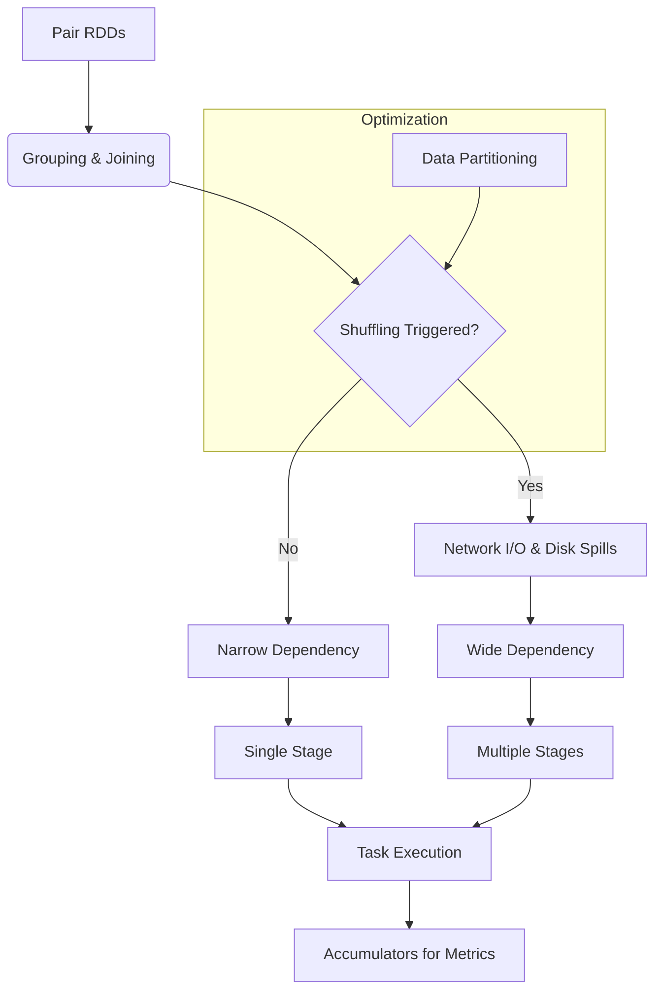

# Chapter 4: The Spark API in Depth

**Mastering the foundational APIs of Apache Spark, understanding internal execution mechanisms, and learning to write performant distributed data processing applications.**

## Why It Matters
While basic RDD and DataFrame operations get you started, building production-grade Spark applications requires a deep understanding of what happens under the hood. Chapter 4 dives into the core mechanisms that dictate performance: shuffling, partitioning, complex joins, and the Spark execution model. Understanding these concepts is the difference between a Spark job that runs in 5 minutes and one that crashes after 5 hours with OutOfMemory errors.

## How It Works

### Learning Objectives
1. **Pair RDDs**: Understand how key-value data structures unlock powerful grouping and joining operations.
2. **Data Partitioning**: Master the art of controlling data layout across the cluster to minimize network I/O.
3. **Shuffling**: Learn what shuffling is, why it's the most expensive operation in Spark, and how to avoid it.
4. **Grouping and Sorting**: Compare `groupByKey`, `reduceByKey`, and `aggregateByKey` for optimal aggregation.
5. **Joining Data**: Explore various join strategies (Broadcast, Sort-Merge, Shuffle Hash) and when Spark uses them.
6. **RDD Lineage and DAG**: Visualize how Spark builds execution plans and ensures fault tolerance through lazy evaluation.
7. **Stages and Tasks**: Deconstruct the Spark execution model to understand how work is distributed to executors.
8. **Accumulators**: Use write-only variables for distributed counters and debugging without compromising performance.

### How These Topics Connect
The concepts in this chapter build upon each other logically:
- You start with **Pair RDDs**, which require specific operations like grouping and joining.
- These operations inevitably trigger **Shuffling**, forcing data to move across the network.
- To control shuffling, you must understand **Data Partitioning** and how data is distributed.
- To optimize these flows, you need to understand the **RDD Lineage and DAG**, which dictates how Spark plans the job.
- The DAG is then compiled into **Stages and Tasks**, which actually execute the code.
- During execution, you might need to gather metrics, which is where **Accumulators** come in.

## Flow Diagram



## Data Visualization

| Concept | High-Level Abstraction | Low-Level Mechanism |
|---------|------------------------|---------------------|
| Grouping | `reduceByKey` | Map-side combine, Shuffle, Reduce |
| Joining | `df.join(other)` | Sort-Merge Join or Broadcast Join |
| Fault Tolerance | Lineage | Recomputing lost partitions |
| Job Execution | Action called | DAG -> Stages -> Tasks |

## Code Example

```python
# A conceptual overview of Chapter 4 topics in a single snippet
from pyspark.sql import SparkSession

spark = SparkSession.builder.appName("Chapter4Overview").getOrCreate()
sc = spark.sparkContext

# 1. Accumulator
bad_records = sc.accumulator(0)

# 2. Pair RDDs & Data Partitioning
data = [("user1", 100), ("user2", 200), ("user1", 50)]
rdd = sc.parallelize(data, numSlices=4) # Initial partitioning

def process_record(record):
    if record[1] < 0:
        bad_records.add(1)
        return (record[0], 0)
    return record

# 3. Lineage (Transformations are lazy)
cleaned_rdd = rdd.map(process_record)

# 4. Grouping & Shuffling (Wide Dependency)
# reduceByKey is preferred over groupByKey
aggregated_rdd = cleaned_rdd.reduceByKey(lambda x, y: x + y)

# 5. Execution (Action triggers DAG -> Stages -> Tasks)
results = aggregated_rdd.collect()

print(f"Results: {results}")
print(f"Bad Records: {bad_records.value}")
```

## Common Pitfalls
* **Skipping Fundamentals**: Jumping straight to DataFrames without understanding RDDs and shuffling leads to unoptimized SQL queries.
* **Ignoring the UI**: Failing to use the Spark UI to inspect stages, tasks, and shuffle read/write sizes.
* **Treating Spark like a Database**: Expecting instant responses without understanding the overhead of distributed task scheduling.
* **Misusing Accumulators**: Reading accumulator values inside transformations instead of actions, leading to double-counting.

## Key Takeaway
**True Spark mastery requires looking beneath the high-level APIs to understand how data moves, how tasks are scheduled, and how cluster resources are utilized.**
