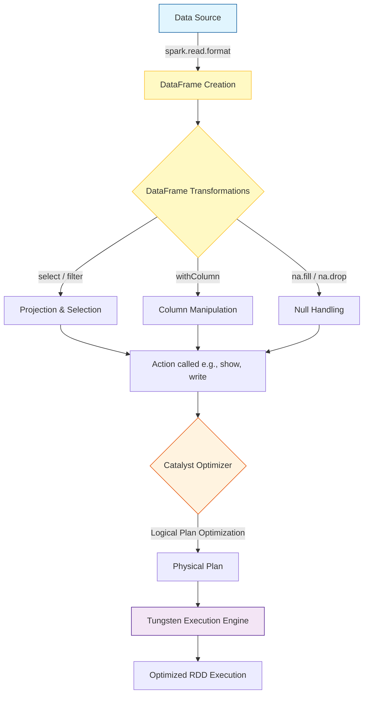

# DataFrames in Apache Spark

**A DataFrame is a distributed collection of data organized into named columns, analogous to a table in a relational database but with richer optimizations under the hood.**

## Why It Matters

When working with massive datasets, raw Resilient Distributed Datasets (RDDs) are extremely powerful but highly unoptimized because they treat data as opaque objects. You have to write low-level code (like maps and reduces) to process them. DataFrames introduced a schema—a blueprint of the data—allowing Spark to understand what your data actually is (e.g., this column is an Integer, that one is a String). Because Spark knows the schema, it can utilize the Catalyst Optimizer to figure out the most efficient way to execute your transformations and aggregations, drastically reducing execution times. Furthermore, DataFrames provide a user-friendly API that closely resembles pandas or R dataframes, making it far easier for data analysts and scientists to adopt Spark.

## How It Works

A DataFrame is essentially a Dataset organized into named columns. Under the hood, DataFrames are still represented as RDDs, but they contain `Row` objects. The crucial difference is the attached schema (represented by `StructType` and `StructField` classes in Spark), which defines the data types of each column. 

When you perform operations on a DataFrame—like `select`, `filter`, `withColumn`, or `groupBy`—you are not executing code immediately. Instead, you are building a logical execution plan. This is called "lazy evaluation." Once an action is called (such as `show`, `count`, or `write`), Spark's Catalyst Optimizer steps in. It reviews the logical plan, applies optimizations (such as predicate pushdown to filter data before reading it fully, or column pruning to ignore unused columns), and generates a highly efficient physical plan.

Creating DataFrames is highly versatile. They can be instantiated by reading structured data from various sources (JSON, CSV, Parquet, Avro, JDBC), from existing RDDs by inferring or explicitly applying a schema, or even programmatically from local collections. DataFrames also provide robust methods for handling dirty or missing data using the `.na` sub-module, allowing engineers to easily drop rows with nulls (`na.drop`) or fill them with default values (`na.fill`).

## Flow Diagram



## Data Visualization

**Original DataFrame (Before Transformations)**

| id | first_name | age | department | salary |
| :--- | :--- | :--- | :--- | :--- |
| 1 | Alice | 30 | Engineering | 100000 |
| 2 | Bob | null | HR | 55000 |
| 3 | Charlie | 25 | Engineering | null |
| 4 | David | 45 | Sales | 85000 |

**Transformation Steps:**
1. `na.fill({"age": 0, "salary": 50000})` - Fill nulls.
2. `filter(col("age") > 0)` - Remove records where age is 0 (or null originally).
3. `withColumn("bonus", col("salary") * 0.10)` - Add a new calculated column.

**Resulting DataFrame (After Transformations)**

| id | first_name | age | department | salary | bonus |
| :--- | :--- | :--- | :--- | :--- | :--- |
| 1 | Alice | 30 | Engineering | 100000 | 10000.0 |
| 3 | Charlie | 25 | Engineering | 50000 | 5000.0 |
| 4 | David | 45 | Sales | 85000 | 8500.0 |

*(Note: Bob was removed because his filled age was 0, which didn't pass the filter)*

## Code Example

```python
from pyspark.sql import SparkSession
from pyspark.sql.types import StructType, StructField, StringType, IntegerType, DoubleType
from pyspark.sql.functions import col, upper, lit

# Initialize SparkSession
spark = SparkSession.builder.appName("DataFrame-Deep-Dive").getOrCreate()

# 1. Defining a strict schema (StructType)
# This is preferred over inferring schema, as schema inference triggers a full pass over the data
schema = StructType([
    StructField("id", IntegerType(), nullable=False),
    StructField("name", StringType(), nullable=True),
    StructField("age", IntegerType(), nullable=True),
    StructField("department", StringType(), nullable=True),
    StructField("salary", DoubleType(), nullable=True)
])

# 2. Creating a DataFrame from a JSON file using the schema
df = spark.read.schema(schema).json("/path/to/employees.json")

# Print the schema to verify
df.printSchema()

# 3. Common DataFrame Operations
transformed_df = df \
    .select("id", "name", "age", "department", "salary") \
    .filter(col("department") != "HR") \
    .withColumn("name", upper(col("name"))) \
    .withColumn("is_active", lit(True)) \
    .withColumnRenamed("salary", "base_salary")

# 4. Null Handling
# Drop rows where 'id' or 'name' is null
clean_df = transformed_df.na.drop(subset=["id", "name"])

# Fill null values for specific columns
final_df = clean_df.na.fill({
    "age": 99,
    "base_salary": 45000.0
})

# Show the results
final_df.show(truncate=False)

# Drop a column if it is no longer needed
final_df.drop("is_active").show()
```

## Common Pitfalls

*   **Relying on Schema Inference in Production:** Using `.csv(inferSchema=True)` forces Spark to read the entire file (or a significant portion) just to guess the data types. This severely degrades startup performance on large datasets. Always define schemas explicitly with `StructType`.
*   **Abusing `withColumn` in a loop:** Calling `.withColumn()` multiple times inside a loop creates a deeply nested lineage of logical plans. This can cause StackOverflow exceptions during query planning. Use `select` with multiple column definitions instead.
*   **Failing to handle nulls properly:** Not checking for nulls (using `isNull()` or `isNotNull()`) can lead to unexpected results during aggregations or joins, as nulls often propagate through calculations.
*   **Misunderstanding Action vs. Transformation:** Assuming transformations (like `filter`) execute immediately. They don't. If you don't call an action (like `show()` or `write()`), nothing happens.

## Key Takeaway

DataFrames bridge the gap between Big Data complexity and user-friendly structured processing, providing an optimized, table-like abstraction that serves as the foundation for modern Spark development.
