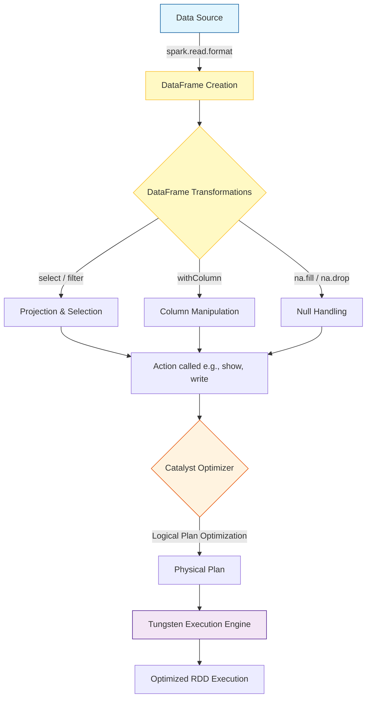

# DataFrames in Apache Spark

**A DataFrame is a distributed collection of data organized into named columns, analogous to a table in a relational database but with richer optimizations under the hood.**

## Why It Matters

When working with massive datasets, raw Resilient Distributed Datasets (RDDs) are extremely powerful but highly unoptimized because they treat data as opaque objects. You have to write low-level code (like maps and reduces) to process them. DataFrames introduced a schema—a blueprint of the data—allowing Spark to understand what your data actually is (e.g., this column is an Integer, that one is a String). Because Spark knows the schema, it can utilize the Catalyst Optimizer to figure out the most efficient way to execute your transformations and aggregations, drastically reducing execution times. Furthermore, DataFrames provide a user-friendly API that closely resembles pandas or R dataframes, making it far easier for data analysts and scientists to adopt Spark.

## How It Works

A DataFrame is essentially a Dataset organized into named columns. Under the hood, DataFrames are still represented as RDDs, but they contain `Row` objects. The crucial difference is the attached schema (represented by `StructType` and `StructField` classes in Spark), which defines the data types of each column. 

When you perform operations on a DataFrame—like `select`, `filter`, `withColumn`, or `groupBy`—you are not executing code immediately. Instead, you are building a logical execution plan. This is called "lazy evaluation." Once an action is called (such as `show`, `count`, or `write`), Spark's Catalyst Optimizer steps in. It reviews the logical plan, applies optimizations (such as predicate pushdown to filter data before reading it fully, or column pruning to ignore unused columns), and generates a highly efficient physical plan.

Creating DataFrames is highly versatile. They can be instantiated by reading structured data from various sources (JSON, CSV, Parquet, Avro, JDBC), from existing RDDs by inferring or explicitly applying a schema, or even programmatically from local collections. DataFrames also provide robust methods for handling dirty or missing data using the `.na` sub-module, allowing engineers to easily drop rows with nulls (`na.drop`) or fill them with default values (`na.fill`).

## Flow Diagram



## Data Visualization

**Original DataFrame (Before Transformations)**

| id | first_name | age | department | salary |
| :--- | :--- | :--- | :--- | :--- |
| 1 | Alice | 30 | Engineering | 100000 |
| 2 | Bob | null | HR | 55000 |
| 3 | Charlie | 25 | Engineering | null |
| 4 | David | 45 | Sales | 85000 |

**Transformation Steps:**
1. `na.fill({"age": 0, "salary": 50000})` - Fill nulls.
2. `filter(col("age") > 0)` - Remove records where age is 0 (or null originally).
3. `withColumn("bonus", col("salary") * 0.10)` - Add a new calculated column.

**Resulting DataFrame (After Transformations)**

| id | first_name | age | department | salary | bonus |
| :--- | :--- | :--- | :--- | :--- | :--- |
| 1 | Alice | 30 | Engineering | 100000 | 10000.0 |
| 3 | Charlie | 25 | Engineering | 50000 | 5000.0 |
| 4 | David | 45 | Sales | 85000 | 8500.0 |

*(Note: Bob was removed because his filled age was 0, which didn't pass the filter)*

## Code Example

```python
from pyspark.sql import SparkSession
from pyspark.sql.types import StructType, StructField, StringType, IntegerType, DoubleType
from pyspark.sql.functions import col, upper, lit

# Initialize SparkSession
spark = SparkSession.builder.appName("DataFrame-Deep-Dive").getOrCreate()

# 1. Defining a strict schema (StructType)
# This is preferred over inferring schema, as schema inference triggers a full pass over the data
schema = StructType([
    StructField("id", IntegerType(), nullable=False),
    StructField("name", StringType(), nullable=True),
    StructField("age", IntegerType(), nullable=True),
    StructField("department", StringType(), nullable=True),
    StructField("salary", DoubleType(), nullable=True)
])

# 2. Creating a DataFrame from a JSON file using the schema
df = spark.read.schema(schema).json("/path/to/employees.json")

# Print the schema to verify
df.printSchema()

# 3. Common DataFrame Operations
transformed_df = df \
    .select("id", "name", "age", "department", "salary") \
    .filter(col("department") != "HR") \
    .withColumn("name", upper(col("name"))) \
    .withColumn("is_active", lit(True)) \
    .withColumnRenamed("salary", "base_salary")

# 4. Null Handling
# Drop rows where 'id' or 'name' is null
clean_df = transformed_df.na.drop(subset=["id", "name"])

# Fill null values for specific columns
final_df = clean_df.na.fill({
    "age": 99,
    "base_salary": 45000.0
})

# Show the results
final_df.show(truncate=False)

# Drop a column if it is no longer needed
final_df.drop("is_active").show()
```

## Common Pitfalls

*   **Relying on Schema Inference in Production:** Using `.csv(inferSchema=True)` forces Spark to read the entire file (or a significant portion) just to guess the data types. This severely degrades startup performance on large datasets. Always define schemas explicitly with `StructType`.
*   **Abusing `withColumn` in a loop:** Calling `.withColumn()` multiple times inside a loop creates a deeply nested lineage of logical plans. This can cause StackOverflow exceptions during query planning. Use `select` with multiple column definitions instead.
*   **Failing to handle nulls properly:** Not checking for nulls (using `isNull()` or `isNotNull()`) can lead to unexpected results during aggregations or joins, as nulls often propagate through calculations.
*   **Misunderstanding Action vs. Transformation:** Assuming transformations (like `filter`) execute immediately. They don't. If you don't call an action (like `show()` or `write()`), nothing happens.

## Key Takeaway

DataFrames bridge the gap between Big Data complexity and user-friendly structured processing, providing an optimized, table-like abstraction that serves as the foundation for modern Spark development.


---

## 🎓 Deep Learning Questions

### Q1: Why Was This Concept Introduced?
Before DataFrames, Apache Spark primarily relied on Resilient Distributed Datasets (RDDs). While RDDs offered incredible power and fault tolerance through distributed in-memory computing, they had significant limitations. The primary issue was that RDDs treated data as opaque, unstructured objects (like Java or Python objects). Because Spark didn't understand the structure of the data inside an RDD, it could not optimize the execution natively. Developers had to write custom map/reduce functions, which were prone to inefficiencies and heavily dependent on the developer's skill. 

Additionally, Python users suffered from severe performance penalties when using RDDs because data had to be serialized and deserialized between the JVM and Python processes constantly (the "Py4J cost"). Spark introduced DataFrames to solve these problems by providing a schema-aware, distributed data collection. By knowing the exact types and names of columns, Spark could introduce the Catalyst Optimizer to rewrite queries efficiently. Furthermore, Tungsten Execution Engine was introduced to manage memory explicitly (bypassing Java garbage collection) and execute queries closer to bare metal. DataFrames democratized Big Data by providing a SQL-like, pandas-style API that executes at scale, matching or exceeding hand-tuned RDD performance across both Scala and Python.

### Q2: What Exactly Is This Concept and How Does It Work?
A DataFrame is a highly optimized, distributed collection of data organized into named columns, identical in concept to a table in a relational database or a data frame in R/pandas. However, beneath the surface, it is powered by Spark's distributed computing engine. 

When you write DataFrame code (e.g., `df.filter().select()`), you are not manipulating data immediately. Instead, Spark constructs an Abstract Syntax Tree (AST) representing your logical transformations. This is where the Catalyst Optimizer shines. Catalyst analyzes your logical plan, resolves it against a catalog (to ensure columns and tables exist), and then applies rule-based and cost-based optimizations. For example, it will push filters down to the data source so only relevant data is read, or it will reorder joins to minimize data shuffling.

Once optimized, Catalyst generates multiple physical plans and selects the most cost-effective one. Finally, the Tungsten engine converts this physical plan into optimized Java bytecode (Whole-Stage Code Generation) that runs on the executors. Data inside a DataFrame is stored in off-heap memory using a highly compact binary format, avoiding Java Object serialization overhead.

### Q3: Where Should This Concept Be Used?
DataFrames are the de facto standard for structured and semi-structured data processing in modern Apache Spark. You should use them in:
- **Banking & Finance:** Parsing massive daily transaction logs (CSV, Parquet) for fraud detection, aggregating daily balances, and filtering out invalid records.
- **E-commerce (e.g., Amazon, Retail):** Processing clickstream data (JSON) to track user behavior, computing rolling averages for product views, and joining user profiles with purchase histories.
- **Healthcare:** Standardizing Electronic Health Records (EHR) from various hospital systems into a unified schema for analytical reporting and compliance tracking.
- **Streaming & IoT (e.g., Uber):** Using Structured Streaming (which is built entirely on the DataFrame API) to compute real-time metrics, like driver availability or surge pricing multipliers based on geospatial data.
Whenever data can be defined by a schema, DataFrames provide the best balance of performance, readability, and maintainability.

### Q4: Where Should This Concept NOT Be Used?
Despite their power, DataFrames are not the universal solution for every Big Data problem. You should avoid DataFrames when:
- **Unstructured Data Processing:** If you are processing raw text for NLP (like tokenizing massive logs or analyzing free-text reviews), images, or binary audio files, RDDs or specialized libraries are better suited because the data lacks a tabular structure.
- **Complex Object Manipulation:** If your logic requires complex, object-oriented state management or heavy reliance on external, non-serializable Java/Python libraries that do not map well to SQL functions, sticking to RDDs is often cleaner.
- **Low-Level Control is Needed:** Sometimes Catalyst's optimization might choose a sub-optimal plan for highly skewed, complex iterative algorithms (like custom graph traversals). If you need absolute granular control over physical data partitioning and task execution, the lower-level RDD API is required.
- **Strong Compile-Time Type Safety:** DataFrames are untyped at compile time. A typo in a column name (e.g., `col("flrst_name")`) will only be caught at runtime. If you need compile-time safety, Spark Datasets (available in Scala/Java) are the preferred alternative.

### Q5: How Is This Concept Different from Hadoop?

| Aspect | Hadoop MapReduce | Apache Spark DataFrames |
| :--- | :--- | :--- |
| **Architecture** | Disk-bound; writes intermediate data to disk. | Memory-bound; processes intermediate data in RAM. |
| **Performance** | Slow due to disk I/O and serialization overhead. | Up to 100x faster leveraging Tungsten memory and Catalyst. |
| **Processing Model** | Strict Map, followed by Reduce operations. | High-level declarative operations (Filter, Join, GroupBy). |
| **Memory Usage** | JVM Objects, heavy garbage collection overhead. | Off-heap, compact binary format (Tungsten). |
| **Fault Tolerance** | Replicates data to disk (HDFS) across nodes. | Lineage-based recomputation (DAG) if a partition fails. |
| **Scalability** | High, but scales linearly with disk/network bottlenecks. | High, optimized for CPU and Memory constraints. |
| **Ease of Development** | Very complex, hundreds of lines of Java boilerplate. | Very simple, SQL-like syntax (Python, Scala, R, SQL). |
| **Typical Use Cases** | Batch ETL, legacy offline processing. | Real-time analytics, machine learning, interactive queries. |
| **Advantages** | Stable for very large clusters lacking RAM. | Superior speed, intuitive API, rich built-in functions. |
| **Disadvantages** | Steep learning curve, terribly slow for ML/iterative. | Requires substantial memory, GC tuning (though less than RDDs). |

### Q6: How Can This Concept Be Related to a Traditional RDBMS?

| RDBMS / SQL Concept | Spark DataFrame Equivalent | Explanation |
| :--- | :--- | :--- |
| Table | DataFrame | A structured collection of records with rows and columns. |
| Column Type (e.g., VARCHAR) | `StringType()`, `IntegerType()` | Defines the data blueprint (Schema / `StructType`). |
| `SELECT a, b FROM table` | `df.select("a", "b")` | Projects specific columns from the dataset. |
| `WHERE a > 5` | `df.filter(col("a") > 5)` | Filters rows based on a specific predicate. |
| `GROUP BY a` | `df.groupBy("a")` | Groups data for aggregation operations. |
| Execution Engine | Query Optimizer | Spark uses the Catalyst Optimizer to determine the execution plan. |
| Indexing | Partitioning / Z-Ordering | Spark doesn't use traditional indexes; it relies on partitioning and Parquet metadata. |

### Q7: What Happens Behind the Scenes?
When a developer submits a DataFrame operation, Spark orchestrates a highly complex pipeline to execute it across a cluster.

1. **Driver & Catalyst:** The Driver program receives the DataFrame code. Since DataFrames are lazy, transformations are compiled into a Logical Plan.
2. **Optimization:** The Catalyst Optimizer resolves column names, pushes down filters, and creates an Optimized Logical Plan.
3. **Physical Planning:** Catalyst generates several Physical Plans and picks the cheapest one, converting it to RDD operations via Tungsten Code Generation.
4. **DAG Scheduler:** The physical plan is translated into a Directed Acyclic Graph (DAG) of stages. Stages are separated by Shuffle boundaries (e.g., when a `groupBy` requires moving data across nodes).
5. **Task Scheduler:** Stages are broken down into independent Tasks. A Task corresponds to one Partition of data.
6. **Executors:** The Cluster Manager assigns Tasks to worker nodes (Executors). Executors process their partitions in memory and write output to disk/storage.

```text
+-------------------+       +-----------------------+       +-------------------------+
|  DataFrame Code   |       |  Catalyst Optimizer   |       |   Tungsten Execution    |
| (Python/Scala)    | ----> | (Logical -> Physical) | ----> | (Bytecode Generation)   |
+-------------------+       +-----------------------+       +-------------------------+
                                                                         |
                                                                         v
+-------------------+       +-----------------------+       +-------------------------+
|   Executors       |       |  Task Scheduler       |       |     DAG Scheduler       |
| (Compute Tasks)   | <---- | (Assigns Tasks to     | <---- | (Splits plan to Stages) |
| (Partition Data)  |       |  Worker Nodes)        |       |                         |
+-------------------+       +-----------------------+       +-------------------------+
```

### Q8: Performance Considerations, Best Practices, and Common Mistakes

| Category | Recommendation | Why It Matters |
| :--- | :--- | :--- |
| **Best Practice** | Provide strict schemas using `StructType` rather than `inferSchema=True`. | `inferSchema` triggers a full cluster-wide read of the data just to determine types, slowing down initialization drastically. |
| **Optimization** | Use built-in Spark SQL functions (`pyspark.sql.functions`) instead of Python UDFs. | Native functions run on Tungsten in the JVM. Python UDFs force data serialization between JVM and Python, causing massive overhead. |
| **Performance** | Save intermediate, heavily reused DataFrames using `.cache()` or `.persist()`. | Prevents Spark from re-evaluating the entire lineage from the source files multiple times. |
| **Common Mistake** | Chaining hundreds of `.withColumn()` operations inside a loop. | Each `.withColumn` creates a new projection in the logical plan. Loops result in deep plan lineages causing `StackOverflow` exceptions during planning. |
| **Best Practice** | Use Parquet format over CSV or JSON for storage. | Parquet is columnar, storing schema and statistics. It supports aggressive predicate pushdown and column pruning, saving huge amounts of I/O. |
| **Debugging** | Use `df.explain(True)` to inspect the execution plan. | Allows you to verify if Catalyst successfully applied optimizations like predicate pushdown before the physical execution. |

### Q9: Interview Questions

#### Beginner
1. **What is the difference between an RDD and a DataFrame?**
   *Answer:* An RDD is a distributed collection of unstructured JVM objects. A DataFrame is a distributed collection structured into named columns with a known schema, allowing Spark to optimize queries using Catalyst and Tungsten.
2. **Are DataFrames lazily evaluated?**
   *Answer:* Yes. Transformations on DataFrames (like `filter` or `select`) do not execute immediately. They only build a lineage graph. Execution begins only when an action (like `show`, `count`, or `write`) is invoked.
3. **What is a Schema in Spark?**
   *Answer:* A schema defines the structure of a DataFrame, specifying column names, data types (e.g., IntegerType, StringType), and whether the column can contain null values.

#### Intermediate
1. **Explain the role of the Catalyst Optimizer.**
   *Answer:* Catalyst takes the logical query plan derived from DataFrame operations, validates it, applies optimizations (like filter pushdown, column pruning, and join reordering), and generates the most efficient physical execution plan.
2. **Why is `inferSchema` dangerous in production?**
   *Answer:* Inferring a schema requires Spark to execute a job to scan the dataset and guess data types. On terabytes of data, this "metadata scan" can take longer than the actual processing job. Explicit schemas bypass this step.
3. **What happens if you use a standard Python function (UDF) on a DataFrame?**
   *Answer:* Spark must serialize the row from the JVM, send it to a Python worker process, execute the function, and serialize the result back to the JVM. This breaks Tungsten optimization and introduces massive performance bottlenecks.

#### Advanced
1. **How does Tungsten optimize DataFrame memory management?**
   *Answer:* Tungsten bypasses traditional Java object overhead by storing DataFrame rows in a highly compact, custom binary format off-heap. It also generates custom Java bytecode at runtime (Whole-Stage Code Generation) to execute physical plans closer to bare metal.
2. **How do you avoid StackOverflow errors when adding hundreds of columns dynamically?**
   *Answer:* Instead of looping `.withColumn()`—which creates a massively nested logical plan—you should build a list of `Column` expressions and use a single `.select(*exprs)` to project all new columns simultaneously.
3. **Explain Predicate Pushdown in the context of DataFrames.**
   *Answer:* If you read a Parquet file and apply a `.filter()`, Catalyst optimizes the query by pushing the filter down to the storage layer. Spark will only read the disk blocks that satisfy the filter, drastically reducing network and memory I/O.

#### Scenario-Based
1. **Your DataFrame job running on 500GB of JSON data fails with OutOfMemory errors. How do you troubleshoot and fix it?**
   *Answer:* First, check if `inferSchema` is used; if so, enforce a schema. Next, analyze data skew—if grouping or joining on a highly skewed key, salt the keys. Ensure you aren't collecting (`.collect()`) large datasets to the Driver. Finally, convert JSON to Parquet upstream if possible to minimize memory footprints.
2. **You need to drop all rows where either `salary` or `department` is null. How do you do this efficiently?**
   *Answer:* Use the DataFrame NA functions: `df.na.drop(subset=["salary", "department"])`. This translates to highly optimized, native Catalyst filtering.

### Q10: Complete Real-World Example

**Business Problem:** 
"StreamFlix", a Netflix-like streaming company, has terabytes of daily viewing logs. They need to analyze these logs to identify which premium users are watching corrupted streams (indicated by a `-1` stream duration) so customer service can offer them a refund.

**Dataset Description:** 
A JSON file representing viewing logs with fields: `user_id`, `subscription_tier`, `movie_id`, `duration_watched_secs`, and `device_type`.

**PySpark Code:**
```python
from pyspark.sql import SparkSession
from pyspark.sql.types import StructType, StructField, StringType, IntegerType
from pyspark.sql.functions import col, count

# 1. Initialize Spark
spark = SparkSession.builder.appName("StreamFlix_Refund_Analytics").getOrCreate()

# 2. Define Explicit Schema for performance
log_schema = StructType([
    StructField("user_id", StringType(), False),
    StructField("subscription_tier", StringType(), True),
    StructField("movie_id", StringType(), True),
    StructField("duration_watched_secs", IntegerType(), True),
    StructField("device_type", StringType(), True)
])

# 3. Load Data (Lazy Transformation)
logs_df = spark.read.schema(log_schema).json("s3a://streamflix-datalake/logs/2023/10/01/")

# 4. Process Data
# We want to find Premium users who experienced errors (duration = -1)
refund_candidates_df = logs_df \
    .filter(col("subscription_tier") == "Premium") \
    .filter(col("duration_watched_secs") == -1) \
    .select("user_id", "device_type", "movie_id")

# 5. Aggregate to find the worst affected users
# Group by user to see how many errors they experienced
bad_experience_summary = refund_candidates_df \
    .groupBy("user_id") \
    .agg(count("movie_id").alias("total_errors")) \
    .filter(col("total_errors") > 3) # Only refund if they had >3 errors

# 6. Action (Triggers Catalyst Execution)
bad_experience_summary.show(truncate=False)

# 7. Write to storage for downstream Customer Support systems
bad_experience_summary.write.mode("overwrite").parquet("s3a://streamflix-datalake/refunds/2023/10/01/")
```

**Step-by-Step Execution Walkthrough:**
1. **Schema Definition:** An explicit schema prevents Spark from parsing the entire JSON payload just to determine types.
2. **Logical Plan Construction:** The `.filter()`, `.select()`, and `.groupBy()` operations do not execute immediately; they merely register intent.
3. **Catalyst Optimization:** Spark merges the two `.filter()` conditions into a single logical step. It applies *column pruning*, realizing that `device_type` is dropped before aggregation, so it doesn't bother keeping it in memory during the shuffle.
4. **Physical Execution:** Because the source is JSON (not columnar), Spark must read the whole row, but immediately discards unnecessary columns.
5. **Shuffle & Aggregation:** The `groupBy` triggers a shuffle, grouping records by `user_id` across the cluster to calculate the `count`.
6. **Action:** `show()` forces execution to the console, and `write()` exports the highly compressed, partitioned Parquet output.

**Expected Output:**
```text
+----------+------------+
|user_id   |total_errors|
+----------+------------+
|USR-9831  |4           |
|USR-1029  |7           |
+----------+------------+
```

**Performance Notes:**
By avoiding RDDs, we bypass Python-JVM serialization. Defining the schema explicitly ensures the job starts instantly rather than waiting for a full JSON scan. This approach is best for heavily structured reporting and aggregation pipelines.

### 💡 Key Takeaways
- DataFrames are distributed collections of structured data with named columns and types.
- They completely outperform RDDs thanks to the Catalyst Optimizer and Tungsten Execution Engine.
- DataFrames bring a unified, SQL-like syntax that is identical in performance across Scala, Java, and Python.
- Transformations build a lazy Logical Plan; Actions trigger Physical Execution.
- Always prefer strict Schemas (`StructType`) over `inferSchema` for production workloads.

### ⚠️ Common Misconceptions
- **"DataFrames store data on the master node."** False. Data is distributed across worker nodes; only the metadata and final aggregated results (if requested via `.collect()`) live on the driver.
- **"Using Python is slower than Scala for DataFrames."** False. Because DataFrame operations map to JVM-based Catalyst optimizations, PySpark DataFrames execute at the same speed as Scala DataFrames (unless you use Python UDFs).
- **"Calling `.filter()` executes immediately."** False. It is a lazy transformation.
- **"DataFrames support strong compile-time type checking."** False. Compile-time safety is provided by Datasets. DataFrames throw runtime errors if a column name is misspelled.

### 🔗 Related Spark Concepts
- **Catalyst Optimizer:** The rule-based and cost-based query optimization engine.
- **Tungsten Engine:** The memory management and code-generation backend.
- **Datasets:** The strongly typed, object-oriented sibling to DataFrames (Scala/Java only).
- **Spark SQL:** The engine that enables running ANSI SQL directly against DataFrames.

### 📚 References for Further Reading
- Apache Spark Official Documentation
- Learning Spark (O'Reilly)
- Spark: The Definitive Guide (O'Reilly)
