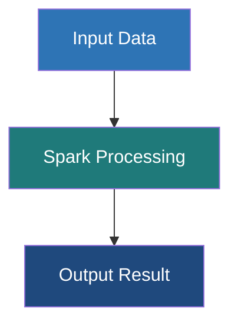

# Datasets in Apache Spark

**A Dataset is a distributed, strongly-typed collection of domain-specific objects that provides the convenience of RDDs with the performance optimizations of Spark SQL's DataFrames.**

## Why It Matters

DataFrames are incredible for processing data, but they lack one critical feature: compile-time type safety. In a DataFrame, columns are dynamically typed; if you try to select a column that doesn't exist, or try to cast a String to an Integer in an incompatible way, you won't know there's an error until the code actually runs on the cluster (Runtime Error). Datasets solve this by providing strongly-typed APIs. If you make a typo in a field name, your Scala or Java code simply won't compile. This saves enormous amounts of debugging time in production data engineering pipelines. Datasets marry the object-oriented, type-safe programming style of RDDs with the blistering fast execution of the Catalyst Optimizer.

## How It Works

A Dataset is effectively the same concept as a DataFrame, but it is strictly typed. In fact, in Scala, a `DataFrame` is merely an alias for `Dataset[Row]`, where `Row` is an untyped generic object. When you use Datasets, you bind the data to a specific schema defined by a Scala `case class` or a Java bean (e.g., `Dataset[Employee]`). 

The magic that makes Datasets work efficiently is the **Encoder**. When working with standard RDDs containing custom objects, Spark has to serialize those objects using Java Serialization or Kryo, which is slow and memory-intensive. Datasets use specialized Encoders that translate between JVM objects and Spark's internal Tungsten binary format. These Encoders allow Spark to perform operations like filtering or sorting directly on the serialized bytes without having to deserialize the objects back into the JVM memory, resulting in massive performance improvements.

**Why no Python Datasets?** Datasets are uniquely a feature of statically typed languages (Scala and Java). Python is dynamically typed; it doesn't have a compile-time type checker in the same way. Therefore, PySpark *only* provides the DataFrame API. While PySpark developers miss out on compile-time type safety, they still benefit from the exact same Catalyst and Tungsten optimizations under the hood.

## Flow Diagram



## Data Visualization

**Comparison Table: Dataset vs DataFrame vs RDD**

| Feature | RDD | DataFrame (`Dataset[Row]`) | Dataset (`Dataset[T]`) |
| :--- | :--- | :--- | :--- |
| **Data Format** | JVM Objects | Untyped Rows | Strongly-typed Objects (`case class`)|
| **Type Safety** | Compile-Time | Runtime | Compile-Time |
| **Optimization** | None (Opaque) | Catalyst & Tungsten | Catalyst & Tungsten |
| **Serialization**| Java/Kryo (Slow) | Tungsten Encoders (Fast) | Tungsten Encoders (Fast) |
| **Supported Languages**| Scala, Java, Python, R | Scala, Java, Python, R | Scala, Java |
| **Best Used For**| Low-level unstructured data | SQL-like analytics, dynamic queries| Complex domain logic, type safety required |

## Code Example

*Note: Since Datasets rely on strict typing, this example uses Scala, which is the primary language for the Dataset API.*

```scala
import org.apache.spark.sql.SparkSession
import org.apache.spark.sql.Encoders

// 1. Define a Case Class to act as the schema/type definition
// This gives us strict compile-time type safety.
case class DeviceData(id: Int, device_name: String, temperature: Double, active: Boolean)

// Initialize Spark
val spark = SparkSession.builder()
  .appName("Dataset-Example")
  .master("local[*]")
  .getOrCreate()

import spark.implicits._ // Required for implicit Encoders

// 2. Reading data as a DataFrame and converting it to a strongly-typed Dataset
// The `.as[DeviceData]` requires an Encoder, provided by spark.implicits._
val ds: Dataset[DeviceData] = spark.read.json("/path/to/devices.json").as[DeviceData]

// 3. Type-Safe Transformations
// The compiler checks that 'temperature' and 'active' exist in the DeviceData case class
val activeDevicesDS = ds.filter(device => device.active == true && device.temperature > 40.0)

// 4. Using Map to transform the Dataset type
// Transforming Dataset[DeviceData] into a Dataset[String]
val deviceNamesDS: Dataset[String] = activeDevicesDS.map(device => s"Device ${device.device_name} is overheating!")

// Show results
deviceNamesDS.show()

// 5. Why Datasets are safer:
// If we tried this on a DataFrame:
// df.select("temperatureee") // Fails at runtime (spelling error)
//
// On a Dataset, the equivalent map:
// ds.map(d => d.temperatureee) // FAILS AT COMPILE TIME! You catch the bug before deployment.
```

## Common Pitfalls

*   **Using Datasets in Python:** Many beginners search for "PySpark Datasets" not realizing they don't exist. Python's dynamic typing makes the Dataset API irrelevant; use PySpark DataFrames instead.
*   **Overusing Object-Oriented functions (`map`, `filter` with lambda functions):** While Datasets allow you to write custom `map(d => d.value * 2)` functions, doing so forces Spark to deserialize the data into JVM objects, losing some of Tungsten's speed. Where possible, use standard column functions (`select`, `withColumn`) even on Datasets.
*   **Forgetting to import `spark.implicits._`:** In Scala, converting a DataFrame to a Dataset requires implicit encoders. Forgetting this import will result in confusing compile-time errors about missing Encoders.
*   **Large case classes:** Having case classes with hundreds of fields can cause compilation slowdowns in Scala and bloat the bytecode, leading to performance hits when mapping.

## Key Takeaway

Datasets offer the "best of both worlds" for JVM developers: the compile-time type safety and object-oriented elegance of RDDs, combined with the extreme performance and optimization engine of Spark SQL DataFrames.
