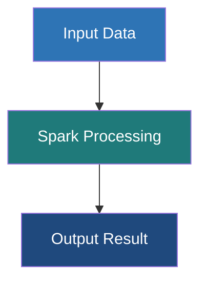

# Datasets in Apache Spark

**A Dataset is a distributed, strongly-typed collection of domain-specific objects that provides the convenience of RDDs with the performance optimizations of Spark SQL's DataFrames.**

## Why It Matters

DataFrames are incredible for processing data, but they lack one critical feature: compile-time type safety. In a DataFrame, columns are dynamically typed; if you try to select a column that doesn't exist, or try to cast a String to an Integer in an incompatible way, you won't know there's an error until the code actually runs on the cluster (Runtime Error). Datasets solve this by providing strongly-typed APIs. If you make a typo in a field name, your Scala or Java code simply won't compile. This saves enormous amounts of debugging time in production data engineering pipelines. Datasets marry the object-oriented, type-safe programming style of RDDs with the blistering fast execution of the Catalyst Optimizer.

## How It Works

A Dataset is effectively the same concept as a DataFrame, but it is strictly typed. In fact, in Scala, a `DataFrame` is merely an alias for `Dataset[Row]`, where `Row` is an untyped generic object. When you use Datasets, you bind the data to a specific schema defined by a Scala `case class` or a Java bean (e.g., `Dataset[Employee]`). 

The magic that makes Datasets work efficiently is the **Encoder**. When working with standard RDDs containing custom objects, Spark has to serialize those objects using Java Serialization or Kryo, which is slow and memory-intensive. Datasets use specialized Encoders that translate between JVM objects and Spark's internal Tungsten binary format. These Encoders allow Spark to perform operations like filtering or sorting directly on the serialized bytes without having to deserialize the objects back into the JVM memory, resulting in massive performance improvements.

**Why no Python Datasets?** Datasets are uniquely a feature of statically typed languages (Scala and Java). Python is dynamically typed; it doesn't have a compile-time type checker in the same way. Therefore, PySpark *only* provides the DataFrame API. While PySpark developers miss out on compile-time type safety, they still benefit from the exact same Catalyst and Tungsten optimizations under the hood.

## Flow Diagram



## Data Visualization

**Comparison Table: Dataset vs DataFrame vs RDD**

| Feature | RDD | DataFrame (`Dataset[Row]`) | Dataset (`Dataset[T]`) |
| :--- | :--- | :--- | :--- |
| **Data Format** | JVM Objects | Untyped Rows | Strongly-typed Objects (`case class`)|
| **Type Safety** | Compile-Time | Runtime | Compile-Time |
| **Optimization** | None (Opaque) | Catalyst & Tungsten | Catalyst & Tungsten |
| **Serialization**| Java/Kryo (Slow) | Tungsten Encoders (Fast) | Tungsten Encoders (Fast) |
| **Supported Languages**| Scala, Java, Python, R | Scala, Java, Python, R | Scala, Java |
| **Best Used For**| Low-level unstructured data | SQL-like analytics, dynamic queries| Complex domain logic, type safety required |

## Code Example

*Note: Since Datasets rely on strict typing, this example uses Scala, which is the primary language for the Dataset API.*

```scala
import org.apache.spark.sql.SparkSession
import org.apache.spark.sql.Encoders

// 1. Define a Case Class to act as the schema/type definition
// This gives us strict compile-time type safety.
case class DeviceData(id: Int, device_name: String, temperature: Double, active: Boolean)

// Initialize Spark
val spark = SparkSession.builder()
  .appName("Dataset-Example")
  .master("local[*]")
  .getOrCreate()

import spark.implicits._ // Required for implicit Encoders

// 2. Reading data as a DataFrame and converting it to a strongly-typed Dataset
// The `.as[DeviceData]` requires an Encoder, provided by spark.implicits._
val ds: Dataset[DeviceData] = spark.read.json("/path/to/devices.json").as[DeviceData]

// 3. Type-Safe Transformations
// The compiler checks that 'temperature' and 'active' exist in the DeviceData case class
val activeDevicesDS = ds.filter(device => device.active == true && device.temperature > 40.0)

// 4. Using Map to transform the Dataset type
// Transforming Dataset[DeviceData] into a Dataset[String]
val deviceNamesDS: Dataset[String] = activeDevicesDS.map(device => s"Device ${device.device_name} is overheating!")

// Show results
deviceNamesDS.show()

// 5. Why Datasets are safer:
// If we tried this on a DataFrame:
// df.select("temperatureee") // Fails at runtime (spelling error)
//
// On a Dataset, the equivalent map:
// ds.map(d => d.temperatureee) // FAILS AT COMPILE TIME! You catch the bug before deployment.
```

## Common Pitfalls

*   **Using Datasets in Python:** Many beginners search for "PySpark Datasets" not realizing they don't exist. Python's dynamic typing makes the Dataset API irrelevant; use PySpark DataFrames instead.
*   **Overusing Object-Oriented functions (`map`, `filter` with lambda functions):** While Datasets allow you to write custom `map(d => d.value * 2)` functions, doing so forces Spark to deserialize the data into JVM objects, losing some of Tungsten's speed. Where possible, use standard column functions (`select`, `withColumn`) even on Datasets.
*   **Forgetting to import `spark.implicits._`:** In Scala, converting a DataFrame to a Dataset requires implicit encoders. Forgetting this import will result in confusing compile-time errors about missing Encoders.
*   **Large case classes:** Having case classes with hundreds of fields can cause compilation slowdowns in Scala and bloat the bytecode, leading to performance hits when mapping.

## Key Takeaway

Datasets offer the "best of both worlds" for JVM developers: the compile-time type safety and object-oriented elegance of RDDs, combined with the extreme performance and optimization engine of Spark SQL DataFrames.


---

## 🎓 Deep Learning Questions

### Q1: Why Was This Concept Introduced?
Before Datasets, developers used either RDDs or DataFrames. RDDs provided great compile-time type safety but lacked query optimization (Catalyst) and efficient memory management (Tungsten). DataFrames offered tremendous performance optimizations but lacked compile-time type safety; errors like misspelled column names or incorrect types were only caught at runtime after submitting the job to the cluster. 

Apache Spark introduced Datasets in version 1.6 to bridge this gap. Datasets combine the object-oriented, strongly-typed programming style of RDDs with the execution efficiency of DataFrames. They overcome the limitations of runtime-only error checking by ensuring that domain-specific objects (like Scala case classes or Java beans) match the data schema at compile time, saving countless hours of debugging in production environments.

### Q2: What Exactly Is This Concept and How Does It Work?
A Dataset is a distributed, strongly-typed collection of data. Internally, a Dataset is essentially a DataFrame that has been bound to a specific object type (`Dataset[T]`). In fact, in Scala, a DataFrame is just an alias for `Dataset[Row]`.

Datasets work through a mechanism called **Encoders**. When you define a Dataset of a custom class, Spark uses an Encoder to map the JVM object fields to Spark's internal binary format (Tungsten). Instead of using standard Java serialization, which is slow and bloated, Encoders generate byte-code to interact directly with off-heap memory. This allows Spark to perform operations like filtering, sorting, and hashing directly on serialized bytes without deserializing the data back into Java objects. This minimizes garbage collection overhead and maximizes CPU efficiency while still giving the developer a type-safe API.

### Q3: Where Should This Concept Be Used?
Datasets are ideal for production-grade data engineering pipelines where type safety and data integrity are paramount.
- **Financial Services (Banking):** When processing transaction data, strict schema enforcement is critical. A missing field or wrong data type could cause severe financial miscalculations.
- **Healthcare Data Pipelines:** Processing patient records requires strong data contracts to ensure no fields are lost or misinterpreted.
- **Complex Domain Logic:** When you have complex business logic that is easier to express as functional operations on objects (using `map`, `filter`, `flatMap`) rather than complex SQL expressions.
- **Large Scala/Java Codebases:** Software engineering teams building large Spark applications benefit from the compiler catching errors early.

### Q4: Where Should This Concept NOT Be Used?
- **Python or R Environments:** Datasets are fundamentally a JVM concept. Python and R are dynamically typed languages, so PySpark and SparkR only support DataFrames. 
- **Simple ETL and SQL Analytics:** If your task is a simple transformation, aggregation, or standard SQL query, sticking to DataFrames is better.
- **Performance-Critical Transformations:** Overusing lambda functions (e.g., `ds.map(obj => obj.value + 1)`) forces Spark to deserialize Tungsten rows into JVM objects, process them, and serialize them back. This breaks whole-stage code generation. For maximum performance, use standard DataFrame/SQL functions instead of Dataset functional transformations.

### Q5: How Is This Concept Different from Hadoop?
| Aspect | Hadoop MapReduce | Apache Spark (Dataset) |
| :--- | :--- | :--- |
| **Architecture** | Disk-based processing, strict Map and Reduce phases. | In-memory processing, Catalyst optimizer, Tungsten execution. |
| **Performance** | Slow due to disk I/O and lack of optimization. | Extremely fast due to optimized query plans and off-heap memory. |
| **Processing Model** | Low-level Key-Value pairs. | High-level strongly-typed domain objects (`Dataset[T]`). |
| **Memory Usage** | JVM heap memory, high Garbage Collection overhead. | Tungsten binary format, off-heap memory, low GC overhead. |
| **Fault Tolerance** | Replication to HDFS. | Lineage graph (DAG) recomputation. |
| **Scalability** | Scales well but high latency. | Scales well with low latency for iterative workloads. |
| **Ease of Development** | Very complex, verbose Java code. | Concise, functional, type-safe API (Scala/Java). |
| **Typical Use Cases** | Batch processing logs, massive cold data. | Advanced ETL, machine learning, streaming, typed data processing. |
| **Advantages** | Robust for extremely large batch jobs. | Compile-time safety + high performance. |
| **Disadvantages** | No type safety for complex structures, very slow. | JVM serialization overhead if lambdas are overused. |

### Q6: How Can This Concept Be Related to a Traditional RDBMS?
| Spark Dataset Concept | Traditional RDBMS Equivalent | Explanation |
| :--- | :--- | :--- |
| **Dataset[T]** | Strongly-typed Table / View | A table where every row maps directly to a strict object structure (ORM-like). |
| **Case Class / Java Bean** | Table Schema (DDL) | Defines the exact columns, types, and constraints of the data. |
| **Encoders** | ORM (Object-Relational Mapping) | Translates between the database's internal storage format and application objects. |
| **Compile-Time Safety** | Schema validation before insert | In RDBMS, inserting wrong types fails; Datasets catch this in code compilation. |
| **Catalyst Optimizer** | Query Planner / Optimizer | Both systems analyze queries and find the most efficient execution path. |

### Q7: What Happens Behind the Scenes?
When a Dataset job is executed, Spark goes through the following lifecycle:

1. **Driver & Compile Time:** The Scala compiler checks your code against the case class. If valid, the Driver translates your Dataset code into an Unresolved Logical Plan.
2. **Catalyst Optimizer:** 
   - Resolves schemas using the Catalog.
   - Applies optimizations (predicate pushdown, column pruning).
   - Generates an Optimized Physical Plan.
3. **Encoders & Tungsten:** Encoders generate byte-code to convert your case classes into Spark's internal binary format.
4. **DAG Scheduler:** Splits the physical plan into Stages based on wide dependencies (Shuffles).
5. **Task Scheduler:** Distributes Tasks to Executors.
6. **Executors:** Process the data in Tungsten binary format. If a lambda function is used (e.g., `.map()`), the data is temporarily deserialized to a JVM object, processed, and serialized back.

```text
[Scala Code / Case Class] 
       | (Compile-time Type Check)
       v
[Logical Plan] -> [Catalyst Optimizer] -> [Physical Plan]
                                              |
    +-----------------------------------------+
    | (Encoders map Objects <-> Tungsten Binary)
    v
[DAG Scheduler] -> [Stages] -> [Task Scheduler]
                                      |
                           +----------+----------+
                           v                     v
                      [Executor 1]          [Executor 2]
                     (Tungsten Memory)     (Tungsten Memory)
```

### Q8: Performance Considerations, Best Practices, and Common Mistakes
| Category | Recommendation | Why It Matters |
| :--- | :--- | :--- |
| **Performance** | Avoid using lambda functions (`.map()`, `.filter()`) if standard SQL functions (`.select()`, `.where()`) can be used. | Lambdas force deserialization of Tungsten binary data into JVM objects, slowing down processing and causing GC overhead. |
| **Best Practice** | Use DataFrames (`Dataset[Row]`) for pure data manipulation and Datasets (`Dataset[T]`) for complex domain logic. | Balances the extreme performance of DataFrames with the type-safety of Datasets where strictly needed. |
| **Optimization** | Rely on Spark SQL built-in functions via `org.apache.spark.sql.functions`. | Built-in functions operate directly on Tungsten binary data without object deserialization. |
| **Common Mistake** | Using huge, nested case classes with hundreds of fields. | Large case classes slow down compilation and increase the overhead of Encoders. |
| **Production Tip** | Ensure `spark.implicits._` is imported in Scala. | Without this, Spark cannot auto-generate the Encoders required to convert DataFrames to Datasets. |

### Q9: Interview Questions

**Beginner**
1. **What is a Spark Dataset?**
   It is a distributed, strongly-typed collection of data that combines RDD type safety with DataFrame performance.
2. **Why do we use Encoders in Datasets?**
   Encoders seamlessly translate between JVM objects (like Scala case classes) and Spark's highly optimized internal binary format (Tungsten).
3. **Does PySpark support the Dataset API?**
   No, Python is dynamically typed. PySpark relies on DataFrames, which provide the same performance benefits but lack compile-time object type checking.

**Intermediate**
4. **What is the difference between `Dataset[Row]` and `Dataset[T]`?**
   `Dataset[Row]` is a DataFrame, meaning rows are dynamically typed and errors are caught at runtime. `Dataset[T]` is strongly typed to a specific object `T`, catching schema errors at compile time.
5. **Why might a Dataset transformation (`.map`) be slower than a DataFrame transformation (`.select`)?**
   Dataset `.map` operations use lambda functions that require Spark to deserialize data from Tungsten format into JVM objects, process it, and serialize it back, which adds overhead.
6. **How does compile-time type safety benefit data engineers?**
   It ensures that column name misspellings, type mismatches, and schema violations are caught in the IDE during development rather than crashing production jobs halfway through execution.

**Advanced**
7. **Explain the role of Tungsten in Dataset execution.**
   Tungsten avoids JVM garbage collection by storing data in off-heap memory using a compact binary format. Encoders generate code to operate directly on this binary data.
8. **How does the Catalyst Optimizer interact with Datasets?**
   While Datasets use custom objects, Catalyst still parses the underlying operations into a logical plan. However, opaque lambda functions cannot be fully optimized by Catalyst (unlike standard SQL expressions).
9. **How would you migrate a massive RDD-based legacy application to Datasets?**
   Start by replacing standard RDDs with Datasets using case classes. Then, incrementally replace `.map()` and `.filter()` operations with Catalyst-friendly expressions (like `.select()` and `.where()`) to unlock performance gains.

**Scenario-Based**
10. **You have a PySpark pipeline and want compile-time type safety. How do you achieve this?**
    Since Datasets are not available in PySpark, you cannot get native Spark compile-time type safety. You must rely on external libraries like Great Expectations, Pandera, or Pydantic for data validation, or migrate the critical pipeline to Scala.
11. **Your Scala Dataset job is running very slowly and the Spark UI shows high GC time. What is wrong?**
    The job likely relies heavily on object-oriented transformations (e.g., `ds.map`, `ds.reduce`). This forces constant serialization/deserialization into JVM heap objects, causing Garbage Collection pauses. Refactor to use native Spark SQL functions.

### Q10: Complete Real-World Example
**Business Problem:**
Netflix needs to process incoming user viewing logs. They must ensure that the data schema is strictly enforced (type-safety) because downstream billing and recommendation systems rely on exact fields. While PySpark is common, the core data engineering team uses Scala Datasets for this critical pipeline to catch schema errors at compile time.

*Note: Since Datasets are a JVM feature, this code is presented in Scala.*

**Sample Dataset (`viewing_logs.json`):**
```json
{"user_id": 101, "show_name": "Stranger Things", "watch_duration_mins": 45, "completed": true}
{"user_id": 102, "show_name": "The Crown", "watch_duration_mins": 10, "completed": false}
{"user_id": 103, "show_name": "Black Mirror", "watch_duration_mins": 60, "completed": true}
```

**Full Working Code (Scala):**
```scala
import org.apache.spark.sql.{SparkSession, Dataset}
import org.apache.spark.sql.functions._

// 1. Define the strongly-typed schema using a Case Class
case class ViewingLog(user_id: Int, show_name: String, watch_duration_mins: Int, completed: Boolean)

object NetflixDataPipeline {
  def main(args: Array[String]): Unit = {
    // 2. Initialize SparkSession
    val spark = SparkSession.builder()
      .appName("Netflix-Viewing-Logs")
      .master("local[*]")
      .getOrCreate()

    // Required for implicit Encoders (converts rows to ViewingLog objects)
    import spark.implicits._

    // 3. Read JSON data as a DataFrame, then cast strictly to a Dataset
    // If the JSON schema doesn't match the case class, it throws an error early
    val logsDS: Dataset[ViewingLog] = spark.read.json("viewing_logs.json").as[ViewingLog]

    // 4. Type-Safe Functional Transformation (Dataset style)
    // The compiler knows 'watch_duration_mins' is an integer.
    // Misspelling it as 'duration' would cause a compilation error.
    val longWatchesDS = logsDS.filter(log => log.watch_duration_mins > 30)

    // 5. Catalyst-Optimized Transformation (DataFrame style via Dataset API)
    // For maximum performance, we can still use standard Spark SQL functions
    val summaryDF = longWatchesDS
      .groupBy("show_name")
      .agg(count("user_id").alias("total_long_views"))

    // 6. Display results
    summaryDF.show()

    spark.stop()
  }
}
```

**Step-by-step Execution Walkthrough:**
1. **Schema Definition:** The `ViewingLog` case class is defined. The Scala compiler now knows exactly what fields exist.
2. **Ingestion & Encoding:** Spark reads the JSON into untyped Rows, then the Encoder (`as[ViewingLog]`) validates and binds them to the `ViewingLog` structure.
3. **Filtering:** The `.filter()` uses a typed lambda function. Spark deserializes the data, applies the filter logic, and serializes it back. 
4. **Aggregation:** The `.groupBy()` leverages standard Catalyst functions, running directly on Tungsten binary data for blazing speed.

**Expected Output:**
```text
+---------------+----------------+
|      show_name|total_long_views|
+---------------+----------------+
|Stranger Things|               1|
|   Black Mirror|               1|
+---------------+----------------+
```

**Performance Notes:**
While the typed `.filter(log => log.watch_duration_mins > 30)` is extremely safe, in a massive production environment with petabytes of data, rewriting it to `.filter($"watch_duration_mins" > 30)` (DataFrame style) would prevent JVM deserialization and run faster.

### 💡 Key Takeaways
- Datasets provide compile-time type safety, catching schema errors before jobs run.
- They are available only in strictly typed languages (Scala and Java), not Python or R.
- Encoders act as the bridge between JVM objects and Spark's off-heap Tungsten memory.
- A DataFrame is simply an alias for `Dataset[Row]`.
- Datasets combine RDD programming paradigms with Spark SQL execution speeds.

### ⚠️ Common Misconceptions
- **"PySpark Datasets exist."** - No, PySpark only uses DataFrames because Python lacks compile-time type checking.
- **"Datasets are always faster than RDDs."** - True, but if you heavily use lambdas (`.map`), they can be slower than pure DataFrames due to serialization overhead.
- **"You must choose between DataFrames or Datasets."** - False, you can seamlessly convert between them using `.toDF()` and `.as[Type]`.

### 🔗 Related Spark Concepts
- Spark SQL & Catalyst Optimizer
- DataFrames (`Dataset[Row]`)
- Project Tungsten Memory Management
- RDDs (Resilient Distributed Datasets)
- Scala Case Classes

### 📚 References for Further Reading
- Apache Spark Official Documentation
- Learning Spark (O'Reilly)
- Spark: The Definitive Guide (O'Reilly)
