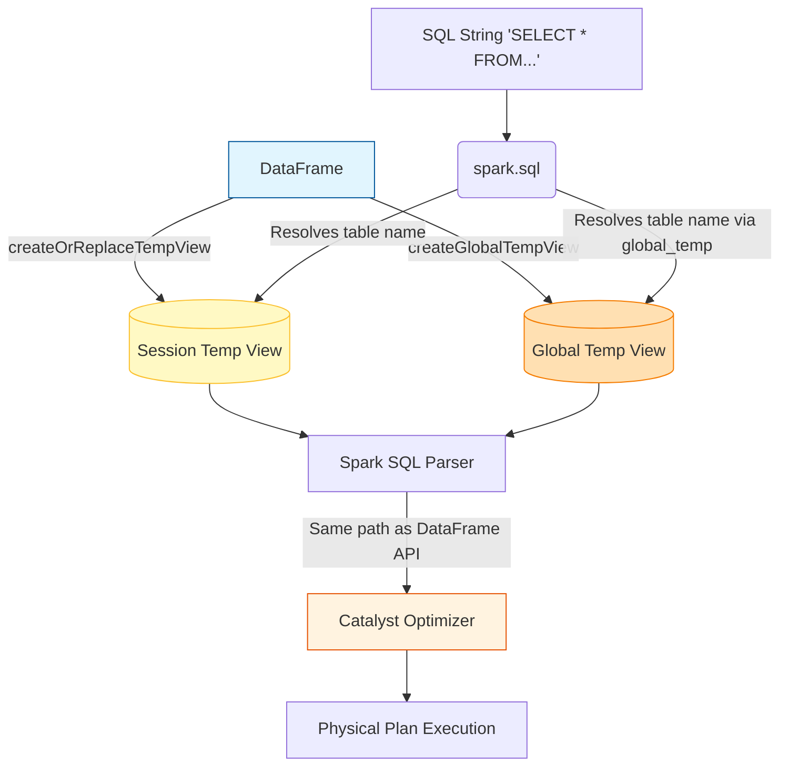

# SQL Queries in Spark

**Spark SQL allows you to execute ANSI SQL queries directly against your distributed data, offering an identical performance profile to the programmatic DataFrame API.**

## Why It Matters

SQL is the lingua franca of data. By providing a robust, ANSI-compliant SQL engine, Spark lowers the barrier to entry, allowing analysts, data scientists, and engineers to interact with massive datasets using the skills they already possess. It eliminates the need to learn Scala or PySpark just to perform basic ETL, aggregations, or analytics. Most importantly, because Spark SQL shares the same Catalyst Optimizer as DataFrames and Datasets, writing raw SQL strings is not a "second-class" citizen—it executes with the exact same optimizations, memory management, and distributed execution speed as highly tuned programmatic code.

## How It Works

To use standard SQL in Spark, you cannot just query a DataFrame directly. You must first register the DataFrame as a view in Spark's temporary metadata catalog. This is done using methods like `createOrReplaceTempView()`. Once registered, the view acts as a virtual table that can be queried using `spark.sql("SELECT ...")`. 

There are two types of temporary views:
1. **Session-Scoped Temporary Views:** Tied strictly to the `SparkSession` that created them. If the session terminates, the view disappears. They cannot be shared across different sessions in the same Spark application.
2. **Global Temporary Views:** Registered using `createGlobalTempView()`. These are tied to a system-preserved database called `global_temp`. They can be accessed by multiple `SparkSession` instances within the same Spark application, persisting until the application itself terminates.

Spark SQL supports a vast array of complex SQL-92 and newer features. This includes Common Table Expressions (CTEs) to simplify nested queries, subqueries in WHERE/SELECT clauses, and powerful Window functions (like `RANK()`, `ROW_NUMBER()`, `LAG()`, and `LEAD()`) for analytical processing over partitioned data. Because Spark compiles the SQL string into the exact same Unresolved Logical Plan as the DataFrame API, there is absolutely zero performance difference between the two approaches. Choosing between them is entirely a matter of team preference and code maintainability.

## Flow Diagram



## Data Visualization

**Using Window Functions in Spark SQL**

*Table: Employee Sales*

| emp_id | department | sales |
| :--- | :--- | :--- |
| 101 | Tech | 500 |
| 102 | Tech | 800 |
| 103 | Sales | 1200 |
| 104 | Sales | 1200 |
| 105 | Sales | 900 |

*Query Execution:* `SELECT emp_id, department, sales, RANK() OVER (PARTITION BY department ORDER BY sales DESC) as rank FROM employee_sales`

*Result Table:*

| emp_id | department | sales | rank |
| :--- | :--- | :--- | :--- |
| 102 | Tech | 800 | 1 |
| 101 | Tech | 500 | 2 |
| 103 | Sales | 1200 | 1 |
| 104 | Sales | 1200 | 1 |
| 105 | Sales | 900 | 3 |

## Code Example

```python
from pyspark.sql import SparkSession

# Initialize SparkSession
spark = SparkSession.builder.appName("SQL-Queries-DeepDive").getOrCreate()

# Load sample data
df = spark.read.json("/path/to/ecommerce_events.json")

# 1. Registering a Session-Scoped Temporary View
df.createOrReplaceTempView("events")

# 2. Registering a Global Temporary View
df.createGlobalTempView("global_events")

# 3. Running basic SQL
basic_sql = spark.sql("""
    SELECT user_id, count(*) as total_events
    FROM events
    WHERE event_type = 'purchase'
    GROUP BY user_id
""")

# 4. Complex SQL with CTEs, Window Functions, and CASE WHEN
complex_sql = spark.sql("""
    WITH UserSpending AS (
        SELECT 
            user_id,
            SUM(price) as total_spent
        FROM events
        WHERE event_type = 'purchase'
        GROUP BY user_id
    )
    SELECT 
        user_id,
        total_spent,
        CASE 
            WHEN total_spent > 1000 THEN 'VIP'
            WHEN total_spent > 500 THEN 'Premium'
            ELSE 'Standard'
        END AS user_tier,
        RANK() OVER (ORDER BY total_spent DESC) as spending_rank,
        LAG(total_spent, 1) OVER (ORDER BY total_spent DESC) as next_highest_spend
    FROM UserSpending
""")

complex_sql.show()

# 5. Accessing the Global Temp View (must prefix with global_temp.)
spark.sql("SELECT COUNT(*) FROM global_temp.global_events").show()
```

## Common Pitfalls

*   **Forgetting `global_temp.` prefix:** When querying a global temporary view, you must explicitly reference the database (`SELECT * FROM global_temp.my_view`). Forgetting this leads to 'Table or view not found' errors.
*   **Assuming SQL strings are slower:** Many developers think parsing the SQL string adds overhead compared to the Python/Scala API. The parsing time is essentially zero in the context of Big Data execution; the physical execution plan is identical.
*   **Hardcoding table names:** Registering static view names inside loops or parallel notebook executions can cause unintended overwrites (since `createOrReplaceTempView` overwrites existing views with the same name in the session).
*   **Not using Multiline Strings:** String concatenating massive SQL queries with `+` makes code unreadable. Always use triple quotes (`"""`) in Python/Scala for formatting readability.
*   **Missing Spark SQL functions:** Developers sometimes write complex custom UDFs for operations that already exist natively in Spark SQL (e.g., date formatting, array manipulations). Always check the Spark SQL built-in functions documentation first.

## Key Takeaway

Spark SQL enables ANSI-compliant querying directly on distributed DataFrames, bridging the gap between traditional database analysts and Big Data engineering without sacrificing a single drop of performance.
