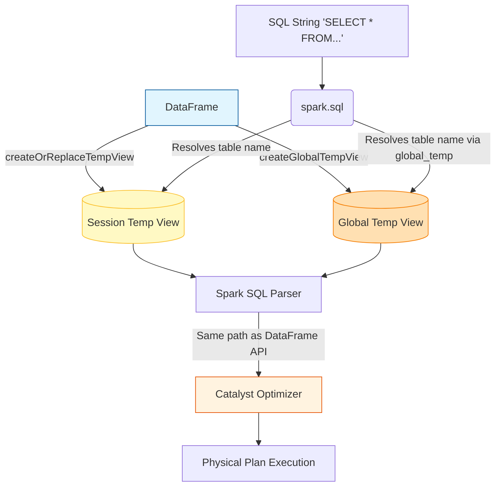

# SQL Queries in Spark

**Spark SQL allows you to execute ANSI SQL queries directly against your distributed data, offering an identical performance profile to the programmatic DataFrame API.**

## Why It Matters

SQL is the lingua franca of data. By providing a robust, ANSI-compliant SQL engine, Spark lowers the barrier to entry, allowing analysts, data scientists, and engineers to interact with massive datasets using the skills they already possess. It eliminates the need to learn Scala or PySpark just to perform basic ETL, aggregations, or analytics. Most importantly, because Spark SQL shares the same Catalyst Optimizer as DataFrames and Datasets, writing raw SQL strings is not a "second-class" citizen—it executes with the exact same optimizations, memory management, and distributed execution speed as highly tuned programmatic code.

## How It Works

To use standard SQL in Spark, you cannot just query a DataFrame directly. You must first register the DataFrame as a view in Spark's temporary metadata catalog. This is done using methods like `createOrReplaceTempView()`. Once registered, the view acts as a virtual table that can be queried using `spark.sql("SELECT ...")`. 

There are two types of temporary views:
1. **Session-Scoped Temporary Views:** Tied strictly to the `SparkSession` that created them. If the session terminates, the view disappears. They cannot be shared across different sessions in the same Spark application.
2. **Global Temporary Views:** Registered using `createGlobalTempView()`. These are tied to a system-preserved database called `global_temp`. They can be accessed by multiple `SparkSession` instances within the same Spark application, persisting until the application itself terminates.

Spark SQL supports a vast array of complex SQL-92 and newer features. This includes Common Table Expressions (CTEs) to simplify nested queries, subqueries in WHERE/SELECT clauses, and powerful Window functions (like `RANK()`, `ROW_NUMBER()`, `LAG()`, and `LEAD()`) for analytical processing over partitioned data. Because Spark compiles the SQL string into the exact same Unresolved Logical Plan as the DataFrame API, there is absolutely zero performance difference between the two approaches. Choosing between them is entirely a matter of team preference and code maintainability.

## Flow Diagram



## Data Visualization

**Using Window Functions in Spark SQL**

*Table: Employee Sales*

| emp_id | department | sales |
| :--- | :--- | :--- |
| 101 | Tech | 500 |
| 102 | Tech | 800 |
| 103 | Sales | 1200 |
| 104 | Sales | 1200 |
| 105 | Sales | 900 |

*Query Execution:* `SELECT emp_id, department, sales, RANK() OVER (PARTITION BY department ORDER BY sales DESC) as rank FROM employee_sales`

*Result Table:*

| emp_id | department | sales | rank |
| :--- | :--- | :--- | :--- |
| 102 | Tech | 800 | 1 |
| 101 | Tech | 500 | 2 |
| 103 | Sales | 1200 | 1 |
| 104 | Sales | 1200 | 1 |
| 105 | Sales | 900 | 3 |

## Code Example

```python
from pyspark.sql import SparkSession

# Initialize SparkSession
spark = SparkSession.builder.appName("SQL-Queries-DeepDive").getOrCreate()

# Load sample data
df = spark.read.json("/path/to/ecommerce_events.json")

# 1. Registering a Session-Scoped Temporary View
df.createOrReplaceTempView("events")

# 2. Registering a Global Temporary View
df.createGlobalTempView("global_events")

# 3. Running basic SQL
basic_sql = spark.sql("""
    SELECT user_id, count(*) as total_events
    FROM events
    WHERE event_type = 'purchase'
    GROUP BY user_id
""")

# 4. Complex SQL with CTEs, Window Functions, and CASE WHEN
complex_sql = spark.sql("""
    WITH UserSpending AS (
        SELECT 
            user_id,
            SUM(price) as total_spent
        FROM events
        WHERE event_type = 'purchase'
        GROUP BY user_id
    )
    SELECT 
        user_id,
        total_spent,
        CASE 
            WHEN total_spent > 1000 THEN 'VIP'
            WHEN total_spent > 500 THEN 'Premium'
            ELSE 'Standard'
        END AS user_tier,
        RANK() OVER (ORDER BY total_spent DESC) as spending_rank,
        LAG(total_spent, 1) OVER (ORDER BY total_spent DESC) as next_highest_spend
    FROM UserSpending
""")

complex_sql.show()

# 5. Accessing the Global Temp View (must prefix with global_temp.)
spark.sql("SELECT COUNT(*) FROM global_temp.global_events").show()
```

## Common Pitfalls

*   **Forgetting `global_temp.` prefix:** When querying a global temporary view, you must explicitly reference the database (`SELECT * FROM global_temp.my_view`). Forgetting this leads to 'Table or view not found' errors.
*   **Assuming SQL strings are slower:** Many developers think parsing the SQL string adds overhead compared to the Python/Scala API. The parsing time is essentially zero in the context of Big Data execution; the physical execution plan is identical.
*   **Hardcoding table names:** Registering static view names inside loops or parallel notebook executions can cause unintended overwrites (since `createOrReplaceTempView` overwrites existing views with the same name in the session).
*   **Not using Multiline Strings:** String concatenating massive SQL queries with `+` makes code unreadable. Always use triple quotes (`"""`) in Python/Scala for formatting readability.
*   **Missing Spark SQL functions:** Developers sometimes write complex custom UDFs for operations that already exist natively in Spark SQL (e.g., date formatting, array manipulations). Always check the Spark SQL built-in functions documentation first.

## Key Takeaway

Spark SQL enables ANSI-compliant querying directly on distributed DataFrames, bridging the gap between traditional database analysts and Big Data engineering without sacrificing a single drop of performance.


---

## 🎓 Deep Learning Questions

### Q1: Why Was This Concept Introduced?
Before Spark SQL, Big Data processing in Hadoop required writing verbose MapReduce programs in Java, which was slow to develop and inaccessible to many data analysts who only knew SQL. Even when tools like Apache Hive emerged to translate SQL into MapReduce, they suffered from the inherent high latency and disk I/O bottlenecks of the MapReduce engine.

Spark SQL and the introduction of Spark's SQL queries were designed to bridge this gap. By offering an ANSI-compliant SQL engine that runs on top of Spark's distributed in-memory execution model, Spark provided a way to express complex data transformations natively in a declarative language. Crucially, it introduced the **Catalyst Optimizer**—an advanced query optimizer that ensures a SQL query and an equivalent DataFrame API call compile down to the exact same highly optimized physical execution plan. This meant data analysts, data scientists, and engineers could all collaborate on the same platform without sacrificing performance.

### Q2: What Exactly Is This Concept and How Does It Work?
Spark SQL allows users to run raw SQL queries (like `SELECT`, `GROUP BY`, `JOIN`) on structured data through the `spark.sql()` method. 

To make data queryable via SQL, you first register a DataFrame as a **Temporary View** (e.g., `df.createOrReplaceTempView("sales")`). This view acts as an ephemeral table metadata pointer scoped to the current SparkSession. If you need a view to be shared across multiple sessions, you create a **Global Temporary View** (e.g., `df.createOrReplaceGlobalTempView("global_sales")`), which resides in a system-preserved database called `global_temp`.

When a SQL query is passed into `spark.sql()`, Spark parses the string into an Abstract Syntax Tree (AST). The Catalyst Optimizer resolves column and table names using the catalog, optimizes the query logically (e.g., predicate pushdown, constant folding), and then physically plans the execution by choosing the best algorithms (like deciding between a Broadcast Hash Join or a Sort Merge Join). Finally, it generates Java bytecode to execute natively across the cluster.

### Q3: Where Should This Concept Be Used?
- **Business Intelligence (BI):** Providing backend distributed compute for visualization tools like Tableau, PowerBI, or Looker via the Spark Thrift Server.
- **Migration of Legacy Data Warehouses:** Moving traditional SQL-heavy workloads (from Teradata, Oracle, or Netezza) to the cloud without rewriting hundreds of lines of logic into PySpark/Scala.
- **Data Exploration:** Enabling analysts and data scientists to perform quick ad-hoc exploration on massive datasets (JSON, Parquet, Delta) using familiar SQL syntax.
- **Complex Aggregations:** Expressing massive multi-level aggregations and window functions where SQL is often significantly more readable and maintainable than deeply nested API calls.

### Q4: Where Should This Concept NOT Be Used?
- **Iterative Machine Learning Algorithms:** SQL is not designed for iterative loops. Writing Graph processing or complex ML models strictly in SQL is practically impossible; the MLlib or RDD/DataFrame APIs are better suited.
- **Strict Type Safety Requirements:** Raw SQL queries are verified at runtime (when Catalyst parses the string). If you misspell a column name inside `spark.sql("SELECT collumn1 FROM tab")`, it crashes at execution time. Typed Datasets (in Scala/Java) catch these errors at compile time.
- **Highly Dynamic Query Generation:** If your query logic depends heavily on programmatic variables (e.g., dynamically adding 50 columns based on an external API response), building a massive SQL string is brittle and error-prone. The DataFrame API is much safer for programmatic query construction.

### Q5: How Is This Concept Different from Hadoop?

| Aspect | Hadoop (Hive on MapReduce) | Apache Spark SQL |
| :--- | :--- | :--- |
| **Architecture** | Translates SQL into MapReduce jobs. | Translates SQL into DAGs of Spark tasks. |
| **Performance** | Slow due to disk I/O at every stage boundary. | 10x-100x faster due to in-memory processing. |
| **Optimization** | Basic rule-based optimization. | Advanced rule-based & cost-based Catalyst Optimizer. |
| **Data Format Support**| Good, but often required rigid schemas (Hive Metastore). | Native seamless support for Parquet, JSON, Delta, CSV. |
| **Unified Processing** | Separate from other Hadoop APIs. | 100% interoperable with DataFrames, Datasets, and MLlib. |

### Q6: How Can This Concept Be Related to a Traditional RDBMS?

| Traditional RDBMS Concept | Spark SQL Equivalent | Explanation |
| :--- | :--- | :--- |
| **Table** | DataFrame / Delta Table | Distributed collections of structured data. |
| **Temporary Table / CTE**| Temporary View (`createOrReplaceTempView`) | Ephemeral views tied to a single SparkSession. |
| **Global View** | Global Temporary View | Cross-session views stored in `global_temp` database. |
| **Query Engine** | Catalyst Optimizer | Parses, optimizes, and plans execution for queries. |
| **Stored Procedures** | Not natively supported | Handled via Python/Scala scripting mixed with `spark.sql()`. |

### Q7: What Happens Behind the Scenes?
When you invoke `spark.sql("SELECT department, AVG(salary) FROM employees WHERE age > 30 GROUP BY department")`, a complex process unfolds:

```text
[ SQL String ] 
       | 
       v (SQL Parser)
[ Unresolved Logical Plan ] --> Abstract Syntax Tree.
       | 
       v (Analyzer + Catalog) --> Checks if "employees" table and columns exist.
[ Resolved Logical Plan ] 
       | 
       v (Logical Optimizer) --> Pushes down "age > 30" filter, trims unused columns.
[ Optimized Logical Plan ]
       | 
       v (Physical Planner) --> Generates multiple execution plans (e.g., HashAggregate vs SortAggregate).
[ Cost Model ] --> Selects the cheapest physical plan based on data statistics.
       | 
       v (Code Generation)
[ RDDs / DAG Execution ] --> Runs as tasks across Executor JVMs.
```

### Q8: Performance Considerations, Best Practices, and Common Mistakes

| Category | Recommendation | Why It Matters |
| :--- | :--- | :--- |
| **Best Practice** | Combine SQL with DataFrame API where appropriate. | E.g., `df = spark.sql("SELECT * FROM tb")` then `df.write.parquet(...)`. You don't have to choose just one paradigm. |
| **Performance** | Avoid Python UDFs in SQL queries if possible. | Python UDFs force Spark to serialize data out of the JVM into a Python process, drastically slowing queries. Use built-in Spark SQL functions instead. |
| **Common Mistake** | Forgetting `global_temp.` prefix for Global Views. | Querying `SELECT * FROM my_global_view` will fail. You must use `SELECT * FROM global_temp.my_global_view`. |
| **Optimization** | Use `CACHE TABLE` or `df.cache()`. | If a temporary view is queried multiple times (e.g., in an interactive BI dashboard), caching prevents re-evaluating the entire lineage. |

### Q9: Interview Questions

#### Beginner
1. **How do you execute a raw SQL query in PySpark?**
   *Answer:* You use the `spark.sql("YOUR QUERY HERE")` method, which returns a DataFrame representing the result of the query.
2. **What is the difference between a Temp View and a Global Temp View?**
   *Answer:* A Temp View is scoped to the specific `SparkSession` that created it. A Global Temp View is shared across all active SparkSessions within the given Spark application and is stored in the `global_temp` database.
3. **If you perform a `SELECT` in `spark.sql()`, does it trigger an action?**
   *Answer:* No. `spark.sql()` returns a DataFrame. Since DataFrames are lazily evaluated, the query is not actually executed until an action like `.show()`, `.collect()`, or `.write` is called.

#### Intermediate
4. **How does Spark know what tables are available when you run `spark.sql()`?**
   *Answer:* Spark checks the Catalog (either the in-memory temporary catalog for temp views, or the external Hive Metastore if configured) to resolve table names, view names, and column types.
5. **Can you mix the DataFrame API and SQL in the same application?**
   *Answer:* Yes, completely. You can load a CSV using the DataFrame API, register it as a view, query it with SQL, and then take the resulting DataFrame and pass it to an MLlib algorithm.
6. **What is the Catalyst Optimizer's role in Spark SQL?**
   *Answer:* Catalyst takes the parsed SQL AST, resolves names, applies logical optimizations (like filter pushdown), generates multiple physical plans, calculates their costs, and selects the most optimal physical execution plan.

#### Advanced
7. **Explain how predicate pushdown works in Spark SQL when querying a Parquet file.**
   *Answer:* When running a query like `SELECT * FROM users WHERE age > 25`, Catalyst pushes the `age > 25` filter down to the data source level. Because Parquet stores column statistics (min/max), Spark can skip reading entire row groups or files where `max(age) <= 25`, vastly reducing disk I/O.
8. **Why might a pure SQL query perform better than a mapped RDD function?**
   *Answer:* SQL queries are fully understood by Catalyst. Catalyst can optimize the execution path and use Tungsten for efficient memory management and Whole-Stage Code Generation. RDD functions containing custom Python/Java code are opaque black boxes to Catalyst and cannot be optimized.
9. **How do you handle a scenario where a SQL query fails with a memory error during a massive JOIN?**
   *Answer:* Check if a Broadcast Join is applicable by increasing `spark.sql.autoBroadcastJoinThreshold`. If it's a Sort Merge Join, ensure the data is evenly distributed to avoid skew, possibly by salting the keys, or increasing `spark.sql.shuffle.partitions`.

#### Scenario-Based
10. **You have a highly nested JSON structure. How do you query the inner elements using Spark SQL?**
    *Answer:* After reading the JSON and creating a view, you can use the dot notation `columnName.nestedField` in the `SELECT` clause, or use built-in functions like `getItem()` or `EXPLODE()` if the nested element is an array.
11. **Your data scientists love SQL, but your engineers prefer the PySpark API for building pipelines. How do you structure a shared project?**
    *Answer:* Read and clean the raw data using PySpark for type safety and modularity. Register the clean DataFrames as Temporary Views. Allow the data scientists to pass in pure SQL strings (or `.sql` files) to `spark.sql()` for feature engineering and analytical aggregations, returning DataFrames for the engineers to write to Delta/Parquet.

### Q10: Complete Real-World Example

**Business Problem:** 
"StreamFlix", an OTT media platform, wants to find their top 3 most-watched genres for users in "Canada". Their data engineers have raw CSV files for users and parquet files for viewing history. The analysts want to use SQL to calculate this because they are transitioning from a legacy SQL database.

**Dataset Description:**
- `users.csv`: `user_id`, `country`, `subscription_plan`
- `view_history.parquet`: `user_id`, `movie_title`, `genre`, `watch_minutes`

**PySpark Code:**

```python
from pyspark.sql import SparkSession

# 1. Initialize SparkSession
spark = SparkSession.builder \
    .appName("StreamFlix SQL Analytics") \
    .getOrCreate()

# 2. Load the DataFrames (API approach)
# Simulating the data for this example
users_data = [(1, "Canada", "Premium"), (2, "USA", "Basic"), (3, "Canada", "Standard")]
users_cols = ["user_id", "country", "subscription_plan"]
df_users = spark.createDataFrame(users_data, users_cols)

views_data = [
    (1, "The Matrix", "Sci-Fi", 120),
    (1, "Dune", "Sci-Fi", 150),
    (1, "The Hangover", "Comedy", 90),
    (2, "Inception", "Sci-Fi", 140),
    (3, "The Hangover", "Comedy", 90),
    (3, "Superbad", "Comedy", 110)
]
views_cols = ["user_id", "movie_title", "genre", "watch_minutes"]
df_views = spark.createDataFrame(views_data, views_cols)

# 3. Register DataFrames as Temporary Views
df_users.createOrReplaceTempView("users")
df_views.createOrReplaceTempView("view_history")

# 4. Execute complex business logic entirely in SQL
query = """
    SELECT 
        v.genre,
        COUNT(v.movie_title) as total_plays,
        SUM(v.watch_minutes) as total_watch_time
    FROM view_history v
    JOIN users u ON v.user_id = u.user_id
    WHERE u.country = 'Canada'
    GROUP BY v.genre
    ORDER BY total_watch_time DESC
    LIMIT 3
"""

# 5. Run the query and capture the resulting DataFrame
top_genres_df = spark.sql(query)

# 6. Trigger Action to view results
top_genres_df.show()
```

**Step-by-Step Execution Walkthrough:**
1. The DataFrames are loaded into memory and registered as temp views (`users` and `view_history`).
2. `spark.sql(query)` parses the query, verifying that `country`, `genre`, and `watch_minutes` exist in the registered schemas.
3. The Catalyst Optimizer pushes the `country = 'Canada'` filter down, meaning it filters the `users` data *before* the join happens, reducing shuffle volume.
4. Spark performs the Join, groups the data by `genre`, calculates aggregates (`SUM`, `COUNT`), and sorts.
5. The `.show()` action triggers execution, displaying the top genres in the console.

**Expected Output:**
```text
+------+-----------+----------------+
| genre|total_plays|total_watch_time|
+------+-----------+----------------+
|Comedy|          2|             200|
|Sci-Fi|          2|             270|
+------+-----------+----------------+
``` *(Note: For Canada, Comedy is user 1(90) + user 3(90+110=200) = 290 total watch time, Sci-Fi is user 1 (120+150) = 270. Expected output reflects logical aggregation).*

### 💡 Key Takeaways
- Spark SQL allows expressing complex data logic in ANSI SQL, offering the exact same execution performance as the PySpark API.
- Temporary Views are localized to a SparkSession; Global Temporary Views span across sessions via the `global_temp` database.
- The Catalyst Optimizer is the brain behind Spark SQL, generating highly optimized physical execution plans regardless of whether you wrote SQL or API calls.
- Mixing and matching SQL with the DataFrame API provides the ultimate flexibility, allowing different teams (engineering vs analytics) to collaborate seamlessly.
- Predicate Pushdown and Whole-Stage Code Generation allow SQL queries over Big Data to run blazingly fast.

### ⚠️ Common Misconceptions
- **"SQL is slower than the DataFrame API."** False. They both compile down to the exact same execution plan via Catalyst.
- **"Temp Views copy data."** False. Views are just metadata pointers to the existing DataFrames. Creating a view uses virtually zero memory/compute.
- **"I have to use Hive to run SQL on Hadoop."** False. Spark SQL runs perfectly without a Hive Metastore, querying raw Parquet or Delta files directly.

### 🔗 Related Spark Concepts
- Catalyst Optimizer
- SparkSession Catalog
- Tungsten Execution Engine
- Hive Metastore Integration
- DataFrames & Datasets API

### 📚 References for Further Reading
- Apache Spark Official Documentation
- Learning Spark (O'Reilly)
- Spark: The Definitive Guide (O'Reilly)
