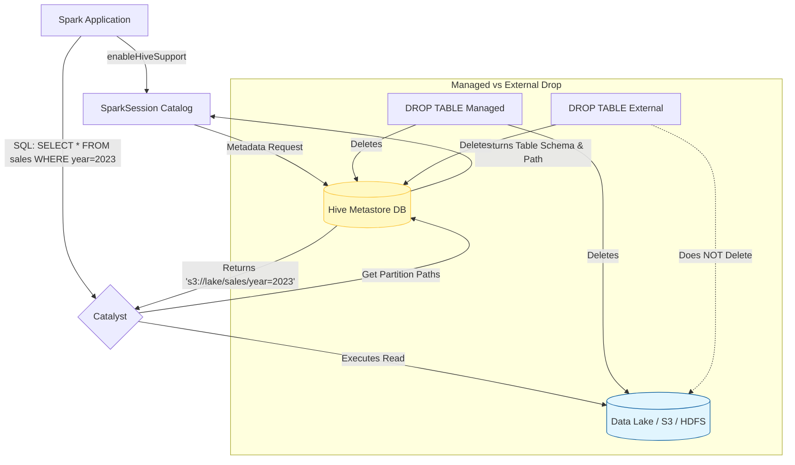

# Hive Metastore Integration

**The Hive Metastore serves as the central repository for Spark SQL's structural metadata, allowing Spark to persistently catalog, discover, and query tables across multiple applications.**

## Why It Matters

Temporary views (`createOrReplaceTempView`) are fantastic for a single script, but they disappear as soon as the Spark application shuts down. In a real-world data lake or data warehouse, you need data to persist, and you need other users and applications to easily find that data without knowing exactly which Parquet files live in which obscure cloud storage directories. By integrating with the Hive Metastore, Spark gains a persistent Catalog. You can define databases, tables, partitions, and schemas just once, and every subsequent Spark job can simply run `SELECT * FROM sales_db.daily_sales`. It transforms Spark from a transient processing engine into a permanent, queryable Data Lakehouse backbone.

## How It Works

Apache Hive is traditionally a data warehouse software built on Hadoop, but Spark doesn't need the Hive execution engine; it only needs Hive's *Metastore*. The Metastore is typically a relational database (like MySQL or Postgres) that stores metadata: table names, schemas (column names/types), locations on disk/cloud, and partition information.

To connect Spark to the Hive Metastore, you must explicitly enable it during initialization using `.enableHiveSupport()`. Once connected, Spark can read and write Hive tables natively. 

Spark differentiates between **Managed Tables** and **External Tables**:
*   **Managed Tables:** Spark (via Hive Metastore) manages both the metadata AND the underlying data files. If you run `DROP TABLE my_table`, the metadata is deleted, and the actual files are physically deleted from storage.
*   **External Tables:** Spark manages only the metadata. You tell Spark to point a table to an existing directory of data. If you run `DROP TABLE my_external_table`, only the table definition in the Metastore is dropped; the underlying data files remain completely untouched. This is the safest and most common pattern for Data Lakes.

Additionally, the Metastore enables **Table Partitioning**. Data can be physically divided into sub-directories (e.g., `year=2023/month=10/`). The Metastore tracks these partitions, so when Spark runs a query with `WHERE year=2023`, it asks the Metastore exactly which directories to scan, skipping irrelevant files entirely (Partition Pruning). Finally, Spark utilizes Hive's SerDes (Serializer/Deserializer) to interface with complex Hadoop file formats like ORC or Avro natively.

## Flow Diagram



## Data Visualization

**Partitioned Data Structure on Disk**

When using the Hive Metastore for a partitioned table, the physical file layout corresponds to the metadata.

| Table Name | Partition Columns | Underlying Storage Path (S3/HDFS) |
| :--- | :--- | :--- |
| `web_logs` | `year`, `month` | `s3://data/web_logs/year=2023/month=10/part-001.parquet` |
| `web_logs` | `year`, `month` | `s3://data/web_logs/year=2023/month=11/part-001.parquet` |
| `web_logs` | `year`, `month` | `s3://data/web_logs/year=2024/month=01/part-001.parquet` |

If your query is `SELECT * FROM web_logs WHERE year=2024`, the Hive Metastore immediately tells Spark to ignore the `year=2023` directories entirely.

## Code Example

```python
from pyspark.sql import SparkSession

# Initialize SparkSession with Hive Support Enabled
# This requires hive-site.xml to be present in the Spark conf directory
spark = SparkSession.builder \
    .appName("Hive-Metastore-Integration") \
    .enableHiveSupport() \
    .getOrCreate()

# 1. Create a Database in the Metastore
spark.sql("CREATE DATABASE IF NOT EXISTS retail_db")
spark.sql("USE retail_db")

# 2. Writing a Managed Table
# Since we use saveAsTable without a path, it's Managed.
# Dropping this table will delete the data.
df = spark.read.csv("/path/to/raw_sales.csv", header=True)
df.write.mode("overwrite").saveAsTable("managed_sales")

# 3. Writing an External Table with Partitioning
# Because we specify the 'path' option, it becomes an External table.
# Dropping this table keeps the data safe in '/path/to/lakehouse/sales/'
df.write \
    .mode("append") \
    .partitionBy("year", "month") \
    .option("path", "/path/to/lakehouse/sales/") \
    .saveAsTable("external_sales")

# 4. Querying the persistent table later (in a different session/script)
# Notice we don't need to specify the format or path; the Metastore handles it.
historical_sales = spark.sql("""
    SELECT product_id, sum(amount)
    FROM retail_db.external_sales
    WHERE year = 2023 AND month = 10
    GROUP BY product_id
""")

historical_sales.show()

# 5. Recovering Partitions
# If files were manually added to the storage directory outside of Spark,
# you must tell the Metastore to update its partition metadata.
spark.sql("MSCK REPAIR TABLE retail_db.external_sales")
```

## Common Pitfalls

*   **Forgetting `enableHiveSupport()`:** A classic error. If you omit this, Spark uses an in-memory catalog. You'll be able to create databases and tables in your script, but they will vanish completely when the script ends, leading to confusion.
*   **Accidental Data Deletion (Managed Tables):** Relying on default `saveAsTable` behavior creates Managed tables. A junior developer testing a script might run `DROP TABLE`, inadvertently deleting critical production files. Default to External tables for data lakes.
*   **Small Files Problem in Partitions:** Over-partitioning (e.g., partitioning by `day`, `hour`, and `minute`) creates thousands of tiny directories and files. The Metastore will struggle to track the metadata, and Spark will spend more time opening files than processing data.
*   **Out-of-Sync Metadata:** If an external process (like AWS Lambda or an Airflow job) dumps new Parquet files directly into an external table's partition directory, Spark *cannot* see them until you run `MSCK REPAIR TABLE` to sync the Metastore.

## Key Takeaway

Integrating with the Hive Metastore upgrades Spark from a transient compute engine into a persistent data warehouse client, providing a centralized, shareable catalog for databases, external tables, and metadata-driven partition pruning.
