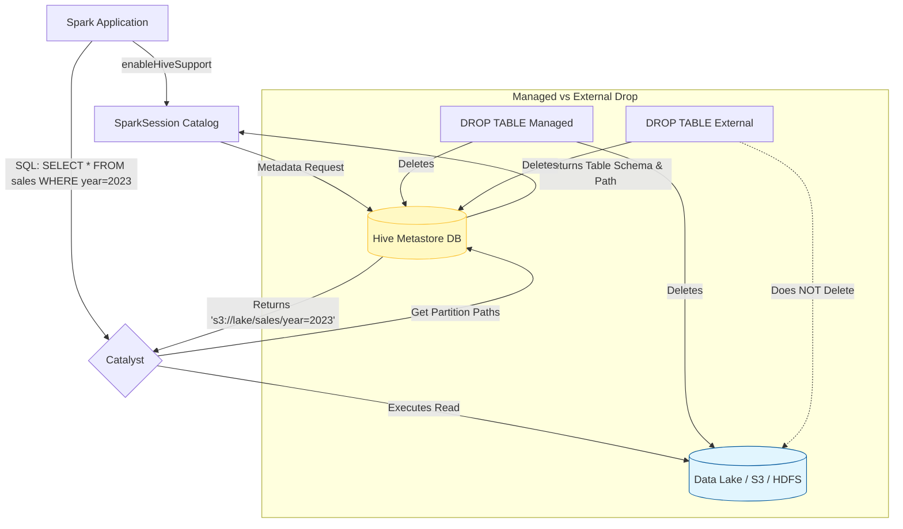

# Hive Metastore Integration

**The Hive Metastore serves as the central repository for Spark SQL's structural metadata, allowing Spark to persistently catalog, discover, and query tables across multiple applications.**

## Why It Matters

Temporary views (`createOrReplaceTempView`) are fantastic for a single script, but they disappear as soon as the Spark application shuts down. In a real-world data lake or data warehouse, you need data to persist, and you need other users and applications to easily find that data without knowing exactly which Parquet files live in which obscure cloud storage directories. By integrating with the Hive Metastore, Spark gains a persistent Catalog. You can define databases, tables, partitions, and schemas just once, and every subsequent Spark job can simply run `SELECT * FROM sales_db.daily_sales`. It transforms Spark from a transient processing engine into a permanent, queryable Data Lakehouse backbone.

## How It Works

Apache Hive is traditionally a data warehouse software built on Hadoop, but Spark doesn't need the Hive execution engine; it only needs Hive's *Metastore*. The Metastore is typically a relational database (like MySQL or Postgres) that stores metadata: table names, schemas (column names/types), locations on disk/cloud, and partition information.

To connect Spark to the Hive Metastore, you must explicitly enable it during initialization using `.enableHiveSupport()`. Once connected, Spark can read and write Hive tables natively. 

Spark differentiates between **Managed Tables** and **External Tables**:
*   **Managed Tables:** Spark (via Hive Metastore) manages both the metadata AND the underlying data files. If you run `DROP TABLE my_table`, the metadata is deleted, and the actual files are physically deleted from storage.
*   **External Tables:** Spark manages only the metadata. You tell Spark to point a table to an existing directory of data. If you run `DROP TABLE my_external_table`, only the table definition in the Metastore is dropped; the underlying data files remain completely untouched. This is the safest and most common pattern for Data Lakes.

Additionally, the Metastore enables **Table Partitioning**. Data can be physically divided into sub-directories (e.g., `year=2023/month=10/`). The Metastore tracks these partitions, so when Spark runs a query with `WHERE year=2023`, it asks the Metastore exactly which directories to scan, skipping irrelevant files entirely (Partition Pruning). Finally, Spark utilizes Hive's SerDes (Serializer/Deserializer) to interface with complex Hadoop file formats like ORC or Avro natively.

## Flow Diagram



## Data Visualization

**Partitioned Data Structure on Disk**

When using the Hive Metastore for a partitioned table, the physical file layout corresponds to the metadata.

| Table Name | Partition Columns | Underlying Storage Path (S3/HDFS) |
| :--- | :--- | :--- |
| `web_logs` | `year`, `month` | `s3://data/web_logs/year=2023/month=10/part-001.parquet` |
| `web_logs` | `year`, `month` | `s3://data/web_logs/year=2023/month=11/part-001.parquet` |
| `web_logs` | `year`, `month` | `s3://data/web_logs/year=2024/month=01/part-001.parquet` |

If your query is `SELECT * FROM web_logs WHERE year=2024`, the Hive Metastore immediately tells Spark to ignore the `year=2023` directories entirely.

## Code Example

```python
from pyspark.sql import SparkSession

# Initialize SparkSession with Hive Support Enabled
# This requires hive-site.xml to be present in the Spark conf directory
spark = SparkSession.builder \
    .appName("Hive-Metastore-Integration") \
    .enableHiveSupport() \
    .getOrCreate()

# 1. Create a Database in the Metastore
spark.sql("CREATE DATABASE IF NOT EXISTS retail_db")
spark.sql("USE retail_db")

# 2. Writing a Managed Table
# Since we use saveAsTable without a path, it's Managed.
# Dropping this table will delete the data.
df = spark.read.csv("/path/to/raw_sales.csv", header=True)
df.write.mode("overwrite").saveAsTable("managed_sales")

# 3. Writing an External Table with Partitioning
# Because we specify the 'path' option, it becomes an External table.
# Dropping this table keeps the data safe in '/path/to/lakehouse/sales/'
df.write \
    .mode("append") \
    .partitionBy("year", "month") \
    .option("path", "/path/to/lakehouse/sales/") \
    .saveAsTable("external_sales")

# 4. Querying the persistent table later (in a different session/script)
# Notice we don't need to specify the format or path; the Metastore handles it.
historical_sales = spark.sql("""
    SELECT product_id, sum(amount)
    FROM retail_db.external_sales
    WHERE year = 2023 AND month = 10
    GROUP BY product_id
""")

historical_sales.show()

# 5. Recovering Partitions
# If files were manually added to the storage directory outside of Spark,
# you must tell the Metastore to update its partition metadata.
spark.sql("MSCK REPAIR TABLE retail_db.external_sales")
```

## Common Pitfalls

*   **Forgetting `enableHiveSupport()`:** A classic error. If you omit this, Spark uses an in-memory catalog. You'll be able to create databases and tables in your script, but they will vanish completely when the script ends, leading to confusion.
*   **Accidental Data Deletion (Managed Tables):** Relying on default `saveAsTable` behavior creates Managed tables. A junior developer testing a script might run `DROP TABLE`, inadvertently deleting critical production files. Default to External tables for data lakes.
*   **Small Files Problem in Partitions:** Over-partitioning (e.g., partitioning by `day`, `hour`, and `minute`) creates thousands of tiny directories and files. The Metastore will struggle to track the metadata, and Spark will spend more time opening files than processing data.
*   **Out-of-Sync Metadata:** If an external process (like AWS Lambda or an Airflow job) dumps new Parquet files directly into an external table's partition directory, Spark *cannot* see them until you run `MSCK REPAIR TABLE` to sync the Metastore.

## Key Takeaway

Integrating with the Hive Metastore upgrades Spark from a transient compute engine into a persistent data warehouse client, providing a centralized, shareable catalog for databases, external tables, and metadata-driven partition pruning.


---

## 🎓 Deep Learning Questions

### Q1: Why Was This Concept Introduced?
Before Hive Metastore integration, Spark was fundamentally a transient processing engine. If you processed a massive dataset and saved it to an HDFS or S3 directory, future jobs had no structural knowledge of that data. You had to manually specify the file path, schema, and format every time you wanted to read it (`spark.read.parquet("s3://data/sales")`). This lack of a persistent data catalog meant data discovery was difficult, and teams had no centralized repository for table definitions. Spark introduced Hive Metastore integration to leverage the existing Hadoop ecosystem's de-facto metadata repository. By connecting to the Hive Metastore, Spark overcame the limitation of transient metadata, allowing users to persist table schemas, locations, and partitioning schemes permanently.

### Q2: What Exactly Is This Concept and How Does It Work?
The Hive Metastore is a relational database (like MySQL or PostgreSQL) that acts as a central catalog for big data tables. When Spark integrates with it via `.enableHiveSupport()`, Spark replaces its default in-memory catalog with a connection to this external database. 
When you execute a command like `CREATE TABLE sales`, Spark sends the schema and storage path to the Metastore. When you run `SELECT * FROM sales`, Spark queries the Metastore to find out where the data physically resides (e.g., S3 or HDFS), what format it is in (Parquet, ORC), and what partitions exist.
Spark's Catalyst Optimizer uses this metadata to perform partition pruning (skipping irrelevant directories) before even touching the physical storage layer. The Metastore does not store the data itself; it only stores the *blueprint* of the data.

### Q3: Where Should This Concept Be Used?
Hive Metastore integration is essential in building enterprise Data Lakes and Lakehouses.
- **Retail (e.g., Amazon, Walmart):** Persisting massive partitioned sales and inventory tables so analysts can query `SELECT * FROM global_sales` without knowing the complex S3 bucket structures.
- **Streaming & Ride-Sharing (e.g., Netflix, Uber):** Providing a unified catalog where data engineering pipelines output parsed logs into managed or external tables, and BI tools (via Spark Thrift Server) read from those exact tables seamlessly.
- **Banking & Healthcare:** Ensuring strong metadata governance. A central catalog tracks all historical tables, allowing different Spark jobs, Presto queries, and Trino clusters to share the exact same table definitions for regulatory reporting and auditing.

### Q4: Where Should This Concept NOT Be Used?
You should not use the Hive Metastore for highly transient, intermediate data processing where tables are created and destroyed rapidly within a single job. For these scenarios, Spark's temporary views (`createOrReplaceTempView`) are vastly superior because they bypass external network calls to a relational database.
Additionally, relying on the Metastore is an anti-pattern when dealing with heavily evolving, unstructured data where schemas are completely fluid, or when working in modern Lakehouse architectures that use Delta Lake, Apache Iceberg, or Apache Hudi. While these modern formats *can* sync with the Metastore, they store their own transaction logs and metadata natively, often making traditional Hive Metastore reliance redundant and a potential bottleneck for extremely large tables.

### Q5: How Is This Concept Different from Hadoop?
| Aspect | Hadoop MapReduce (Hive Engine) | Apache Spark with Hive Metastore |
| :--- | :--- | :--- |
| **Architecture** | Disk-heavy MapReduce execution engine reading Metastore | In-memory DAG execution engine reading Metastore |
| **Performance** | Slower due to disk I/O between Map and Reduce phases | 10x-100x faster due to in-memory processing and Catalyst Optimizer |
| **Processing Model** | Batch processing only | Unified batch and streaming (Structured Streaming) |
| **Memory Usage** | Minimal in-memory caching | Heavy reliance on distributed RAM |
| **Fault Tolerance** | Writes intermediate data to disk for recovery | Recomputes lost partitions via RDD lineage |
| **Scalability** | Scales massively but slowly | Scales massively and quickly |
| **Ease of Development** | Requires writing complex HiveQL or Java MapReduce | Native Python/Scala APIs and ANSI SQL |
| **Typical Use Cases** | Legacy batch ETL, overnight reporting | Interactive queries, real-time analytics, machine learning |
| **Advantages** | Battle-tested for ultra-large, slow batch jobs | Unmatched speed, rich API, multi-language support |
| **Disadvantages** | Sluggish, high latency | Higher memory footprint and costs |

### Q6: How Can This Concept Be Related to a Traditional RDBMS?
| Aspect | Traditional RDBMS (e.g., PostgreSQL, Oracle) | Spark + Hive Metastore |
| :--- | :--- | :--- |
| **Storage vs Compute** | Tightly coupled. Database manages both. | Decoupled. Storage (S3/HDFS), Compute (Spark), Metadata (Hive). |
| **Data Location** | Stored in proprietary internal blocks on local disks. | Stored as open formats (Parquet/ORC) on distributed storage. |
| **Metadata** | Handled implicitly by the database engine. | Handled explicitly by the standalone Hive Metastore service. |
| **Table Types** | Primarily Managed (Internal) tables. | Both Managed and External tables (data lives outside engine control). |
| **Schema Enforcement** | Schema-on-write (rejects bad data at insert). | Schema-on-read (data is read; errors handled at query time). |
| **Query Engine** | Internal proprietary query planner. | Spark Catalyst Optimizer. |

### Q7: What Happens Behind the Scenes?
1. **Driver:** The user executes `spark.sql("SELECT * FROM sales WHERE year=2023")`. The Spark Driver receives this query.
2. **Metadata Lookup:** The Driver contacts the Hive Metastore to fetch the schema and partition locations for the `sales` table.
3. **Catalyst Optimizer:** Catalyst uses the metadata to push down filters. It prunes partitions, deciding to only read the `year=2023` directory.
4. **DAG Scheduler:** A logical plan is translated into a physical execution DAG.
5. **Task Scheduler:** The DAG is broken into Stages. The first stage contains Tasks for reading the underlying Parquet files.
6. **Executors & Partitions:** The Task Scheduler assigns tasks to Executors. Each Executor reads a specific Parquet file block (partition) directly from distributed storage (e.g., S3) into RAM.
7. **Shuffle & Memory:** If the query included a `GROUP BY` or `JOIN`, executors shuffle data across the network. Results are aggregated in memory and sent back to the Driver.

```text
[User Query] -> (Spark Driver)
                     | 1. Request Metadata
                     v
             (Hive Metastore DB)
                     | 2. Return Table Path & Partitions
                     v
            (Catalyst Optimizer) -> Prunes irrelevant partitions
                     | 3. Create Physical Plan
                     v
              (DAG Scheduler) -> Creates Stages & Tasks
                     | 4. Distribute Tasks
                     v
    +-----------------------------------+
    |             Executors             |
    | Task 1 reads 'year=2023/part1'    |
    | Task 2 reads 'year=2023/part2'    |
    +-----------------------------------+
                     | 5. In-Memory Execution
                     v
           [Final Result to User]
```

### Q8: Performance Considerations, Best Practices, and Common Mistakes
| Category | Recommendation | Why It Matters |
| :--- | :--- | :--- |
| **Best Practice** | Default to External Tables over Managed Tables. | Prevents accidental deletion of raw data when `DROP TABLE` is executed. |
| **Performance** | Avoid over-partitioning (e.g., partitioning by day and hour). | Too many partitions overwhelm the Metastore database and create millions of tiny files, destroying HDFS/S3 performance. |
| **Optimization** | Use Columnar Formats (Parquet/ORC) with Snappy compression. | The Metastore seamlessly integrates with these formats, allowing Spark to push down filters and skip massive amounts of data. |
| **Common Mistake** | Forgetting to run `MSCK REPAIR TABLE`. | If an external process adds files to an external table's directory, the Metastore won't know. Queries will return empty or incomplete results. |
| **Production Tip** | Use highly available Relational DBs for the Metastore. | If the Metastore goes down, Spark cannot resolve any table metadata, halting all catalog-based jobs. |

### Q9: Interview Questions

**Beginner**
1. **What is the difference between `.createOrReplaceTempView()` and saving a table to the Hive Metastore?**
   *Answer:* Temporary views exist only in memory and disappear when the Spark application terminates. Metastore tables are persistent and can be accessed by any future Spark application.
2. **What does `enableHiveSupport()` do in SparkSession?**
   *Answer:* It tells Spark to connect to a persistent Hive Metastore to read and write permanent table metadata, rather than using a transient in-memory catalog.
3. **What happens to the data files if you drop a Managed table?**
   *Answer:* In a Managed table, Spark drops both the metadata from the Metastore and physically deletes the underlying data files from storage.

**Intermediate**
1. **Explain the difference between Managed and External tables in Spark SQL.**
   *Answer:* Managed tables store both metadata and data under Spark's control. External tables only store metadata in the Metastore; the data resides in a user-specified path and is NOT deleted when the table is dropped.
2. **Why might a `SELECT COUNT(*)` on a newly updated external table return old results?**
   *Answer:* If data files were added manually to the storage path without Spark's knowledge, the Metastore is out of sync. You must run `MSCK REPAIR TABLE` to update partition metadata.
3. **How does partition pruning work with the Hive Metastore?**
   *Answer:* When a query filters on a partition column, Spark fetches only the relevant partition paths from the Metastore, instructing executors to skip scanning irrelevant directories entirely.

**Advanced**
1. **How do modern table formats like Delta Lake or Iceberg interact with or replace the Hive Metastore?**
   *Answer:* Modern formats maintain their own transaction logs (metadata) at the file system level, removing the Metastore bottleneck for partition planning. However, they still register their top-level table names in the Metastore for BI tool discovery.
2. **What is the architectural bottleneck of the Hive Metastore when dealing with exabyte-scale data?**
   *Answer:* The Metastore is a single relational database. For tables with hundreds of thousands of partitions, fetching metadata from this RDBMS becomes a severe bottleneck, delaying the Spark Catalyst optimizer's planning phase.
3. **How would you migrate thousands of existing Hive tables to Spark SQL processing?**
   *Answer:* Simply connect Spark to the existing Hive Metastore URI. Spark SQL is fully compatible with Hive's catalog. Spark will read the metadata and execute the processing using its own engine without migrating any actual data files.

**Scenario-Based**
1. **Your team runs daily ETL jobs that output partitioned Parquet files to an S3 bucket. Analysts complain they cannot query this data via SQL. How do you fix this?**
   *Answer:* Define an External Table mapped to that S3 bucket using `CREATE EXTERNAL TABLE ... USING PARQUET LOCATION 's3://...'`. Ensure `enableHiveSupport()` is on. Run `MSCK REPAIR TABLE` daily to sync partitions.
2. **A junior developer accidentally ran `DROP TABLE customer_data`. The table was an external table. What is your next step?**
   *Answer:* Do not panic. Because it was an external table, the raw data on S3/HDFS is safe. Simply re-run the `CREATE EXTERNAL TABLE` statement pointing to the same storage path to rebuild the metadata.

### Q10: Complete Real-World Example
- **Business Problem:** A streaming service (like Netflix) needs a permanent catalog for user viewing logs so data scientists can run historical SQL queries without hardcoding S3 paths.
- **Sample Dataset description:** JSON files containing `user_id`, `movie_id`, `duration_watched`, `event_date`.

```python
from pyspark.sql import SparkSession
from pyspark.sql.types import StructType, StructField, StringType, IntegerType
import os

# 1. Initialize Spark with Hive Support
# In a production cluster, spark-defaults.conf points to the Metastore URI
spark = SparkSession.builder \\
    .appName("Netflix-Viewing-History-Catalog") \\
    .enableHiveSupport() \\
    .getOrCreate()

# 2. Sample Data Creation (Simulating raw log ingestion)
data = [
    ("u101", "m55", 120, "2023-10-01"),
    ("u102", "m55", 15, "2023-10-01"),
    ("u101", "m89", 90, "2023-10-02")
]
schema = StructType([
    StructField("user_id", StringType(), True),
    StructField("movie_id", StringType(), True),
    StructField("duration_watched", IntegerType(), True),
    StructField("event_date", StringType(), True)
])

df = spark.createDataFrame(data, schema)

# 3. Create a Database Namespace
spark.sql("CREATE DATABASE IF NOT EXISTS streaming_logs")
spark.sql("USE streaming_logs")

# 4. Save as a Partitioned EXTERNAL Table
# The metadata goes to Hive Metastore, data goes to the provided path.
storage_path = "/tmp/lakehouse/viewing_logs"

df.write \\
    .mode("overwrite") \\
    .partitionBy("event_date") \\
    .option("path", storage_path) \\
    .saveAsTable("external_viewing_logs")

# 5. Simulate a new session/Data Scientist querying the catalog
# Notice no file paths are needed!
historical_query = spark.sql(\"""
    SELECT movie_id, SUM(duration_watched) as total_minutes
    FROM streaming_logs.external_viewing_logs
    WHERE event_date = '2023-10-01'
    GROUP BY movie_id
\""")

print("Query Results using Hive Metastore Catalog:")
historical_query.show()

# 6. Safety check: Drop the external table
spark.sql("DROP TABLE streaming_logs.external_viewing_logs")

# The data still exists on disk!
print("Is data safe on disk? Checking filesystem...")
print("Data exists:", os.path.exists(storage_path))
```

*Step-by-step execution walkthrough:*
1. The SparkSession is initialized with `.enableHiveSupport()`, connecting to the cluster's default Metastore.
2. A DataFrame representing raw logs is created in memory.
3. We define a database `streaming_logs` to organize our tables logically.
4. We write the data as an *External Table*, partitioned by `event_date`. Spark saves Parquet files to `/tmp/lakehouse/viewing_logs` and registers the table and partition locations in the Metastore.
5. We run a standard SQL query. Catalyst queries the Metastore, discovers the schema, applies partition pruning (only reading the `2023-10-01` folder), and returns the aggregation.
6. We drop the table to prove that external tables protect underlying files.

*Expected output:*
```text
Query Results using Hive Metastore Catalog:
+--------+-------------+
|movie_id|total_minutes|
+--------+-------------+
|     m55|          135|
+--------+-------------+

Is data safe on disk? Checking filesystem...
Data exists: True
```

*Performance notes:*
Partitioning by `event_date` drastically reduces I/O for time-bounded queries. However, avoid using `user_id` as a partition column, as it would create millions of tiny directories, crashing the Metastore.

*When this approach is best:*
This is best for building a traditional Data Lake where multiple disconnected teams (Data Engineering, BI, Data Science) need to discover and query shared, immutable datasets using a central registry.

### 💡 Key Takeaways
- `.enableHiveSupport()` is mandatory to persist table definitions beyond the lifespan of a single Spark application.
- The Metastore holds *metadata* (schemas, paths, partitions), not the actual row data.
- **Managed Tables** couple data and metadata; dropping the table deletes the physical files.
- **External Tables** decouple data and metadata; dropping the table leaves the physical files completely safe.
- The Catalyst Optimizer uses Metastore data for **Partition Pruning**, skipping massive amounts of irrelevant data directories.

### ⚠️ Common Misconceptions
- **Spark uses Hive for processing:** Wrong. Spark only talks to the Hive *Metastore* database for schemas and paths. It uses its own Catalyst optimizer and execution engine to process the data.
- **Dropping any table deletes the data:** Wrong. Dropping an *External* table only removes the metadata pointer; the data remains safe on disk.
- **Data magically updates in the Metastore:** Wrong. If you copy files into an external table's directory manually, Spark won't see them until you run `MSCK REPAIR TABLE`.

### 🔗 Related Spark Concepts
- Temporary Views vs Global Temporary Views
- Catalyst Optimizer
- Partition Pruning
- Delta Lake / Apache Iceberg (Modern Metastore alternatives)
- Spark Thrift Server (JDBC/ODBC BI integration)

### 📚 References for Further Reading
- Apache Spark Official Documentation
- Learning Spark (O'Reilly)
- Spark: The Definitive Guide (O'Reilly)
