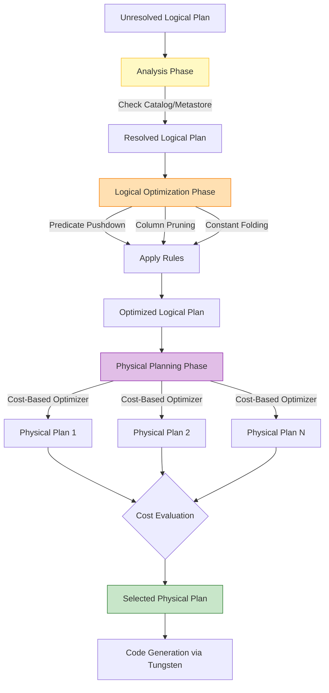

# The Catalyst Optimizer

**The Catalyst Optimizer is Spark SQL's rule-based and cost-based execution engine that automatically translates user code (SQL, DataFrames, Datasets) into the most efficient physical execution plan possible.**

## Why It Matters

In older MapReduce paradigms, the developer was responsible for optimizing the job. If you filtered data *after* a join instead of *before* it, your job would move exponentially more data across the network, leading to massive slowdowns or Out-Of-Memory (OOM) errors. You had to manually arrange the order of operations. The Catalyst Optimizer takes that burden entirely off the developer. Because DataFrames have a strict schema, Catalyst acts as an intelligent compiler. It inspects your entire query, mathematically proves which operations can be safely rearranged, and rewrites your code under the hood. It ensures that no matter how poorly you structure your initial SQL string or DataFrame API chain, Spark will execute it optimally.

## How It Works

Catalyst operates in a strict, four-phase pipeline:

1.  **Analysis:** The user submits a query (Unresolved Logical Plan). Catalyst checks the Catalog (or Hive Metastore) to verify that the tables exist, the column names are spelled correctly, and the data types match. If everything is valid, it generates a *Resolved Logical Plan*.
2.  **Logical Optimization:** This is where the heavy lifting of rule-based optimization occurs. Catalyst applies a series of heuristics (rules) to rewrite the plan. 
    *   **Predicate Pushdown:** Moves `filter()` or `WHERE` clauses as close to the data source as possible. If you join two tables and then filter the results by date, Catalyst rewrites it to filter the tables *before* the join.
    *   **Column Pruning:** If a table has 100 columns but your final `SELECT` only uses 3, Catalyst strips out the other 97 immediately after reading, saving massive memory.
    *   **Constant Folding:** If your query contains expressions like `val + (10 * 100)`, Catalyst computes `1000` at compile time rather than computing it for every single row.
3.  **Physical Planning:** The optimized logical plan tells Spark *what* to do, but not *how* to do it. Catalyst takes the logical plan and generates multiple Physical Plans (e.g., Should I use a SortMergeJoin or a BroadcastHashJoin?). It uses a Cost-Based Optimizer (CBO) to estimate the cost (memory/CPU/network) of each plan and selects the cheapest one.
4.  **Code Generation:** The final physical plan is handed off to Tungsten, which generates highly optimized JVM bytecode to execute the plan on the workers.

You can view this entire lifecycle by using the DataFrame `.explain()` method. Calling `.explain(mode="extended")` will output the Unresolved Logical Plan, Resolved Logical Plan, Optimized Logical Plan, and the final Physical Plan.

## Flow Diagram



## Data Visualization

**Understanding Predicate Pushdown & Column Pruning**

*Scenario: Joining Users and Purchases, looking for users over 18 who bought an item today, returning only their names.*

| Stage | Data Transferred / Processed |
| :--- | :--- |
| **Without Catalyst (Naive)** | Load 100% of Users (all cols), Load 100% Purchases (all cols). Join them. Filter by age>18 and date=today. Drop unused cols. |
| **With Catalyst (Optimized)** | Pushdown: Filter Users (age>18) *at the data source*. Prune: Read only `user_id` and `name` from disk.<br>Pushdown: Filter Purchases (date=today). Prune: Read only `user_id` and `item`. |
| **Impact** | Disk I/O reduced by 90%. Memory usage reduced by 95%. Join shuffle data reduced significantly. |

## Code Example

```python
from pyspark.sql import SparkSession
from pyspark.sql.functions import col

spark = SparkSession.builder.appName("Catalyst-Optimizer").getOrCreate()

# Create dummy DataFrames
users = spark.read.parquet("/path/to/users")
purchases = spark.read.parquet("/path/to/purchases")

# A deliberately poorly structured query
# We do a massive join FIRST, and then filter AFTER. 
# We also do a static math calculation per row.
bad_query_df = users.join(purchases, "user_id") \
    .filter(users["age"] > 18) \
    .filter(purchases["purchase_date"] == "2023-10-01") \
    .withColumn("tax_calc", col("price") * (100 / 100)) \
    .select(users["name"], purchases["item"], "tax_calc")

# View the standard physical plan
print("--- Standard Physical Plan ---")
bad_query_df.explain()

# View the full Catalyst pipeline (Analysis -> Logical -> Physical)
print("--- Extended Catalyst Pipeline ---")
bad_query_df.explain(mode="extended")

# What you will see in the Optimized Logical Plan output:
# 1. PushedFilters: [age > 18] and [purchase_date = '2023-10-01'] 
#    Notice Catalyst moved the filters BEFORE the join.
# 2. ReadSchema: struct<name:string, user_id:int, ...> 
#    Notice Catalyst pruned all columns except those needed for the join or select.
# 3. tax_calc: (price * 1.0) 
#    Notice Catalyst evaluated (100/100) to 1.0 at compile time (Constant Folding).
```

## Common Pitfalls

*   **Breaking Predicate Pushdown with Custom UDFs:** If you use a Python User Defined Function (UDF) inside a `filter()`, Catalyst cannot look inside the Python code to understand the logic. Therefore, it cannot push that filter down to the data source (e.g., Parquet file). It must load the entire dataset into memory first. Use native Spark SQL functions!
*   **Hiding schemas behind opaque types:** Reading data as JSON without providing a strict schema forces Spark to infer it. This can prevent certain optimizations early in the Catalyst pipeline. Parquet is highly preferred because the schema is embedded.
*   **Over-reliance on automatic Join Reordering:** While Catalyst's Cost-Based Optimizer can reorder joins (joining small tables first), it requires accurate table statistics. If you haven't run `ANALYZE TABLE` in the Hive Metastore recently, the CBO might choose a terrible physical plan because its size estimates are wrong.

## Key Takeaway

The Catalyst Optimizer acts as an intelligent compiler that automatically rewrites your code using predicate pushdown, column pruning, and constant folding, guaranteeing that your query runs efficiently regardless of how you initially structured it.
