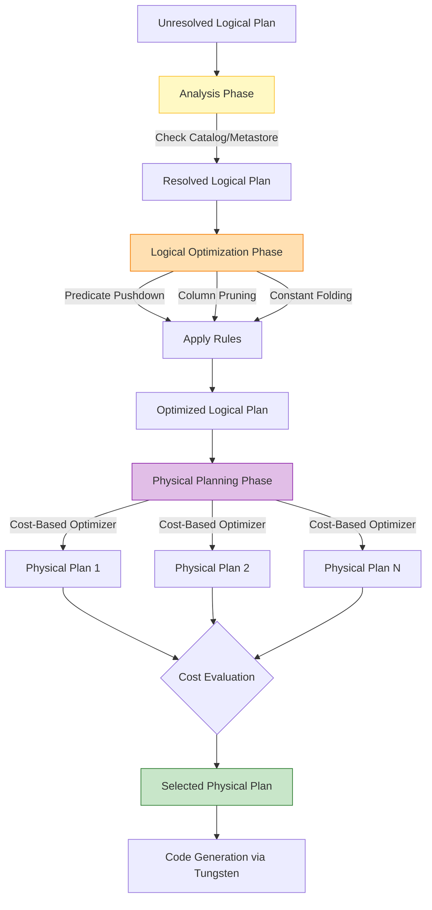

# The Catalyst Optimizer

**The Catalyst Optimizer is Spark SQL's rule-based and cost-based execution engine that automatically translates user code (SQL, DataFrames, Datasets) into the most efficient physical execution plan possible.**

## Why It Matters

In older MapReduce paradigms, the developer was responsible for optimizing the job. If you filtered data *after* a join instead of *before* it, your job would move exponentially more data across the network, leading to massive slowdowns or Out-Of-Memory (OOM) errors. You had to manually arrange the order of operations. The Catalyst Optimizer takes that burden entirely off the developer. Because DataFrames have a strict schema, Catalyst acts as an intelligent compiler. It inspects your entire query, mathematically proves which operations can be safely rearranged, and rewrites your code under the hood. It ensures that no matter how poorly you structure your initial SQL string or DataFrame API chain, Spark will execute it optimally.

## How It Works

Catalyst operates in a strict, four-phase pipeline:

1.  **Analysis:** The user submits a query (Unresolved Logical Plan). Catalyst checks the Catalog (or Hive Metastore) to verify that the tables exist, the column names are spelled correctly, and the data types match. If everything is valid, it generates a *Resolved Logical Plan*.
2.  **Logical Optimization:** This is where the heavy lifting of rule-based optimization occurs. Catalyst applies a series of heuristics (rules) to rewrite the plan. 
    *   **Predicate Pushdown:** Moves `filter()` or `WHERE` clauses as close to the data source as possible. If you join two tables and then filter the results by date, Catalyst rewrites it to filter the tables *before* the join.
    *   **Column Pruning:** If a table has 100 columns but your final `SELECT` only uses 3, Catalyst strips out the other 97 immediately after reading, saving massive memory.
    *   **Constant Folding:** If your query contains expressions like `val + (10 * 100)`, Catalyst computes `1000` at compile time rather than computing it for every single row.
3.  **Physical Planning:** The optimized logical plan tells Spark *what* to do, but not *how* to do it. Catalyst takes the logical plan and generates multiple Physical Plans (e.g., Should I use a SortMergeJoin or a BroadcastHashJoin?). It uses a Cost-Based Optimizer (CBO) to estimate the cost (memory/CPU/network) of each plan and selects the cheapest one.
4.  **Code Generation:** The final physical plan is handed off to Tungsten, which generates highly optimized JVM bytecode to execute the plan on the workers.

You can view this entire lifecycle by using the DataFrame `.explain()` method. Calling `.explain(mode="extended")` will output the Unresolved Logical Plan, Resolved Logical Plan, Optimized Logical Plan, and the final Physical Plan.

## Flow Diagram



## Data Visualization

**Understanding Predicate Pushdown & Column Pruning**

*Scenario: Joining Users and Purchases, looking for users over 18 who bought an item today, returning only their names.*

| Stage | Data Transferred / Processed |
| :--- | :--- |
| **Without Catalyst (Naive)** | Load 100% of Users (all cols), Load 100% Purchases (all cols). Join them. Filter by age>18 and date=today. Drop unused cols. |
| **With Catalyst (Optimized)** | Pushdown: Filter Users (age>18) *at the data source*. Prune: Read only `user_id` and `name` from disk.<br>Pushdown: Filter Purchases (date=today). Prune: Read only `user_id` and `item`. |
| **Impact** | Disk I/O reduced by 90%. Memory usage reduced by 95%. Join shuffle data reduced significantly. |

## Code Example

```python
from pyspark.sql import SparkSession
from pyspark.sql.functions import col

spark = SparkSession.builder.appName("Catalyst-Optimizer").getOrCreate()

# Create dummy DataFrames
users = spark.read.parquet("/path/to/users")
purchases = spark.read.parquet("/path/to/purchases")

# A deliberately poorly structured query
# We do a massive join FIRST, and then filter AFTER. 
# We also do a static math calculation per row.
bad_query_df = users.join(purchases, "user_id") \
    .filter(users["age"] > 18) \
    .filter(purchases["purchase_date"] == "2023-10-01") \
    .withColumn("tax_calc", col("price") * (100 / 100)) \
    .select(users["name"], purchases["item"], "tax_calc")

# View the standard physical plan
print("--- Standard Physical Plan ---")
bad_query_df.explain()

# View the full Catalyst pipeline (Analysis -> Logical -> Physical)
print("--- Extended Catalyst Pipeline ---")
bad_query_df.explain(mode="extended")

# What you will see in the Optimized Logical Plan output:
# 1. PushedFilters: [age > 18] and [purchase_date = '2023-10-01'] 
#    Notice Catalyst moved the filters BEFORE the join.
# 2. ReadSchema: struct<name:string, user_id:int, ...> 
#    Notice Catalyst pruned all columns except those needed for the join or select.
# 3. tax_calc: (price * 1.0) 
#    Notice Catalyst evaluated (100/100) to 1.0 at compile time (Constant Folding).
```

## Common Pitfalls

*   **Breaking Predicate Pushdown with Custom UDFs:** If you use a Python User Defined Function (UDF) inside a `filter()`, Catalyst cannot look inside the Python code to understand the logic. Therefore, it cannot push that filter down to the data source (e.g., Parquet file). It must load the entire dataset into memory first. Use native Spark SQL functions!
*   **Hiding schemas behind opaque types:** Reading data as JSON without providing a strict schema forces Spark to infer it. This can prevent certain optimizations early in the Catalyst pipeline. Parquet is highly preferred because the schema is embedded.
*   **Over-reliance on automatic Join Reordering:** While Catalyst's Cost-Based Optimizer can reorder joins (joining small tables first), it requires accurate table statistics. If you haven't run `ANALYZE TABLE` in the Hive Metastore recently, the CBO might choose a terrible physical plan because its size estimates are wrong.

## Key Takeaway

The Catalyst Optimizer acts as an intelligent compiler that automatically rewrites your code using predicate pushdown, column pruning, and constant folding, guaranteeing that your query runs efficiently regardless of how you initially structured it.


---

## 🎓 Deep Learning Questions

### Q1: Why Was This Concept Introduced?
Before Catalyst, developers using early Big Data frameworks like Hadoop MapReduce or early RDD-based Spark had to manually optimize their jobs. If a developer accidentally filtered data after a join instead of before, the engine would blindly execute it, causing massive network shuffles and Out-Of-Memory (OOM) errors. Writing efficient jobs required deep systems expertise. Spark introduced the Catalyst Optimizer to shift this burden from the developer to the engine. By treating user code (SQL, DataFrames, Datasets) as a declarative language, Catalyst can mathematically analyze, restructure, and optimize the query execution plan. It overcomes the limitations of manual optimization, ensuring that even poorly written queries execute with maximum efficiency.

### Q2: What Exactly Is This Concept and How Does It Work?
The Catalyst Optimizer is Spark SQL's extensible query optimizer, written in Scala. It functions like an intelligent compiler for Spark queries. The process operates in four distinct phases:
1. **Analysis:** It validates table and column names in the Unresolved Logical Plan against the Catalog (Metastore), creating a Resolved Logical Plan.
2. **Logical Optimization:** It applies rule-based heuristics like Predicate Pushdown (filtering early), Column Pruning (dropping unused columns), and Constant Folding (evaluating static math).
3. **Physical Planning:** It takes the Optimized Logical Plan and generates multiple physical execution strategies. Using a Cost-Based Optimizer (CBO), it estimates the cost of each and picks the most efficient one (e.g., choosing BroadcastHashJoin over SortMergeJoin for small tables).
4. **Code Generation:** It delegates the final physical plan to Project Tungsten, which generates highly optimized JVM bytecode for actual execution on worker nodes.

### Q3: Where Should This Concept Be Used?
Catalyst is automatically used under the hood whenever you use Spark's structured APIs (DataFrames, Datasets, and Spark SQL). It is essential in any production scenario involving large-scale data processing:
- **Retail:** Aggregating billions of daily transactions where column pruning heavily reduces memory overhead.
- **Healthcare:** Joining massive patient telemetry data with small lookup tables, where Catalyst's CBO automatically selects a broadcast join.
- **Financial Services:** Running complex analytical SQL queries over Parquet data lakes. Catalyst pushes down filters directly to the Parquet files, skipping irrelevant data blocks entirely.

### Q4: Where Should This Concept NOT Be Used?
Catalyst is ineffective if you bypass the structured APIs by using low-level Resilient Distributed Datasets (RDDs). Because RDDs are opaque to Spark (it just sees Java/Scala/Python objects), Catalyst cannot inspect the schema or the operations. Furthermore, Catalyst optimizations can be broken by heavily relying on Python User-Defined Functions (UDFs). Catalyst cannot "see" inside a Python UDF to optimize it, so operations like Predicate Pushdown are blocked, and performance degrades severely. Use native Spark SQL functions instead.

### Q5: How Is This Concept Different from Hadoop?

| Aspect | Hadoop MapReduce | Apache Spark (with Catalyst) |
| :--- | :--- | :--- |
| **Architecture** | Imperative; developer specifies exactly *how* to process data. | Declarative; developer specifies *what* to do, Catalyst decides *how*. |
| **Optimization** | None. Completely manual. Bad code = bad performance. | Automatic rule-based and cost-based optimizations. |
| **Data Types** | Opaque key-value pairs. Engine doesn't understand the data. | Structured schemas (DataFrames/SQL). Engine understands data fully. |
| **Execution Path** | Hardcoded map and reduce phases. | Dynamically generated physical plans chosen by CBO. |
| **Performance** | Slow due to heavy disk I/O and lack of query optimization. | Orders of magnitude faster due to memory use and optimized JVM bytecode. |

### Q6: How Can This Concept Be Related to a Traditional RDBMS?

| RDBMS Concept | Spark Catalyst Optimizer Equivalent | Explanation |
| :--- | :--- | :--- |
| Query Parser/Analyzer | Analysis Phase | Both validate syntax and check metadata/schema catalogs. |
| Query Rewriter | Logical Optimization | Both apply rules like predicate pushdown to restructure the query. |
| Cost-Based Optimizer (CBO) | Physical Planning (CBO) | Both evaluate table statistics to choose the best join algorithms. |
| Execution Engine | Code Generation (Tungsten) | Both compile the final execution plan into low-level instructions. |
| `EXPLAIN` statement | `df.explain(True)` | Both allow developers to view the internal execution plan. |

### Q7: What Happens Behind the Scenes?
When a developer calls an action on a DataFrame:
1. **Driver:** Intercepts the code and builds an Unresolved Logical Plan (an Abstract Syntax Tree).
2. **Analysis:** The Analyzer checks the Catalog to validate column names and types.
3. **Logical Optimization:** The rule engine rewrites the tree (pushes filters down, prunes columns).
4. **Physical Planning:** The planner generates multiple physical strategies and picks the best one using cost metrics.
5. **Code Generation:** Tungsten translates the plan into optimized Java bytecode.
6. **Execution:** The execution plan is translated into a DAG of RDDs, divided into Stages and Tasks, and sent to Executors.

```text
User Code (DataFrame/SQL)
      │
      ▼
[Unresolved Logical Plan]
      │ (Analysis via Catalog)
      ▼
[Resolved Logical Plan]
      │ (Rule-Based Optimization)
      ▼
[Optimized Logical Plan]
      │ (Cost-Based Physical Planning)
      ▼
[Multiple Physical Plans] ──► (Cost Evaluation) ──► [Selected Physical Plan]
                                                          │
                                                          ▼
                                                 [Tungsten Code Gen] ──► [Executors]
```

### Q8: Performance Considerations, Best Practices, and Common Mistakes

| Category | Recommendation | Why It Matters |
| :--- | :--- | :--- |
| **Best Practice** | Use native Spark SQL functions instead of UDFs. | UDFs act as a black box. Catalyst cannot optimize them, breaking predicate pushdown. |
| **Optimization** | Store data in Parquet or ORC formats. | These formats support embedded schemas and allow Catalyst to push filters down to the file level. |
| **Performance** | Run `ANALYZE TABLE` regularly on Hive Metastore tables. | Catalyst's CBO relies on accurate statistics (row counts, sizes) to choose optimal join strategies. |
| **Common Mistake** | Mixing RDD API with DataFrame API. | Converting to RDDs loses all schema information, completely bypassing Catalyst's optimizations. |
| **Debugging** | Use `df.explain("extended")`. | Helps identify if filters are actually being pushed down or if a sub-optimal join strategy was selected. |

### Q9: Interview Questions

**Beginner**
1. **What is the primary purpose of the Catalyst Optimizer?**
   *Answer:* To automatically translate and optimize Spark SQL and DataFrame queries into the most efficient execution plan possible.
2. **What are the four phases of Catalyst?**
   *Answer:* Analysis, Logical Optimization, Physical Planning, and Code Generation.
3. **What is Predicate Pushdown?**
   *Answer:* An optimization rule that moves filter operations as close to the data source as possible, reducing the amount of data read into memory.

**Intermediate**
1. **How does the Cost-Based Optimizer (CBO) make decisions in Physical Planning?**
   *Answer:* It uses table statistics (like row count and size in bytes) to estimate the cost of different physical execution strategies, selecting the one with the lowest CPU/memory/network overhead.
2. **Why should you avoid using Python UDFs when relying on Catalyst?**
   *Answer:* Python UDFs are opaque to the JVM-based Catalyst engine. Catalyst cannot inspect the logic inside the UDF, which prevents it from applying optimizations like predicate pushdown.
3. **What is the difference between an Unresolved and Resolved Logical Plan?**
   *Answer:* An Unresolved plan has unverified column names and tables. A Resolved plan has been validated against the Spark Catalog to ensure the tables and columns actually exist and types are correct.

**Advanced**
1. **How does Catalyst interact with Project Tungsten?**
   *Answer:* Catalyst handles query optimization up to the physical plan. It then hands this plan over to Tungsten, which generates optimized low-level JVM bytecode to execute the plan efficiently on the hardware.
2. **Can Catalyst optimize RDD transformations? Why or why not?**
   *Answer:* No. Catalyst relies on the structured schema provided by DataFrames/Datasets. RDDs contain raw Java/Python objects, which are opaque to Catalyst, preventing rule-based optimization.
3. **Explain Constant Folding.**
   *Answer:* It's a logical optimization where Catalyst pre-computes constant expressions (e.g., `100 * 50`) at compile time rather than evaluating them for every single row during execution.

**Scenario-Based**
1. **Your Spark job is running out of memory during a join, despite applying a filter on the result. How does Catalyst handle this, and why might it still fail?**
   *Answer:* Catalyst should automatically use Predicate Pushdown to filter the data *before* the join. However, if the filter uses a custom Python UDF, Catalyst cannot push it down, meaning all data is loaded and joined before filtering, causing the OOM.
2. **You notice Catalyst is choosing a SortMergeJoin for a tiny table instead of a BroadcastHashJoin. What is wrong?**
   *Answer:* The Cost-Based Optimizer likely lacks accurate table statistics. Running `ANALYZE TABLE` will update the metadata, allowing Catalyst to realize the table is small enough to broadcast.

### Q10: Complete Real-World Example

**Business Problem:**
A streaming service (like Netflix) needs to analyze viewing habits. They have a massive `viewing_history` table and a smaller `user_metadata` table. They want to find all premium users who watched a specific show recently.

**Sample Dataset:**
- `viewing_history` (Parquet, billions of rows): `user_id`, `show_name`, `watch_date`, `duration`
- `user_metadata` (Parquet, millions of rows): `user_id`, `subscription_type`, `country`

**PySpark Code:**
```python
from pyspark.sql import SparkSession
from pyspark.sql.functions import col

# Initialize Spark session
spark = SparkSession.builder \
    .appName("Catalyst-Production-Example") \
    .getOrCreate()

# Load DataFrames (Schema is inferred from Parquet metadata)
views_df = spark.read.parquet("s3://data-lake/viewing_history/")
users_df = spark.read.parquet("s3://data-lake/user_metadata/")

# Write query declaratively. 
# Even though we write the join FIRST and filters AFTER,
# Catalyst will heavily optimize this.
result_df = views_df.join(users_df, "user_id") \
    .filter(users_df.subscription_type == "Premium") \
    .filter(views_df.show_name == "Stranger Things") \
    .filter(views_df.watch_date >= "2023-10-01") \
    .select(users_df.user_id, views_df.duration, users_df.country)

# View the execution plan optimized by Catalyst
result_df.explain("extended")

# Execute the action
result_df.write.mode("overwrite").parquet("s3://data-lake/analytics/premium_stranger_things_views/")
```

**Step-by-step execution walkthrough:**
1. **Analysis:** Spark validates that `subscription_type`, `show_name`, and `watch_date` exist in the Parquet schemas.
2. **Logical Optimization:** Catalyst applies Predicate Pushdown. It moves the `show_name` and `watch_date` filters directly to the `views_df` Parquet reader. It moves the `subscription_type` filter to the `users_df` reader. It also applies Column Pruning, completely ignoring columns like `user_name` or `episode_id`.
3. **Physical Planning:** Because the filtered `users_df` is small, the CBO chooses a `BroadcastHashJoin` over a `SortMergeJoin`.
4. **Execution:** Project Tungsten generates Java bytecode to execute this optimized plan directly on the worker nodes.

**Expected Output:**
A new directory containing Parquet files with only the `user_id`, `duration`, and `country` of recent Premium viewers of the specific show.

**Performance Notes:**
Because data is stored in Parquet, Catalyst pushes the filters down to the file level. The executors skip reading data blocks that don't match the `watch_date` and `show_name`, reducing disk I/O by 99% and preventing massive network shuffles during the join.

### 💡 Key Takeaways
- Catalyst automatically transforms declarative code (SQL/DataFrames) into optimized physical execution plans.
- It operates in four phases: Analysis, Logical Optimization, Physical Planning, and Code Generation.
- Predicate Pushdown and Column Pruning are its two most powerful rule-based optimizations.
- The Cost-Based Optimizer (CBO) uses table statistics to pick the most efficient physical execution strategy.
- It entirely removes the burden of manual job optimization from the developer.

### ⚠️ Common Misconceptions
- **"Catalyst works with RDDs"**: False. Catalyst requires structured schemas to work. It does not optimize RDD API code.
- **"The order of DataFrame transformations matters"**: False. Because of Catalyst, writing `.filter().join()` or `.join().filter()` generally results in the exact same optimized physical plan.
- **"Python UDFs are perfectly fine to use"**: False. Python UDFs block Catalyst optimizations like predicate pushdown because the JVM engine cannot read Python logic.

### 🔗 Related Spark Concepts
- Project Tungsten
- Spark SQL & DataFrames
- Cost-Based Optimizer (CBO)
- Adaptive Query Execution (AQE)
- Predicate Pushdown

### 📚 References for Further Reading
- Apache Spark Official Documentation
- Learning Spark (O'Reilly)
- Spark: The Definitive Guide (O'Reilly)
