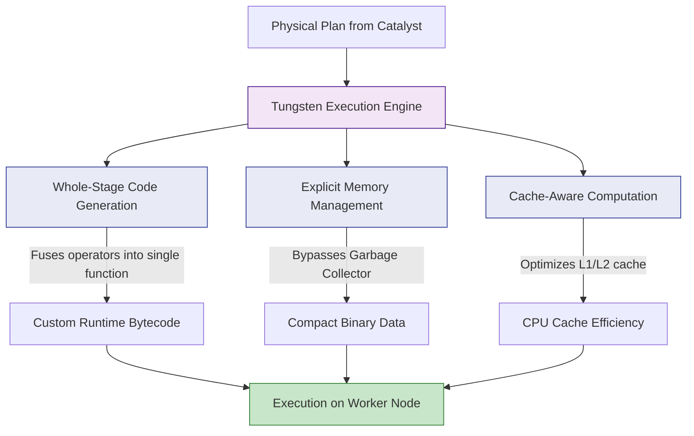

# Tungsten Performance Engine

**Tungsten is Spark's specialized execution engine designed to push modern hardware to its absolute limits by minimizing JVM overhead, optimizing CPU cache usage, and generating highly tailored raw Java bytecode at runtime.**

## Why It Matters

In the early versions of Spark (1.x), performance was entirely bottlenecked by the Java Virtual Machine (JVM). When Spark processed large volumes of RDDs, it created millions of Java objects. This caused the JVM's Garbage Collector (GC) to constantly pause the application to clean up memory, sometimes freezing a job for minutes at a time. Furthermore, generic data processing code was not taking advantage of modern CPU features (like L1/L2 caches and vectorized instructions). Tungsten was introduced in Spark 1.5 (and vastly expanded in 2.x) to solve these hardware-level inefficiencies. It shifts the bottleneck away from memory/GC overhead and CPU wait times, making Spark operations operate near the theoretical limits of bare-metal hardware.

## How It Works

Tungsten achieves its extreme performance through three primary pillars:

1.  **Off-Heap Memory Management (Explicit Memory Management):** Instead of relying on the JVM to create and manage objects, Tungsten stores data in a compact, binary format outside of the JVM's standard garbage-collected heap (off-heap memory). By managing memory explicitly (similar to C or C++), Tungsten completely bypasses GC pauses. Data structures are packed tightly, vastly reducing the memory footprint compared to standard Java objects.
2.  **Cache-Aware Computation:** CPUs have incredibly fast, small caches (L1/L2). If data is not in the cache, the CPU sits idle waiting for the RAM to deliver it (a cache miss). Because Tungsten packs data tightly in binary format, it can design sorting and grouping algorithms that fit perfectly into the CPU cache. For example, Tungsten's sorting algorithms sort pointers to binary records rather than the massive records themselves, virtually eliminating CPU cache misses.
3.  **Whole-Stage Code Generation (WSCG):** This is Tungsten's crown jewel. In traditional database execution engines (Volcano model), processing a row requires making virtual function calls for every step (e.g., call `filter`, then call `project`, then call `aggregate`). This creates massive CPU overhead. Tungsten collapses the entire physical execution plan generated by Catalyst into a single, optimized Java function containing simple `for` loops. It dynamically compiles this custom bytecode at runtime (using Janino). 

Additionally, Tungsten leverages **Vectorized Columnar Reading**. When reading from columnar formats like Parquet, it reads batches of rows (vectors) at a time using CPU SIMD (Single Instruction, Multiple Data) instructions, rather than processing row by agonizing row. You can confirm WSCG is active by looking for stars (`*`) or `WholeStageCodegen` nodes in the output of `.explain()`.

## Flow Diagram



## Data Visualization

**Volcano Iterator Model vs. Whole-Stage Code Generation**

*The Query: `SELECT count(*) FROM table WHERE age > 18`*

| Execution Model | How it executes under the hood | CPU Overhead |
| :--- | :--- | :--- |
| **Traditional (Volcano)** | `while(scan.next()) {`<br>&nbsp;&nbsp;`if(filter.evaluate(row)) {`<br>&nbsp;&nbsp;&nbsp;&nbsp;`count.increment();`<br>&nbsp;&nbsp;`}`<br>`}` | **High:** Millions of virtual function calls (`.evaluate()`, `.next()`) per row. |
| **Tungsten (WSCG)** | `int count = 0;`<br>`for(int i = 0; i < binaryBatch.size(); i++) {`<br>&nbsp;&nbsp;`if(binaryBatch.getAge(i) > 18) { count++; }`<br>`}` | **Zero:** Operators are fused into a single dense `for` loop. No virtual calls. |

## Code Example

```python
from pyspark.sql import SparkSession

# Initialize SparkSession
spark = SparkSession.builder \
    .appName("Tungsten-Engine") \
    .config("spark.sql.codegen.wholeStage", "true") \
    .getOrCreate()

# Create a massive DataFrame programmatically to demonstrate performance
# Using range() is highly optimized by Tungsten
df = spark.range(1, 100000000)

# Perform a chain of operations
result = df.filter("id % 2 = 0") \
           .withColumn("multiplied", df["id"] * 10) \
           .groupBy() \
           .sum("multiplied")

# Action to trigger execution
result.show()

# Verify Whole-Stage Code Generation is happening
print("--- Execution Plan ---")
result.explain()

"""
Sample Explain Output:
== Physical Plan ==
*(2) HashAggregate(keys=[], functions=[sum(multiplied#4L)])
+- Exchange SinglePartition, ENSURE_REQUIREMENTS, [plan_id=15]
   +- *(1) HashAggregate(keys=[], functions=[partial_sum(multiplied#4L)])
      +- *(1) Project [(id#0L * 10) AS multiplied#4L]
         +- *(1) Filter ((id#0L % 2) = 0)
            +- *(1) Range (1, 100000000, step=1, splits=8)

Notice the asterisks `*(1)` and `*(2)`. 
These stars indicate that Tungsten's Whole-Stage Code Generation is active.
All operators under *(1) (Range, Filter, Project, partial_sum) were fused into 
a single compiled Java function!
"""
```

## Common Pitfalls

*   **Using Python UDFs:** Python UDFs completely break Whole-Stage Code Generation. Spark must serialize the Tungsten binary data back into JVM objects, send them to a Python process via Py4J, wait for Python to process them, and serialize them back. This kills Tungsten's performance. (Use Pandas/Vectorized UDFs if you absolutely must use Python).
*   **Assuming more memory equals more speed:** Because Tungsten uses off-heap memory, blindly increasing `spark.executor.memory` (which only increases JVM heap) might not help if your bottleneck is off-heap overhead. You must tune `spark.memory.offHeap.enabled` and `spark.memory.offHeap.size` if dealing with massive Tungsten operations.
*   **Extremely complex query plans:** If a query contains thousands of nested columns or thousands of expressions, Tungsten might fail to compile the generated Java bytecode (hitting the JVM's 64KB bytecode limit for a single method). When this happens, Spark silently falls back to the slower Volcano model.

## Key Takeaway

While Catalyst optimizes *what* Spark should do logically, Tungsten optimizes *how* Spark physically executes it by managing memory off-heap, maximizing CPU cache efficiency, and dynamically compiling query stages into singular, ultra-fast Java bytecode functions.
