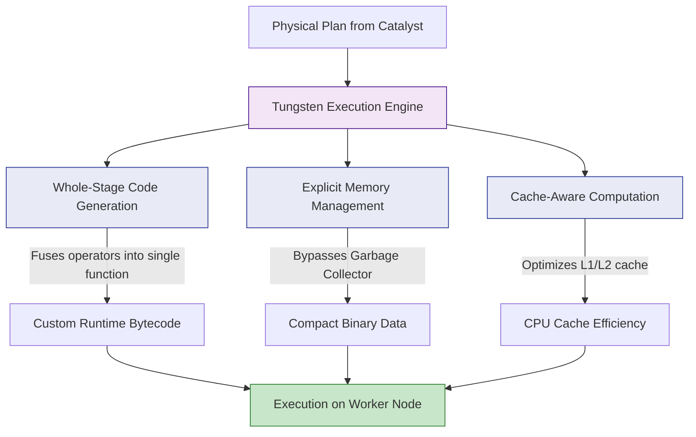

# Tungsten Performance Engine

**Tungsten is Spark's specialized execution engine designed to push modern hardware to its absolute limits by minimizing JVM overhead, optimizing CPU cache usage, and generating highly tailored raw Java bytecode at runtime.**

## Why It Matters

In the early versions of Spark (1.x), performance was entirely bottlenecked by the Java Virtual Machine (JVM). When Spark processed large volumes of RDDs, it created millions of Java objects. This caused the JVM's Garbage Collector (GC) to constantly pause the application to clean up memory, sometimes freezing a job for minutes at a time. Furthermore, generic data processing code was not taking advantage of modern CPU features (like L1/L2 caches and vectorized instructions). Tungsten was introduced in Spark 1.5 (and vastly expanded in 2.x) to solve these hardware-level inefficiencies. It shifts the bottleneck away from memory/GC overhead and CPU wait times, making Spark operations operate near the theoretical limits of bare-metal hardware.

## How It Works

Tungsten achieves its extreme performance through three primary pillars:

1.  **Off-Heap Memory Management (Explicit Memory Management):** Instead of relying on the JVM to create and manage objects, Tungsten stores data in a compact, binary format outside of the JVM's standard garbage-collected heap (off-heap memory). By managing memory explicitly (similar to C or C++), Tungsten completely bypasses GC pauses. Data structures are packed tightly, vastly reducing the memory footprint compared to standard Java objects.
2.  **Cache-Aware Computation:** CPUs have incredibly fast, small caches (L1/L2). If data is not in the cache, the CPU sits idle waiting for the RAM to deliver it (a cache miss). Because Tungsten packs data tightly in binary format, it can design sorting and grouping algorithms that fit perfectly into the CPU cache. For example, Tungsten's sorting algorithms sort pointers to binary records rather than the massive records themselves, virtually eliminating CPU cache misses.
3.  **Whole-Stage Code Generation (WSCG):** This is Tungsten's crown jewel. In traditional database execution engines (Volcano model), processing a row requires making virtual function calls for every step (e.g., call `filter`, then call `project`, then call `aggregate`). This creates massive CPU overhead. Tungsten collapses the entire physical execution plan generated by Catalyst into a single, optimized Java function containing simple `for` loops. It dynamically compiles this custom bytecode at runtime (using Janino). 

Additionally, Tungsten leverages **Vectorized Columnar Reading**. When reading from columnar formats like Parquet, it reads batches of rows (vectors) at a time using CPU SIMD (Single Instruction, Multiple Data) instructions, rather than processing row by agonizing row. You can confirm WSCG is active by looking for stars (`*`) or `WholeStageCodegen` nodes in the output of `.explain()`.

## Flow Diagram



## Data Visualization

**Volcano Iterator Model vs. Whole-Stage Code Generation**

*The Query: `SELECT count(*) FROM table WHERE age > 18`*

| Execution Model | How it executes under the hood | CPU Overhead |
| :--- | :--- | :--- |
| **Traditional (Volcano)** | `while(scan.next()) {`<br>&nbsp;&nbsp;`if(filter.evaluate(row)) {`<br>&nbsp;&nbsp;&nbsp;&nbsp;`count.increment();`<br>&nbsp;&nbsp;`}`<br>`}` | **High:** Millions of virtual function calls (`.evaluate()`, `.next()`) per row. |
| **Tungsten (WSCG)** | `int count = 0;`<br>`for(int i = 0; i < binaryBatch.size(); i++) {`<br>&nbsp;&nbsp;`if(binaryBatch.getAge(i) > 18) { count++; }`<br>`}` | **Zero:** Operators are fused into a single dense `for` loop. No virtual calls. |

## Code Example

```python
from pyspark.sql import SparkSession

# Initialize SparkSession
spark = SparkSession.builder \
    .appName("Tungsten-Engine") \
    .config("spark.sql.codegen.wholeStage", "true") \
    .getOrCreate()

# Create a massive DataFrame programmatically to demonstrate performance
# Using range() is highly optimized by Tungsten
df = spark.range(1, 100000000)

# Perform a chain of operations
result = df.filter("id % 2 = 0") \
           .withColumn("multiplied", df["id"] * 10) \
           .groupBy() \
           .sum("multiplied")

# Action to trigger execution
result.show()

# Verify Whole-Stage Code Generation is happening
print("--- Execution Plan ---")
result.explain()

"""
Sample Explain Output:
== Physical Plan ==
*(2) HashAggregate(keys=[], functions=[sum(multiplied#4L)])
+- Exchange SinglePartition, ENSURE_REQUIREMENTS, [plan_id=15]
   +- *(1) HashAggregate(keys=[], functions=[partial_sum(multiplied#4L)])
      +- *(1) Project [(id#0L * 10) AS multiplied#4L]
         +- *(1) Filter ((id#0L % 2) = 0)
            +- *(1) Range (1, 100000000, step=1, splits=8)

Notice the asterisks `*(1)` and `*(2)`. 
These stars indicate that Tungsten's Whole-Stage Code Generation is active.
All operators under *(1) (Range, Filter, Project, partial_sum) were fused into 
a single compiled Java function!
"""
```

## Common Pitfalls

*   **Using Python UDFs:** Python UDFs completely break Whole-Stage Code Generation. Spark must serialize the Tungsten binary data back into JVM objects, send them to a Python process via Py4J, wait for Python to process them, and serialize them back. This kills Tungsten's performance. (Use Pandas/Vectorized UDFs if you absolutely must use Python).
*   **Assuming more memory equals more speed:** Because Tungsten uses off-heap memory, blindly increasing `spark.executor.memory` (which only increases JVM heap) might not help if your bottleneck is off-heap overhead. You must tune `spark.memory.offHeap.enabled` and `spark.memory.offHeap.size` if dealing with massive Tungsten operations.
*   **Extremely complex query plans:** If a query contains thousands of nested columns or thousands of expressions, Tungsten might fail to compile the generated Java bytecode (hitting the JVM's 64KB bytecode limit for a single method). When this happens, Spark silently falls back to the slower Volcano model.

## Key Takeaway

While Catalyst optimizes *what* Spark should do logically, Tungsten optimizes *how* Spark physically executes it by managing memory off-heap, maximizing CPU cache efficiency, and dynamically compiling query stages into singular, ultra-fast Java bytecode functions.


---

## 🎓 Deep Learning Questions

### Q1: Why Was This Concept Introduced?
Before the introduction of Tungsten (starting in Spark 1.5), Apache Spark's execution engine heavily depended on the Java Virtual Machine (JVM). While the JVM is excellent for general-purpose programming, it became a significant bottleneck for big data processing. Every time Spark processed a row of data, it created a Java object. Processing millions of rows meant millions of objects, leading to massive memory overhead and triggering frequent Garbage Collection (GC) pauses that severely impacted performance. Furthermore, early Spark versions executed operations using the traditional Volcano Iterator Model, which involved costly virtual function calls for every step of a query plan. Spark introduced Project Tungsten to overcome these exact limitations. By taking control of memory management (off-heap memory) and leveraging modern CPU capabilities (like whole-stage code generation and CPU cache alignment), Tungsten minimizes JVM overhead, reduces GC pauses, and achieves near bare-metal hardware performance.

### Q2: What Exactly Is This Concept and How Does It Work?
Project Tungsten is Spark's physical execution engine designed to bring Spark's performance closer to the limits of modern hardware. It operates on three main pillars:
1. **Explicit Memory Management:** Instead of storing data as standard Java objects, Tungsten stores data in a dense, binary format (`UnsafeRow`) using off-heap memory. This drastically reduces the memory footprint and completely bypasses the JVM's Garbage Collector.
2. **Whole-Stage Code Generation (WSCG):** Instead of processing data operator-by-operator (e.g., filter, then map, then aggregate) with heavy virtual function calls, Tungsten's WSCG engine collapses multiple operators from a query plan into a single, optimized Java function containing simple `for` loops. This custom Java code is compiled dynamically at runtime using Janino.
3. **Cache-Aware Computation:** Tungsten structures data and algorithms to exploit the CPU L1/L2 caches. For instance, when sorting data, Tungsten sorts a lightweight pointer array rather than moving the full binary records around in memory, ensuring high cache-hit rates.

### Q3: Where Should This Concept Be Used?
Tungsten is a core internal component of the Spark SQL engine, meaning it is used automatically whenever you use the DataFrame, Dataset, or Spark SQL APIs. 
- **Financial Services (e.g., Banking):** Processing petabytes of transactional data for fraud detection, where ultra-low latency and efficient memory usage are critical.
- **E-commerce & Retail (e.g., Amazon, Walmart):** Aggregating customer purchase histories across millions of rows without triggering debilitating GC pauses.
- **Streaming Analytics (e.g., Netflix, Uber):** Real-time aggregation of telemetry or GPS data, where the high-throughput, low-latency execution provided by Whole-Stage Code Generation ensures SLAs are met.
Because it works under the hood, any scenario that leverages Spark SQL benefits from Tungsten.

### Q4: Where Should This Concept NOT Be Used?
Tungsten cannot optimize everything. You should avoid patterns that actively break Tungsten's optimizations:
- **Using legacy RDD APIs:** Tungsten does not optimize standard RDD operations (`map`, `filter` on Python/Java objects). If you are using RDDs, you are falling back to standard JVM object overhead.
- **Python UDFs (User Defined Functions):** Standard PySpark UDFs force Spark to deserialize Tungsten's highly optimized binary format into Python objects, send them across the JVM/Python boundary, and serialize them back. This kills performance. 
- **Extremely Complex Queries:** If a query plan is massively complicated (e.g., thousands of columns or nested expressions), the dynamically generated code might exceed the JVM's 64KB bytecode limit for a single method. Spark will then disable WSCG and fall back to the slower Volcano model.

### Q5: How Is This Concept Different from Hadoop?
| Aspect | Hadoop MapReduce | Apache Spark (with Tungsten) |
| :--- | :--- | :--- |
| **Architecture** | Disk-based execution with standard JVM object management. | In-memory execution utilizing explicit off-heap binary memory management. |
| **Performance** | Slow due to disk I/O, heavy JVM object overhead, and GC pauses. | Ultra-fast due to in-memory processing, cache-aware algorithms, and WSCG. |
| **Processing Model** | Step-by-step Map and Reduce phases. | Fuses multiple query operators into a single dense `for` loop via WSCG. |
| **Memory Usage** | High memory overhead from Java object headers and padding. | Compact binary data representation avoids object overhead entirely. |
| **Fault Tolerance** | Writes to disk after every phase. | Lineage-based recovery using Catalyst and Tungsten optimizations. |
| **Scalability** | Scales well but with heavy latency. | Scales massively with near bare-metal CPU utilization. |
| **Ease of Development** | Low (requires extensive boilerplate Java). | High (SQL, DataFrames natively supported and optimized). |
| **Typical Use Cases** | Batch processing, ETL pipelines. | High-speed ETL, interactive queries, real-time analytics. |
| **Advantages** | Robust for massive batch jobs. | Bypasses GC pauses; maximizes CPU L1/L2 cache efficiency. |
| **Disadvantages** | Inefficient CPU and memory usage. | Complex internal architecture; hard to debug generated code. |

### Q6: How Can This Concept Be Related to a Traditional RDBMS?
| Spark Tungsten Concept | Traditional RDBMS Equivalent | Explanation |
| :--- | :--- | :--- |
| **Whole-Stage Code Generation** | **Compiled Queries (e.g., SQL Server Hekaton, PostgreSQL JIT)** | Both systems dynamically compile query execution plans into machine or native code (or Java bytecode in Spark's case) to avoid interpretative overhead and function calls. |
| **Binary Memory Format (UnsafeRow)** | **Page/Block Storage Format** | RDBMS engines store data tightly packed in disk/memory pages. Tungsten explicitly packs data into continuous memory blocks, avoiding standard object-oriented padding. |
| **Cache-Aware Computation** | **Cache-Optimized Indexes/Sorting** | Modern RDBMS engines structure B-Trees or columnar data to fit into CPU caches. Tungsten does the same, specifically optimizing sorting algorithms to keep CPU pipelines fed. |
| **Volcano Iterator Fallback** | **Standard Query Execution Engine** | Traditional databases execute queries using a tree of iterators (Volcano model). Spark falls back to this if WSCG fails. |

### Q7: What Happens Behind the Scenes?
When a query is executed, Tungsten takes over after the Catalyst Optimizer determines the physical plan.
1. **Catalyst Output:** Catalyst hands an optimized physical execution plan to Tungsten.
2. **Operator Fusion (WSCG):** Tungsten inspects the plan and identifies operators that can be fused together (e.g., `Scan -> Filter -> Project -> Aggregate`). 
3. **Code Generation:** Tungsten translates these operators into a single block of optimized Java source code (a dense `for` loop).
4. **Compilation:** Janino (a lightweight Java compiler) compiles this source code into Java bytecode on the fly.
5. **Execution on Binary Data:** The Executors run this bytecode directly against Tungsten's compact binary data structures (`UnsafeRow`) stored in off-heap memory. 
6. **Cache-Aware Operations:** Any sorting or grouping leverages cache-friendly pointer arrays rather than moving actual records.

```text
[Catalyst Physical Plan] 
         |
         v
+-----------------------+
|  Operator Fusion      |  (Fuses Filter + Project + Sum)
+-----------------------+
         |
         v
+-----------------------+
|  Source Generation    |  (Writes Java `for` loop)
+-----------------------+
         |
         v
+-----------------------+
|  Janino Compiler      |  (Compiles to Bytecode)
+-----------------------+
         |
         v
+-----------------------+
|  Executor Hardware    |  (Reads Binary Data via CPU Cache)
+-----------------------+
```

### Q8: Performance Considerations, Best Practices, and Common Mistakes
| Category | Recommendation | Why It Matters |
| :--- | :--- | :--- |
| **Performance Impact** | Favor DataFrames/Spark SQL over RDDs. | RDDs cannot leverage Tungsten's explicit memory management or WSCG, drastically reducing performance. |
| **Optimization** | Use Pandas UDFs (Vectorized UDFs) instead of Python UDFs. | Standard Python UDFs force Spark to deserialize Tungsten's binary data, incurring huge serialization costs. Pandas UDFs process data in Arrow vector batches. |
| **Best Practices** | Check query plans using `.explain()`. | Look for the `*` symbol in the physical plan, which confirms Whole-Stage Code Generation is active. |
| **Common Mistakes** | Blindly increasing JVM heap size to fix memory issues. | Tungsten operates off-heap. If you need more memory for Tungsten aggregations, you must configure `spark.memory.offHeap.enabled` and `spark.memory.offHeap.size`. |
| **Production Tips** | Avoid insanely wide tables (10,000+ columns). | Complex queries can exceed the JVM 64KB bytecode limit for a single method, forcing Spark to abandon WSCG and fall back to the slow Volcano iterator model. |

### Q9: Interview Questions

**Beginner**
1. **What is the primary goal of Project Tungsten?**
   To improve Spark's execution efficiency by minimizing JVM object overhead, reducing Garbage Collection (GC) pauses, and maximizing CPU hardware utilization.
2. **What is Whole-Stage Code Generation (WSCG)?**
   It is Tungsten's engine that fuses multiple query operators (like filter, map, aggregate) into a single, optimized Java function to eliminate virtual function call overhead.
3. **How does Tungsten represent data in memory?**
   It uses a compact, binary format called `UnsafeRow` and manages it explicitly, similar to C++, rather than using standard Java objects.

**Intermediate**
1. **How do you verify if Whole-Stage Code Generation is being used in a query?**
   By calling `.explain()` on a DataFrame. If WSCG is active, the physical plan will show an asterisk (`*`) before the operator names.
2. **Why are standard Python UDFs detrimental to Tungsten's performance?**
   Python UDFs force Spark to deserialize Tungsten's optimized binary format into Python objects, process them in a Python worker, and serialize them back, completely negating Tungsten's speed benefits.
3. **What is cache-aware computation in Tungsten?**
   It means algorithms (like sorting) are designed to fit within the CPU L1/L2 caches. For example, Tungsten sorts arrays of memory pointers rather than the large binary records themselves to prevent cache misses.

**Advanced**
1. **What happens if Tungsten's generated code exceeds the JVM method size limit (64KB)?**
   If the query is too complex, the Janino compiler will fail to compile the generated bytecode. Spark handles this gracefully by disabling WSCG and falling back to the traditional Volcano Iterator Model.
2. **How does off-heap memory management help prevent GC pauses?**
   Garbage Collection only tracks objects inside the JVM heap. Since Tungsten stores its binary records in memory allocated directly from the OS (off-heap), the JVM GC ignores it, drastically reducing pause times during big shuffles or aggregations.
3. **Explain the difference between Tungsten's memory management and Spark 1.x RDD caching.**
   Spark 1.x stored cached RDDs as Java objects in the JVM heap (or serialized objects). Tungsten uses standard Unsafe operations to manage raw bytes, acting as its own manual memory manager to pack data tighter and avoid object overhead.

**Scenario-Based**
1. **You migrated a job from Spark 1.6 (RDDs) to Spark 3.x (DataFrames), but performance didn't improve. You notice a lot of PySpark UDFs. What is happening?**
   The heavy use of PySpark UDFs prevents Tungsten from executing entirely in the JVM. Spark is wasting time converting Tungsten binary rows to Python objects. You should refactor to use native Spark SQL functions or Pandas (Vectorized) UDFs.
2. **Your Spark SQL query involving 5,000 columns is executing very slowly. The `.explain()` plan lacks the `*` symbol. How do you resolve this?**
   The query plan is too massive, causing Tungsten to abandon WSCG due to the JVM 64KB bytecode limit. To fix this, you should break the query into smaller stages, save intermediate results to Parquet, or reduce the number of columns evaluated in a single stage.

### Q10: Complete Real-World Example

**Business Problem:** 
A global telecommunications company (like AT&T) needs to process billions of Call Detail Records (CDRs) per hour. They need to filter out dropped calls, calculate the total call duration per user, and find high-usage customers. This must happen extremely fast, without JVM garbage collection bringing the cluster to a halt.

**Sample Dataset:**
A massive table of CDRs containing `call_id`, `user_id`, `duration_seconds`, and `status_code`.

**PySpark Code:**
```python
from pyspark.sql import SparkSession
from pyspark.sql.functions import sum, col

# Initialize SparkSession with explicit off-heap memory to assist Tungsten
spark = SparkSession.builder \
    .appName("Telecom-CDR-Tungsten-Optimization") \
    .config("spark.memory.offHeap.enabled", "true") \
    .config("spark.memory.offHeap.size", "2g") \
    .getOrCreate()

# 1. Programmatically generate a large dataset to simulate billions of CDRs
# Tungsten handles range() natively without object overhead
df_cdrs = spark.range(1, 50000000).select(
    col("id").alias("call_id"),
    (col("id") % 10000).alias("user_id"),
    (col("id") % 300).alias("duration_seconds"),
    (col("id") % 5).alias("status_code") # 0 implies dropped call
)

# 2. Perform Transformations
# Tungsten will fuse the Filter, Project, and partial Aggregate into one Java function
high_usage_customers = df_cdrs.filter(col("status_code") != 0) \
    .groupBy("user_id") \
    .agg(sum("duration_seconds").alias("total_duration")) \
    .filter(col("total_duration") > 5000)

# 3. Action to trigger computation
high_usage_customers.show(5)

# 4. View the Execution Plan to confirm WSCG
print("=== Physical Execution Plan ===")
high_usage_customers.explain()

"""
Expected Output Explanation:
In the output of .explain(), you will see asterisks `*(1)`, `*(2)`, `*(3)`.
This confirms that Whole-Stage Code Generation successfully fused the operations.
The filter for status_code, the grouping by user_id, and the aggregation happened 
in ultra-fast, natively compiled Java loops acting on binary off-heap data.
"""
```

**Step-by-step execution walkthrough:**
1. **Data Generation:** `spark.range` acts as the source, generating data entirely in Tungsten's binary format without ever creating a Java `Long` object.
2. **Catalyst Optimization:** Catalyst creates the logical plan and physical plan.
3. **Tungsten WSCG:** Tungsten fuses the first `filter` and the map-side `groupBy` aggregation into a single block of Java code.
4. **Execution:** The Janino compiler converts this block to bytecode. The executor processes the binary rows, utilizing CPU L1/L2 caches efficiently for the aggregation hash map.
5. **Shuffle & Finalize:** The aggregated data is shuffled, and a second generated code stage handles the final `filter` (> 5000) and displays the results.

**Performance notes:**
Because we enabled off-heap memory (`spark.memory.offHeap.enabled`), Tungsten can perform massive hash aggregations outside of the JVM heap. The Garbage Collector never sees these millions of records, eliminating GC pauses entirely. 

**When this approach is best:**
This approach is essential for any high-volume batch or streaming job where transformations (filters, maps, math) and aggregations are heavy, and minimizing CPU and memory overhead is critical for meeting Service Level Agreements (SLAs).

### 💡 Key Takeaways
- **Hardware Focus:** Project Tungsten shifts Spark's focus from reducing disk I/O to maximizing CPU and memory hardware efficiency.
- **Off-Heap Memory:** It uses a dense, binary format (`UnsafeRow`) and manages memory manually (like C/C++) to eliminate JVM Garbage Collection pauses.
- **Whole-Stage Code Generation:** It fuses multiple logical operators into a single, highly optimized Java function at runtime, removing virtual call overhead.
- **Janino Compiler:** Tungsten leverages the fast Janino compiler to turn generated Java source code into bytecode instantly.
- **Cache-Aware:** Sorting and grouping operations are optimized to fit inside the small, ultra-fast CPU L1/L2 caches.
- **Native Support:** Tungsten is the default engine for Spark SQL, DataFrames, and Datasets. RDDs do not benefit from it.

### ⚠️ Common Misconceptions
- **"Tungsten replaces Catalyst."** False. Catalyst optimizes the *logical/physical plan*. Tungsten takes that optimized physical plan and executes it via *code generation and memory management*. They work together.
- **"More executor memory speeds up Tungsten."** False. If your bottleneck is off-heap processing, increasing standard JVM executor memory won't help. You need to configure off-heap memory settings.
- **"PySpark is inherently slow because of Python."** False. If you use PySpark DataFrames with native Spark SQL functions, the underlying execution is done entirely by Tungsten in C++-like speeds. It is only slow if you use traditional Python UDFs.
- **"Tungsten optimizes all Spark code."** False. If you write RDD code using `map(lambda x: ...)`, Tungsten is entirely bypassed.

### 🔗 Related Spark Concepts
- Catalyst Optimizer
- Spark SQL & DataFrames API
- Vectorized Parquet Reader
- Pandas / Vectorized UDFs (Arrow)
- Memory Management in Spark (On-Heap vs. Off-Heap)

### 📚 References for Further Reading
- Apache Spark Official Documentation (Spark SQL, DataFrames and Datasets Guide)
- Learning Spark (O'Reilly) - Chapter on Spark SQL Engine
- Spark: The Definitive Guide (O'Reilly) - Chapter on Catalyst and Tungsten
