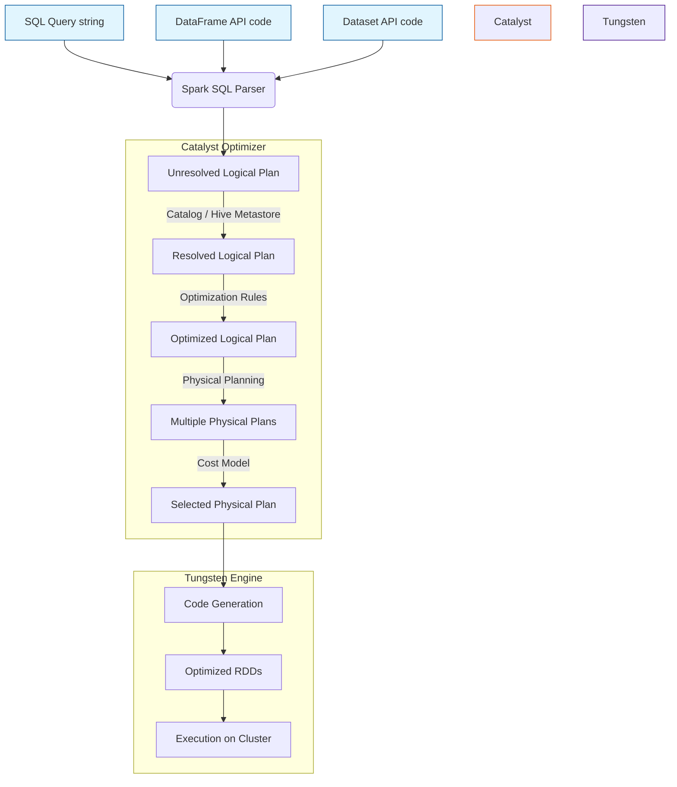

# Chapter 5 Overview: Sparkling Queries with Spark SQL

**Spark SQL is the foundational module for structured data processing in Apache Spark, acting as the underlying engine that powers DataFrames, Datasets, and SQL query execution.**

## Why It Matters

In the early days of big data processing, data engineers relied heavily on Resilient Distributed Datasets (RDDs) to process large datasets. While RDDs offered fault tolerance and parallel processing, they were inherently opaque to the Spark execution engine. Spark had no understanding of the underlying data structure or the specific operations being performed, making it impossible to automatically optimize execution plans. Spark SQL changes this paradigm entirely. By introducing structure (schemas) and declarative high-level APIs (SQL, DataFrames, Datasets), Spark SQL enables the framework to understand *what* the user wants to do, rather than just *how* to do it. This unlocks massive performance gains through advanced optimization rules, making Spark SQL the most-used component in modern data engineering and the cornerstone of the Spark ecosystem.

## How It Works

Spark SQL is much more than just a tool for running SQL queries. It is a massive distributed data processing engine that integrates relational processing with Spark's functional programming API. At its core, Spark SQL introduces a structured data abstraction called the DataFrame, which organizes data into named columns, much like a table in a relational database. This structure allows Spark to infer metadata and apply powerful internal optimizations.

The magic of Spark SQL lies in its two primary internal components: the Catalyst Optimizer and the Tungsten Execution Engine. When you write a query using SQL, or use DataFrame/Dataset transformations, these operations are not executed immediately. Instead, they are parsed into an Unresolved Logical Plan. The Catalyst Optimizer then takes over, applying a series of rules to resolve, optimize, and transform this logical plan into a highly efficient Physical Plan. 

Once the physical plan is chosen, Tungsten steps in to execute it. Tungsten focuses on substantially improving the memory and CPU efficiency of Spark applications. It bypasses the JVM's garbage collector by managing memory directly (off-heap memory) and generates highly optimized custom Java bytecode for the physical plan at runtime (Whole-Stage Code Generation). This synergy between Catalyst and Tungsten means that a query written in Python, Scala, Java, or R will often compile down to the exact same highly optimized execution path.

Ultimately, Spark SQL acts as a universal bridge. It connects various data sources (JSON, Parquet, ORC, JDBC, Hive) and exposes a unified API. Whether you are running complex window functions, aggregating terabytes of logs, or feeding data into machine learning pipelines, Spark SQL is the engine orchestrating the distributed computation with unparalleled efficiency.

## Flow Diagram



## Data Visualization

| API Choice | Data Representation | Type Safety | Optimizer Support | Performance Profile |
| :--- | :--- | :--- | :--- | :--- |
| **RDDs** | Opaque Java/Python objects | Compile-time (Scala/Java) | None (Opaque to Spark) | Moderate (High GC overhead) |
| **DataFrames** | Distributed rows (Row objects) | Runtime (Dynamically typed) | Catalyst & Tungsten | Ultra-Fast (Optimized execution) |
| **Datasets** | Distributed strongly-typed objects| Compile-time (Scala/Java) | Catalyst & Tungsten | Ultra-Fast (Encoder overhead) |
| **Spark SQL** | Tables / Views | Runtime | Catalyst & Tungsten | Ultra-Fast (Identical to DataFrames)|

## Code Example

```python
# Import necessary Spark SQL functions and types
from pyspark.sql import SparkSession
from pyspark.sql.functions import col, upper, avg, count

# Initialize SparkSession, the entry point for Spark SQL
spark = SparkSession.builder \
    .appName("Chapter5-Overview") \
    .config("spark.sql.adaptive.enabled", "true") \
    .getOrCreate()

# 1. Read data from a Parquet file (Spark SQL handles the schema automatically)
# Parquet is a columnar format highly optimized for Spark SQL
df = spark.read.parquet("/path/to/users_data.parquet")

# 2. DataFrame API Transformation
# Here we are filtering, grouping, and aggregating using the programmatic API
df_transformed = df.filter(col("age") > 18) \
    .withColumn("status", upper(col("subscription_status"))) \
    .groupBy("status") \
    .agg(
        avg("age").alias("average_age"),
        count("*").alias("total_users")
    )

# 3. SQL Query Transformation (Identical execution plan to the DataFrame API)
# First, register the DataFrame as a temporary view in the catalog
df.createOrReplaceTempView("users")

# Now, execute a raw SQL query string against the view
sql_transformed = spark.sql("""
    SELECT 
        UPPER(subscription_status) AS status,
        AVG(age) AS average_age,
        COUNT(1) AS total_users
    FROM users
    WHERE age > 18
    GROUP BY UPPER(subscription_status)
""")

# Show the results (Both DataFrames will yield the exact same physical execution plan)
df_transformed.show()
sql_transformed.show()

# To verify they share the same Catalyst optimization path:
df_transformed.explain(True)
sql_transformed.explain(True)
```

## Common Pitfalls

*   **Mixing RDDs and DataFrames unnecessarily:** Continually switching back and forth between RDDs and DataFrames incurs heavy serialization penalties and breaks the Catalyst optimizer's chain of transformations. Stick to DataFrames/SQL.
*   **Ignoring the execution plan:** Writing complex chained transformations without periodically checking the physical plan using `.explain()`. You might accidentally cause Cartesian joins or prevent predicate pushdown.
*   **Over-reliance on UDFs (User Defined Functions):** Using Python UDFs forces Spark to serialize data out of the JVM, send it to a Python worker, and serialize it back, completely bypassing Tungsten's CodeGen optimizations. Use native Spark SQL functions whenever possible.
*   **Mismanaging partitions:** Allowing Spark to shuffle data into the default 200 partitions (`spark.sql.shuffle.partitions`) regardless of the data size. For small datasets, 200 is too high; for massive datasets, it's too low.
*   **Assuming SQL is slower than programmatic APIs:** A common misconception is that writing code in Scala/Python DataFrames is faster than writing SQL strings. They both compile down to the identical Catalyst plan. 

## Key Takeaway

Spark SQL transforms Apache Spark from a functional data processing tool into a highly optimized, universally accessible data engine that understands the structure of your data and optimizes your queries automatically.
