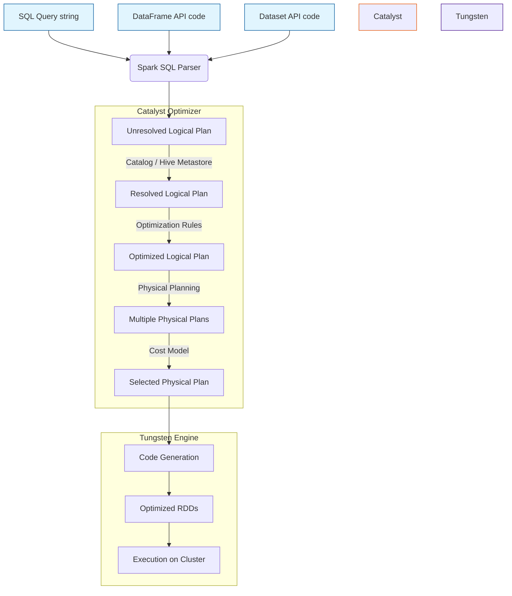

# Chapter 5 Overview: Sparkling Queries with Spark SQL

**Spark SQL is the foundational module for structured data processing in Apache Spark, acting as the underlying engine that powers DataFrames, Datasets, and SQL query execution.**

## Why It Matters

In the early days of big data processing, data engineers relied heavily on Resilient Distributed Datasets (RDDs) to process large datasets. While RDDs offered fault tolerance and parallel processing, they were inherently opaque to the Spark execution engine. Spark had no understanding of the underlying data structure or the specific operations being performed, making it impossible to automatically optimize execution plans. Spark SQL changes this paradigm entirely. By introducing structure (schemas) and declarative high-level APIs (SQL, DataFrames, Datasets), Spark SQL enables the framework to understand *what* the user wants to do, rather than just *how* to do it. This unlocks massive performance gains through advanced optimization rules, making Spark SQL the most-used component in modern data engineering and the cornerstone of the Spark ecosystem.

## How It Works

Spark SQL is much more than just a tool for running SQL queries. It is a massive distributed data processing engine that integrates relational processing with Spark's functional programming API. At its core, Spark SQL introduces a structured data abstraction called the DataFrame, which organizes data into named columns, much like a table in a relational database. This structure allows Spark to infer metadata and apply powerful internal optimizations.

The magic of Spark SQL lies in its two primary internal components: the Catalyst Optimizer and the Tungsten Execution Engine. When you write a query using SQL, or use DataFrame/Dataset transformations, these operations are not executed immediately. Instead, they are parsed into an Unresolved Logical Plan. The Catalyst Optimizer then takes over, applying a series of rules to resolve, optimize, and transform this logical plan into a highly efficient Physical Plan. 

Once the physical plan is chosen, Tungsten steps in to execute it. Tungsten focuses on substantially improving the memory and CPU efficiency of Spark applications. It bypasses the JVM's garbage collector by managing memory directly (off-heap memory) and generates highly optimized custom Java bytecode for the physical plan at runtime (Whole-Stage Code Generation). This synergy between Catalyst and Tungsten means that a query written in Python, Scala, Java, or R will often compile down to the exact same highly optimized execution path.

Ultimately, Spark SQL acts as a universal bridge. It connects various data sources (JSON, Parquet, ORC, JDBC, Hive) and exposes a unified API. Whether you are running complex window functions, aggregating terabytes of logs, or feeding data into machine learning pipelines, Spark SQL is the engine orchestrating the distributed computation with unparalleled efficiency.

## Flow Diagram



## Data Visualization

| API Choice | Data Representation | Type Safety | Optimizer Support | Performance Profile |
| :--- | :--- | :--- | :--- | :--- |
| **RDDs** | Opaque Java/Python objects | Compile-time (Scala/Java) | None (Opaque to Spark) | Moderate (High GC overhead) |
| **DataFrames** | Distributed rows (Row objects) | Runtime (Dynamically typed) | Catalyst & Tungsten | Ultra-Fast (Optimized execution) |
| **Datasets** | Distributed strongly-typed objects| Compile-time (Scala/Java) | Catalyst & Tungsten | Ultra-Fast (Encoder overhead) |
| **Spark SQL** | Tables / Views | Runtime | Catalyst & Tungsten | Ultra-Fast (Identical to DataFrames)|

## Code Example

```python
# Import necessary Spark SQL functions and types
from pyspark.sql import SparkSession
from pyspark.sql.functions import col, upper, avg, count

# Initialize SparkSession, the entry point for Spark SQL
spark = SparkSession.builder \
    .appName("Chapter5-Overview") \
    .config("spark.sql.adaptive.enabled", "true") \
    .getOrCreate()

# 1. Read data from a Parquet file (Spark SQL handles the schema automatically)
# Parquet is a columnar format highly optimized for Spark SQL
df = spark.read.parquet("/path/to/users_data.parquet")

# 2. DataFrame API Transformation
# Here we are filtering, grouping, and aggregating using the programmatic API
df_transformed = df.filter(col("age") > 18) \
    .withColumn("status", upper(col("subscription_status"))) \
    .groupBy("status") \
    .agg(
        avg("age").alias("average_age"),
        count("*").alias("total_users")
    )

# 3. SQL Query Transformation (Identical execution plan to the DataFrame API)
# First, register the DataFrame as a temporary view in the catalog
df.createOrReplaceTempView("users")

# Now, execute a raw SQL query string against the view
sql_transformed = spark.sql("""
    SELECT 
        UPPER(subscription_status) AS status,
        AVG(age) AS average_age,
        COUNT(1) AS total_users
    FROM users
    WHERE age > 18
    GROUP BY UPPER(subscription_status)
""")

# Show the results (Both DataFrames will yield the exact same physical execution plan)
df_transformed.show()
sql_transformed.show()

# To verify they share the same Catalyst optimization path:
df_transformed.explain(True)
sql_transformed.explain(True)
```

## Common Pitfalls

*   **Mixing RDDs and DataFrames unnecessarily:** Continually switching back and forth between RDDs and DataFrames incurs heavy serialization penalties and breaks the Catalyst optimizer's chain of transformations. Stick to DataFrames/SQL.
*   **Ignoring the execution plan:** Writing complex chained transformations without periodically checking the physical plan using `.explain()`. You might accidentally cause Cartesian joins or prevent predicate pushdown.
*   **Over-reliance on UDFs (User Defined Functions):** Using Python UDFs forces Spark to serialize data out of the JVM, send it to a Python worker, and serialize it back, completely bypassing Tungsten's CodeGen optimizations. Use native Spark SQL functions whenever possible.
*   **Mismanaging partitions:** Allowing Spark to shuffle data into the default 200 partitions (`spark.sql.shuffle.partitions`) regardless of the data size. For small datasets, 200 is too high; for massive datasets, it's too low.
*   **Assuming SQL is slower than programmatic APIs:** A common misconception is that writing code in Scala/Python DataFrames is faster than writing SQL strings. They both compile down to the identical Catalyst plan. 

## Key Takeaway

Spark SQL transforms Apache Spark from a functional data processing tool into a highly optimized, universally accessible data engine that understands the structure of your data and optimizes your queries automatically.

---

## 🎓 Deep Learning Questions

### Q1: Why Was This Concept Introduced?
Before Spark SQL, developers relied heavily on Resilient Distributed Datasets (RDDs) for distributed processing. While powerful and fault-tolerant, RDDs treated data as opaque objects (e.g., standard Python or Java objects). The Spark engine had no insight into the internal structure of the data or the specific transformations being applied. This limitation meant that Spark could not automatically optimize execution; the efficiency of the job depended entirely on the developer's code.

Spark SQL and its structured APIs (DataFrames and Datasets) were introduced to solve this exact problem. By enforcing a schema, Spark SQL enables the framework to understand both the structure of the data (columns and types) and the intent of the operations (filters, aggregations). This paradigm shift paved the way for the Catalyst Optimizer and Tungsten execution engine, fundamentally changing Spark from a raw compute engine into a smart query engine capable of optimizing data pipelines dynamically, pushing down filters, and vastly reducing memory footprints.

### Q2: What Exactly Is This Concept and How Does It Work?
Spark SQL is the foundational module for structured data processing in Apache Spark. It sits on top of the core Spark engine and provides three main APIs: raw SQL, DataFrames, and Datasets. 

When you execute a DataFrame transformation or a SQL query, it does not run immediately. Instead, Spark SQL parses the code into an **Unresolved Logical Plan**. The **Catalyst Optimizer** then leverages the catalog (schema metadata) to validate column names and types, generating a **Resolved Logical Plan**. Catalyst applies rules (like predicate pushdown or column pruning) to create an **Optimized Logical Plan**. Finally, Catalyst generates multiple **Physical Plans** and uses a cost model to select the most efficient one.

Once the physical plan is chosen, the **Tungsten Engine** takes over execution. Tungsten generates highly optimized Java bytecode at runtime (Whole-Stage Code Generation) and manages memory off-heap, bypassing the JVM's Garbage Collector. This results in the optimized RDDs that ultimately run on the cluster's executors.

### Q3: Where Should This Concept Be Used?
Spark SQL and its structured APIs are the gold standard for almost all modern data processing tasks.
- **ETL and Data Pipelines:** Transforming raw data into cleaned, structured tables (e.g., in a Delta Lake or Data Lakehouse architecture).
- **Business Intelligence & Reporting:** Connecting tools like Tableau or PowerBI to Spark via JDBC/ODBC for massive-scale analytics.
- **Machine Learning Feature Engineering:** Preparing datasets for Spark MLlib or other machine learning frameworks using optimized aggregations.
- **Log Processing:** Querying structured or semi-structured data formats like Parquet, ORC, AVRO, and JSON natively.

Major tech companies (Netflix, Uber, Amazon) rely entirely on Spark SQL to clean, aggregate, and process multi-terabyte datasets efficiently without writing verbose lower-level code.

### Q4: Where Should This Concept NOT Be Used?
While Spark SQL is incredibly versatile, there are specific scenarios where falling back to core RDDs or other tools is necessary:
- **Highly Unstructured Data:** If you are processing raw media files (images, audio, video) or complex raw text blobs that cannot be mapped to a tabular schema, RDDs provide the necessary low-level flexibility.
- **Low-Level Partition Control:** When you need absolute, granular control over data distribution, custom physical placement, or complex stateful streaming logic that the declarative SQL API cannot express.
- **Legacy Migrations:** If maintaining legacy MapReduce paradigms that strictly require step-by-step opaque object manipulation, though migrating to Spark SQL is strongly advised.
- **Single-Node Relational Tasks:** For small gigabyte-scale datasets that fit on a single laptop, traditional RDBMS systems (like PostgreSQL) or Pandas/DuckDB might be faster and easier to deploy than spinning up a Spark cluster.

### Q5: How Is This Concept Different from Hadoop?

| Aspect | Hadoop MapReduce | Apache Spark (Spark SQL & DataFrames) |
| :--- | :--- | :--- |
| **Architecture** | Disk-based execution (writes to HDFS after every step) | In-memory execution (caches data, minimal disk I/O) |
| **Performance** | Slower due to constant disk reading/writing | Up to 100x faster in memory, aided by Catalyst and Tungsten |
| **Processing Model** | Rigid Map and Reduce phases | Declarative SQL and functional API with an automated query optimizer |
| **Memory Usage** | JVM-managed, prone to GC pauses | Tungsten manages memory off-heap, avoiding GC overhead |
| **Fault Tolerance** | Replicates data on HDFS for recovery | Recomputes lost partitions using lineage (DAG) |
| **Scalability** | Scales to petabytes efficiently | Scales identically, but faster due to optimized shuffling |
| **Ease of Development**| Very low; requires hundreds of lines of Java | High; concise SQL, Python, or Scala scripts |
| **Typical Use Cases** | Batch processing legacy systems | Modern ETL, interactive querying, real-time analytics |
| **Advantages** | Extremely mature, handles cheap hardware well | Speed, unified API, rich ecosystem, automated optimization |
| **Disadvantages** | Verbose, slow, no interactive querying | Higher memory requirement, tuning Catalyst/memory can be complex |

### Q6: How Can This Concept Be Related to a Traditional RDBMS?
Spark SQL feels very familiar to SQL developers but operates at a distributed scale.

| Concept | Traditional RDBMS (e.g., PostgreSQL, MySQL) | Apache Spark SQL |
| :--- | :--- | :--- |
| **Core Engine** | Single node (usually), scale-up architecture | Distributed cluster, scale-out architecture |
| **Storage** | Closely coupled with the execution engine (local disks) | Decoupled storage (S3, HDFS, Azure Data Lake) |
| **Data Formats** | Proprietary internal storage formats | Open formats (Parquet, ORC, JSON, CSV, Delta) |
| **Optimization** | Cost-Based Optimizer (CBO) on local statistics | Catalyst Optimizer (CBO and Rule-Based) across a cluster |
| **Execution** | Centralized query execution | Tungsten engine generating byte-code for distributed executors |
| **Indexing** | B-Trees, Hash indexes heavily used | Generally lacks traditional indexes; relies on partitioning and bucketing |
| **Updates/Deletes** | Granular row-level ACID transactions | Historically append-only (requires Delta Lake/Iceberg for ACID) |

### Q7: What Happens Behind the Scenes?
When a user submits a query via DataFrames or SQL:
1. **Unresolved Logical Plan:** Spark parses the code or SQL string into a syntax tree without checking if columns or tables actually exist.
2. **Resolved Logical Plan:** The Catalyst Optimizer checks the Catalog (Schema/Metastore) to validate column names and types.
3. **Optimized Logical Plan:** Catalyst applies rule-based optimizations: pushing filters down to the data source (Predicate Pushdown), removing unused columns (Column Pruning), and simplifying expressions.
4. **Physical Planning:** Catalyst generates multiple physical execution plans and uses a Cost-Based Optimizer (CBO) to pick the most efficient one.
5. **Code Generation:** Tungsten generates custom, highly optimized Java bytecode for the chosen plan.
6. **Execution:** The resulting DAG of RDDs is sent to the DAG Scheduler, broken into Stages and Tasks, and executed on worker nodes.

```text
User Code (SQL / DataFrame) 
       │
       ▼
[ Spark SQL Parser ]
       │
       ▼
(Unresolved Logical Plan)
       │
       ▼  <-- Catalog / Metastore
[ Catalyst Optimizer ]
       │  -- Validation
       ▼
(Resolved Logical Plan)
       │  -- Predicate Pushdown, Column Pruning
       ▼
(Optimized Logical Plan)
       │  -- Cost-Based Optimization
       ▼
(Selected Physical Plan)
       │
       ▼
[ Tungsten Engine ]  <-- Whole-Stage Code Generation
       │
       ▼
(Optimized RDDs Executed on Cluster)
```

### Q8: Performance Considerations, Best Practices, and Common Mistakes

| Category | Recommendation | Why It Matters |
| :--- | :--- | :--- |
| **Optimization** | **Use Native Functions:** Avoid Python UDFs. | Python UDFs force expensive JVM-to-Python serialization and break Tungsten's optimizations. |
| **Best Practice** | **File Formats:** Always prefer Parquet or ORC. | Columnar formats allow Spark to read only required columns and push down filters at the file level. |
| **Performance** | **Partitioning:** Tune `spark.sql.shuffle.partitions`. | Default is 200. Overly high for small data causes overhead; too low for big data causes OOM errors. |
| **Optimization** | **Broadcast Joins:** Use `broadcast()` for small tables. | Broadcasting a small table eliminates the expensive network shuffle required for a standard join. |
| **Common Mistake** | **SELECT *:** Never select all columns if not needed. | Prevents Catalyst from utilizing column pruning optimization and increases memory pressure. |
| **Best Practice** | **Check `.explain()`:** Review the physical plan. | Ensures filters are pushed down and avoids unexpected Cartesian joins. |

### Q9: Interview Questions

**Beginner**
1. **What is the difference between a DataFrame and an RDD?** 
   *Answer:* A DataFrame is a distributed collection of data organized into named columns, allowing Spark to optimize execution using the Catalyst optimizer. An RDD is a lower-level, untyped collection of opaque objects without automated optimization.
2. **Can you write SQL queries directly in Spark?** 
   *Answer:* Yes, using `spark.sql("SELECT * FROM table")` after registering a DataFrame as a temporary view via `createOrReplaceTempView`.
3. **What is the Catalyst Optimizer?** 
   *Answer:* It is Spark SQL's internal query optimizer that transforms logical queries (SQL or DataFrame API) into highly efficient physical execution plans.

**Intermediate**
1. **What is Predicate Pushdown?** 
   *Answer:* An optimization where Spark pushes filter conditions down to the data source (like a Parquet file) so only the relevant rows are read into memory, saving massive I/O.
2. **What role does Tungsten play in Spark SQL?** 
   *Answer:* Tungsten is the execution engine that improves CPU and memory efficiency. It uses off-heap memory management to avoid JVM garbage collection and dynamically generates custom Java bytecode (Whole-Stage Code Generation) for physical plans.
3. **Is there a performance difference between the DataFrame API and Spark SQL strings?** 
   *Answer:* No. Both are parsed into the exact same Unresolved Logical Plan and optimized by Catalyst into the identical physical execution path.

**Advanced**
1. **How does Spark SQL handle Catalyst rule execution internally?** 
   *Answer:* Catalyst represents queries as trees. It applies sets of rules (transformations) sequentially to these trees in phases (Analysis, Logical Optimization, Physical Planning) until a fixed point is reached and the tree stops changing.
2. **Explain the difference between Rule-Based and Cost-Based Optimization in Catalyst.** 
   *Answer:* Rule-based optimization applies logical heuristics (e.g., pushing filters down, combining identical projections). Cost-based optimization (CBO) uses dataset statistics (row counts, sizes) to choose the best physical execution strategy, such as deciding between a Broadcast Hash Join or Sort Merge Join.
3. **Why do Python UDFs cause performance bottlenecks in Spark SQL?** 
   *Answer:* Native Spark SQL functions run entirely in the JVM and are optimized by Tungsten. Python UDFs require Spark to serialize data out of the JVM, send it via a pipe to a Python worker, process it, and serialize it back, completely breaking Tungsten's optimizations.

**Scenario-Based**
1. **Your Spark SQL query joining a 2TB table and a 50MB table is taking hours and causing OOM errors. How do you fix it?** 
   *Answer:* The engine is likely doing a massive shuffle for a Sort Merge Join. Wrap the 50MB DataFrame in a `broadcast()` function. This sends the small table to every executor, completely eliminating the network shuffle and resolving the OOM.
2. **You notice that `df.filter("date > '2023-01-01'")` is scanning your entire 10TB S3 bucket of JSON logs. What is wrong?** 
   *Answer:* JSON does not support predicate pushdown natively like Parquet does. You must convert the JSON files to Parquet format, ideally partitioned by `date`, so Spark can skip reading irrelevant files entirely.

### Q10: Complete Real-World Example

**Business Problem:** A streaming service wants to analyze user viewing habits to find out which device types yield the highest average watch time for users over the age of 18.
**Sample Dataset:** `viewing_logs.parquet` (Columns: `user_id`, `age`, `device_type`, `watch_duration_mins`).

```python
from pyspark.sql import SparkSession
from pyspark.sql.functions import col, avg, round

# 1. Initialize SparkSession (Entry point for Spark SQL)
spark = SparkSession.builder \
    .appName("ViewingHabitsAnalysis") \
    .config("spark.sql.adaptive.enabled", "true") \
    .getOrCreate()

# 2. Read optimized Parquet data
# Catalyst automatically understands the schema and columns
df_logs = spark.read.parquet("s3://data-lake/viewing_logs.parquet")

# 3. DataFrame API approach
optimized_df = df_logs \
    .filter(col("age") > 18) \
    .groupBy("device_type") \
    .agg(round(avg("watch_duration_mins"), 2).alias("avg_watch_time")) \
    .orderBy(col("avg_watch_time").desc())

# Execute and show results
print("Results using DataFrame API:")
optimized_df.show()

# 4. SQL approach (achieves the exact same Catalyst plan)
df_logs.createOrReplaceTempView("viewing_logs")

sql_query = """
    SELECT 
        device_type, 
        ROUND(AVG(watch_duration_mins), 2) AS avg_watch_time
    FROM viewing_logs
    WHERE age > 18
    GROUP BY device_type
    ORDER BY avg_watch_time DESC
"""

sql_df = spark.sql(sql_query)
print("Results using Spark SQL:")
sql_df.show()

# Performance Note: Because the source is Parquet, the filter (age > 18) 
# is pushed down to the storage layer, meaning Spark skips reading 
# rows for users under 18 entirely!
```
**Expected Output:**
```text
+-----------+--------------+
|device_type|avg_watch_time|
+-----------+--------------+
|   Smart TV|        145.50|
|     Tablet|         85.20|
|     Mobile|         42.10|
+-----------+--------------+
```

### 💡 Key Takeaways
- Spark SQL allows you to write declarative, highly optimized data pipelines.
- DataFrames and Spark SQL strings compile down to the exact same physical execution plan.
- The Catalyst Optimizer transforms your logical logic into the best physical plan using rules and cost-models.
- Tungsten improves raw execution speed by managing off-heap memory and generating custom Java bytecode.
- Always prefer columnar formats like Parquet to leverage predicate pushdown and column pruning.

### ⚠️ Common Misconceptions
- **"Writing raw Scala is faster than using Spark SQL."** False. Both use the Catalyst Optimizer and Tungsten engine, resulting in identical performance.
- **"DataFrames are just RDDs with headers."** False. DataFrames use a completely different internal engine (Tungsten) that avoids storing standard JVM objects, drastically reducing memory footprints.
- **"UDFs are a great way to reuse Python code."** While true for code reuse, they are terrible for performance. Always try to use native `pyspark.sql.functions` instead.

### 🔗 Related Spark Concepts
- Resilient Distributed Datasets (RDDs)
- Spark Session & Spark Context
- The Catalyst Optimizer
- Tungsten Execution Engine
- DataFrame and Dataset APIs

### 📚 References for Further Reading
- Apache Spark Official Documentation: Spark SQL Guide
- Learning Spark (O'Reilly) - Chapter 3 & 4
- Spark: The Definitive Guide (O'Reilly) - Part II: Structured APIs
