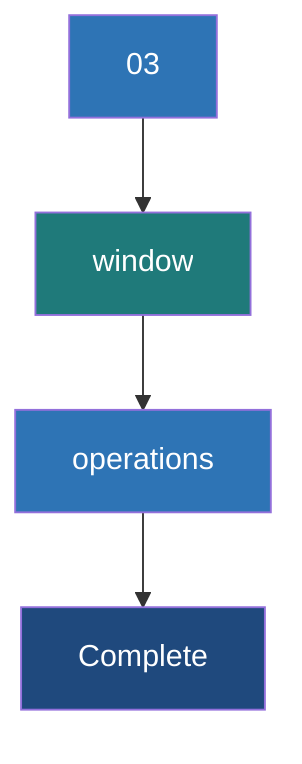

# Window Operations

**Window operations allow you to apply transformations over a sliding time frame of data, enabling computations like "the top 5 hashtags over the last 10 minutes, updated every minute."**

## Why It Matters

In many streaming scenarios, analyzing just the data that arrived in the last 2 seconds (the batch interval) doesn't provide enough context. Conversely, maintaining state for the *entire history* of the application (using `updateStateByKey`) is overkill and irrelevant for real-time trending metrics. 

Consider a dashboard monitoring system health. You don't care about a CPU spike from yesterday, and looking only at the last 1 second might trigger false alarms. What you really want is the average CPU load over the *last 5 minutes*, updated continuously. Window operations are the perfect abstraction for this. They allow Spark Streaming to maintain a rolling window of recent data batches. As time marches forward, the window slides, taking in new batches and dropping the oldest ones, keeping your analytics focused strictly on the "recent past."

## How It Works

Window operations in Spark Streaming are controlled by two fundamental parameters:

1.  **Window Length (Duration):** The duration of time covered by the window. This defines how much historical data is grouped together for the computation. (e.g., "The last 60 seconds").
2.  **Sliding Interval (Slide Duration):** The interval at which the window operation is computed and updated. (e.g., "Update the calculation every 10 seconds").

**CRITICAL RULE:** Both the Window Length and the Sliding Interval must be multiples of the core `StreamingContext` batch interval. If your batch interval is 3 seconds, you cannot have a window length of 10 seconds (10 is not divisible by 3).

When you call a window operation like `reduceByKeyAndWindow()`, Spark automatically gathers all the underlying RDDs that fall within the current Window Length, unions them together, and applies the reduction function. 

Spark provides highly optimized versions of these functions. For example, `reduceByKeyAndWindow` comes in two flavors. The standard version recalculates the entire window from scratch every time it slides. The *inverse version* (which requires checkpointing) is much more efficient. When the window slides, it simply takes the previous window's result, *adds* the new batches entering the window, and *subtracts* the old batches leaving the window. This makes the computation cost independent of the window size!

## Flow Diagram



## Data Visualization

Assuming a Batch Interval of **1 minute**, Window Length of **3 minutes**, and Sliding Interval of **2 minutes**.

| Time | Batch Created | Is Window Evaluated? | Batches Included in the Current Window | Batches Dropped from Previous Window |
| :--- | :--- | :--- | :--- | :--- |
| **00:01** | Batch 1 | No (Slide is 2m) | N/A | N/A |
| **00:02** | Batch 2 | **Yes** (Time 2) | Batch 1, Batch 2 | (Initial window) |
| **00:03** | Batch 3 | No (Wait for t=4) | N/A | N/A |
| **00:04** | Batch 4 | **Yes** (Time 4) | Batch 2, Batch 3, Batch 4 | Batch 1 dropped |
| **00:05** | Batch 5 | No | N/A | N/A |
| **00:06** | Batch 6 | **Yes** (Time 6) | Batch 4, Batch 5, Batch 6 | Batch 2, Batch 3 dropped|

*Notice how Batch 2 and Batch 4 are included in multiple window evaluations. This is the nature of overlapping (sliding) windows.*

## Code Example

Here is a Python example calculating the top 5 trending hashtags over the last 60 seconds, updated every 10 seconds. This uses the highly efficient inverse reduction method.

```python
from pyspark import SparkContext
from pyspark.streaming import StreamingContext

sc = SparkContext("local[2]", "TrendingHashtags")
# Base batch interval: 2 seconds
ssc = StreamingContext(sc, 2)
# Inverse reduceByKeyAndWindow requires checkpointing!
ssc.checkpoint("file:///tmp/spark_window_checkpoints")

# Input stream of tweets (simulated via socket)
tweets = ssc.socketTextStream("localhost", 9999)

# Extract hashtags: flatMap to split words, filter for '#', map to (hashtag, 1)
hashtags = tweets.flatMap(lambda line: line.split(" ")) \
                 .filter(lambda word: word.startswith("#")) \
                 .map(lambda hashtag: (hashtag, 1))

# Optimized reduceByKeyAndWindow
# Params:
# 1. Add function: how to add new data entering the window
# 2. Subtract function (Inverse): how to remove old data leaving the window
# 3. Window length: 60 seconds
# 4. Slide interval: 10 seconds
trending_counts = hashtags.reduceByKeyAndWindow(
    lambda x, y: x + y,        # Add function
    lambda x, y: x - y,        # Inverse (subtract) function
    60,                        # Window duration (must be multiple of 2)
    10                         # Slide duration (must be multiple of 2)
)

# Sort the results in the window to find the top 5
def get_top_5(time, rdd):
    print(f"\n--- Top 5 Hashtags at {time} ---")
    if not rdd.isEmpty():
        # Sort by count (value) descending, take top 5
        top_5 = rdd.sortBy(lambda pair: pair[1], ascending=False).take(5)
        for tag, count in top_5:
            # Only print if count > 0 (subtraction can leave 0 counts)
            if count > 0:
                print(f"{tag}: {count}")

trending_counts.foreachRDD(get_top_5)

ssc.start()
ssc.awaitTermination()
```

## Common Pitfalls

*   **Parameter Multiples Mismatch:** If your StreamingContext batch interval is 5 seconds, setting a window length of 12 seconds will throw a runtime exception. 12 is not a multiple of 5.
*   **Memory Exhaustion with Large Windows:** If you define a window length of 24 hours, Spark has to keep 24 hours' worth of RDDs in memory (unless you use the inverse `reduceByKeyAndWindow` which only stores the reduced state). Standard `window()` over large periods will inevitably cause OutOfMemory errors.
*   **0-Count Ghost Keys:** When using the inverse subtract function (`lambda x, y: x - y`), when a hashtag completely leaves the window, its count becomes 0. The key *remains* in the state with a value of 0. You must explicitly filter out keys with a value `<= 0` in your downstream processing.
*   **Forgetting Checkpoints for Inverse Functions:** The optimized version of `reduceByKeyAndWindow` that takes an inverse reduction function maintains state to avoid recalculating the whole window. Therefore, just like `updateStateByKey`, it strictly requires `ssc.checkpoint()` to be set.

## Key Takeaway

Window operations empower you to compute metrics over a rolling, sliding timeframe, allowing real-time applications to analyze recent historical trends without the overhead of maintaining indefinite state.

<br><br><br><br><br><br><br><br><br><br><br><br><br><br><br><br><br><br><br><br><br><br><br><br><br><br><br><br><br><br><br><br><br><br><br><br><br><br><br><br><br><br><br><br><br><br><br><br><br><br><br><br><br><br><br><br><br><br><br><br><br><br><br><br><br><br><br><br><br><br><br><br><br><br><br><br><br><br><br><br><br><br><br><br><br><br><br><br><br><br><br><br><br><br><br><br><br><br><br><br>
