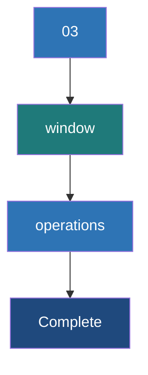

# Window Operations

**Window operations allow you to apply transformations over a sliding time frame of data, enabling computations like "the top 5 hashtags over the last 10 minutes, updated every minute."**

## Why It Matters

In many streaming scenarios, analyzing just the data that arrived in the last 2 seconds (the batch interval) doesn't provide enough context. Conversely, maintaining state for the *entire history* of the application (using `updateStateByKey`) is overkill and irrelevant for real-time trending metrics. 

Consider a dashboard monitoring system health. You don't care about a CPU spike from yesterday, and looking only at the last 1 second might trigger false alarms. What you really want is the average CPU load over the *last 5 minutes*, updated continuously. Window operations are the perfect abstraction for this. They allow Spark Streaming to maintain a rolling window of recent data batches. As time marches forward, the window slides, taking in new batches and dropping the oldest ones, keeping your analytics focused strictly on the "recent past."

## How It Works

Window operations in Spark Streaming are controlled by two fundamental parameters:

1.  **Window Length (Duration):** The duration of time covered by the window. This defines how much historical data is grouped together for the computation. (e.g., "The last 60 seconds").
2.  **Sliding Interval (Slide Duration):** The interval at which the window operation is computed and updated. (e.g., "Update the calculation every 10 seconds").

**CRITICAL RULE:** Both the Window Length and the Sliding Interval must be multiples of the core `StreamingContext` batch interval. If your batch interval is 3 seconds, you cannot have a window length of 10 seconds (10 is not divisible by 3).

When you call a window operation like `reduceByKeyAndWindow()`, Spark automatically gathers all the underlying RDDs that fall within the current Window Length, unions them together, and applies the reduction function. 

Spark provides highly optimized versions of these functions. For example, `reduceByKeyAndWindow` comes in two flavors. The standard version recalculates the entire window from scratch every time it slides. The *inverse version* (which requires checkpointing) is much more efficient. When the window slides, it simply takes the previous window's result, *adds* the new batches entering the window, and *subtracts* the old batches leaving the window. This makes the computation cost independent of the window size!

## Flow Diagram



## Data Visualization

Assuming a Batch Interval of **1 minute**, Window Length of **3 minutes**, and Sliding Interval of **2 minutes**.

| Time | Batch Created | Is Window Evaluated? | Batches Included in the Current Window | Batches Dropped from Previous Window |
| :--- | :--- | :--- | :--- | :--- |
| **00:01** | Batch 1 | No (Slide is 2m) | N/A | N/A |
| **00:02** | Batch 2 | **Yes** (Time 2) | Batch 1, Batch 2 | (Initial window) |
| **00:03** | Batch 3 | No (Wait for t=4) | N/A | N/A |
| **00:04** | Batch 4 | **Yes** (Time 4) | Batch 2, Batch 3, Batch 4 | Batch 1 dropped |
| **00:05** | Batch 5 | No | N/A | N/A |
| **00:06** | Batch 6 | **Yes** (Time 6) | Batch 4, Batch 5, Batch 6 | Batch 2, Batch 3 dropped|

*Notice how Batch 2 and Batch 4 are included in multiple window evaluations. This is the nature of overlapping (sliding) windows.*

## Code Example

Here is a Python example calculating the top 5 trending hashtags over the last 60 seconds, updated every 10 seconds. This uses the highly efficient inverse reduction method.

```python
from pyspark import SparkContext
from pyspark.streaming import StreamingContext

sc = SparkContext("local[2]", "TrendingHashtags")
# Base batch interval: 2 seconds
ssc = StreamingContext(sc, 2)
# Inverse reduceByKeyAndWindow requires checkpointing!
ssc.checkpoint("file:///tmp/spark_window_checkpoints")

# Input stream of tweets (simulated via socket)
tweets = ssc.socketTextStream("localhost", 9999)

# Extract hashtags: flatMap to split words, filter for '#', map to (hashtag, 1)
hashtags = tweets.flatMap(lambda line: line.split(" ")) \
                 .filter(lambda word: word.startswith("#")) \
                 .map(lambda hashtag: (hashtag, 1))

# Optimized reduceByKeyAndWindow
# Params:
# 1. Add function: how to add new data entering the window
# 2. Subtract function (Inverse): how to remove old data leaving the window
# 3. Window length: 60 seconds
# 4. Slide interval: 10 seconds
trending_counts = hashtags.reduceByKeyAndWindow(
    lambda x, y: x + y,        # Add function
    lambda x, y: x - y,        # Inverse (subtract) function
    60,                        # Window duration (must be multiple of 2)
    10                         # Slide duration (must be multiple of 2)
)

# Sort the results in the window to find the top 5
def get_top_5(time, rdd):
    print(f"\n--- Top 5 Hashtags at {time} ---")
    if not rdd.isEmpty():
        # Sort by count (value) descending, take top 5
        top_5 = rdd.sortBy(lambda pair: pair[1], ascending=False).take(5)
        for tag, count in top_5:
            # Only print if count > 0 (subtraction can leave 0 counts)
            if count > 0:
                print(f"{tag}: {count}")

trending_counts.foreachRDD(get_top_5)

ssc.start()
ssc.awaitTermination()
```

## Common Pitfalls

*   **Parameter Multiples Mismatch:** If your StreamingContext batch interval is 5 seconds, setting a window length of 12 seconds will throw a runtime exception. 12 is not a multiple of 5.
*   **Memory Exhaustion with Large Windows:** If you define a window length of 24 hours, Spark has to keep 24 hours' worth of RDDs in memory (unless you use the inverse `reduceByKeyAndWindow` which only stores the reduced state). Standard `window()` over large periods will inevitably cause OutOfMemory errors.
*   **0-Count Ghost Keys:** When using the inverse subtract function (`lambda x, y: x - y`), when a hashtag completely leaves the window, its count becomes 0. The key *remains* in the state with a value of 0. You must explicitly filter out keys with a value `<= 0` in your downstream processing.
*   **Forgetting Checkpoints for Inverse Functions:** The optimized version of `reduceByKeyAndWindow` that takes an inverse reduction function maintains state to avoid recalculating the whole window. Therefore, just like `updateStateByKey`, it strictly requires `ssc.checkpoint()` to be set.

## Key Takeaway

Window operations empower you to compute metrics over a rolling, sliding timeframe, allowing real-time applications to analyze recent historical trends without the overhead of maintaining indefinite state.

<br><br><br><br><br><br><br><br><br><br><br><br><br><br><br><br><br><br><br><br><br><br><br><br><br><br><br><br><br><br><br><br><br><br><br><br><br><br><br><br><br><br><br><br><br><br><br><br><br><br><br><br><br><br><br><br><br><br><br><br><br><br><br><br><br><br><br><br><br><br><br><br><br><br><br><br><br><br><br><br><br><br><br><br><br><br><br><br><br><br><br><br><br><br><br><br><br><br><br><br>


---

## 🎓 Deep Learning Questions

### Q1: Why Was This Concept Introduced?
Historically, streaming frameworks like early Storm or basic Hadoop Micro-batching struggled with time-based aggregations that spanned multiple batches. Spark Streaming processes data in discrete micro-batches (e.g., 2 seconds). However, business logic often dictates tracking events over a rolling timeframe (e.g., "trailing 5 minutes"). Without windowing, developers had to manually buffer micro-batches in external systems or carefully manage large state arrays, leading to complex and error-prone code. Window operations were introduced in Spark Streaming to provide a native, high-level abstraction for sliding and tumbling windows. This solved the problem of manually tracking cross-batch state, making rolling aggregations (like moving averages, top-N trending items, and sessionization) straightforward and natively optimized within the DStream API.

### Q2: What Exactly Is This Concept and How Does It Work?
Window operations allow you to apply transformations across a sliding time frame of data. Under the hood, Spark Streaming buffers the RDDs (batches) that fall into a specific time window. 
The concept relies on two core parameters:
1. **Window Duration:** The total time frame of data to evaluate (e.g., the last 10 minutes).
2. **Slide Duration:** The frequency at which the window is evaluated (e.g., every 1 minute). 
When a window triggers (based on the Slide Duration), the DStream creates a new aggregated RDD containing all data from the underlying RDDs within the Window Duration. Spark manages the memory and buffering of these underlying RDDs automatically. For aggregation functions like `reduceByKeyAndWindow`, Spark even provides an "inverse" optimization where it simply adds new batches entering the window and subtracts batches leaving, rather than recalculating the entire window from scratch.

### Q3: Where Should This Concept Be Used?
Window operations are fundamental in real-time analytics across multiple industries:
*   **Social Media & E-commerce:** Calculating top trending hashtags, products, or searches over the last 15 minutes, updated every minute.
*   **FinTech & Banking:** Fraud detection based on transaction velocity (e.g., identifying if more than 3 transactions occurred from the same IP address in a 5-minute rolling window).
*   **IoT & Telemetry:** Monitoring server health by checking if the moving average of CPU usage over 10 minutes exceeds a certain threshold, avoiding false positives from momentary spikes.
*   **Ride-sharing (Uber/Lyft):** Dynamic pricing algorithms that evaluate the supply vs. demand in a specific geohash over the trailing 10 minutes.

### Q4: Where Should This Concept NOT Be Used?
Window operations should NOT be used for:
*   **Lifelong State Management:** If you need to track user profiles or total lifetime events since the start of the application, `updateStateByKey` or `mapWithState` is appropriate. Windowing drops old data by design.
*   **Event-Time Processing with Late Data:** Spark Streaming (DStreams) relies heavily on *processing time*. If your data arrives severely out-of-order and you require strict *event-time* windows with watermarks, DStreams are not suitable. You should migrate to **Structured Streaming**.
*   **Extremely Long Windows:** Creating a window duration of 30 days in Spark Streaming will force the driver to track massive amounts of batch metadata, often leading to OOM (Out of Memory) errors. Long-term aggregations belong in a batch job.

### Q5: How Is This Concept Different from Hadoop?
| Aspect | Hadoop MapReduce | Apache Spark Streaming (Windowing) |
| :--- | :--- | :--- |
| **Architecture** | Batch-only. Operates on static files on HDFS. | Micro-batching. Operates on continuous streams of data. |
| **Processing Model** | No native concept of time-windows or sliding intervals. | Native APIs for Sliding and Tumbling time windows. |
| **Memory Usage** | Disk-heavy; writes intermediate data to disk. | Memory-heavy; buffers RDDs in RAM for the window duration. |
| **Fault Tolerance** | Recomputes map/reduce tasks from disk. | Recomputes lost RDDs from lineage; uses checkpointing for window state. |
| **Scalability** | High, scales well for massive historical data. | High, but memory-bound by the window duration requirements. |
| **Ease of Development** | Hard. Requires custom logic/Oozie orchestration for "rolling" batch jobs. | Easy. Declarative `window()` and `reduceByKeyAndWindow` APIs. |
| **Typical Use Cases** | End-of-day daily aggregations and ETL. | Real-time moving averages, top-N trending dashboards. |
| **Advantages** | Can process virtually unlimited data sizes. | Extremely fast, built-in windowing abstractions. |
| **Disadvantages** | Latency is too high for real-time monitoring. | Susceptible to OOM if window duration is too large. |

### Q6: How Can This Concept Be Related to a Traditional RDBMS?
In traditional SQL, windowing is similar to the `OVER` clause combined with `ROWS BETWEEN` or `RANGE BETWEEN` to compute moving metrics.

| RDBMS / SQL Concept | Spark Streaming Window Equivalent | Explanation |
| :--- | :--- | :--- |
| `OVER (ORDER BY time RANGE BETWEEN INTERVAL '5' MINUTE PRECEDING AND CURRENT ROW)` | `Window Duration = 5 minutes` | Defines the scope of the rolling historical data to include in the aggregation. |
| Cron Job / Scheduled View | `Slide Duration` | How often the moving metric is evaluated/updated. |
| `SUM(amount) OVER (...)` | `reduceByKeyAndWindow(lambda x,y: x+y, ...)` | The aggregate function applied to the windowed data. |

### Q7: What Happens Behind the Scenes?
1. **Driver Setup:** The `StreamingContext` validates that Window and Slide durations are multiples of the batch interval.
2. **Buffering:** As micro-batches arrive, the driver retains RDD references in memory based on the `Window Duration`.
3. **Trigger:** When the `Slide Duration` elapses, the Job Scheduler fires.
4. **Union:** Spark performs a logical union of all RDDs that fall inside the current window time frame.
5. **Execution:** If using naive windowing, tasks are generated to process the entire unioned dataset from scratch. If using inverse `reduceByKeyAndWindow`, Spark fetches the state from the previous slide, adds the incoming micro-batches, and subtracts the outgoing micro-batches.
6. **Checkpointing:** State and RDD lineage are checkpointed to reliable storage to survive driver failures.

```text
Time --------> 
Batch 1 [2s] \ 
Batch 2 [2s] -- [Union] --> Window RDD (6s window) --> Action (e.g., print)
Batch 3 [2s] /
```

### Q8: Performance Considerations, Best Practices, and Common Mistakes
| Category | Recommendation | Why It Matters |
| :--- | :--- | :--- |
| **Optimization** | Use inverse `reduceByKeyAndWindow`. | Naive windowing recalculates everything. Inverse windowing is `O(incoming + outgoing)`, making it independent of window size. |
| **Checkpointing** | ALWAYS enable checkpointing. | Inverse windowing maintains state. Without checkpointing, driver failure results in total data loss. |
| **Common Mistake** | Misaligned batch multiples. | Window and Slide durations MUST be exact multiples of the base batch interval. Spark will crash otherwise. |
| **Data Cleaning** | Filter out 0-value keys. | Inverse reduction can leave keys with a count of `0`. Filter them out to avoid memory bloat over time. |
| **Architecture** | Use Structured Streaming for new projects. | DStream windowing uses processing time. Structured Streaming handles event-time and late data natively. |

### Q9: Interview Questions

**Beginner**
1. **What is the difference between Window Duration and Slide Duration?** Window Duration is how much historical data is evaluated; Slide Duration is how often the evaluation happens.
2. **Can my batch interval be 3 seconds and my window duration 10 seconds?** No, window and slide durations must be multiples of the base batch interval (10 is not divisible by 3).
3. **What happens if Window Duration equals Slide Duration?** This creates a "Tumbling Window," where windows do not overlap and each batch belongs to exactly one window.

**Intermediate**
4. **How does the inverse `reduceByKeyAndWindow` improve performance?** Instead of re-evaluating the whole window, it takes the previous window's output, adds the new batch, and subtracts the oldest dropped batch.
5. **Why is checkpointing required for optimized window functions?** Because the optimized function relies on the state of the previous window; checkpointing ensures this state can be recovered if the driver crashes.
6. **How do you handle keys whose values drop to zero in a sliding window?** You must explicitly add a `filter` transformation after the reduction to remove pairs where the value is `<= 0`.

**Advanced**
7. **What are the limitations of DStream window operations regarding late-arriving data?** DStreams strictly use processing time (when Spark receives the data). If an event is delayed, it falls into the wrong window. There is no concept of event-time watermarking in DStreams.
8. **Explain the memory implications of a 24-hour window duration in Spark Streaming.** Spark must retain lineage and underlying RDD data (or extensive state) for the full 24 hours in memory/disk, severely risking OutOfMemory errors and long GC pauses.
9. **How would you implement a session window in DStreams?** DStreams don't support session windows natively. You would have to use `mapWithState` to manually track user activity and timeout periods.

**Scenario-Based**
10. **Your pipeline computes a 5-minute moving average of sensor temps every 10 seconds. The memory keeps growing until the cluster crashes. What is wrong?** If using inverse reduction, keys with a value of 0 are not automatically deleted. Over days, millions of inactive sensor IDs accumulate with `0` state, exhausting memory. You must filter out zero-states.

### Q10: Complete Real-World Example
**Business Problem:** A retail application (like Amazon) wants to monitor the top 3 selling product categories over a rolling 60-second window, updated every 20 seconds, to adjust homepage recommendations in real-time.

**Sample Dataset:** Streaming text lines: `userID,productCategory,price`
*(e.g., "101,Electronics,299", "102,Books,15")*

```python
from pyspark import SparkContext
from pyspark.streaming import StreamingContext

# 1. Initialize Contexts
sc = SparkContext("local[2]", "RollingTopCategories")
ssc = StreamingContext(sc, 10)  # Base batch interval of 10 seconds

# REQUIRED for inverse window operations
ssc.checkpoint("file:///tmp/spark_checkpoint") 

# 2. Simulate streaming data via socket
lines = ssc.socketTextStream("localhost", 9999)

# 3. Parse data and map to (category, 1)
# Input: "101,Electronics,299" -> Output: ("Electronics", 1)
category_pairs = lines.map(lambda line: line.split(",")) \
                      .filter(lambda fields: len(fields) == 3) \
                      .map(lambda fields: (fields[1], 1))

# 4. Apply optimized sliding window
# Window Length: 60 seconds (6 batches)
# Slide Duration: 20 seconds (2 batches)
windowed_counts = category_pairs.reduceByKeyAndWindow(
    func=lambda x, y: x + y,           # Add new data
    invFunc=lambda x, y: x - y,        # Subtract old data
    windowDuration=60,
    slideDuration=20
)

# 5. Clean state and extract Top 3
def process_window_rdd(time, rdd):
    print(f"\n--- Top 3 Categories at {time} ---")
    # Filter out 0 counts to prevent memory leaks!
    active_categories = rdd.filter(lambda x: x[1] > 0)
    
    if not active_categories.isEmpty():
        # Sort by count descending and take top 3
        top3 = active_categories.sortBy(lambda x: x[1], ascending=False).take(3)
        for category, count in top3:
            print(f"{category}: {count} purchases")

windowed_counts.foreachRDD(process_window_rdd)

# 6. Start and await termination
ssc.start()
ssc.awaitTermination()
```

**Expected Output:**
```text
--- Top 3 Categories at 2023-10-27 10:00:20 ---
Electronics: 15 purchases
Clothing: 8 purchases
Books: 4 purchases
```

**Performance Notes:** The use of `invFunc` prevents Spark from recalculating the entire 60-second window every 20 seconds. Filtering out `x[1] > 0` is crucial to prevent the state map from ballooning infinitely.

### 💡 Key Takeaways
*   Window operations compute metrics over a sliding time frame, ideal for "trailing X minutes" analytics.
*   **Window Duration** dictates the history size; **Slide Duration** dictates the update frequency.
*   Both durations must be exact multiples of the `StreamingContext` batch interval.
*   Inverse reduction (`reduceByKeyAndWindow` with `invFunc`) is highly optimized but requires checkpointing.
*   DStream windows operate strictly on processing time, not event time.

### ⚠️ Common Misconceptions
*   *Misconception:* Window duration can be any arbitrary time. *Fact:* It must be a multiple of the batch interval.
*   *Misconception:* DStream windowing handles late data elegantly. *Fact:* It completely ignores event timestamps; late data is processed in the window it physically arrives in.
*   *Misconception:* Spark automatically drops old keys in inverse windowing. *Fact:* You must manually filter out zero-value keys to avoid OOM issues.

### 🔗 Related Spark Concepts
*   `updateStateByKey` & `mapWithState` (for lifelong state management)
*   Structured Streaming Watermarks (modern event-time handling)
*   DStream Transformations (map, flatMap, reduceByKey)

### 📚 References for Further Reading
*   Apache Spark Official Documentation
*   Learning Spark (O'Reilly)
*   Spark: The Definitive Guide (O'Reilly)
