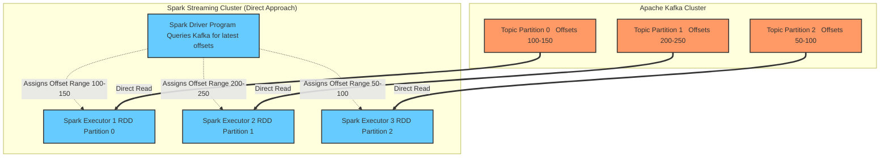

# Kafka Integration

**Integrating Apache Kafka with Spark Streaming provides a highly scalable, distributed publish-subscribe messaging pipeline that guarantees reliable, parallel data ingestion.**

## Why It Matters

In enterprise streaming architectures, directly connecting Spark to TCP sockets or file systems is extremely fragile. What if the Spark cluster goes down? The incoming data stream is lost forever because there is no buffer. 

Apache Kafka solves this by acting as a distributed, fault-tolerant shock absorber. Producers (like web servers or IoT devices) write data to Kafka topics, and Kafka safely persists this data on disk for a configured retention period (e.g., 7 days). Spark Streaming then acts as a Consumer, pulling data from Kafka at its own pace. If Spark crashes and is offline for an hour, it simply wakes up and resumes reading from Kafka exactly where it left off, losing zero data. The Kafka-Spark integration is the industry standard pattern for building resilient data pipelines, offering high throughput and strong "exactly-once" processing semantics when configured correctly.

## How It Works

Kafka organizes data into **Topics**, which are further divided into **Partitions** for parallel processing. Each message in a partition has a sequential ID number called an **Offset**. 

Spark Streaming offers two distinct approaches for reading from Kafka:

**1. The Receiver-based Approach (Legacy):**
In older versions of Spark, integration relied on a Kafka Receiver running continuously on a Spark Executor. The receiver pulled data from Kafka and stored it in Spark's block manager. To ensure zero data loss on executor failure, Spark had to be configured to write this incoming data to a Write-Ahead Log (WAL) in HDFS. This approach was highly inefficient: data was essentially replicated twice (once by Kafka, once by Spark's WAL), and maintaining parallelism required creating multiple DStreams and manually unioning them. 

**2. The Direct Approach (No Receivers):**
Introduced in Spark 1.3, the Direct Approach revolutionized Kafka integration. Instead of using a continuous receiver, Spark queries Kafka periodically to find the latest offsets for each partition. When the micro-batch job runs, Spark Executors read the exact ranges of offsets directly from Kafka (like reading a static file). 
*   *Parallelism:* Spark automatically creates an RDD partition for every Kafka partition. One-to-one mapping.
*   *Exactly-Once Semantics:* Because Spark manages the offsets within its RDD lineage and checkpoints, data is guaranteed to be processed exactly once, even during failures. No WAL is required, drastically improving throughput.
*   *No data duplication:* Spark relies entirely on Kafka's replication for data safety.

In modern applications, **the Direct Approach is universally preferred and recommended.**

## Flow Diagram



## Data Visualization

Comparison of the two Kafka integration methods:

| Feature | Receiver-based Approach | Direct Approach (Recommended) |
| :--- | :--- | :--- |
| **Data Ingestion Method** | Long-running task pushing to memory | Scheduled tasks pulling exact offsets |
| **Fault Tolerance** | Requires Write-Ahead Logs (WAL) in HDFS | Native. Relies on Kafka's retention |
| **Processing Semantics** | At-least-once (may process dupes on crash) | Exactly-once (offsets tied to RDDs) |
| **Parallelism Tuning** | Manual (Create N streams & union them) | Automatic (1 RDD Partition = 1 Kafka Partition) |
| **Performance Overhead** | High (Double replication of data) | Low (Direct read, no WAL) |

## Code Example

This Scala example demonstrates how to use the Direct API to read from Kafka, process the data, and commit the offsets. Note: Requires the `spark-streaming-kafka-0-10` package.

```scala
import org.apache.spark.SparkConf
import org.apache.spark.streaming.{Seconds, StreamingContext}
import org.apache.kafka.clients.consumer.ConsumerRecord
import org.apache.kafka.common.serialization.StringDeserializer
import org.apache.spark.streaming.kafka010._
import org.apache.spark.streaming.kafka010.LocationStrategies.PreferConsistent
import org.apache.spark.streaming.kafka010.ConsumerStrategies.Subscribe

object DirectKafkaIntegration {
  def main(args: Array[String]): Unit = {
    val conf = new SparkConf().setMaster("local[*]").setAppName("KafkaDirectStreaming")
    val ssc = new StreamingContext(conf, Seconds(5))

    // Define Kafka consumer parameters
    val kafkaParams = Map[String, Object](
      "bootstrap.servers" -> "localhost:9092",
      "key.deserializer" -> classOf[StringDeserializer],
      "value.deserializer" -> classOf[StringDeserializer],
      "group.id" -> "spark_streaming_group",
      "auto.offset.reset" -> "latest", // Start reading from the newest messages
      "enable.auto.commit" -> (false: java.lang.Boolean) // Spark will manage offsets manually
    )

    val topics = Array("user_clicks")

    // Create the Direct DStream
    val stream = KafkaUtils.createDirectStream[String, String](
      ssc,
      PreferConsistent,
      Subscribe[String, String](topics, kafkaParams)
    )

    // Process the data: Map to the message value
    stream.foreachRDD { rdd =>
      // Extract offset ranges for this specific batch
      val offsetRanges = rdd.asInstanceOf[HasOffsetRanges].offsetRanges

      // Perform your actual business logic
      val count = rdd.count()
      println(s"Processed $count messages in this batch.")

      // MANUALLY commit offsets to Kafka ONLY AFTER successful processing
      // This ensures exactly-once processing even if the job fails mid-batch
      stream.asInstanceOf[CanCommitOffsets].commitAsync(offsetRanges)
    }

    ssc.start()
    ssc.awaitTermination()
  }
}
```

## Common Pitfalls

*   **Enabling Auto-Commit:** If you leave Kafka's `enable.auto.commit=true`, Kafka will periodically update the offsets in the background, completely ignoring whether Spark actually finished processing the RDD. If Spark crashes, Kafka thinks the data was consumed, leading to data loss. Always set it to `false` and commit manually (as shown in the code) or rely on Spark checkpoints.
*   **Mismatched Parallelism:** With the Direct API, Spark partition count equals Kafka partition count. If you have a Kafka topic with only 1 partition, Spark will process the entire stream on a single executor core, bottlenecking your cluster. You must ensure Kafka topics are partitioned adequately (e.g., 10-30 partitions) to utilize the Spark cluster.
*   **Losing Offsets on Code Updates:** If you rely on Spark Checkpoints to track Kafka offsets, and you change your Spark application code, Spark often cannot recover from the old checkpoint due to serialization changes. The best practice is to manually commit offsets back to Kafka (via `commitAsync`) or save them in an external DB like ZooKeeper/HBase, so you can safely wipe the Spark checkpoint when upgrading code.
*   **Timeouts and Heartbeats:** Spark executors acting as Kafka consumers must send heartbeats. If your RDD processing takes longer than the Kafka `session.timeout.ms`, Kafka assumes the executor died, rebalances the group, and causes cascading failures. Tuning Kafka consumer timeouts is critical for long-running batches.

## Key Takeaway

The Kafka Direct Approach provides a zero-data-loss, exactly-once ingestion pipeline by mapping Kafka partitions directly to Spark RDD partitions, eliminating the need for receivers and write-ahead logs.

<br><br><br><br><br><br><br><br><br><br><br><br><br><br><br><br><br><br><br><br><br><br><br><br><br><br><br><br><br><br><br><br><br><br><br><br><br><br><br><br><br><br><br><br><br><br><br><br><br><br><br><br><br><br><br><br><br><br><br><br><br><br><br><br><br><br><br><br><br><br><br><br><br><br><br><br><br><br><br><br><br><br><br><br><br><br><br><br><br><br><br><br><br><br><br><br><br><br><br><br>


---

## 🎓 Deep Learning Questions

### Q1: Why Was This Concept Introduced?
Historically, streaming frameworks read data directly from network sockets or relied on basic message queues. If a Spark cluster failed, any data transmitted during the downtime was permanently lost, and processing guarantees were mostly "at-most-once." The introduction of Apache Kafka integration—specifically the Direct Approach—solved the critical need for a resilient, highly available buffer between data producers and the Spark processing engine. Kafka stores streaming data reliably on disk for a configured period, allowing Spark to retrieve messages at its own pace. This decoupled architecture overcomes the fragility of synchronous data ingestion, enabling reliable "exactly-once" semantics without needing expensive, duplicate Write-Ahead Logs (WAL) in HDFS.

### Q2: What Exactly Is This Concept and How Does It Work?
Kafka Integration with Spark Streaming connects a highly scalable message broker (Kafka) to a distributed stream processing engine (Spark). In the modern **Direct Approach**, Spark functions as a Kafka consumer but without running a continuous background receiver task. At the start of every micro-batch, the Spark Driver connects to Kafka to check the latest message offsets for each topic partition. It then creates an RDD where each Spark partition maps directly to a Kafka partition (1:1 relationship). Spark executors then read the specified offset ranges directly from Kafka broker logs in parallel. By managing offsets manually or via checkpoints, Spark ensures that each message is processed exactly once, bypassing the complexities of consumer groups and rebalancing.

### Q3: Where Should This Concept Be Used?
This integration is the backbone of modern real-time data pipelines and is heavily utilized across major industries:
- **Uber & Lyft:** Processing real-time GPS coordinates, driver availability, and surge pricing calculations.
- **Netflix:** Collecting real-time telemetry from user devices to feed recommendation engines and monitor application health.
- **Banking:** Fraud detection systems that need to evaluate credit card transactions in milliseconds against historical profiles.
- **E-commerce (Amazon, Walmart):** Real-time inventory updates, dynamic pricing, and clickstream analytics to track user behavior on websites.
- **IoT & Healthcare:** Processing continuous streams of sensor data from medical devices or manufacturing equipment for anomaly detection.

### Q4: Where Should This Concept NOT Be Used?
- **Sub-millisecond Latency Requirements:** Spark Streaming (even Structured Streaming) operates on micro-batches (or continuous mode with limitations). For high-frequency trading where microseconds matter, Apache Flink or Kafka Streams are better alternatives.
- **Simple ETL Tasks:** If you only need to move data from Kafka to S3 without complex aggregations or joins, a lightweight tool like Kafka Connect is far more efficient than spinning up a Spark cluster.
- **Extremely Small Data Volumes:** Using Kafka and Spark for a few messages a minute is overkill and incurs unnecessary operational overhead.
- **Single-Node Applications:** Kafka and Spark are distributed systems designed for scale. If data fits on one machine, use a standard message queue (like RabbitMQ) and a simple Python script.

### Q5: How Is This Concept Different from Hadoop?
| Aspect | Hadoop MapReduce | Apache Spark (with Kafka) |
| :--- | :--- | :--- |
| **Architecture** | Batch processing heavily reliant on HDFS disk I/O. | In-memory processing engine reading from a distributed log. |
| **Performance** | High latency; takes minutes/hours to process. | Low latency; processes data in near real-time (milliseconds/seconds). |
| **Processing Model** | Strictly batch jobs via Map and Reduce phases. | Micro-batch or continuous streaming via DStreams/DataFrames. |
| **Memory Usage** | Minimal; writes intermediate states to disk. | High; utilizes RAM for caching streams and states. |
| **Fault Tolerance** | Re-runs failed tasks from disk blocks. | Recovers from Kafka offsets and RDD lineage. |
| **Scalability** | High, but scales batch jobs only. | High, scales both stream ingestion and processing seamlessly. |
| **Ease of Development** | Complex Java boilerplate for simple tasks. | Concise APIs in Scala, Python, Java, and SQL. |
| **Typical Use Cases** | End-of-day reporting, historical log analysis. | Live dashboards, real-time alerts, fraud detection. |
| **Advantages** | Robust for massive historical datasets. | "Exactly-once" semantics and real-time stateful operations. |
| **Disadvantages** | Cannot handle streaming or real-time data. | Requires careful memory and offset management. |

### Q6: How Can This Concept Be Related to a Traditional RDBMS?
| Spark Streaming & Kafka Concept | Traditional RDBMS Equivalent | Explanation |
| :--- | :--- | :--- |
| **Kafka Topic** | Table | A logical collection of data records. |
| **Kafka Partition** | Table Partition or Shard | Dividing data for parallel access. |
| **Kafka Offset** | Primary Key / Row ID | A unique, sequential identifier for a specific record. |
| **Spark Micro-Batch** | Scheduled Transaction / Stored Procedure | Processing a set of new rows periodically. |
| **Offset Commit** | `COMMIT` Statement | Acknowledging that data has been successfully processed. |
| **Exactly-Once Semantics** | ACID Properties | Guaranteeing processing without duplication or data loss. |

### Q7: What Happens Behind the Scenes?
```text
[Kafka Cluster]
  ├── Partition 0 (Offsets 100-200)
  └── Partition 1 (Offsets 150-250)
         │
         ▼
[Spark Driver]
  1. Queries Kafka for latest offsets (e.g., up to 200 and 250).
  2. Creates a DAG and schedules tasks for the offset ranges.
         │
         ▼
[Spark Executors]
  ├── Executor 1 (Reads Partition 0: 100-200 directly from Kafka broker)
  └── Executor 2 (Reads Partition 1: 150-250 directly from Kafka broker)
         │
         ▼
[Processing & Commit]
  1. Executes transformations (map, filter, reduce).
  2. Writes results to external sink (e.g., Cassandra, HDFS).
  3. Commits successful offsets back to Kafka or a checkpoint directory.
```

### Q8: Performance Considerations, Best Practices, and Common Mistakes
| Category | Recommendation | Why It Matters |
| :--- | :--- | :--- |
| **Performance** | Align Kafka partitions with cluster cores. | Ensures all Spark cores are utilized. 1 Kafka partition = 1 Spark partition. |
| **Best Practice** | Manually commit offsets after the batch succeeds. | Prevents data loss. Using `auto.commit=true` in Kafka may commit before Spark finishes processing. |
| **Best Practice** | Externalize offset storage (e.g., ZooKeeper, HBase). | Spark checkpoints break upon code updates. External offsets allow seamless application upgrades. |
| **Common Mistake** | Ignoring `session.timeout.ms`. | If processing takes too long, Kafka thinks the consumer is dead, causing rebalancing and failures. |
| **Optimization** | Use `LocationStrategies.PreferConsistent`. | Distributes Kafka partitions evenly across available Spark executors for balanced workloads. |

### Q9: Interview Questions

**Beginner**
1. **What is the difference between the Receiver and Direct approach in Spark-Kafka integration?**
   *Answer:* The Receiver approach uses continuous tasks that cache data in memory/WAL, while the Direct approach queries offsets and reads directly from Kafka partitions per micro-batch, offering better performance and exactly-once semantics without WAL.
2. **What does a Kafka offset represent in Spark Streaming?**
   *Answer:* It represents a unique, sequential ID for a message within a Kafka partition, allowing Spark to track exactly which data has been processed.
3. **Why should you disable `enable.auto.commit`?**
   *Answer:* Because Kafka would commit offsets based on a timer, not based on whether Spark actually finished processing the data, leading to potential data loss if Spark crashes.

**Intermediate**
1. **How does Spark achieve exactly-once semantics with the Direct approach?**
   *Answer:* By deterministically mapping Kafka partitions to RDD partitions, managing offsets within its lineage, and allowing manual commits only after a batch successfully completes processing and writing to a sink.
2. **If your Kafka topic has 2 partitions, but your Spark cluster has 10 cores, how many cores will be actively reading from Kafka?**
   *Answer:* Only 2 cores. In the Direct API, Spark partitions strictly equal Kafka partitions. You would need to repartition the RDD after reading to utilize the other 8 cores.
3. **What happens if a Spark executor dies during a micro-batch?**
   *Answer:* The Spark Driver will simply relaunch the failed task on another executor, which will read the exact same offset range from Kafka, ensuring no data is lost or skipped.

**Advanced**
1. **Why might Spark checkpoints be dangerous for storing Kafka offsets in production?**
   *Answer:* Spark checkpoints store serialized Scala/Java objects. If you update your application code, the deserialization of the old checkpoint will fail, forcing you to delete the checkpoint and lose your offset tracking.
2. **Explain the impact of `maxRatePerPartition`.**
   *Answer:* It acts as backpressure, limiting the maximum number of messages Spark will pull per Kafka partition per second, preventing OutOfMemory errors during traffic spikes or when recovering from downtime.
3. **How do you handle schema evolution in a Kafka-Spark pipeline?**
   *Answer:* By utilizing schema registries (like Confluent Schema Registry) with Avro/Protobuf. Spark fetches the schema using the record's schema ID and deserializes it, allowing safe evolution without breaking the streaming job.

**Scenario-Based**
1. **Your Spark Streaming job is falling behind during peak hours. How do you troubleshoot and fix it?**
   *Answer:* I would check the Spark UI to see if processing time exceeds batch duration. Fixes include increasing `spark.executor.instances`, increasing Kafka partitions to allow more parallelism, or setting `spark.streaming.kafka.maxRatePerPartition` to throttle ingestion.
2. **You deployed a new code version and the streaming job crashed on startup complaining about checkpoint deserialization. What is the fix?**
   *Answer:* Delete the old checkpoint directory. To prevent this in the future, I would implement external offset management (e.g., storing offsets in MySQL or ZooKeeper) instead of relying solely on Spark Checkpoints.

### Q10: Complete Real-World Example
**Business Problem:** A retail company wants to track real-time website clicks to detect popular products and feed a live dashboard.
**Sample Dataset:** JSON messages in a Kafka topic `website_clicks` containing `{"user_id": "u123", "product_id": "p456", "timestamp": 1690000000}`.

```python
from pyspark.sql import SparkSession
from pyspark.sql.functions import from_json, col, window
from pyspark.sql.types import StructType, StructField, StringType, TimestampType

# 1. Initialize SparkSession (Structured Streaming is preferred in modern Spark)
spark = SparkSession.builder \
    .appName("RealTimeProductTrending") \
    .config("spark.jars.packages", "org.apache.spark:spark-sql-kafka-0-10_2.12:3.3.0") \
    .getOrCreate()

spark.sparkContext.setLogLevel("WARN")

# Define schema for the incoming JSON
schema = StructType([
    StructField("user_id", StringType(), True),
    StructField("product_id", StringType(), True),
    StructField("timestamp", TimestampType(), True)
])

# 2. Read from Kafka (Direct Approach under the hood in Structured Streaming)
df = spark.readStream \
    .format("kafka") \
    .option("kafka.bootstrap.servers", "localhost:9092") \
    .option("subscribe", "website_clicks") \
    .option("startingOffsets", "latest") \
    .load()

# 3. Process Data
# Kafka values are binary, cast to string and parse JSON
parsed_df = df.selectExpr("CAST(value AS STRING)") \
    .select(from_json(col("value"), schema).alias("data")) \
    .select("data.*")

# Calculate trending products over a 1-minute sliding window
trending_df = parsed_df \
    .withWatermark("timestamp", "2 minutes") \
    .groupBy(window(col("timestamp"), "1 minute"), col("product_id")) \
    .count()

# 4. Write to Console (In production, write to a fast DB like Cassandra/Redis)
query = trending_df.writeStream \
    .outputMode("update") \
    .format("console") \
    .option("truncate", "false") \
    .trigger(processingTime="10 seconds") \
    .start()

query.awaitTermination()
```
*Execution Walkthrough:* Spark connects to Kafka on `localhost:9092`. Every 10 seconds, it reads the newest bytes from `website_clicks`, casts them to JSON, groups clicks by product and a 1-minute time window, and prints updated counts to the console.
*Performance Notes:* The `withWatermark` handles late-arriving data and prevents memory leaks by dropping old state.

### 💡 Key Takeaways
- The Direct Approach maps Kafka partitions to Spark partitions 1:1.
- Never use `auto.commit=true`; manage offsets manually for exactly-once processing.
- Direct integration avoids duplicate data storage (no HDFS WAL required).
- External offset storage is safer than Spark checkpoints for seamless code upgrades.
- Backpressure (`maxRatePerPartition`) prevents memory exhaustion during lag spikes.

### ⚠️ Common Misconceptions
- *Misconception:* Spark automatically handles Kafka partition increases. *Reality:* You must restart the context or carefully manage offsets for new partitions to be picked up.
- *Misconception:* Checkpointing is enough for fault tolerance. *Reality:* Checkpoints serialize code; updating application code usually breaks checkpoint recovery.
- *Misconception:* More Spark executors guarantee faster Kafka reads. *Reality:* Read parallelism is hard-capped by the number of Kafka topic partitions.

### 🔗 Related Spark Concepts
- Spark Structured Streaming
- Spark Checkpointing & Write-Ahead Logs (WAL)
- RDD Lineage and Fault Tolerance
- DStreams (Discretized Streams)

### 📚 References for Further Reading
- Apache Spark Official Documentation
- Learning Spark (O'Reilly)
- Spark: The Definitive Guide (O'Reilly)
