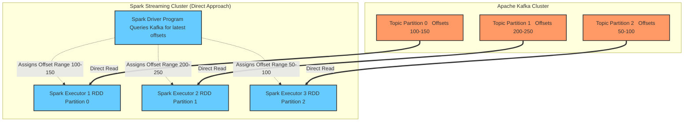

# Kafka Integration

**Integrating Apache Kafka with Spark Streaming provides a highly scalable, distributed publish-subscribe messaging pipeline that guarantees reliable, parallel data ingestion.**

## Why It Matters

In enterprise streaming architectures, directly connecting Spark to TCP sockets or file systems is extremely fragile. What if the Spark cluster goes down? The incoming data stream is lost forever because there is no buffer. 

Apache Kafka solves this by acting as a distributed, fault-tolerant shock absorber. Producers (like web servers or IoT devices) write data to Kafka topics, and Kafka safely persists this data on disk for a configured retention period (e.g., 7 days). Spark Streaming then acts as a Consumer, pulling data from Kafka at its own pace. If Spark crashes and is offline for an hour, it simply wakes up and resumes reading from Kafka exactly where it left off, losing zero data. The Kafka-Spark integration is the industry standard pattern for building resilient data pipelines, offering high throughput and strong "exactly-once" processing semantics when configured correctly.

## How It Works

Kafka organizes data into **Topics**, which are further divided into **Partitions** for parallel processing. Each message in a partition has a sequential ID number called an **Offset**. 

Spark Streaming offers two distinct approaches for reading from Kafka:

**1. The Receiver-based Approach (Legacy):**
In older versions of Spark, integration relied on a Kafka Receiver running continuously on a Spark Executor. The receiver pulled data from Kafka and stored it in Spark's block manager. To ensure zero data loss on executor failure, Spark had to be configured to write this incoming data to a Write-Ahead Log (WAL) in HDFS. This approach was highly inefficient: data was essentially replicated twice (once by Kafka, once by Spark's WAL), and maintaining parallelism required creating multiple DStreams and manually unioning them. 

**2. The Direct Approach (No Receivers):**
Introduced in Spark 1.3, the Direct Approach revolutionized Kafka integration. Instead of using a continuous receiver, Spark queries Kafka periodically to find the latest offsets for each partition. When the micro-batch job runs, Spark Executors read the exact ranges of offsets directly from Kafka (like reading a static file). 
*   *Parallelism:* Spark automatically creates an RDD partition for every Kafka partition. One-to-one mapping.
*   *Exactly-Once Semantics:* Because Spark manages the offsets within its RDD lineage and checkpoints, data is guaranteed to be processed exactly once, even during failures. No WAL is required, drastically improving throughput.
*   *No data duplication:* Spark relies entirely on Kafka's replication for data safety.

In modern applications, **the Direct Approach is universally preferred and recommended.**

## Flow Diagram



## Data Visualization

Comparison of the two Kafka integration methods:

| Feature | Receiver-based Approach | Direct Approach (Recommended) |
| :--- | :--- | :--- |
| **Data Ingestion Method** | Long-running task pushing to memory | Scheduled tasks pulling exact offsets |
| **Fault Tolerance** | Requires Write-Ahead Logs (WAL) in HDFS | Native. Relies on Kafka's retention |
| **Processing Semantics** | At-least-once (may process dupes on crash) | Exactly-once (offsets tied to RDDs) |
| **Parallelism Tuning** | Manual (Create N streams & union them) | Automatic (1 RDD Partition = 1 Kafka Partition) |
| **Performance Overhead** | High (Double replication of data) | Low (Direct read, no WAL) |

## Code Example

This Scala example demonstrates how to use the Direct API to read from Kafka, process the data, and commit the offsets. Note: Requires the `spark-streaming-kafka-0-10` package.

```scala
import org.apache.spark.SparkConf
import org.apache.spark.streaming.{Seconds, StreamingContext}
import org.apache.kafka.clients.consumer.ConsumerRecord
import org.apache.kafka.common.serialization.StringDeserializer
import org.apache.spark.streaming.kafka010._
import org.apache.spark.streaming.kafka010.LocationStrategies.PreferConsistent
import org.apache.spark.streaming.kafka010.ConsumerStrategies.Subscribe

object DirectKafkaIntegration {
  def main(args: Array[String]): Unit = {
    val conf = new SparkConf().setMaster("local[*]").setAppName("KafkaDirectStreaming")
    val ssc = new StreamingContext(conf, Seconds(5))

    // Define Kafka consumer parameters
    val kafkaParams = Map[String, Object](
      "bootstrap.servers" -> "localhost:9092",
      "key.deserializer" -> classOf[StringDeserializer],
      "value.deserializer" -> classOf[StringDeserializer],
      "group.id" -> "spark_streaming_group",
      "auto.offset.reset" -> "latest", // Start reading from the newest messages
      "enable.auto.commit" -> (false: java.lang.Boolean) // Spark will manage offsets manually
    )

    val topics = Array("user_clicks")

    // Create the Direct DStream
    val stream = KafkaUtils.createDirectStream[String, String](
      ssc,
      PreferConsistent,
      Subscribe[String, String](topics, kafkaParams)
    )

    // Process the data: Map to the message value
    stream.foreachRDD { rdd =>
      // Extract offset ranges for this specific batch
      val offsetRanges = rdd.asInstanceOf[HasOffsetRanges].offsetRanges

      // Perform your actual business logic
      val count = rdd.count()
      println(s"Processed $count messages in this batch.")

      // MANUALLY commit offsets to Kafka ONLY AFTER successful processing
      // This ensures exactly-once processing even if the job fails mid-batch
      stream.asInstanceOf[CanCommitOffsets].commitAsync(offsetRanges)
    }

    ssc.start()
    ssc.awaitTermination()
  }
}
```

## Common Pitfalls

*   **Enabling Auto-Commit:** If you leave Kafka's `enable.auto.commit=true`, Kafka will periodically update the offsets in the background, completely ignoring whether Spark actually finished processing the RDD. If Spark crashes, Kafka thinks the data was consumed, leading to data loss. Always set it to `false` and commit manually (as shown in the code) or rely on Spark checkpoints.
*   **Mismatched Parallelism:** With the Direct API, Spark partition count equals Kafka partition count. If you have a Kafka topic with only 1 partition, Spark will process the entire stream on a single executor core, bottlenecking your cluster. You must ensure Kafka topics are partitioned adequately (e.g., 10-30 partitions) to utilize the Spark cluster.
*   **Losing Offsets on Code Updates:** If you rely on Spark Checkpoints to track Kafka offsets, and you change your Spark application code, Spark often cannot recover from the old checkpoint due to serialization changes. The best practice is to manually commit offsets back to Kafka (via `commitAsync`) or save them in an external DB like ZooKeeper/HBase, so you can safely wipe the Spark checkpoint when upgrading code.
*   **Timeouts and Heartbeats:** Spark executors acting as Kafka consumers must send heartbeats. If your RDD processing takes longer than the Kafka `session.timeout.ms`, Kafka assumes the executor died, rebalances the group, and causes cascading failures. Tuning Kafka consumer timeouts is critical for long-running batches.

## Key Takeaway

The Kafka Direct Approach provides a zero-data-loss, exactly-once ingestion pipeline by mapping Kafka partitions directly to Spark RDD partitions, eliminating the need for receivers and write-ahead logs.

<br><br><br><br><br><br><br><br><br><br><br><br><br><br><br><br><br><br><br><br><br><br><br><br><br><br><br><br><br><br><br><br><br><br><br><br><br><br><br><br><br><br><br><br><br><br><br><br><br><br><br><br><br><br><br><br><br><br><br><br><br><br><br><br><br><br><br><br><br><br><br><br><br><br><br><br><br><br><br><br><br><br><br><br><br><br><br><br><br><br><br><br><br><br><br><br><br><br><br><br>
