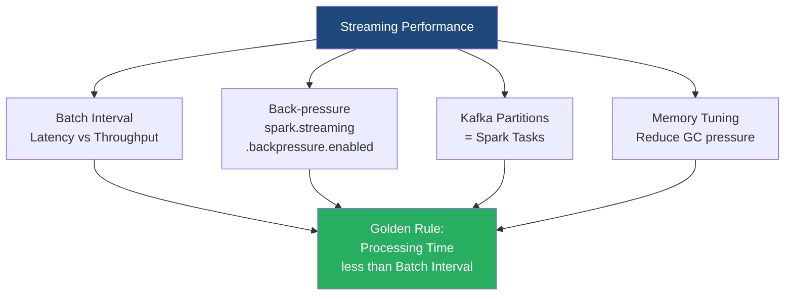

# Spark Streaming Performance Tuning

**Tuning a Spark Streaming application is a delicate balancing act to ensure the cluster can ingest, process, and output data faster than the data arrives, maintaining system stability.**

## Why It Matters

In a traditional batch job, if a process takes 4 hours instead of 3, the worst outcome is a delayed report. In Spark Streaming, if a 5-second micro-batch takes 6 seconds to process, the system is doomed. 

Because data is arriving continuously, processing delays accumulate. The second batch will wait 1 second to start, the third will wait 2 seconds, and soon the application will have a massive backlog. This is known as "falling behind." Eventually, the executor memory fills up with queued data, garbage collection halts the JVM, and the application crashes with an `OutOfMemoryError`. Performance tuning matters because a streaming application *must* run 24/7 without intervention. Achieving that stability requires careful configuration of batch intervals, memory management, parallelism, and back-pressure mechanisms.

## How It Works

The **Golden Rule of Spark Streaming** is: *Processing Time must be strictly less than Batch Interval.* 
If your Batch Interval is set to 2 seconds, your code must finish executing in less than 2 seconds, every single time.

**1. Setting the Right Batch Interval:** 
The batch interval dictates latency. While a 500ms interval gives low latency, it incurs massive scheduling overhead. Every batch requires the Driver to construct a DAG, serialize tasks, and dispatch them to executors. If the interval is too small, this overhead consumes the majority of the time. The rule of thumb is to start with a conservative interval (e.g., 5 to 10 seconds). Monitor the Spark UI. If the processing time is consistently much lower than the batch interval, you can safely reduce the interval.

**2. Tuning Parallelism:**
A cluster's power lies in concurrent execution.
*   *For Kafka Direct Streams:* The number of Spark tasks equals the number of Kafka partitions. If your Kafka topic has 3 partitions, your cluster will only use 3 cores, no matter how large the cluster is. Increase Kafka partitions to increase read parallelism.
*   *For Data Processing:* If operations like `reduceByKey` are creating too few partitions, explicitly pass a higher partition count: `reduceByKey(func, numPartitions=50)` or use `dstream.repartition(N)` to spread the workload across more cores.

**3. Memory and Garbage Collection (GC):**
Streaming generates massive amounts of short-lived objects (data arriving, RDDs forming, then being discarded). This puts enormous pressure on Java's Garbage Collector. Long "Stop-The-World" GC pauses will easily push your processing time over the batch interval. Best practices include using Kryo Serialization (which is much faster and smaller than Java serialization) and tuning the CMS (Concurrent Mark Sweep) or G1 Garbage Collector to clear old data proactively.

**4. Back-Pressure Mechanism:**
What happens if a sudden, unexpected spike in traffic hits your system? For instance, traffic triples for 5 minutes. Without safeguards, Spark will ingest all of it, run out of memory, and crash. Spark 1.5 introduced **Back-Pressure** (`spark.streaming.backpressure.enabled = true`). When enabled, Spark dynamically monitors its own processing times and scheduling delays. If it senses it is falling behind, it automatically signals the receivers (or Kafka integration) to throttle the ingestion rate, deliberately slowing down data intake to a manageable level until the spike passes.

## Flow Diagram



## Data Visualization

Understanding the Spark Streaming UI metrics. These three metrics are critical to monitor:

| Metric Name | What It Means | Healthy State | Danger State (Action Needed) |
| :--- | :--- | :--- | :--- |
| **Processing Time** | The time it took to actually process the data in the batch. | `0.5x to 0.7x` of Batch Interval | `> 1.0x` Batch Interval |
| **Scheduling Delay** | Time the batch waited in the queue before execution started. | `~0 ms` (Immediate start) | Increasing continuously over time |
| **Total Delay** | Scheduling Delay + Processing Time | `Total Delay < Batch Interval` | Continuously growing (queue building) |

*If Scheduling Delay is constantly increasing, your application has officially "fallen behind" and will eventually crash.*

## Code Example

This code snippet highlights the critical configuration flags required to tune a Spark Streaming application for production deployment.

```scala
import org.apache.spark.SparkConf
import org.apache.spark.streaming.{Seconds, StreamingContext}

object StreamingTuningApp {
  def main(args: Array[String]): Unit = {
    
    // Create Spark configuration with tuning parameters
    val conf = new SparkConf()
      .setAppName("HighPerformanceStreaming")
      .setMaster("yarn") // Run on a cluster manager
      
      // 1. ENABLE BACKPRESSURE: The most critical setting for stability
      .set("spark.streaming.backpressure.enabled", "true")
      
      // 2. Set an initial max rate to avoid startup spikes (e.g., max 1000 records/sec/partition)
      .set("spark.streaming.kafka.maxRatePerPartition", "1000")
      
      // 3. Serialization: Use Kryo for much smaller memory footprint
      .set("spark.serializer", "org.apache.spark.serializer.KryoSerializer")
      
      // 4. Garbage Collection tuning (pass to executors)
      // Use G1GC which is excellent for keeping pause times predictable
      .set("spark.executor.extraJavaOptions", "-XX:+UseG1GC -XX:MaxGCPauseMillis=200")
      
      // 5. Memory Configuration (ensure enough memory for buffering)
      // By default Spark allocates 60% of memory for caching. 
      // If you do heavy aggregations, you might need more execution memory.
      .set("spark.memory.fraction", "0.6")

    // Set batch interval conservatively based on expected SLA
    // E.g., 10 seconds provides high throughput with manageable latency
    val ssc = new StreamingContext(conf, Seconds(10))

    // ... define DStreams and transformations ...

    ssc.start()
    ssc.awaitTermination()
  }
}
```

## Common Pitfalls

*   **Ignoring the Streaming UI:** Deploying a streaming app without aggressively monitoring the "Streaming" tab in the Spark UI for the first 24 hours. The UI explicitly plots Processing Time vs. Batch Interval. If they cross, you have a problem.
*   **Assuming More Cores Solves Everything:** If your processing time is too high, adding 100 cores won't help if your data is skewed (all data sitting in one partition) or if you are using Kafka with only 2 partitions. Parallelism must be balanced across the data layer.
*   **Using Default Java Serialization:** Spark uses standard Java serialization by default, which is notoriously slow and creates massive object bloat in memory. Not switching to Kryo in a streaming context leads to rapid memory exhaustion and long GC pauses.
*   **Caching DStreams Unnecessarily:** Calling `.cache()` or `.persist()` on a DStream forces Spark to keep those RDDs in memory. If you aren't reusing the DStream multiple times in the same batch, caching provides zero benefit and actively steals memory from the execution engine, increasing GC pressure.

## Key Takeaway

A stable streaming application requires strict adherence to the golden rule—processing time must remain below the batch interval—which is achieved by tuning parallelism, optimizing garbage collection, and enabling dynamic backpressure.

<br><br><br><br><br><br><br><br><br><br><br><br><br><br><br><br><br><br><br><br><br><br><br><br><br><br><br><br><br><br><br><br><br><br><br><br><br><br><br><br><br><br><br><br><br><br><br><br><br><br><br><br><br><br><br><br><br><br><br><br><br><br><br><br><br><br><br><br><br><br><br><br><br><br><br><br><br><br><br><br><br><br><br><br><br><br><br><br><br><br><br><br><br><br><br><br><br><br><br><br>


---

## 🎓 Deep Learning Questions

### Q1: Why Was This Concept Introduced?
Before the introduction of dynamic performance tuning in Spark Streaming, processing streaming data reliably was a massive operational headache. Traditional streaming engines struggled with sudden spikes in incoming data. If traffic surged unexpectedly, Spark would blindly ingest all the incoming records. This would overload the executors, fill up memory, trigger intense Garbage Collection (GC) pauses, and eventually cause the application to crash with an `OutOfMemoryError`. 

Spark introduced features like **Backpressure** and **Kryo Serialization**, along with granular configuration parameters, to overcome these limitations. Backpressure allows Spark to dynamically calculate the maximum rate at which it can ingest data based on its current processing speed. Performance tuning was introduced to transform Spark from a rigid processing engine into an elastic, self-regulating system capable of running 24/7 without manual intervention.

### Q2: What Exactly Is This Concept and How Does It Work?
Spark Streaming Performance Tuning is the process of optimizing a streaming application so that its **Processing Time is consistently lower than its Batch Interval**. This ensures that the system never falls behind and data doesn't queue up indefinitely.

It works by adjusting several interconnected layers:
1.  **Batch Interval Configuration:** Setting the time window (e.g., 5 seconds) to balance scheduling overhead with latency.
2.  **Parallelism Optimization:** Aligning the number of Spark partitions with the number of input partitions (e.g., Kafka partitions) so that all CPU cores are utilized efficiently.
3.  **Backpressure Mechanism:** A PID (Proportional-Integral-Derivative) controller inside Spark continuously monitors scheduling delays and processing times. If it detects a slowdown, it signals the receivers to ingest less data.
4.  **Memory Management:** Tuning Garbage Collection (using G1GC) and serialization (Kryo) to reduce the memory footprint of short-lived objects created during each micro-batch.

### Q3: Where Should This Concept Be Used?
Performance tuning is absolutely mandatory for **any production-grade Spark Streaming application** running continuously. 
-   **Financial Services (e.g., Banking, Fraud Detection):** Applications must process millions of transactions per second with strict latency SLAs. If a fraud detection stream crashes due to memory limits during a Black Friday spike, fraudulent transactions slip through.
-   **Ride-Sharing (e.g., Uber, Lyft):** Processing GPS telemetry from millions of drivers in real-time to calculate surge pricing. Sudden surges in traffic (e.g., after a concert) require backpressure to keep the system stable.
-   **E-Commerce (e.g., Amazon, Retail):** Monitoring clickstreams and shopping carts. During flash sales, backpressure ensures the analytics dashboard keeps running, albeit slightly delayed, instead of crashing completely.

### Q4: Where Should This Concept NOT Be Used?
While tuning is essential, certain configurations should **not** be used blindly:
-   **Batch Jobs:** Streaming parameters like `spark.streaming.backpressure.enabled` have absolutely no effect on traditional batch jobs (Spark Core/SQL).
-   **Ultra-Low Latency Systems (Sub-millisecond):** Spark Streaming (Micro-batching) cannot achieve sub-millisecond latency no matter how much you tune it, due to scheduling overhead. If you need hardware-level latency, use Apache Flink or Apache Storm instead.
-   **Over-parallelization:** Do not arbitrarily increase `repartition(1000)` on a small data stream. The overhead of managing 1000 tiny partitions will severely degrade performance and cause task scheduling delays.

### Q5: How Is This Concept Different from Hadoop?
| Aspect | Hadoop MapReduce | Apache Spark Streaming Tuning |
| :--- | :--- | :--- |
| **Architecture** | Disk-based, batch-oriented. | Memory-centric, micro-batch streaming. |
| **Performance** | High latency; tuning focuses on disk I/O and mapper/reducer counts. | Low latency; tuning focuses on memory, GC, and batch intervals. |
| **Processing Model** | Static map and reduce phases. | Continuous execution of DAGs every few seconds. |
| **Memory Usage** | Writes intermediate data to disk, low GC pressure. | Keeps intermediate data in RAM, extreme GC pressure. |
| **Fault Tolerance** | Replicates data to HDFS at every step. | Recomputes lost partitions using lineage and Checkpointing. |
| **Scalability** | Adds nodes for faster batch completion. | Adds nodes/partitions to handle higher events-per-second (EPS). |
| **Typical Use Cases** | End-of-day ETL, historical aggregations. | Real-time fraud detection, live dashboards. |

### Q6: How Can This Concept Be Related to a Traditional RDBMS?
| Spark Streaming Concept | Traditional RDBMS Equivalent | Explanation |
| :--- | :--- | :--- |
| **Batch Interval** | Transaction Commit Frequency | How often data is committed and processed as a single logical block. |
| **Backpressure** | Connection Pooling / Throttling | Limiting incoming requests to prevent the database from being overwhelmed. |
| **Kafka Partitions to Tasks** | Table Sharding / Partitioning | Distributing data across multiple physical disks/nodes for parallel reads. |
| **Garbage Collection Pauses** | Table Locks / Vacuuming | System maintenance tasks that temporarily halt processing. |
| **Kryo Serialization** | Binary Data Formats (e.g., BSON) | Compressing data representation in memory for faster access. |

### Q7: What Happens Behind the Scenes?
When a tuned Spark Streaming application runs, the execution follows this path:

1.  **Rate Calculation (Driver):** If Backpressure is enabled, the RateController analyzes the completion time of the previous batch.
2.  **Ingestion (Receivers/Direct API):** The system fetches data (e.g., from Kafka), strictly adhering to the calculated maximum rate per partition.
3.  **DAG Generation (Driver):** The driver creates a DAG of transformations for the incoming micro-batch.
4.  **Task Dispatch (Scheduler):** Tasks are serialized (using Kryo if configured) and sent to Executors.
5.  **Parallel Execution (Executors):** Cores process the data. Efficient GC (like G1GC) runs in the background to clean up discarded objects.
6.  **Metric Reporting:** Executors report processing times back to the Driver, closing the feedback loop for the next batch.

```text
[Incoming Data Spikes] 
        |
        v
+---------------------------------------------------+
|                  Spark Driver                     |
|  1. RateController calculates safe intake rate    |
|  2. Signals Kafka Direct Stream to throttle       |
+---------------------------------------------------+
        | (Requests controlled batch size)
        v
+---------------------------------------------------+
|               Kafka Cluster                       |
|  Reads Partitions 1, 2, 3 at throttled speed      |
+---------------------------------------------------+
        |
        v
+---------------------------------------------------+
|               Spark Executors                     |
|  Task 1 (Core 1) -> Processes P1 (Kryo + G1GC)    |
|  Task 2 (Core 2) -> Processes P2 (Kryo + G1GC)    |
|  Task 3 (Core 3) -> Processes P3 (Kryo + G1GC)    |
+---------------------------------------------------+
        |
        v
[Output / Sink (e.g., Cassandra, S3)]
```

### Q8: Performance Considerations, Best Practices, and Common Mistakes
| Category | Recommendation | Why It Matters |
| :--- | :--- | :--- |
| **Backpressure** | Always enable `spark.streaming.backpressure.enabled`. | Prevents OOM crashes during sudden traffic spikes. |
| **Serialization** | Set `spark.serializer` to `KryoSerializer`. | Java serialization is bloated and slow; Kryo reduces memory footprint and network I/O. |
| **Garbage Collection** | Use `-XX:+UseG1GC` in `spark.executor.extraJavaOptions`. | Prevents long Stop-The-World pauses that can cause batch scheduling delays. |
| **Parallelism** | Match Kafka partitions to cluster cores. | If you have 20 cores but only 2 Kafka partitions, 18 cores will sit idle. |
| **Windowing** | Use Checkpointing when using stateful operations. | Prevents the lineage graph from growing infinitely, which would eventually crash the Driver. |
| **Common Mistake** | Setting the Batch Interval too low (< 1 sec). | Scheduling overhead dominates processing time, leading to queue buildup. |

### Q9: Interview Questions

**Beginner**
1.  **What is the Golden Rule of Spark Streaming?**
    *Answer:* Processing time must always be strictly less than the batch interval.
2.  **Why should you enable Backpressure?**
    *Answer:* It dynamically throttles the ingestion rate during traffic spikes to prevent the application from running out of memory and crashing.
3.  **What is the impact of setting a batch interval to 100 milliseconds?**
    *Answer:* It will likely cause the application to fail because the overhead of task scheduling and DAG generation will take longer than the interval itself.

**Intermediate**
4.  **How does Spark Streaming parallelism relate to Kafka?**
    *Answer:* When using the Kafka Direct API, Spark creates exactly one task per Kafka partition. You must increase Kafka partitions to achieve higher read parallelism.
5.  **Why is Garbage Collection (GC) a major concern in Spark Streaming?**
    *Answer:* Streaming applications run 24/7 and generate millions of short-lived objects per micro-batch. Inefficient GC causes long pauses, delaying processing and causing batches to queue up.
6.  **Why should you use Kryo over default Java serialization?**
    *Answer:* Kryo is significantly faster and more compact, reducing the memory footprint of RDDs and lowering network transmission times during shuffles.

**Advanced**
7.  **If `Scheduling Delay` is continuously increasing in the Spark UI, what exactly is happening and how do you fix it?**
    *Answer:* The application has "fallen behind"—processing takes longer than the batch interval. Fix it by enabling backpressure, increasing parallelism, optimizing code, or increasing the batch interval.
8.  **How does the PID RateController work in Spark Streaming Backpressure?**
    *Answer:* It uses a Proportional-Integral-Derivative algorithm to monitor processing times and scheduling delays, estimating the exact number of records the system can safely process in the next batch to maintain stability.
9.  **Can adding more executor memory solve a "falling behind" issue?**
    *Answer:* Usually, no. Adding memory only delays the inevitable crash by providing a larger buffer for queued batches. It does not speed up processing. You must fix the root cause (parallelism, bad joins, GC issues).

**Scenario-Based**
10. **You deployed a Spark Streaming job that runs fine for 5 days but crashes every Saturday evening. How do you troubleshoot this?**
    *Answer:* Look at the Spark UI around the crash time. Likely, a traffic spike occurs on Saturday evening, increasing processing time beyond the batch interval. Enable backpressure, check if data skew is occurring on Saturdays, and ensure Kafka partitions allow enough parallelism.
11. **Your streaming job has 50 executors (200 cores), but the UI shows only 4 tasks running at a time. What is the problem?**
    *Answer:* The source only has 4 partitions (e.g., a Kafka topic with 4 partitions). Spark is limited by source partitions during ingestion. You must increase the source partitions or explicitly call `repartition()` after ingestion.

### Q10: Complete Real-World Example

**Business Problem:** 
Netflix needs to monitor real-time playback errors from millions of smart TVs to detect widespread outages. During a major show release, traffic can spike 10x. The streaming job must remain stable and calculate error rates per region without crashing.

**Sample Dataset (Kafka JSON Messages):**
```json
{"device_id": "TV-992", "region": "US-East", "event_type": "BUFFERING_ERROR", "timestamp": 1691234567}
{"device_id": "TV-104", "region": "EU-West", "event_type": "PLAYBACK_SUCCESS", "timestamp": 1691234568}
```

**Full Working PySpark Code:**
```python
from pyspark.sql import SparkSession
from pyspark.sql.functions import col, from_json, window
from pyspark.sql.types import StructType, StructField, StringType, TimestampType

# 1. Initialize SparkSession with crucial tuning parameters
spark = SparkSession.builder \\
    .appName("NetflixRealTimeErrorMonitor") \\
    .config("spark.streaming.backpressure.enabled", "true") \\
    .config("spark.streaming.kafka.maxRatePerPartition", "5000") \\
    .config("spark.serializer", "org.apache.spark.serializer.KryoSerializer") \\
    .config("spark.executor.extraJavaOptions", "-XX:+UseG1GC -XX:MaxGCPauseMillis=100") \\
    .config("spark.sql.shuffle.partitions", "24") \\
    .getOrCreate()

# Suppress verbose logging
spark.sparkContext.setLogLevel("WARN")

# Define schema for the incoming JSON data
schema = StructType([
    StructField("device_id", StringType(), True),
    StructField("region", StringType(), True),
    StructField("event_type", StringType(), True),
    StructField("timestamp", TimestampType(), True)
])

# 2. Read from Kafka (Structured Streaming)
# Backpressure limits ingestion naturally based on processing capability
df = spark.readStream \\
    .format("kafka") \\
    .option("kafka.bootstrap.servers", "localhost:9092") \\
    .option("subscribe", "playback_events") \\
    .option("startingOffsets", "latest") \\
    .load()

# 3. Parse JSON and Extract fields
parsed_df = df.selectExpr("CAST(value AS STRING)") \\
    .select(from_json(col("value"), schema).alias("data")) \\
    .select("data.*")

# 4. Filter for errors and aggregate by region over a 1-minute window
error_counts = parsed_df \\
    .filter(col("event_type").contains("ERROR")) \\
    .withWatermark("timestamp", "2 minutes") \\
    .groupBy(
        window(col("timestamp"), "1 minute"),
        col("region")
    ).count()

# 5. Output to Console (In production, this would go to a database like Cassandra or Redis)
# A 10-second trigger interval is conservative enough to prevent scheduling overhead
query = error_counts.writeStream \\
    .outputMode("update") \\
    .format("console") \\
    .option("truncate", "false") \\
    .trigger(processingTime="10 seconds") \\
    .start()

query.awaitTermination()
```

**Step-by-step execution walkthrough:**
1. **Configuration:** The `SparkSession` is loaded with G1GC for low-pause garbage collection, Kryo serialization, and Backpressure enabled. `maxRatePerPartition` limits the initial surge of data.
2. **Ingestion:** Structured Streaming continuously polls Kafka. If it falls behind, backpressure automatically scales back the request size per partition.
3. **Parsing:** Raw binary data from Kafka is cast to JSON using the predefined schema.
4. **Aggregation:** We filter for errors and group by `region` and a 1-minute `window`. Watermarking is applied to handle late-arriving data and clean up old state memory.
5. **Trigger:** Every 10 seconds, Spark initiates a micro-batch execution, outputting updated error counts to the console.

**Expected Output (Console):**
```text
-------------------------------------------
Batch: 1
-------------------------------------------
+------------------------------------------+-------+-----+
|window                                    |region |count|
+------------------------------------------+-------+-----+
|{2023-08-05 10:15:00, 2023-08-05 10:16:00}|US-East| 142 |
|{2023-08-05 10:15:00, 2023-08-05 10:16:00}|EU-West| 89  |
+------------------------------------------+-------+-----+
```

**Performance Notes:**
- Setting `spark.sql.shuffle.partitions` to 24 (instead of the default 200) prevents creating too many tiny files and scheduling overhead for a moderate data stream.
- Watermarking is absolutely critical; without it, the memory used by stateful aggregations (like windowing) will grow indefinitely.

**When this approach is best:**
This setup is ideal for 24/7 telemetry ingestion, alerting systems, and real-time dashboards where stability during unexpected traffic surges is far more important than achieving millisecond latency.

### 💡 Key Takeaways
- The Golden Rule: Processing Time must be strictly less than the Batch Interval.
- Backpressure (`spark.streaming.backpressure.enabled`) is the most important defense against traffic spikes and OutOfMemory crashes.
- Parallelism during ingestion is bound by the number of partitions in the source (e.g., Kafka partitions).
- Garbage Collection (GC) pauses are a silent killer of streaming apps; always use `G1GC`.
- Default Java serialization is slow; always switch to `KryoSerializer` for streaming.
- Caching is useless and harmful in streaming unless the DStream is reused multiple times within the exact same micro-batch.

### ⚠️ Common Misconceptions
- **"Adding more memory fixes slow streams."** Wrong. It just delays the OutOfMemory crash. You must fix parallelism or code efficiency.
- **"Adding more worker nodes will automatically speed up Kafka reads."** Wrong. If Kafka has 3 partitions, only 3 tasks (cores) will read data, even if you have 100 worker nodes.
- **"Batch intervals should be as small as possible."** Wrong. Very small intervals (e.g., < 1 sec) cause scheduling overhead to dominate, degrading performance.

### 🔗 Related Spark Concepts
- Spark Structured Streaming
- Kafka Integration with Spark
- DStream RDD Lineage and Checkpointing
- Spark Memory Management (Execution vs Storage Memory)
- Spark Shuffle Tuning

### 📚 References for Further Reading
- Apache Spark Official Documentation (Streaming Programming Guide)
- Learning Spark (O'Reilly)
- Spark: The Definitive Guide (O'Reilly)
