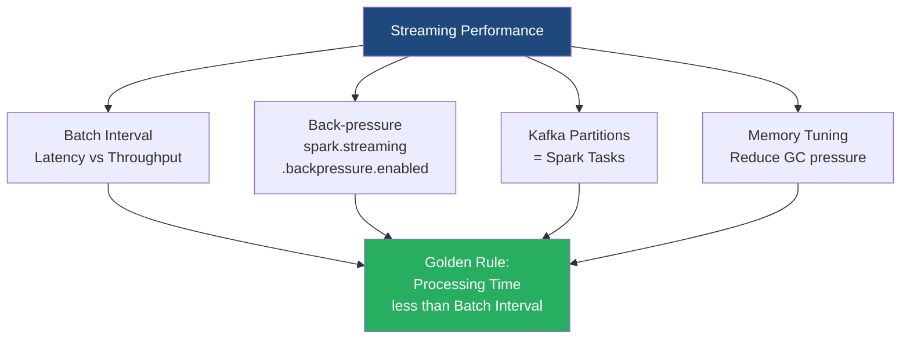

# Spark Streaming Performance Tuning

**Tuning a Spark Streaming application is a delicate balancing act to ensure the cluster can ingest, process, and output data faster than the data arrives, maintaining system stability.**

## Why It Matters

In a traditional batch job, if a process takes 4 hours instead of 3, the worst outcome is a delayed report. In Spark Streaming, if a 5-second micro-batch takes 6 seconds to process, the system is doomed. 

Because data is arriving continuously, processing delays accumulate. The second batch will wait 1 second to start, the third will wait 2 seconds, and soon the application will have a massive backlog. This is known as "falling behind." Eventually, the executor memory fills up with queued data, garbage collection halts the JVM, and the application crashes with an `OutOfMemoryError`. Performance tuning matters because a streaming application *must* run 24/7 without intervention. Achieving that stability requires careful configuration of batch intervals, memory management, parallelism, and back-pressure mechanisms.

## How It Works

The **Golden Rule of Spark Streaming** is: *Processing Time must be strictly less than Batch Interval.* 
If your Batch Interval is set to 2 seconds, your code must finish executing in less than 2 seconds, every single time.

**1. Setting the Right Batch Interval:** 
The batch interval dictates latency. While a 500ms interval gives low latency, it incurs massive scheduling overhead. Every batch requires the Driver to construct a DAG, serialize tasks, and dispatch them to executors. If the interval is too small, this overhead consumes the majority of the time. The rule of thumb is to start with a conservative interval (e.g., 5 to 10 seconds). Monitor the Spark UI. If the processing time is consistently much lower than the batch interval, you can safely reduce the interval.

**2. Tuning Parallelism:**
A cluster's power lies in concurrent execution.
*   *For Kafka Direct Streams:* The number of Spark tasks equals the number of Kafka partitions. If your Kafka topic has 3 partitions, your cluster will only use 3 cores, no matter how large the cluster is. Increase Kafka partitions to increase read parallelism.
*   *For Data Processing:* If operations like `reduceByKey` are creating too few partitions, explicitly pass a higher partition count: `reduceByKey(func, numPartitions=50)` or use `dstream.repartition(N)` to spread the workload across more cores.

**3. Memory and Garbage Collection (GC):**
Streaming generates massive amounts of short-lived objects (data arriving, RDDs forming, then being discarded). This puts enormous pressure on Java's Garbage Collector. Long "Stop-The-World" GC pauses will easily push your processing time over the batch interval. Best practices include using Kryo Serialization (which is much faster and smaller than Java serialization) and tuning the CMS (Concurrent Mark Sweep) or G1 Garbage Collector to clear old data proactively.

**4. Back-Pressure Mechanism:**
What happens if a sudden, unexpected spike in traffic hits your system? For instance, traffic triples for 5 minutes. Without safeguards, Spark will ingest all of it, run out of memory, and crash. Spark 1.5 introduced **Back-Pressure** (`spark.streaming.backpressure.enabled = true`). When enabled, Spark dynamically monitors its own processing times and scheduling delays. If it senses it is falling behind, it automatically signals the receivers (or Kafka integration) to throttle the ingestion rate, deliberately slowing down data intake to a manageable level until the spike passes.

## Flow Diagram



## Data Visualization

Understanding the Spark Streaming UI metrics. These three metrics are critical to monitor:

| Metric Name | What It Means | Healthy State | Danger State (Action Needed) |
| :--- | :--- | :--- | :--- |
| **Processing Time** | The time it took to actually process the data in the batch. | `0.5x to 0.7x` of Batch Interval | `> 1.0x` Batch Interval |
| **Scheduling Delay** | Time the batch waited in the queue before execution started. | `~0 ms` (Immediate start) | Increasing continuously over time |
| **Total Delay** | Scheduling Delay + Processing Time | `Total Delay < Batch Interval` | Continuously growing (queue building) |

*If Scheduling Delay is constantly increasing, your application has officially "fallen behind" and will eventually crash.*

## Code Example

This code snippet highlights the critical configuration flags required to tune a Spark Streaming application for production deployment.

```scala
import org.apache.spark.SparkConf
import org.apache.spark.streaming.{Seconds, StreamingContext}

object StreamingTuningApp {
  def main(args: Array[String]): Unit = {
    
    // Create Spark configuration with tuning parameters
    val conf = new SparkConf()
      .setAppName("HighPerformanceStreaming")
      .setMaster("yarn") // Run on a cluster manager
      
      // 1. ENABLE BACKPRESSURE: The most critical setting for stability
      .set("spark.streaming.backpressure.enabled", "true")
      
      // 2. Set an initial max rate to avoid startup spikes (e.g., max 1000 records/sec/partition)
      .set("spark.streaming.kafka.maxRatePerPartition", "1000")
      
      // 3. Serialization: Use Kryo for much smaller memory footprint
      .set("spark.serializer", "org.apache.spark.serializer.KryoSerializer")
      
      // 4. Garbage Collection tuning (pass to executors)
      // Use G1GC which is excellent for keeping pause times predictable
      .set("spark.executor.extraJavaOptions", "-XX:+UseG1GC -XX:MaxGCPauseMillis=200")
      
      // 5. Memory Configuration (ensure enough memory for buffering)
      // By default Spark allocates 60% of memory for caching. 
      // If you do heavy aggregations, you might need more execution memory.
      .set("spark.memory.fraction", "0.6")

    // Set batch interval conservatively based on expected SLA
    // E.g., 10 seconds provides high throughput with manageable latency
    val ssc = new StreamingContext(conf, Seconds(10))

    // ... define DStreams and transformations ...

    ssc.start()
    ssc.awaitTermination()
  }
}
```

## Common Pitfalls

*   **Ignoring the Streaming UI:** Deploying a streaming app without aggressively monitoring the "Streaming" tab in the Spark UI for the first 24 hours. The UI explicitly plots Processing Time vs. Batch Interval. If they cross, you have a problem.
*   **Assuming More Cores Solves Everything:** If your processing time is too high, adding 100 cores won't help if your data is skewed (all data sitting in one partition) or if you are using Kafka with only 2 partitions. Parallelism must be balanced across the data layer.
*   **Using Default Java Serialization:** Spark uses standard Java serialization by default, which is notoriously slow and creates massive object bloat in memory. Not switching to Kryo in a streaming context leads to rapid memory exhaustion and long GC pauses.
*   **Caching DStreams Unnecessarily:** Calling `.cache()` or `.persist()` on a DStream forces Spark to keep those RDDs in memory. If you aren't reusing the DStream multiple times in the same batch, caching provides zero benefit and actively steals memory from the execution engine, increasing GC pressure.

## Key Takeaway

A stable streaming application requires strict adherence to the golden rule—processing time must remain below the batch interval—which is achieved by tuning parallelism, optimizing garbage collection, and enabling dynamic backpressure.

<br><br><br><br><br><br><br><br><br><br><br><br><br><br><br><br><br><br><br><br><br><br><br><br><br><br><br><br><br><br><br><br><br><br><br><br><br><br><br><br><br><br><br><br><br><br><br><br><br><br><br><br><br><br><br><br><br><br><br><br><br><br><br><br><br><br><br><br><br><br><br><br><br><br><br><br><br><br><br><br><br><br><br><br><br><br><br><br><br><br><br><br><br><br><br><br><br><br><br><br>
