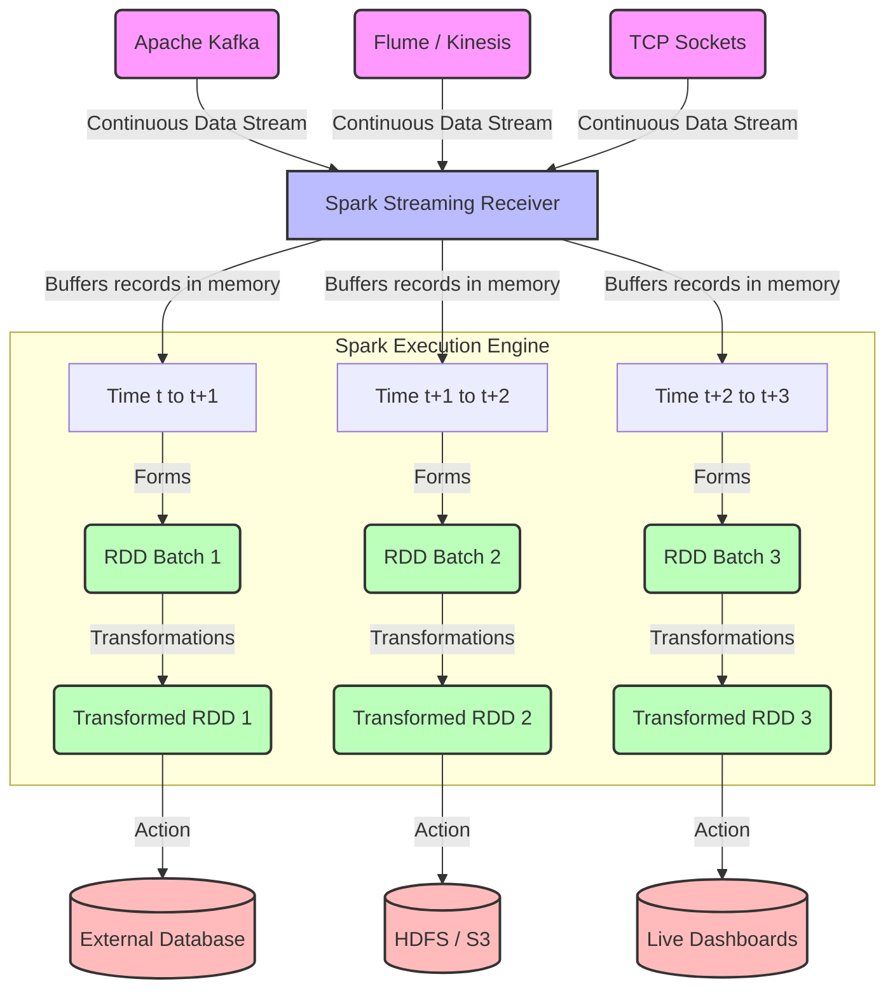

# Chapter 6 Overview: Ingesting Data with Spark Streaming

**Spark Streaming extends the core Spark API to enable scalable, high-throughput, fault-tolerant processing of live data streams.**

## Why It Matters

In today's fast-paced digital world, processing data in periodic nightly batches is no longer sufficient for many business use cases. Organizations need to react to events as they happen—detecting fraudulent transactions the moment a credit card is swiped, adjusting online recommendations based on a user's current session, monitoring server logs for immediate security threats, and analyzing social media sentiment in real time. 

Spark Streaming provides a unified framework that allows developers to write streaming jobs using the same concepts and similar APIs they use for batch processing. This unification drastically reduces the learning curve and code maintenance overhead. Instead of running one specialized cluster for batch (e.g., Hadoop MapReduce) and another for streaming (e.g., Apache Storm), engineering teams can deploy a single robust engine (Apache Spark) that handles both. By leveraging Spark's core execution engine, Spark Streaming inherits built-in fault tolerance, the ability to join streaming data against historical static datasets, and seamless integration with Spark SQL and MLlib.

## How It Works

At a high level, Spark Streaming receives live input data streams from sources such as Apache Kafka, Amazon Kinesis, TCP sockets, or HDFS/S3 directories. It then divides the continuous stream of data into discrete chunks called "micro-batches," which are processed by the Spark engine to generate the final stream of results in batches.

The fundamental abstraction in Spark Streaming is the **micro-batch model**. Unlike traditional streaming systems that process data one record at a time (continuous processing), Spark Streaming accumulates records over a short time interval (e.g., 1 second, 5 seconds). Once the interval elapses, the accumulated records form a standard Resilient Distributed Dataset (RDD). Spark then schedules a standard batch job to process this RDD. This means that a Spark Streaming application is essentially a continuous sequence of short-lived, small batch jobs running one after the other.

This micro-batch architecture offers several profound advantages. First, it simplifies fault tolerance. If a worker node fails, Spark simply recomputes the lost RDD partitions using data lineage, just like it does in regular batch processing. Second, it naturally handles stragglers and load balancing across the cluster. Third, it allows developers to reuse exactly the same business logic (map, filter, reduce) for both streaming and batch data. However, the trade-off is latency: the processing delay will always be at least as long as the batch interval, making sub-millisecond latencies impossible but easily achieving sub-second latencies which are perfect for 95% of use cases.

## Flow Diagram



## Data Visualization

The following table demonstrates the conceptual difference between how data is processed in a Pure Batch Model versus the Spark Streaming Micro-Batch Model.

| Processing Paradigm | Time Horizon | Data Volume Processed at Once | Latency Profile | Example Use Case | Fault Tolerance Mechanism |
| :--- | :--- | :--- | :--- | :--- | :--- |
| **Traditional Batch** (e.g., nightly ETL) | 24 Hours | 500 GB | ~Hours (Run time) | Daily Sales Aggregation | Re-run entire batch / checkpointing |
| **Micro-Batch Streaming** (Spark Streaming) | 5 Seconds | 10 MB per interval | ~5-10 Seconds | Live Fraud Detection | RDD Lineage recomputation |
| **Continuous Streaming** (e.g., Flink) | Real-time (Event by Event) | 1 Record | ~Milliseconds | High-frequency Trading | Distributed Snapshots (Chandy-Lamport) |

Notice how the Micro-Batch streaming model bridges the gap, offering near real-time processing while still taking advantage of batch-style fault tolerance.

## Code Example

Below is a Python (PySpark) example illustrating how a Spark Streaming context is initialized, demonstrating the basic structure required for any streaming application.

```python
# Import required classes
from pyspark import SparkContext
from pyspark.streaming import StreamingContext

# 1. Initialize SparkContext with 2 local working threads
# We need at least 2 threads: one for the receiver, and one for processing the data
sc = SparkContext("local[2]", "Chapter6OverviewApp")

# Set log level to ERROR to reduce console output noise
sc.setLogLevel("ERROR")

# 2. Create a StreamingContext with a 5-second batch interval
# This defines the "micro-batch" window. Data arriving within 5 seconds 
# will be grouped into a single RDD.
ssc = StreamingContext(sc, 5)

# 3. Define the input source (e.g., TCP socket on port 9999)
# This creates a DStream (Discretized Stream), the core streaming abstraction
lines_dstream = ssc.socketTextStream("localhost", 9999)

# 4. Define computations on the DStream
# We apply standard RDD-like operations (map, flatMap, reduceByKey)
words_dstream = lines_dstream.flatMap(lambda line: line.split(" "))
word_counts = words_dstream.map(lambda word: (word, 1)).reduceByKey(lambda a, b: a + b)

# 5. Define output operations (Actions)
# Without an output operation, no computation will actually be triggered
word_counts.pprint() # Prints the first 10 elements of each RDD batch to the console

# 6. Start the streaming computation
print("Starting the Spark Streaming Context...")
ssc.start()

# 7. Wait for the computation to terminate (manually stopped or due to an error)
# This keeps the main thread alive while background threads process the stream
ssc.awaitTermination()
```

## Common Pitfalls

*   **Insufficient Cores Allocated:** A common mistake is running Spark Streaming locally with `local[1]`. If you have only one core, the receiver takes it, leaving zero cores to process the data, causing the application to stall indefinitely.
*   **Batch Interval Too Short:** Setting a 10-millisecond batch interval will crash the cluster. Spark's job scheduling overhead takes tens to hundreds of milliseconds. If the batch interval is shorter than the processing time, jobs will queue up, causing OutOfMemory errors.
*   **Unbounded State Growth:** When maintaining state (e.g., tracking distinct users over time), failing to implement an expiration policy means the state dictionary will grow indefinitely until the executor runs out of memory.
*   **Missing Output Operations:** Just like standard Spark requires an action (e.g., `.collect()`) to trigger transformations, DStreams require an output operation like `.pprint()` or `.foreachRDD()`. Without it, Spark Streaming will complain and refuse to start.
*   **Improper Checkpointing Location:** Writing checkpoints to a temporary local filesystem (like `/tmp`) in a distributed cluster means if that specific node goes down, the checkpoint is lost, completely breaking fault recovery.

## Key Takeaway

Spark Streaming achieves scalable, fault-tolerant real-time processing by slicing continuous data into manageable micro-batches, effectively converting streaming problems into a sequence of small, rapid batch jobs.

<br><br><br><br><br><br><br><br><br><br><br><br><br><br><br><br><br><br><br><br><br><br><br><br><br><br><br><br><br><br><br><br><br><br><br><br><br><br><br><br><br><br><br><br><br><br><br><br><br><br><br><br><br><br><br><br><br><br><br><br><br><br><br><br><br><br><br><br><br><br><br><br><br><br><br><br><br><br><br><br><br><br><br><br><br><br><br><br><br><br><br><br><br><br><br><br><br><br><br><br>


---

## 🎓 Deep Learning Questions

### Q1: Why Was This Concept Introduced?
Spark Streaming was introduced to overcome the limitations of traditional batch processing systems like Hadoop MapReduce, which were ill-suited for real-time data processing. Before Spark Streaming, organizations had to maintain entirely separate architectures for batch and streaming data—such as Hadoop for daily ETL and Apache Storm for live events. This Lambda architecture led to duplicated codebases, higher operational overhead, and complex maintenance. 

By introducing Spark Streaming, Apache Spark provided a unified framework. It allowed developers to write a single codebase using the familiar RDD API, running both batch and streaming workloads on the same engine. This integration means you can seamlessly join historical static data with live streams (e.g., enriching live transactions with a static customer database) without switching platforms. Additionally, earlier streaming systems often struggled with fault tolerance and stragglers. Spark Streaming's micro-batch architecture inherently solved these issues by recomputing lost micro-batches using data lineage, eliminating the need for complex, record-level acknowledgment protocols.

### Q2: What Exactly Is This Concept and How Does It Work?
Spark Streaming is a framework that processes live data streams using a micro-batch architecture. Instead of processing data one event at a time, it ingests continuous data from sources like Apache Kafka or Kinesis, buffers it in memory, and divides it into small, discrete time intervals called micro-batches (e.g., every 5 seconds). 

Behind the scenes, each micro-batch is converted into an RDD (Resilient Distributed Dataset) and pushed into the core Spark execution engine. Spark schedules these RDDs as a series of short, successive batch jobs. The primary abstraction for this continuous sequence of RDDs is the Discretized Stream (DStream). 

When you apply a transformation (like `map` or `reduceByKey`) on a DStream, Spark automatically applies it to all the underlying RDDs. For stateful processing (like tracking user sessions), Spark Streaming uses operations such as `updateStateByKey`, which maintains a state RDD across micro-batches. Because it builds upon Spark's core engine, Spark Streaming natively supports fault tolerance through RDD lineage and checkpointing, ensuring no data is lost if a worker node fails.

### Q3: Where Should This Concept Be Used?
Spark Streaming is highly effective in production scenarios requiring high-throughput, fault-tolerant, and stateful near real-time processing. 

1. **Cybersecurity & Fraud Detection:** Banking and financial institutions (like Capital One or Visa) use it to ingest thousands of transactions per second from Kafka, scoring them against machine learning models (via Spark MLlib) to detect fraud within seconds.
2. **Real-Time Analytics & Dashboards:** Companies like Uber or Lyft process real-time telemetry from vehicles to update dynamic pricing and calculate ETAs, aggregating data over tumbling or sliding windows.
3. **Log Monitoring & Alerting:** Tech giants aggregate server logs across thousands of machines. Spark Streaming filters these logs for error codes or security anomalies, triggering immediate alerts while simultaneously writing the raw data to HDFS/S3 for long-term auditing.
4. **IoT & Sensor Data:** Manufacturing or energy sectors monitor sensor data from equipment, calculating rolling averages to predict hardware failures before they occur. 

In all these cases, Spark Streaming's ability to maintain computation state and join live streams with static metadata makes it incredibly powerful.

### Q4: Where Should This Concept NOT Be Used?
While Spark Streaming is robust, its micro-batch model makes it unsuitable for certain use cases.

1. **Ultra-Low Latency Applications:** Because it waits to accumulate data into batches (minimum typically ~500ms to 1 second), it cannot achieve the single-digit millisecond latency required for high-frequency trading platforms or real-time gaming engines. Systems like Apache Flink or Apache Storm are better suited here.
2. **Event-at-a-Time Processing:** If your business logic strictly requires processing and reacting to every single event the exact microsecond it arrives (rather than aggregating over a window), Spark Streaming's batching overhead will be problematic.
3. **Complex Event Processing (CEP):** If you need complex pattern matching across streams with varying time delays (e.g., "Event A followed by Event B within exactly 3.2 seconds"), dedicated CEP engines or Flink offer better out-of-the-box primitives.
4. **Simple, Low-Volume Workloads:** If you are only processing a few messages per minute, spinning up a distributed Spark cluster is massive overkill. A simple serverless function (like AWS Lambda) attached to a message queue is much more cost-effective.

### Q5: How Is This Concept Different from Hadoop?

| Aspect | Hadoop MapReduce | Apache Spark Streaming |
| :--- | :--- | :--- |
| **Architecture** | Purely batch processing, reading/writing to HDFS. | Micro-batch streaming processing data in memory. |
| **Performance** | High latency (minutes to hours). | Low latency (seconds to near real-time). |
| **Processing Model** | Disk-bound; intermediate results written to disk. | Memory-bound; intermediate data kept in memory. |
| **Memory Usage** | Minimal caching, relies heavily on physical storage. | Highly optimized for in-memory caching and state. |
| **Fault Tolerance** | Re-runs map/reduce tasks from disk blocks. | Recomputes lost micro-batches via RDD lineage. |
| **Scalability** | Scales well but with heavy disk I/O overhead. | Highly scalable with much less I/O bottleneck. |
| **Ease of Development** | Complex, verbose Java MapReduce code. | Simple functional APIs in Scala, Python, and Java. |
| **Typical Use Cases** | Nightly ETL, historical aggregations. | Fraud detection, live dashboards, log alerting. |
| **Advantages** | Deep ecosystem, handles massive historical data. | Unified batch/streaming API, much faster execution. |
| **Disadvantages** | Cannot process live streaming data natively. | Micro-batch model prevents true millisecond latency. |

### Q6: How Can This Concept Be Related to a Traditional RDBMS?

| Traditional RDBMS (SQL) | Spark Streaming Equivalent | Explanation |
| :--- | :--- | :--- |
| **Table** | **DStream (Discretized Stream)** | A continuously updating sequence of records over time. |
| **Row** | **Event / Message** | A single piece of data arriving in the stream. |
| **SELECT / WHERE** | **map() / filter()** | Transformations applied to modify or filter the incoming data. |
| **GROUP BY (Time)** | **Window Operations** | Aggregating data over a specific time window (e.g., tumbling window). |
| **Materialized View** | **Stateful Processing (updateStateByKey)** | Maintaining an updated aggregate state across all incoming batches. |
| **INSERT INTO / UPDATE** | **Output Operations (foreachRDD)** | Writing the processed micro-batch results to external sinks. |
| **Transaction Log** | **Write-Ahead Logs (WAL) / Checkpointing** | Mechanisms used to ensure data isn't lost if the system crashes. |

### Q7: What Happens Behind the Scenes?
When a Spark Streaming application is deployed, a continuous execution flow is established:

1. **Receiver/Direct Approach:** For Kafka, Spark Streaming creates a Kafka Direct Stream. Executors read messages directly from Kafka partitions.
2. **Micro-Batching:** As time progresses (e.g., a 5-second interval), Spark groups the incoming messages into a logical micro-batch.
3. **DAG Generation:** The Driver creates a Directed Acyclic Graph (DAG) for this specific micro-batch based on the DStream transformations.
4. **Task Scheduling:** The Spark Scheduler breaks the DAG into Stages and Tasks.
5. **Execution:** Tasks are sent to Executors. If Kafka has 10 partitions, Spark typically creates 10 tasks, allowing 10 executors to process the data in parallel.
6. **State & Shuffle:** If a stateful operation (like `updateStateByKey`) is used, data is shuffled across executors. The executors read previous state from memory/checkpoints and compute the new state.
7. **Output:** The final RDD action (like `foreachRDD`) triggers writing the results to a database.

```text
[Kafka Partitions] 
      │ (Continuous Flow)
      ▼
[Spark Executors (Receivers / Direct API)]
      │ (Buffer into 5-second intervals)
      ▼
[Driver] ──(Generates DAG & Tasks)──> [Cluster Manager]
      │                                    │
      ▼                                    ▼
[Micro-Batch RDD n]                 [Worker Nodes]
      │ (Transformations/Shuffle)          │
      ▼                                    ▼
[State RDD] <──(Checkpointing)── [Distributed Memory/HDFS]
      │
      ▼
[External Sink (Cassandra / HDFS / Dashboard)]
```

### Q8: Performance Considerations, Best Practices, and Common Mistakes

| Category | Recommendation | Why It Matters |
| :--- | :--- | :--- |
| **Performance** | **Use Kafka Direct API** | Avoids data loss without needing Write-Ahead Logs (WAL). Executors read directly from Kafka partitions, aligning Spark partitions 1:1 with Kafka. |
| **Optimization** | **Tune Batch Interval** | Batch processing time must be less than the batch interval. If processing takes 7 seconds for a 5-second interval, batches queue up and crash the app. |
| **Best Practice** | **Implement Checkpointing** | Required for stateful operations (`updateStateByKey`, windows) and fault recovery. Save to a reliable distributed file system (like HDFS/S3), not local disk. |
| **Best Practice** | **Manage State Size** | When keeping state, ensure you remove old/expired state data. Otherwise, your state RDD grows infinitely until Executors run out of memory. |
| **Common Mistake** | **Single Core Local Testing** | Running `local[1]` allocates the only thread to the receiver. Data is ingested but never processed. Always use `local[2]` or higher. |
| **Production Tip** | **Graceful Shutdown** | Use `spark.streaming.stopGracefullyOnShutdown=true`. This ensures Spark finishes processing the current micro-batch before shutting down, preventing data loss. |

### Q9: Interview Questions

**Beginner:**
1. **What is a DStream?**
   *Answer:* A Discretized Stream (DStream) is the basic abstraction in Spark Streaming, representing a continuous sequence of RDDs generated over small time intervals.
2. **Why does Spark Streaming use micro-batches?**
   *Answer:* Micro-batching allows Spark to reuse its core batch engine, ensuring easy fault tolerance, lineage-based recovery, and a unified API for batch and stream processing.
3. **What is the difference between `transform` and `updateStateByKey`?**
   *Answer:* `transform` applies a stateless RDD-to-RDD operation on each micro-batch independently. `updateStateByKey` is stateful, maintaining and updating data across multiple batches.

**Intermediate:**
4. **How do you prevent data loss when reading from Kafka?**
   *Answer:* By using the Kafka Direct API, where Spark executors read directly from Kafka partitions and track offsets themselves, ensuring Exactly-Once semantics without needing WAL.
5. **What happens if your batch processing time exceeds your batch interval?**
   *Answer:* The application will experience scheduling delays. Micro-batches will queue up in memory, eventually leading to an OutOfMemoryError and cluster crash.
6. **Why is checkpointing mandatory for stateful transformations?**
   *Answer:* Because stateful operations build DAG lineages that stretch back to the beginning of the application. Checkpointing cuts this lineage by periodically saving the RDD to reliable storage, preventing stack overflows during recovery.

**Advanced:**
7. **Explain the difference between a tumbling window and a sliding window.**
   *Answer:* A tumbling window aggregates data in fixed, non-overlapping intervals (e.g., every 5 minutes). A sliding window aggregates data over a fixed duration but moves forward by a smaller step (e.g., 5-minute window sliding every 1 minute), resulting in overlapping data calculations.
8. **How does Spark Streaming achieve Exactly-Once semantics?**
   *Answer:* By combining idempotent output operations (or transactional updates) with the Kafka Direct API, which precisely tracks partition offsets. Spark ensures that even if an executor fails, the micro-batch is recomputed from the exact Kafka offset, and results are written exactly once.
9. **What is Structured Streaming and how does it relate to Spark Streaming (DStreams)?**
   *Answer:* Structured Streaming is the newer, DataFrame/SQL-based streaming engine built on Spark SQL. It offers true event-time processing and watermarking, largely replacing the older DStream (RDD-based) API for modern applications.

**Scenario-Based:**
10. **You are monitoring website traffic and need to alert if a user logs in from two different countries within 10 minutes. How would you design this?**
    *Answer:* I would ingest login events from Kafka into Spark Streaming. I would key the stream by UserID and apply a stateful operation (`mapWithState` or a 10-minute sliding window). The state would store the countries. If the set of countries for a single UserID > 1 within the window, an alert is triggered to the output sink.
11. **Your Spark Streaming app runs fine for 3 days but then crashes with an Out Of Memory error. What is the likely cause?**
    *Answer:* The most likely cause is an unbounded state. If using `updateStateByKey` to track unique users, and old users are never expired or removed from the state dictionary, the state RDD grows indefinitely until memory is exhausted.

### Q10: Complete Real-World Example

**Business Problem:** 
A retail company wants to track trending product categories on their e-commerce platform in real-time. They need to calculate the total sales amount per category over the last 60 seconds, updating the dashboard every 10 seconds.

**Sample Dataset (Simulated JSON from Kafka):**
```json
{"timestamp": "2023-10-25T14:30:00Z", "product_id": "P123", "category": "Electronics", "amount": 299.99}
{"timestamp": "2023-10-25T14:30:02Z", "product_id": "P456", "category": "Clothing", "amount": 49.50}
```

**Full Working PySpark Code:**

```python
from pyspark import SparkContext
from pyspark.streaming import StreamingContext
import json

# 1. Initialize Contexts
# Local cluster with 2 cores, batch interval of 10 seconds
sc = SparkContext("local[2]", "TrendingCategoriesApp")
sc.setLogLevel("WARN")
ssc = StreamingContext(sc, 10)

# 2. Set Checkpoint directory (Mandatory for windowing operations)
ssc.checkpoint("file:///tmp/spark_checkpoint")

# 3. Simulate streaming data source (Socket stream for simplicity)
# In production, this would be KafkaUtils.createDirectStream(...)
raw_stream = ssc.socketTextStream("localhost", 9999)

# 4. Parse JSON and Extract (Category, Amount)
def parse_event(line):
    try:
        data = json.loads(line)
        return (data["category"], data["amount"])
    except:
        return ("Unknown", 0)

parsed_stream = raw_stream.map(parse_event)

# 5. Apply Sliding Window Operation
# Calculate total sales per category over the last 60 seconds, sliding every 10 seconds
# reduceByKeyAndWindow arguments: (reduce_func, inverse_reduce_func, window_duration, slide_duration)
windowed_sales = parsed_stream.reduceByKeyAndWindow(
    lambda x, y: x + y,        # Add new data entering the window
    lambda x, y: x - y,        # Subtract old data leaving the window
    60,                        # Window length (60 seconds)
    10                         # Slide interval (10 seconds)
)

# 6. Sort and Output Results
# We use transform to apply RDD operations (like sortBy) within the DStream
def sort_and_print(time, rdd):
    print(f"--- Top Categories at {time} ---")
    # Sort by sales amount in descending order
    sorted_rdd = rdd.sortBy(lambda x: x[1], ascending=False)
    for record in sorted_rdd.take(5):
        print(f"Category: {record[0]} | Sales: ${record[1]:.2f}")

windowed_sales.foreachRDD(sort_and_print)

# 7. Start processing
ssc.start()
ssc.awaitTermination()
```

**Step-by-Step Execution Walkthrough:**
1. Spark initializes and connects to the socket on port 9999.
2. Every 10 seconds, it grabs all incoming JSON strings and forms a micro-batch RDD.
3. `parse_event` converts strings into `(Category, Amount)` tuples.
4. `reduceByKeyAndWindow` looks at the past 60 seconds of data. To optimize, it adds the new 10 seconds of data and subtracts the oldest 10 seconds of data leaving the window.
5. The `foreachRDD` function extracts the underlying RDD, sorts the categories by total sales amount, and prints the top 5 to the console.

**Performance Notes & Best Fit:**
Using the inverse reduction function (`lambda x, y: x - y`) in the window operation makes it highly performant. Instead of recalculating the entire 60-second window from scratch, Spark only calculates the delta. This approach is best for real-time leaderboards, alerting thresholds, and live operational dashboards.

### 💡 Key Takeaways
- Spark Streaming processes live data using a micro-batch architecture, converting streams into a sequence of small batch jobs.
- The fundamental abstraction is the DStream (Discretized Stream), which is essentially a continuous series of RDDs.
- It provides a unified API, allowing developers to use similar code for both batch and real-time processing.
- Fault tolerance is natively handled through RDD lineage and checkpointing, ensuring zero data loss upon node failure.
- Windowing and stateful operations (`updateStateByKey`, `reduceByKeyAndWindow`) require a configured checkpoint directory to manage state across batches.
- Processing time must strictly remain below the batch interval to avoid memory exhaustion and application crashes.

### ⚠️ Common Misconceptions
- **"Spark Streaming provides true real-time, millisecond latency."** False. Because of the micro-batch design, latency is typically in the hundreds of milliseconds to seconds.
- **"You can run a streaming app locally with one core."** False. The receiver occupies one core, leaving zero cores for processing. You must use at least `local[2]`.
- **"Stateful streams manage their own memory automatically."** False. If you don't explicitly expire old keys in your state dictionary, you will eventually encounter an OutOfMemoryError.
- **"DStreams are the most modern way to do streaming in Spark."** False. Structured Streaming (using DataFrames) is the modern, recommended approach; DStreams are the legacy RDD-based approach.

### 🔗 Related Spark Concepts
- Structured Streaming (DataFrames/SQL)
- Spark Core (RDDs and DAG Execution)
- Spark Checkpointing & Fault Tolerance
- Apache Kafka Integration
- Windowing Operations (Tumbling & Sliding Windows)

### 📚 References for Further Reading
- Apache Spark Official Documentation
- Learning Spark (O'Reilly)
- Spark: The Definitive Guide (O'Reilly)
