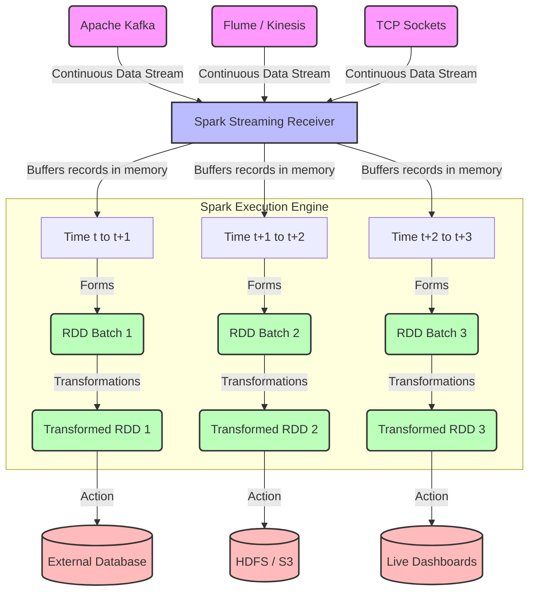

# Chapter 6 Overview: Ingesting Data with Spark Streaming

**Spark Streaming extends the core Spark API to enable scalable, high-throughput, fault-tolerant processing of live data streams.**

## Why It Matters

In today's fast-paced digital world, processing data in periodic nightly batches is no longer sufficient for many business use cases. Organizations need to react to events as they happen—detecting fraudulent transactions the moment a credit card is swiped, adjusting online recommendations based on a user's current session, monitoring server logs for immediate security threats, and analyzing social media sentiment in real time. 

Spark Streaming provides a unified framework that allows developers to write streaming jobs using the same concepts and similar APIs they use for batch processing. This unification drastically reduces the learning curve and code maintenance overhead. Instead of running one specialized cluster for batch (e.g., Hadoop MapReduce) and another for streaming (e.g., Apache Storm), engineering teams can deploy a single robust engine (Apache Spark) that handles both. By leveraging Spark's core execution engine, Spark Streaming inherits built-in fault tolerance, the ability to join streaming data against historical static datasets, and seamless integration with Spark SQL and MLlib.

## How It Works

At a high level, Spark Streaming receives live input data streams from sources such as Apache Kafka, Amazon Kinesis, TCP sockets, or HDFS/S3 directories. It then divides the continuous stream of data into discrete chunks called "micro-batches," which are processed by the Spark engine to generate the final stream of results in batches.

The fundamental abstraction in Spark Streaming is the **micro-batch model**. Unlike traditional streaming systems that process data one record at a time (continuous processing), Spark Streaming accumulates records over a short time interval (e.g., 1 second, 5 seconds). Once the interval elapses, the accumulated records form a standard Resilient Distributed Dataset (RDD). Spark then schedules a standard batch job to process this RDD. This means that a Spark Streaming application is essentially a continuous sequence of short-lived, small batch jobs running one after the other.

This micro-batch architecture offers several profound advantages. First, it simplifies fault tolerance. If a worker node fails, Spark simply recomputes the lost RDD partitions using data lineage, just like it does in regular batch processing. Second, it naturally handles stragglers and load balancing across the cluster. Third, it allows developers to reuse exactly the same business logic (map, filter, reduce) for both streaming and batch data. However, the trade-off is latency: the processing delay will always be at least as long as the batch interval, making sub-millisecond latencies impossible but easily achieving sub-second latencies which are perfect for 95% of use cases.

## Flow Diagram



## Data Visualization

The following table demonstrates the conceptual difference between how data is processed in a Pure Batch Model versus the Spark Streaming Micro-Batch Model.

| Processing Paradigm | Time Horizon | Data Volume Processed at Once | Latency Profile | Example Use Case | Fault Tolerance Mechanism |
| :--- | :--- | :--- | :--- | :--- | :--- |
| **Traditional Batch** (e.g., nightly ETL) | 24 Hours | 500 GB | ~Hours (Run time) | Daily Sales Aggregation | Re-run entire batch / checkpointing |
| **Micro-Batch Streaming** (Spark Streaming) | 5 Seconds | 10 MB per interval | ~5-10 Seconds | Live Fraud Detection | RDD Lineage recomputation |
| **Continuous Streaming** (e.g., Flink) | Real-time (Event by Event) | 1 Record | ~Milliseconds | High-frequency Trading | Distributed Snapshots (Chandy-Lamport) |

Notice how the Micro-Batch streaming model bridges the gap, offering near real-time processing while still taking advantage of batch-style fault tolerance.

## Code Example

Below is a Python (PySpark) example illustrating how a Spark Streaming context is initialized, demonstrating the basic structure required for any streaming application.

```python
# Import required classes
from pyspark import SparkContext
from pyspark.streaming import StreamingContext

# 1. Initialize SparkContext with 2 local working threads
# We need at least 2 threads: one for the receiver, and one for processing the data
sc = SparkContext("local[2]", "Chapter6OverviewApp")

# Set log level to ERROR to reduce console output noise
sc.setLogLevel("ERROR")

# 2. Create a StreamingContext with a 5-second batch interval
# This defines the "micro-batch" window. Data arriving within 5 seconds 
# will be grouped into a single RDD.
ssc = StreamingContext(sc, 5)

# 3. Define the input source (e.g., TCP socket on port 9999)
# This creates a DStream (Discretized Stream), the core streaming abstraction
lines_dstream = ssc.socketTextStream("localhost", 9999)

# 4. Define computations on the DStream
# We apply standard RDD-like operations (map, flatMap, reduceByKey)
words_dstream = lines_dstream.flatMap(lambda line: line.split(" "))
word_counts = words_dstream.map(lambda word: (word, 1)).reduceByKey(lambda a, b: a + b)

# 5. Define output operations (Actions)
# Without an output operation, no computation will actually be triggered
word_counts.pprint() # Prints the first 10 elements of each RDD batch to the console

# 6. Start the streaming computation
print("Starting the Spark Streaming Context...")
ssc.start()

# 7. Wait for the computation to terminate (manually stopped or due to an error)
# This keeps the main thread alive while background threads process the stream
ssc.awaitTermination()
```

## Common Pitfalls

*   **Insufficient Cores Allocated:** A common mistake is running Spark Streaming locally with `local[1]`. If you have only one core, the receiver takes it, leaving zero cores to process the data, causing the application to stall indefinitely.
*   **Batch Interval Too Short:** Setting a 10-millisecond batch interval will crash the cluster. Spark's job scheduling overhead takes tens to hundreds of milliseconds. If the batch interval is shorter than the processing time, jobs will queue up, causing OutOfMemory errors.
*   **Unbounded State Growth:** When maintaining state (e.g., tracking distinct users over time), failing to implement an expiration policy means the state dictionary will grow indefinitely until the executor runs out of memory.
*   **Missing Output Operations:** Just like standard Spark requires an action (e.g., `.collect()`) to trigger transformations, DStreams require an output operation like `.pprint()` or `.foreachRDD()`. Without it, Spark Streaming will complain and refuse to start.
*   **Improper Checkpointing Location:** Writing checkpoints to a temporary local filesystem (like `/tmp`) in a distributed cluster means if that specific node goes down, the checkpoint is lost, completely breaking fault recovery.

## Key Takeaway

Spark Streaming achieves scalable, fault-tolerant real-time processing by slicing continuous data into manageable micro-batches, effectively converting streaming problems into a sequence of small, rapid batch jobs.

<br><br><br><br><br><br><br><br><br><br><br><br><br><br><br><br><br><br><br><br><br><br><br><br><br><br><br><br><br><br><br><br><br><br><br><br><br><br><br><br><br><br><br><br><br><br><br><br><br><br><br><br><br><br><br><br><br><br><br><br><br><br><br><br><br><br><br><br><br><br><br><br><br><br><br><br><br><br><br><br><br><br><br><br><br><br><br><br><br><br><br><br><br><br><br><br><br><br><br><br>
