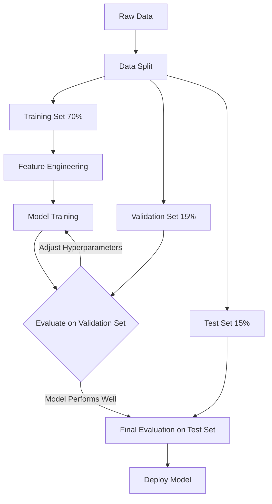

# Machine Learning Basics

**A fundamental overview of machine learning paradigms, workflows, and core concepts essential for applying Spark MLlib effectively.**

## Why It Matters
Before diving into the complexities of distributed algorithms, it is crucial to understand the foundational principles of machine learning. Whether you are building a recommendation engine, detecting fraudulent transactions, or predicting customer churn, the underlying concepts of supervised learning, model evaluation, and the bias-variance tradeoff remain the same. A solid grasp of these basics ensures that you can design robust models, interpret their performance correctly, and diagnose issues when things go wrong, especially when scaling up to massive datasets with Spark.

## How It Works
Machine learning can be broadly categorized into three main paradigms:
1.  **Supervised Learning**: The algorithm learns from labeled data. For example, predicting house prices based on historical sales data (regression) or classifying emails as spam or not spam (classification).
2.  **Unsupervised Learning**: The algorithm learns from unlabeled data, seeking inherent structures or patterns. Examples include grouping customers into segments (clustering) or reducing the number of features (dimensionality reduction).
3.  **Reinforcement Learning**: The algorithm learns by interacting with an environment, receiving rewards or penalties for its actions. (Note: Spark MLlib primarily focuses on supervised and unsupervised learning).

The typical Machine Learning Workflow involves several iterative steps:
1.  **Data Collection & Exploration**: Gathering data and understanding its distribution and quality.
2.  **Feature Engineering**: Cleaning data, handling missing values, encoding categorical variables, and scaling numerical features.
3.  **Model Training**: Selecting an algorithm and fitting it to the training data.
4.  **Evaluation**: Assessing model performance using a separate validation or test dataset.
5.  **Deployment**: Integrating the trained model into a production system for inference.

A critical concept during training is the **Bias-Variance Tradeoff**. 
*   **High Bias (Underfitting)**: The model is too simple and fails to capture the underlying patterns in the data. It performs poorly on both training and test sets.
*   **High Variance (Overfitting)**: The model is too complex and memorizes the training data, including noise. It performs well on the training set but poorly on the unseen test set.
The goal is to find the sweet spot that minimizes both bias and variance, achieving good generalization. To evaluate generalization, data is typically split into Training (e.g., 70%), Validation (e.g., 15%), and Test (e.g., 15%) sets.

Distributed ML (like Spark MLlib) becomes necessary when datasets are simply too large to fit into the memory of a single machine or when training time on a single node becomes prohibitively slow. Spark distributes the data and the computation across a cluster, enabling ML at scale.

## Flow Diagram


## Data Visualization
| Dataset Split | Purpose | Example Size | Role in Bias/Variance |
| :--- | :--- | :--- | :--- |
| **Training Set** | Fit the model parameters (weights). | 70% | Used to minimize training error (reduce bias). |
| **Validation Set** | Tune hyperparameters and evaluate during development. | 15% | Used to detect overfitting (monitor variance). |
| **Test Set** | Final unbiased evaluation of the fully trained model. | 15% | Provides a realistic estimate of production performance. |

## Code Example
```python
# Demonstrating a simple Train/Test split in Spark
from pyspark.sql import SparkSession

spark = SparkSession.builder.appName("ML_Basics").getOrCreate()

# Create dummy data
data = [(1, 10.0, 1.0), (2, 20.0, 0.0), (3, 30.0, 1.0), (4, 40.0, 0.0), (5, 50.0, 1.0)]
df = spark.createDataFrame(data, ["id", "feature1", "label"])

# Split the data into 80% training and 20% testing
# A seed is provided for reproducibility
train_df, test_df = df.randomSplit([0.8, 0.2], seed=42)

print(f"Training Data Count: {train_df.count()}")
print(f"Test Data Count: {test_df.count()}")

# Show a sample of the training data
train_df.show()
```

## Common Pitfalls
*   **Data Leakage**: Accidentally including information from the test set in the training process (e.g., scaling features based on the entire dataset before splitting).
*   **Ignoring the Baseline**: Failing to compare model performance against a simple baseline (e.g., predicting the most frequent class), making it hard to know if the model is actually learning anything useful.
*   **Over-tuning on Validation Data**: Tweaking hyperparameters too many times based on validation performance can lead to overfitting the validation set itself.
*   **Assuming Big Data == Better Model**: Throwing massive amounts of poor-quality data at a complex model usually yields worse results than training a simpler model on clean, well-engineered data.

## Key Takeaway
Understanding the fundamentals of ML workflows and the bias-variance tradeoff is non-negotiable for building models that actually generalize well to unseen data, especially when leveraging distributed systems like Spark.


---

## 🎓 Deep Learning Questions

### Q1: Why Was This Concept Introduced?
Before the advent of Apache Spark, traditional machine learning libraries like `scikit-learn` or `R` were designed for single-node machines. As data volumes exploded, these tools struggled because datasets could no longer fit into the RAM of a single computer. On the other hand, distributed solutions like Apache Mahout running on Hadoop MapReduce were notoriously slow because they wrote intermediate results to disk between iterations—a fatal flaw for iterative machine learning algorithms. 

Spark MLlib was introduced to bridge this gap. It overcomes the memory constraints of single nodes by distributing data across a cluster, and it overcomes the speed limitations of MapReduce by retaining intermediate data in-memory (RAM) between iterations. This makes Spark MLlib exponentially faster for iterative workloads like gradient descent, allowing data scientists to train robust models on terabytes of data efficiently.

### Q2: What Exactly Is This Concept and How Does It Work?
Machine Learning in Spark involves building predictive models from data at a massive scale. At its core, Spark's MLlib uses a DataFrame-based API to represent datasets, where each row represents an observation and columns represent features and labels. 

The architecture is built on two primary abstractions:
1. **Transformers**: Algorithms that transform one DataFrame into another. For example, a `VectorAssembler` takes multiple feature columns and combines them into a single vector column. A trained model is also a Transformer (it transforms a DataFrame of features into a DataFrame with predictions).
2. **Estimators**: Algorithms that can be fit on a DataFrame to produce a Model. For example, a `LogisticRegression` algorithm is an Estimator.

When you call `fit()` on an Estimator, Spark translates the mathematical optimization process (like computing gradients) into distributed map and reduce tasks. The driver node coordinates the optimization, while the worker nodes compute partial gradients or statistics on their respective data partitions. 

### Q3: Where Should This Concept Be Used?
Distributed machine learning with Spark MLlib is essential for enterprise-scale business scenarios where datasets are massive. 
- **E-commerce (Amazon, Walmart)**: Building product recommendation engines using Alternating Least Squares (ALS) across billions of user-item interactions.
- **Banking & Finance**: Real-time fraud detection models that need to process and learn from millions of transactions per day, relying on classification algorithms.
- **Transportation (Uber, Lyft)**: Predicting dynamic pricing (surge pricing) or Estimated Time of Arrival (ETA) by training regression models on vast historical trip data.
- **Healthcare**: Predicting patient readmission rates by analyzing distributed electronic health records (EHR).
If your dataset is larger than the memory of a single high-end server (typically > 50-100 GB), Spark MLlib is the right tool.

### Q4: Where Should This Concept NOT Be Used?
Do not use Spark MLlib for small to medium-sized datasets (e.g., 100 MB to 10 GB) that easily fit into the RAM of a single machine. In these cases, using a single-node library like `scikit-learn`, `XGBoost`, or `LightGBM` is significantly faster and simpler because you avoid the network overhead and serialization costs of distributed computing.

Additionally, Spark MLlib should not be used for complex Deep Learning tasks (like image recognition, Natural Language Processing, or training Large Language Models). While Spark can manage data preprocessing, specialized frameworks like PyTorch or TensorFlow, combined with GPU clusters, are required for training complex neural networks.

### Q5: How Is This Concept Different from Hadoop?
| Aspect | Hadoop MapReduce (e.g., Mahout) | Apache Spark MLlib |
| :--- | :--- | :--- |
| **Architecture** | Map and Reduce phases with strict disk-writes. | In-memory DAG execution engine. |
| **Performance** | Very slow for iterative algorithms due to disk I/O. | 10x to 100x faster for iterative ML tasks. |
| **Processing Model** | Batch processing only. | Batch and interactive, stream-friendly. |
| **Memory Usage** | Relies heavily on disk storage. | Leverages RAM for caching intermediate results. |
| **Fault Tolerance** | Replicates data on HDFS. | Uses RDD lineage to recompute lost partitions. |
| **Scalability** | Scales well but with high latency. | Scales well with low latency. |
| **Ease of Development** | Verbose Java code. | High-level APIs in Python, Scala, Java, and R. |
| **Typical Use Cases** | Simple, non-iterative batch analytics. | Iterative ML, real-time analytics, graph processing. |
| **Advantages** | Extremely fault-tolerant for long batch jobs. | Speed, unified ecosystem (SQL, Streaming, ML). |
| **Disadvantages** | Unusable for modern machine learning. | Higher memory footprint requirements. |

### Q6: How Can This Concept Be Related to a Traditional RDBMS?
For SQL developers, machine learning concepts in Spark map to data manipulation and statistical derivation:

| MLlib Concept | RDBMS / SQL Equivalent | Explanation |
| :--- | :--- | :--- |
| **DataFrame** | Table / View | The base structured dataset holding rows and columns. |
| **Feature (Column)** | Independent Variable Column | The inputs (e.g., Age, Income) used to make a prediction. |
| **Label (Column)** | Dependent Variable Column | The target value you want to predict (e.g., Default_Status). |
| **Transformer** | `SELECT` with Functions | Modifying or adding columns (e.g., `SELECT age, age / 10 AS age_scaled`). |
| **Estimator / Model** | Stored Procedure / UDF | A complex function that takes features and returns a predicted value. |
| **VectorAssembler** | Array constructor | Combining multiple numeric columns into a single array column for processing. |

### Q7: What Happens Behind the Scenes?
When you train a machine learning model in Spark (e.g., Logistic Regression), the following distributed execution occurs:

1. **Driver**: Your PySpark script defines the Estimator and calls `fit(df)`. The driver initializes the model parameters.
2. **DAG Generation**: The driver creates a Directed Acyclic Graph (DAG) for the iterative optimization process (e.g., computing the gradient of the loss function).
3. **Task Distribution**: The scheduler breaks the DAG into stages and tasks. Tasks are sent to executors.
4. **Executors & Partitions**: Each executor calculates the partial gradient using the data partition it holds in memory.
5. **Shuffle & Aggregate**: The partial gradients from all executors are sent back (reduced) to the driver.
6. **Update**: The driver updates the model weights and checks for convergence. If not converged, it triggers the next iteration.

```text
[Driver Node]
   | (1) Initialize Weights
   v
[DAG Scheduler] -> Divides optimization into Stages/Tasks
   |
   +-----------------------+-----------------------+
   | (2) Send tasks        |                       |
   v                       v                       v
[Worker 1]              [Worker 2]              [Worker 3]
(Partition 1)           (Partition 2)           (Partition 3)
Compute partial         Compute partial         Compute partial
gradient                gradient                gradient
   |                       |                       |
   +-----------+-----------+-----------+-----------+
               | (3) Aggregate Gradients (Reduce)
               v
[Driver Node] Updates Weights -> Converged? -> YES (Return Model)
               | -> NO (Loop back to Worker nodes)
```

### Q8: Performance Considerations, Best Practices, and Common Mistakes
| Category | Recommendation | Why It Matters |
| :--- | :--- | :--- |
| **Caching** | Always `.cache()` or `.persist()` your training DataFrame. | ML algorithms are iterative. Caching prevents Spark from re-reading data from disk on every iteration. |
| **Data Types** | Cast features to Double or Float. | MLlib's underlying C++ linear algebra libraries (BLAS) require floating-point numbers. |
| **Vectorization** | Use `VectorAssembler`. | MLlib requires all input features to be combined into a single `VectorUDT` column for training. |
| **Data Skew** | Ensure labels and features are evenly partitioned. | If one partition holds 80% of the data, one executor will bottleneck the entire training process. |
| **Overfitting** | Use Cross-Validation. | Training on 100% of your data will lead to models that memorize noise instead of learning patterns. |
| **Memory Tuning** | Increase executor memory (`spark.executor.memory`). | Matrix operations in MLlib are memory-intensive. Insufficient memory leads to disk spills and slow training. |

### Q9: Interview Questions

**Beginner**
1. **What is the difference between supervised and unsupervised learning?**
   *Supervised learning uses labeled data (predicting a known target), while unsupervised learning finds patterns in unlabeled data (like clustering).*
2. **What is a Transformer in Spark MLlib?**
   *An algorithm that takes a DataFrame and outputs a new DataFrame, typically by appending a new column (e.g., predictions or scaled features).*
3. **What is an Estimator?**
   *An algorithm that takes a DataFrame and trains on it to produce a Model (which acts as a Transformer).*

**Intermediate**
4. **Why is caching important in Spark Machine Learning?**
   *Because ML algorithms traverse the same dataset multiple times (iteratively). Caching keeps the data in RAM, avoiding expensive disk reads per iteration.*
5. **What is the purpose of the `VectorAssembler`?**
   *Spark ML algorithms expect all input features to be contained within a single column of type `Vector`. `VectorAssembler` merges multiple numeric columns into this single vector column.*
6. **Explain the Bias-Variance tradeoff.**
   *High bias means the model is too simple (underfitting), while high variance means it is too complex and memorizes noise (overfitting). The goal is to balance both for good generalization.*

**Advanced**
7. **How does Spark handle the distributed computation of gradients during model training?**
   *Executors compute partial gradients on their local data partitions. Spark uses a distributed reduce operation (often `treeAggregate`) to send these partial gradients back to the driver, which updates the global model weights.*
8. **What happens if your data is highly skewed during MLlib training?**
   *The executor processing the skewed partition will take significantly longer to compute its partial gradient, causing the driver to wait and stalling the entire iteration, leading to poor performance.*
9. **How would you handle categorical variables in Spark MLlib?**
   *You use `StringIndexer` to convert strings to numerical indices, followed by `OneHotEncoder` to create binary vector columns, preventing the model from assuming ordinal relationships between categories.*

**Scenario-Based**
10. **You have a 5 GB dataset and a Spark cluster. You train a Random Forest model, but it is much slower than running it locally on your laptop with scikit-learn. Why?**
    *A 5 GB dataset easily fits into the memory of a modern laptop. Spark introduces network serialization, task scheduling, and distributed coordination overhead. For small data, the overhead of Spark outweighs the benefits of parallelization.*
11. **Your logistic regression model takes 30 minutes for the first iteration, and 30 minutes for every subsequent iteration. How do you fix this?**
    *The training DataFrame is not cached. Spark is re-evaluating the entire DAG and re-reading the data from the source (e.g., S3 or HDFS) on every iteration. Calling `.cache()` before training will drop iteration time significantly.*

### Q10: Complete Real-World Example
**Business Problem**: A telecom company wants to predict which customers are likely to churn (cancel their subscription) based on their account metrics.
**Dataset**: Customer data including tenure (months), monthly charges, and total charges.
**Code**:
```python
from pyspark.sql import SparkSession
from pyspark.ml.feature import VectorAssembler
from pyspark.ml.classification import LogisticRegression
from pyspark.ml.evaluation import BinaryClassificationEvaluator

# 1. Initialize Spark
spark = SparkSession.builder.appName("CustomerChurnPrediction").getOrCreate()

# 2. Sample Dataset
data = [
    (1, 12, 50.0, 600.0, 0), # No churn
    (2, 2, 80.0, 160.0, 1),  # Churn
    (3, 48, 60.0, 2880.0, 0),# No churn
    (4, 1, 95.0, 95.0, 1),   # Churn
    (5, 24, 75.0, 1800.0, 0) # No churn
]
columns = ["customer_id", "tenure", "monthly_charges", "total_charges", "label"]
df = spark.createDataFrame(data, columns)

# 3. Feature Engineering: Combine features into a single vector column
assembler = VectorAssembler(
    inputCols=["tenure", "monthly_charges", "total_charges"], 
    outputCol="features"
)
feature_df = assembler.transform(df)

# Cache the DataFrame before training for performance
feature_df.cache()

# 4. Data Split
train_data, test_data = feature_df.randomSplit([0.8, 0.2], seed=42)

# 5. Model Training (Estimator)
lr = LogisticRegression(featuresCol="features", labelCol="label", maxIter=10)
model = lr.fit(train_data) # Spark executes distributed gradient descent here

# 6. Evaluation (Transformer)
predictions = model.transform(test_data)
predictions.select("customer_id", "prediction", "label", "probability").show()

# Evaluate Accuracy (Area Under ROC)
evaluator = BinaryClassificationEvaluator(labelCol="label")
auc = evaluator.evaluate(predictions)
print(f"Area Under ROC: {auc}")
```
**Execution Walkthrough**:
1. Spark reads the data and `VectorAssembler` merges the independent variables into a `features` vector.
2. The DataFrame is cached in memory.
3. `randomSplit` divides the data.
4. `lr.fit()` triggers an iterative optimization across the Spark cluster to find the best weights for predicting churn.
5. `model.transform()` applies the learned weights to the unseen test data.
6. The `BinaryClassificationEvaluator` measures how well the model separates churners from non-churners.

### 💡 Key Takeaways
- Spark MLlib brings machine learning to distributed datasets that cannot fit in single-machine memory.
- The DataFrame API in MLlib uses Transformers (to modify data) and Estimators (to train models).
- Iterative algorithms in Spark require data caching to perform efficiently.
- `VectorAssembler` is a mandatory step to bundle features into a single column for MLlib algorithms.
- Distributed ML adds overhead; it should not be used for small data.

### ⚠️ Common Misconceptions
- **Misconception**: Spark MLlib is faster than scikit-learn for all datasets. **Reality**: It is slower for small datasets due to network and distribution overhead.
- **Misconception**: Spark trains Deep Learning neural networks out of the box. **Reality**: Spark MLlib focuses on traditional ML (Trees, Regression, Clustering). Deep learning requires integrating with PyTorch/TensorFlow.
- **Misconception**: You can pass multiple columns directly into a Spark ML algorithm. **Reality**: You must assemble them into a single `Vector` column first.

### 🔗 Related Spark Concepts
- ML Pipelines (`pyspark.ml.Pipeline`)
- Feature Extraction and Transformation
- Spark DataFrame API
- RDD Caching and Persistence

### 📚 References for Further Reading
- Apache Spark Official MLlib Documentation
- Learning Spark, 2nd Edition (O'Reilly)
- Spark: The Definitive Guide (O'Reilly)
