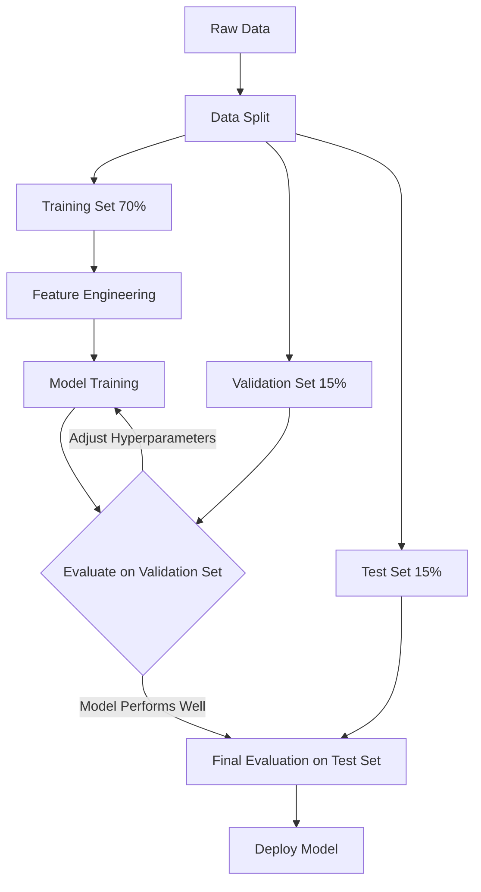

# Machine Learning Basics

**A fundamental overview of machine learning paradigms, workflows, and core concepts essential for applying Spark MLlib effectively.**

## Why It Matters
Before diving into the complexities of distributed algorithms, it is crucial to understand the foundational principles of machine learning. Whether you are building a recommendation engine, detecting fraudulent transactions, or predicting customer churn, the underlying concepts of supervised learning, model evaluation, and the bias-variance tradeoff remain the same. A solid grasp of these basics ensures that you can design robust models, interpret their performance correctly, and diagnose issues when things go wrong, especially when scaling up to massive datasets with Spark.

## How It Works
Machine learning can be broadly categorized into three main paradigms:
1.  **Supervised Learning**: The algorithm learns from labeled data. For example, predicting house prices based on historical sales data (regression) or classifying emails as spam or not spam (classification).
2.  **Unsupervised Learning**: The algorithm learns from unlabeled data, seeking inherent structures or patterns. Examples include grouping customers into segments (clustering) or reducing the number of features (dimensionality reduction).
3.  **Reinforcement Learning**: The algorithm learns by interacting with an environment, receiving rewards or penalties for its actions. (Note: Spark MLlib primarily focuses on supervised and unsupervised learning).

The typical Machine Learning Workflow involves several iterative steps:
1.  **Data Collection & Exploration**: Gathering data and understanding its distribution and quality.
2.  **Feature Engineering**: Cleaning data, handling missing values, encoding categorical variables, and scaling numerical features.
3.  **Model Training**: Selecting an algorithm and fitting it to the training data.
4.  **Evaluation**: Assessing model performance using a separate validation or test dataset.
5.  **Deployment**: Integrating the trained model into a production system for inference.

A critical concept during training is the **Bias-Variance Tradeoff**. 
*   **High Bias (Underfitting)**: The model is too simple and fails to capture the underlying patterns in the data. It performs poorly on both training and test sets.
*   **High Variance (Overfitting)**: The model is too complex and memorizes the training data, including noise. It performs well on the training set but poorly on the unseen test set.
The goal is to find the sweet spot that minimizes both bias and variance, achieving good generalization. To evaluate generalization, data is typically split into Training (e.g., 70%), Validation (e.g., 15%), and Test (e.g., 15%) sets.

Distributed ML (like Spark MLlib) becomes necessary when datasets are simply too large to fit into the memory of a single machine or when training time on a single node becomes prohibitively slow. Spark distributes the data and the computation across a cluster, enabling ML at scale.

## Flow Diagram


## Data Visualization
| Dataset Split | Purpose | Example Size | Role in Bias/Variance |
| :--- | :--- | :--- | :--- |
| **Training Set** | Fit the model parameters (weights). | 70% | Used to minimize training error (reduce bias). |
| **Validation Set** | Tune hyperparameters and evaluate during development. | 15% | Used to detect overfitting (monitor variance). |
| **Test Set** | Final unbiased evaluation of the fully trained model. | 15% | Provides a realistic estimate of production performance. |

## Code Example
```python
# Demonstrating a simple Train/Test split in Spark
from pyspark.sql import SparkSession

spark = SparkSession.builder.appName("ML_Basics").getOrCreate()

# Create dummy data
data = [(1, 10.0, 1.0), (2, 20.0, 0.0), (3, 30.0, 1.0), (4, 40.0, 0.0), (5, 50.0, 1.0)]
df = spark.createDataFrame(data, ["id", "feature1", "label"])

# Split the data into 80% training and 20% testing
# A seed is provided for reproducibility
train_df, test_df = df.randomSplit([0.8, 0.2], seed=42)

print(f"Training Data Count: {train_df.count()}")
print(f"Test Data Count: {test_df.count()}")

# Show a sample of the training data
train_df.show()
```

## Common Pitfalls
*   **Data Leakage**: Accidentally including information from the test set in the training process (e.g., scaling features based on the entire dataset before splitting).
*   **Ignoring the Baseline**: Failing to compare model performance against a simple baseline (e.g., predicting the most frequent class), making it hard to know if the model is actually learning anything useful.
*   **Over-tuning on Validation Data**: Tweaking hyperparameters too many times based on validation performance can lead to overfitting the validation set itself.
*   **Assuming Big Data == Better Model**: Throwing massive amounts of poor-quality data at a complex model usually yields worse results than training a simpler model on clean, well-engineered data.

## Key Takeaway
Understanding the fundamentals of ML workflows and the bias-variance tradeoff is non-negotiable for building models that actually generalize well to unseen data, especially when leveraging distributed systems like Spark.
