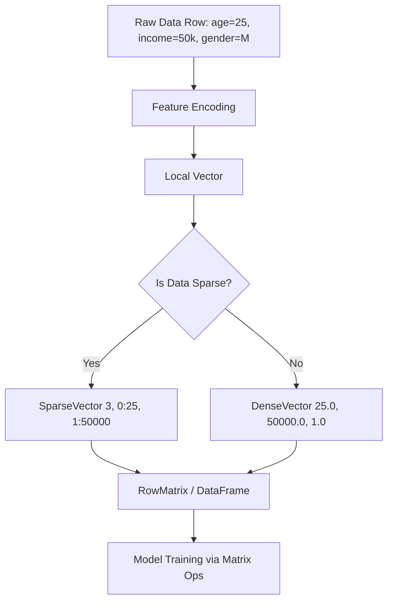

# Linear Algebra for ML

**A deep dive into how linear algebra operations power machine learning algorithms and how vectors and matrices are represented in Spark MLlib.**

## Why It Matters
Machine learning is fundamentally built on linear algebra. When you feed data into an ML algorithm, that data must be represented numerically—specifically, as vectors and matrices. The "learning" process itself involves manipulating these mathematical structures (e.g., taking dot products, multiplying matrices to update weights). Understanding how Spark represents and processes these structures is essential for troubleshooting memory issues, optimizing performance, and understanding what the algorithms are actually doing under the hood.

## How It Works
In machine learning, a single observation (a row of data) is typically represented as a **Vector**, where each element corresponds to a feature. A collection of observations forms a **Matrix**.

Spark MLlib provides specialized data types for distributed linear algebra:
1.  **Local Vectors**: Stored on a single machine. Spark supports two types:
    *   **DenseVector**: Stores all values, including zeros, in an array. Useful when most features have non-zero values.
    *   **SparseVector**: Stores only the non-zero values and their indices. Crucial for memory efficiency when dealing with high-dimensional data (e.g., text processing where most words don't appear in a given document).
2.  **Distributed Matrices**: Stored across the cluster.
    *   **RowMatrix**: A row-oriented distributed matrix without meaningful row indices, backed by an RDD of its rows (each row is a Local Vector).
    *   **IndexedRowMatrix**: Similar to RowMatrix but with meaningful row indices, allowing for row identification and joins.

The core operations involve dot products and matrix multiplication. The prediction of a linear model, for example, is simply the **dot product** of the feature vector and the model's weight vector. The dot product measures the similarity or projection of one vector onto another.

When debugging model behavior, understanding these structures is key. If your model runs out of memory, it might be because you are using DenseVectors for highly sparse data. If your weights are unexpectedly large, you might have collinear features in your matrix.

## Flow Diagram


## Data Visualization
| Data Type | Memory Representation | Best Use Case |
| :--- | :--- | :--- |
| **DenseVector** | `[1.0, 0.0, 0.0, 5.0, 0.0]` | Images, dense numerical data |
| **SparseVector** | `(size=5, indices=[0, 3], values=[1.0, 5.0])` | Text (TF-IDF), one-hot encoded features |
| **RowMatrix** | RDD of Local Vectors | Standard ML training (e.g., PCA, SVD) |

## Code Example
```python
from pyspark.ml.linalg import Vectors
import numpy as np

# 1. Dense Vector: Stores all elements
dv = Vectors.dense([1.0, 0.0, 0.0, 5.0])
print(f"Dense Vector: {dv}")

# 2. Sparse Vector: Stores size, active indices, active values
# Vector of size 4, non-zeros at index 0 and 3
sv = Vectors.sparse(4, [0, 3], [1.0, 5.0])
print(f"Sparse Vector: {sv}")

# 3. Dot Product: Fundamental operation in ML (e.g., Linear Regression prediction)
weight_vector = Vectors.dense([0.5, 0.1, 0.1, 2.0])

# Pyspark ml.linalg Vectors don't natively support dot product easily in python directly
# We usually convert to numpy arrays for local operations if needed, 
# though Spark handles this internally during distributed training.
dot_product = np.dot(dv.toArray(), weight_vector.toArray())
print(f"Dot Product (Prediction): {dot_product}")
```

## Common Pitfalls
*   **Using DenseVectors for Sparse Data**: This leads to OutOfMemory (OOM) errors and extremely slow training times. Always use `SparseVector` for data like TF-IDF vectors or widely one-hot-encoded categorical variables.
*   **Ignoring Feature Scaling**: Matrix operations are sensitive to the magnitude of the values. Unscaled features can cause numerical instability and slow convergence during gradient descent.
*   **Assuming Local Operations Scale**: Trying to collect a massive distributed matrix (like an RDD of vectors) to the driver node using `.collect()` or converting it to a local NumPy array will crash the driver.

## Key Takeaway
Choosing the correct vector representation (Dense vs. Sparse) is the single most impactful optimization you can make when dealing with high-dimensional data in Spark MLlib.


---

## 🎓 Deep Learning Questions

### Q1: Why Was This Concept Introduced?
Historically, implementing machine learning algorithms required manually programming complex mathematical formulas involving matrix transformations and vector manipulations. Early systems struggled to store massive matrices in memory and lacked the ability to process them in parallel. Spark introduced distributed linear algebra structures to overcome these limitations. By providing `DenseVector`, `SparseVector`, and distributed matrices (`RowMatrix`, `IndexedRowMatrix`), Spark allows developers to focus on the modeling logic rather than the low-level math. More importantly, it scales these operations across thousands of machines, enabling the processing of terabytes of high-dimensional data (like text or image features) that would instantly crash a single server.

### Q2: What Exactly Is This Concept and How Does It Work?
At its core, linear algebra in Spark MLlib is a set of abstractions for representing numerical data. A machine learning model doesn't understand "words" or "categories"; it only understands numbers. 
- A **Vector** represents a single row of data (an observation). A `DenseVector` stores an array of all values, while a `SparseVector` only stores non-zero values and their positions, saving tremendous amounts of memory.
- A **Matrix** represents the entire dataset. In Spark, a `RowMatrix` is essentially an RDD (Resilient Distributed Dataset) of Vectors.

When an algorithm trains, it performs mathematical operations—like the **dot product** (multiplying corresponding elements and summing them up)—between the data vectors and the model's internal weight vectors. Spark distributes these calculations across executors, parallelizing the heavy math.

### Q3: Where Should This Concept Be Used?
Distributed linear algebra is the engine under the hood for almost all production machine learning workloads:
- **E-commerce (Amazon, Walmart):** Representing user purchase histories or item characteristics as large, sparse vectors for recommendation engines (Collaborative Filtering).
- **Social Media (Twitter, Meta):** Processing NLP tasks where text is converted into massive TF-IDF matrices (mostly zeros) for sentiment analysis or spam detection.
- **Healthcare & Bioinformatics:** Handling wide datasets with thousands of gene expressions (dense vectors) for predictive modeling.
- **Financial Services:** Representing high-frequency trading indicators as dense vectors for real-time fraud detection models.

### Q4: Where Should This Concept NOT Be Used?
- **Small Datasets:** If your data fits comfortably into the memory of a single machine, using Spark's distributed matrices adds unnecessary overhead. Use standard Python libraries like NumPy, pandas, or scikit-learn instead.
- **Deep Learning Involving Tensors:** Spark's core MLlib is built around 1D vectors and 2D matrices. If you need highly complex multi-dimensional tensor operations (e.g., for training deep neural networks from scratch), frameworks like TensorFlow, PyTorch, or JAX (sometimes run via Spark, but not native MLlib) are the appropriate choices.
- **Non-Numerical Data:** Linear algebra structures cannot hold strings or raw complex objects directly. You must first use transformers (like `StringIndexer` or `OneHotEncoder`) to convert them to vectors.

### Q5: How Is This Concept Different from Hadoop?
| Aspect | Hadoop MapReduce | Apache Spark |
| :--- | :--- | :--- |
| **Architecture** | Disk-based Map and Reduce phases | In-memory distributed matrices and vectors |
| **Performance** | Very slow for iterative math operations | Up to 100x faster due to in-memory caching |
| **Processing Model** | No native linear algebra abstractions | Built-in `DenseVector`, `SparseVector`, `RowMatrix` |
| **Memory Usage** | High disk I/O, lower RAM requirements | High memory usage, optimized by sparse representations |
| **Fault Tolerance** | Replicates data to disk between steps | Lineage graph (DAG) recomputes lost partitions |
| **Scalability** | High, but impractical for ML | Extremely high and designed for iterative ML |
| **Ease of Development** | Requires complex custom math logic | Simple high-level APIs (e.g., `Vectors.dense()`) |
| **Typical Use Cases** | Batch ETL, simple aggregations | Advanced Analytics, Machine Learning, PCA, SVD |
| **Advantages** | Can handle data much larger than RAM | Extremely fast and developer-friendly |
| **Disadvantages** | Not suited for machine learning | Prone to OutOfMemory (OOM) errors if misconfigured |

### Q6: How Can This Concept Be Related to a Traditional RDBMS?
| Spark MLlib Concept | RDBMS Equivalent | Explanation |
| :--- | :--- | :--- |
| **Vector** | A single Table Row | Represents one record (observation) where each dimension is a column. |
| **DenseVector** | A row with no NULLs | Every feature/column has a populated value. |
| **SparseVector** | A row with mostly NULLs/Zeros | Optimized storage that ignores empty columns, saving space. |
| **RowMatrix** | The entire Table | A distributed collection of rows/vectors. |
| **Dot Product** | `SUM(col A * col B)` | Multiplying and summing corresponding feature values and weights. |

### Q7: What Happens Behind the Scenes?
When you train a model in Spark MLlib, a complex orchestration of distributed math occurs:
1. **Driver:** Reads the data and initiates the ML algorithm (e.g., Logistic Regression).
2. **DAG Scheduler:** Breaks the iterative training process into a series of Stages.
3. **Vectors:** Each row of your DataFrame is converted into a `Vector` (Dense or Sparse).
4. **Executors:** The dataset (now an RDD of Vectors) is partitioned across the cluster.
5. **Tasks (Matrix Ops):** Each executor independently calculates partial gradients (using dot products between data vectors and current model weights).
6. **Shuffle/Aggregation:** The partial results are sent back to the driver (or aggregated in a tree-reduce fashion) to update the global model weights.

```text
[Driver Node] -- Broadcasts Model Weights --> [Executors]
                                                  |
[Raw Data Partition] -> [Converted to Vectors] -> [Executors compute Dot Products]
                                                  |
[Updated Global Weights] <---- Aggregates Gradients --/
```

### Q8: Performance Considerations, Best Practices, and Common Mistakes
| Category | Recommendation | Why It Matters |
| :--- | :--- | :--- |
| **Memory** | Use `SparseVector` for mostly zero data. | Text processing generates 99% zero values. Dense vectors will cause instant OOM errors. |
| **Performance** | Normalize or scale your data. | Unscaled features cause numerical instability and make matrix operations take longer to converge. |
| **Best Practice** | Cache datasets before iterative training. | ML algorithms read the same matrix repeatedly. Caching prevents re-reading from disk. |
| **Common Mistake** | Calling `.collect()` on large matrices. | Pulling a distributed matrix to the driver node will exceed its memory and crash the application. |
| **Optimization** | Use BLAS/LAPACK natively. | Spark relies on underlying Fortran/C libraries (netlib-java) for hardware-accelerated math. Ensure they are installed! |

### Q9: Interview Questions

**Beginner**
1. **What is the difference between a `DenseVector` and a `SparseVector`?**
   *Answer:* A `DenseVector` stores all values in an array, including zeros. A `SparseVector` stores only the non-zero values along with their indices, which is highly memory-efficient for sparse data.
2. **Why does MLlib require data to be in Vector format?**
   *Answer:* Machine learning algorithms are based on linear algebra. They perform mathematical operations (like dot products) which require numerical inputs structured as vectors and matrices.
3. **What is a `RowMatrix` in Spark?**
   *Answer:* A `RowMatrix` is a distributed matrix where each row is a local vector. It is backed by an RDD and doesn't maintain meaningful row indices.

**Intermediate**
4. **How would you represent a one-hot encoded categorical variable with 10,000 distinct categories?**
   *Answer:* Using a `SparseVector`. Since only one category is active (1.0) and 9,999 are zero, a sparse representation saves massive amounts of memory.
5. **What happens if you don't scale your features before performing matrix operations in Spark ML?**
   *Answer:* Features with larger magnitudes will dominate the objective function, leading to biased models, numerical instability, and slow convergence during gradient descent.
6. **How does Spark handle the distributed multiplication of a massive matrix?**
   *Answer:* Spark partitions the matrix across executors. Operations like matrix-vector multiplication are performed locally on partitions, and the partial results are aggregated across the network.

**Advanced**
7. **Explain the role of netlib-java in Spark MLlib.**
   *Answer:* Spark MLlib uses netlib-java to access highly optimized, hardware-specific linear algebra libraries (like BLAS and LAPACK) written in C/Fortran, significantly speeding up matrix operations compared to pure Java.
8. **When would you choose an `IndexedRowMatrix` over a `RowMatrix`?**
   *Answer:* You use an `IndexedRowMatrix` when the row index is meaningful and you need to perform operations that require identifying specific rows, joining matrices, or converting to a `CoordinateMatrix`.
9. **How does a high sparsity ratio impact the computational complexity of a dot product?**
   *Answer:* With sparse vectors, the dot product only iterates over the non-zero elements. A high sparsity ratio drastically reduces the number of multiplication operations, speeding up execution exponentially compared to dense vectors.

**Scenario-Based**
10. **You are running a Logistic Regression model on a TF-IDF text dataset, but the Spark job crashes with Java heap space errors on the executors. What is the likely cause?**
    *Answer:* The TF-IDF vectors are likely being stored as `DenseVectors`. Text data is incredibly sparse. Converting them to `SparseVectors` will drastically reduce memory footprint and resolve the OOM error.
11. **You want to calculate the pairwise cosine similarity between 1 million user vectors. How do you approach this in Spark?**
    *Answer:* Pairwise similarity is an $O(N^2)$ operation, which is expensive. Instead of a Cartesian product, use Spark's `RowMatrix.columnSimilarities()` which utilizes DIMSUM (an optimized sampling algorithm for large-scale similarity estimation) to compute it efficiently.

### Q10: Complete Real-World Example

**Business Problem:**
A streaming service (like Netflix) wants to identify similar movies based on user ratings. To optimize storage and compute, they represent user ratings as a distributed matrix and compute similarities.

**Dataset:**
User ratings for different movies. Most users haven't rated most movies, making the data highly sparse.

```python
from pyspark.sql import SparkSession
from pyspark.ml.linalg import Vectors
from pyspark.mllib.linalg.distributed import RowMatrix
import numpy as np

# Initialize SparkSession
spark = SparkSession.builder.appName("MatrixOperations").getOrCreate()

# Sample Dataset: 3 Movies, represented by User Ratings (Features)
# Due to the sparsity of user ratings, we use SparseVectors
# Format: Vectors.sparse(vector_size, [indices], [values])
movie_1 = Vectors.sparse(5, [0, 2, 4], [5.0, 3.0, 4.0]) # User 0, 2, and 4 rated this
movie_2 = Vectors.sparse(5, [1, 2, 3], [4.0, 3.0, 5.0]) # User 1, 2, and 3 rated this
movie_3 = Vectors.sparse(5, [0, 4], [4.0, 5.0])         # User 0 and 4 rated this

# 1. Create an RDD of Vectors
vector_rdd = spark.sparkContext.parallelize([movie_1, movie_2, movie_3])

# 2. Convert to a Distributed RowMatrix
# This distributes the matrix across the cluster
mat = RowMatrix(vector_rdd)

# 3. Compute Column Similarities (Cosine Similarity)
# In this context, columns represent Users.
# This calculates how similar user rating behaviors are across the entire dataset.
similarities = mat.columnSimilarities()

# 4. Extract results (Converting to a local matrix for viewing - ONLY for small results!)
print(f"Matrix Rows: {mat.numRows()}, Matrix Columns: {mat.numCols()}")
print("\nUser Cosine Similarity Matrix:")
print(similarities.toDense().toArray())

# Expected output shows a 5x5 matrix where values represent similarity between users.
# A value of 1.0 means perfect correlation.

# Stop Spark
spark.stop()
```

**Step-by-step execution walkthrough:**
1. We define three sparse vectors, representing three movies and the ratings they received from 5 potential users.
2. We load these vectors into an RDD.
3. We wrap the RDD in a `RowMatrix`, which tells Spark to treat this data as a distributed mathematical matrix.
4. We call `.columnSimilarities()`. Behind the scenes, Spark performs distributed matrix multiplication and normalization to calculate the cosine similarity between every pair of columns (users).
5. The result is returned as an `CoordinateMatrix` which we bring back to the driver as a local dense matrix for printing.

**Performance notes:**
Using `.columnSimilarities()` on a `RowMatrix` is highly optimized in Spark. It avoids a naive $O(N^2)$ cross-join by using block matrix multiplications and can handle matrices with millions of columns without crashing.

### 💡 Key Takeaways
- Machine Learning algorithms require numerical representations of data (Vectors and Matrices).
- `DenseVector` stores all elements; `SparseVector` stores only non-zeros, saving massive amounts of memory for text or categorical data.
- Distributed matrices (like `RowMatrix`) allow Spark to perform complex math across a cluster.
- The fundamental operation in most ML training is the dot product.
- Always scale features and ensure underlying C/Fortran libraries (BLAS) are configured for maximum performance.

### ⚠️ Common Misconceptions
- **"I can just use NumPy for everything in Spark."** False. NumPy works on a single machine. Spark's `RowMatrix` and `Vectors` are needed to distribute math across a cluster.
- **"Sparse vectors change the mathematical result."** False. Sparse and Dense vectors yield the exact same mathematical results (like dot products); they only differ in how they are stored in memory.
- **"Spark calculates ML formulas manually."** False. Spark offloads the heavy lifting to low-level optimized libraries like BLAS and LAPACK via netlib-java whenever possible.

### 🔗 Related Spark Concepts
- Feature Extraction (`TF-IDF`, `Word2Vec`)
- Feature Transformation (`StringIndexer`, `OneHotEncoder`, `StandardScaler`)
- Principal Component Analysis (PCA)
- Collaborative Filtering (ALS)

### 📚 References for Further Reading
- Apache Spark Official Documentation
- Learning Spark (O'Reilly)
- Spark: The Definitive Guide (O'Reilly)
