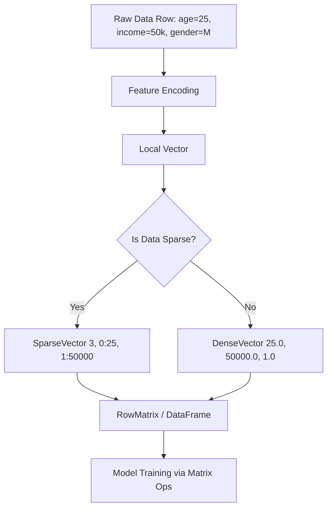

# Linear Algebra for ML

**A deep dive into how linear algebra operations power machine learning algorithms and how vectors and matrices are represented in Spark MLlib.**

## Why It Matters
Machine learning is fundamentally built on linear algebra. When you feed data into an ML algorithm, that data must be represented numerically—specifically, as vectors and matrices. The "learning" process itself involves manipulating these mathematical structures (e.g., taking dot products, multiplying matrices to update weights). Understanding how Spark represents and processes these structures is essential for troubleshooting memory issues, optimizing performance, and understanding what the algorithms are actually doing under the hood.

## How It Works
In machine learning, a single observation (a row of data) is typically represented as a **Vector**, where each element corresponds to a feature. A collection of observations forms a **Matrix**.

Spark MLlib provides specialized data types for distributed linear algebra:
1.  **Local Vectors**: Stored on a single machine. Spark supports two types:
    *   **DenseVector**: Stores all values, including zeros, in an array. Useful when most features have non-zero values.
    *   **SparseVector**: Stores only the non-zero values and their indices. Crucial for memory efficiency when dealing with high-dimensional data (e.g., text processing where most words don't appear in a given document).
2.  **Distributed Matrices**: Stored across the cluster.
    *   **RowMatrix**: A row-oriented distributed matrix without meaningful row indices, backed by an RDD of its rows (each row is a Local Vector).
    *   **IndexedRowMatrix**: Similar to RowMatrix but with meaningful row indices, allowing for row identification and joins.

The core operations involve dot products and matrix multiplication. The prediction of a linear model, for example, is simply the **dot product** of the feature vector and the model's weight vector. The dot product measures the similarity or projection of one vector onto another.

When debugging model behavior, understanding these structures is key. If your model runs out of memory, it might be because you are using DenseVectors for highly sparse data. If your weights are unexpectedly large, you might have collinear features in your matrix.

## Flow Diagram


## Data Visualization
| Data Type | Memory Representation | Best Use Case |
| :--- | :--- | :--- |
| **DenseVector** | `[1.0, 0.0, 0.0, 5.0, 0.0]` | Images, dense numerical data |
| **SparseVector** | `(size=5, indices=[0, 3], values=[1.0, 5.0])` | Text (TF-IDF), one-hot encoded features |
| **RowMatrix** | RDD of Local Vectors | Standard ML training (e.g., PCA, SVD) |

## Code Example
```python
from pyspark.ml.linalg import Vectors
import numpy as np

# 1. Dense Vector: Stores all elements
dv = Vectors.dense([1.0, 0.0, 0.0, 5.0])
print(f"Dense Vector: {dv}")

# 2. Sparse Vector: Stores size, active indices, active values
# Vector of size 4, non-zeros at index 0 and 3
sv = Vectors.sparse(4, [0, 3], [1.0, 5.0])
print(f"Sparse Vector: {sv}")

# 3. Dot Product: Fundamental operation in ML (e.g., Linear Regression prediction)
weight_vector = Vectors.dense([0.5, 0.1, 0.1, 2.0])

# Pyspark ml.linalg Vectors don't natively support dot product easily in python directly
# We usually convert to numpy arrays for local operations if needed, 
# though Spark handles this internally during distributed training.
dot_product = np.dot(dv.toArray(), weight_vector.toArray())
print(f"Dot Product (Prediction): {dot_product}")
```

## Common Pitfalls
*   **Using DenseVectors for Sparse Data**: This leads to OutOfMemory (OOM) errors and extremely slow training times. Always use `SparseVector` for data like TF-IDF vectors or widely one-hot-encoded categorical variables.
*   **Ignoring Feature Scaling**: Matrix operations are sensitive to the magnitude of the values. Unscaled features can cause numerical instability and slow convergence during gradient descent.
*   **Assuming Local Operations Scale**: Trying to collect a massive distributed matrix (like an RDD of vectors) to the driver node using `.collect()` or converting it to a local NumPy array will crash the driver.

## Key Takeaway
Choosing the correct vector representation (Dense vs. Sparse) is the single most impactful optimization you can make when dealing with high-dimensional data in Spark MLlib.
