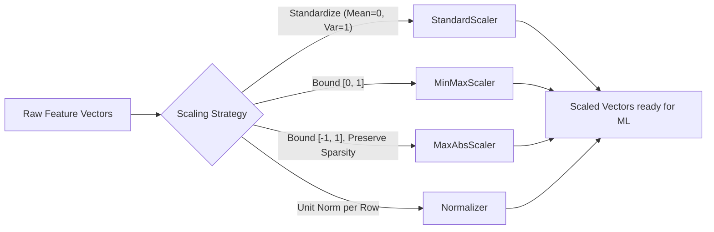

# Feature Scaling

**An essential preprocessing technique to standardize the range of independent variables or features of data.**

## Why It Matters
Feature scaling is absolutely critical in machine learning. Many algorithms—especially those relying on gradient descent (like Linear Regression, Logistic Regression, Neural Networks) and those based on distance calculations (like K-Nearest Neighbors, SVMs, and K-Means clustering)—are highly sensitive to the scale of the input data. If one feature (e.g., salary) ranges from 20,000 to 200,000, and another feature (e.g., age) ranges from 18 to 90, the algorithm will naturally place more weight on the larger feature simply because the numbers are bigger. Feature scaling levels the playing field, ensuring all features contribute proportionately, improving model accuracy and significantly speeding up convergence during training.

## How It Works
Spark MLlib provides several transformers for feature scaling:

1.  **StandardScaler**: Standardizes features by removing the mean and scaling to unit variance. It computes the summary statistics (mean and standard deviation) on the training set and transforms the data such that the resulting distribution has a mean of 0 and a standard deviation of 1.
    *   *Formula*: $z = (x - \mu) / \sigma$
2.  **MinMaxScaler**: Rescales features to lie within a specific range, usually between 0 and 1. This is useful when the data has hard boundaries or when you want to preserve zero entries in sparse data.
    *   *Formula*: $x_{scaled} = (x - x_{min}) / (x_{max} - x_{min})$
3.  **MaxAbsScaler**: Rescales features by dividing through the maximum absolute value in each feature. It scales data to the range [-1, 1]. It does not shift/center the data, making it ideal for sparse data (it preserves sparsity).
4.  **Normalizer**: Unlike the previous scalers which operate on columns (features), the Normalizer scales individual samples (rows) to have unit norm (e.g., L2 norm = 1). Useful in text classification or clustering.

The choice of scaler depends on the algorithm and the data distribution. `StandardScaler` is generally the default choice, but `MinMaxScaler` is preferred when you need strict bounds, and `MaxAbsScaler` is essential for SparseVectors.

## Flow Diagram


## Data Visualization
**Effect of Scaling on Age and Income**

| Original Age | Original Income | StandardScaler Age (approx) | StandardScaler Income (approx) |
| :--- | :--- | :--- | :--- |
| 25 | 40,000 | -1.2 | -0.8 |
| 45 | 80,000 | 0.4 | 0.2 |
| 65 | 150,000| 2.0 | 1.8 |

*Notice how both features are now on a comparable scale around 0, preventing Income from dominating Age.*

## Code Example
```python
from pyspark.ml.feature import StandardScaler, VectorAssembler
from pyspark.sql import SparkSession

spark = SparkSession.builder.appName("FeatureScaling").getOrCreate()

# Create dummy data
data = [(1, 25.0, 40000.0), (2, 45.0, 80000.0), (3, 65.0, 150000.0)]
df = spark.createDataFrame(data, ["id", "age", "income"])

# Assemble features into a vector
assembler = VectorAssembler(inputCols=["age", "income"], outputCol="features")
assembled_df = assembler.transform(df)

# Apply StandardScaler
scaler = StandardScaler(inputCol="features", outputCol="scaled_features", 
                        withStd=True, withMean=True)

# Fit on data (computes mean and std dev)
scaler_model = scaler.fit(assembled_df)

# Transform data (applies scaling)
scaled_df = scaler_model.transform(assembled_df)
scaled_df.select("features", "scaled_features").show(truncate=False)
```

## Common Pitfalls
*   **Scaling Sparse Data with Mean**: Using `StandardScaler(withMean=True)` on a SparseVector will convert it into a DenseVector, potentially causing immediate OutOfMemory errors on large datasets. Use `MaxAbsScaler` or `StandardScaler(withMean=False)` for sparse data.
*   **Data Leakage**: Fitting the scaler on the *entire* dataset (train + test) before splitting. You must fit the scaler *only* on the training data, and then apply that fitted scaler to both train and test sets to avoid leaking information about the test distribution into the training process.
*   **Forgetting to Scale**: The most common pitfall is simply forgetting to scale features before applying algorithms like Logistic Regression with regularization or K-Means, leading to poor model performance.

## Key Takeaway
Never feed raw, unscaled numerical features with vastly different ranges into distance-based or gradient-descent-based ML algorithms; always use transformers like StandardScaler to ensure equitable feature representation.


---

## 🎓 Deep Learning Questions

### Q1: Why Was This Concept Introduced?
Historically, when working with raw numerical datasets, developers observed that machine learning algorithms like K-Means or gradient descent would converge slowly or produce heavily skewed results. This happened because features inherently have different units and magnitudes—for instance, a person's age (0-100) and their annual income ($10,000-$500,000). Before feature scaling, algorithms would place disproportionate importance on the features with larger magnitudes simply because the numerical values were bigger. This mathematically eclipsed smaller but potentially more significant features. Spark MLlib introduced feature scaling transformers (StandardScaler, MinMaxScaler, MaxAbsScaler) directly into its pipeline framework to resolve this. By providing scalable, distributed ways to normalize or standardize data, Spark overcomes the limitations of manually calculating statistics over huge datasets and ensures algorithms learn equally from all features, enabling stable and fast convergence.

### Q2: What Exactly Is This Concept and How Does It Work?
Feature scaling is a preprocessing step that maps disparate numerical feature ranges into a common scale without distorting differences in the ranges of values. 
In Spark, it operates as an Estimator-Transformer pair. First, a scaling estimator (like `StandardScaler`) is `fit()` on the training DataFrame. During this phase, Spark executes distributed aggregations across all partitions to compute global statistics like mean, standard deviation, minimum, or maximum for each feature vector column. These statistics are saved into a Model. 
Next, during the `transform()` phase, this Model applies the respective scaling mathematical formula to every vector. For instance, `StandardScaler` subtracts the global mean from each value and divides by the standard deviation. Because Spark calculates this efficiently across the cluster, it easily scales to billions of rows of vectors, yielding a new DataFrame column of standardized vectors.

### Q3: Where Should This Concept Be Used?
Feature scaling is absolutely critical in scenarios relying on distance metrics or gradient descent optimization. 
- **Recommendation Systems (Netflix, Amazon):** When clustering users (K-Means) based on viewing hours vs. movie count, scaling ensures clusters are spherical rather than stretched along the larger axis.
- **Financial Fraud Detection (Banking):** Logistic regression models predicting fraud need standardized transaction amounts and frequency counts so the optimizer steps efficiently towards the global minimum.
- **Healthcare Risk Prediction:** Using Support Vector Machines (SVMs) to classify disease risk based on patient age, blood pressure, and cell counts. SVMs calculate margins, and without scaling, the feature with the widest range dictates the boundary.
- **Deep Learning:** Any neural network trained via PySpark or integrated frameworks (like Horovod) requires scaled inputs to prevent exploding gradients.

### Q4: Where Should This Concept NOT Be Used?
Feature scaling is largely unnecessary and sometimes counterproductive for tree-based algorithms like Decision Trees, Random Forests, and Gradient-Boosted Trees (XGBoost/LightGBM). These algorithms make splits based on relative ordering and thresholding of single features independently; they do not calculate distances between features or use gradient descent on the feature space. Scaling adds unnecessary computational overhead here.
Additionally, you should be extremely cautious applying standard scaling (with `withMean=True`) to highly sparse data (like TF-IDF text features), as shifting by the mean destroys sparsity, replacing billions of zeros with non-zero dense values, which immediately causes Out-Of-Memory (OOM) crashes in Spark. 

### Q5: How Is This Concept Different from Hadoop?
| Aspect | Hadoop MapReduce | Apache Spark |
| :--- | :--- | :--- |
| **Architecture** | Requires custom MapReduce jobs to compute global max/min, then a second job to apply them. | Built-in Estimator-Transformer Pipeline API. |
| **Performance** | High latency due to HDFS disk I/O between the statistics calculation and the transformation. | In-memory operations; statistics are kept in memory and broadcasted to executors. |
| **Processing Model** | Batch only, writing intermediate states to disk. | Interactive, batch, or streaming via ML Pipelines. |
| **Memory Usage** | Less prone to OOM, but extremely slow. | Efficient sparse/dense vector memory structures. |
| **Fault Tolerance** | Relying on HDFS replication. | Lineage graphs (DAG) allow recomputing lost partitions. |
| **Scalability** | Good, but cumbersome to program. | Excellent, highly optimized linear algebra (BLAS/LAPACK). |
| **Ease of Development** | Very difficult; hundreds of lines of Java code. | Few lines of Python/Scala using `pyspark.ml`. |
| **Typical Use Cases** | Custom ETL scripts. | End-to-end Machine Learning pipelines. |
| **Advantages** | Robust for massive data. | Developer friendly, integrates with cross-validation. |
| **Disadvantages** | No native ML library equivalent to MLlib's ease of use. | Can cause OOM if converting sparse to dense carelessly. |

### Q6: How Can This Concept Be Related to a Traditional RDBMS?
| Spark MLlib Scaler | RDBMS SQL Equivalent Concept | Explanation |
| :--- | :--- | :--- |
| `StandardScaler` | `(val - AVG(val) OVER()) / STDDEV(val) OVER()` | Using window functions to calculate Z-scores. |
| `MinMaxScaler` | `(val - MIN(val) OVER()) / (MAX(val) OVER() - MIN(val) OVER())` | Normalizing values to a 0-1 range using aggregates. |
| `MaxAbsScaler` | `val / MAX(ABS(val)) OVER()` | Scaling relative to the absolute maximum. |
| `VectorAssembler` | `ARRAY[col1, col2, col3]` | Combining individual columns into a unified structure before scaling. |

### Q7: What Happens Behind the Scenes?
When `StandardScaler.fit(df)` is called:
1. **Driver:** Parses the pipeline and creates a DAG. It determines that global statistics (mean, variance) are required.
2. **Tasks & Partitions:** The DataFrame partitions containing `Vector` columns are scanned by Executors. Each Executor computes the local sum, count, and sum of squares for the features in its partition.
3. **Shuffle/Aggregation:** A tree-aggregate mechanism reduces these local statistics back to the Driver to compute the final global mean and standard deviation arrays.
4. **Model Creation:** A `StandardScalerModel` is instantiated on the Driver holding these arrays.
5. **Transform:** During `StandardScalerModel.transform(df)`, the statistics are broadcasted to the Executors. Executors iterate over partitions, applying the $z = (x - \mu)/\sigma$ formula independently to each vector, yielding the new column.

```text
[Driver] -> Define StandardScaler -> Call fit()
   |
   v
[Executors] -> Read Partitions -> Compute local sums/counts (Task)
   |
   v
[Driver] -> TreeAggregate results -> Calculate Global Mean & StdDev -> Create Model
   |
   v
[Executors] -> Receive Broadcasted Stats -> Apply Z-score formula -> Return Scaled Vectors
```

### Q8: Performance Considerations, Best Practices, and Common Mistakes
| Category | Recommendation | Why It Matters |
| :--- | :--- | :--- |
| **Performance** | Use `MaxAbsScaler` for SparseVectors. | Preserves zero values, keeping data sparse. `StandardScaler` with mean centering destroys sparsity and causes OOM. |
| **Best Practice** | Fit on Train, Transform on Train & Test. | Prevents data leakage. Fitting on the entire dataset gives the model knowledge of the test set's distribution. |
| **Best Practice** | Use ML Pipelines. | Bundling `VectorAssembler` and the scaler ensures data is preprocessed consistently during inference. |
| **Common Mistake** | Scaling for Tree-based models. | Wastes CPU and memory; Random Forests do not benefit from scaled features. |
| **Debugging** | Check vector bounds after scaling. | If bounds are infinite or NaN, it usually means standard deviation was zero (a constant feature). Spark's scaler handles this, but it's a data quality red flag. |

### Q9: Interview Questions
**Beginner**
1. **Why do we need feature scaling in machine learning?**
   To ensure features with large numeric ranges do not dominate distance calculations or gradients, allowing equal contribution.
2. **What is the difference between StandardScaler and MinMaxScaler?**
   StandardScaler centers data around 0 with unit variance. MinMaxScaler bounds data precisely (usually 0 to 1).
3. **What does VectorAssembler do before scaling?**
   It concatenates multiple numerical columns into a single vector column, which is the required input format for MLlib scalers.

**Intermediate**
4. **Why shouldn't you fit a scaler on your test data?**
   Because the test data should be completely unseen. Fitting on it leaks its distribution characteristics into the training phase, invalidating the test.
5. **If I have a text dataset converted via TF-IDF (highly sparse), which scaler should I use?**
   Use `MaxAbsScaler` (or `StandardScaler(withMean=False)`). It scales by the absolute maximum without shifting the mean, preserving the zeros (sparsity).
6. **Do Random Forests require feature scaling in Spark?**
   No, tree-based models split on thresholds and are scale-invariant.

**Advanced**
7. **Explain how Spark calculates the standard deviation across a distributed dataset without bringing all data to the driver.**
   Spark uses a single-pass tree aggregation. Executors calculate the local count, sum, and sum of squares for each feature. The driver aggregates these to mathematically derive the global standard deviation using Welford's algorithm or variance formulas.
8. **What happens if a feature has zero variance (constant value) when passed to StandardScaler?**
   Spark's `StandardScaler` will handle the zero-division safely (typically by outputting 0 for that feature), but it indicates a useless feature that should be dropped.
9. **How does feature scaling impact the learning rate in Gradient Descent?**
   Without scaling, the loss landscape is elongated (like a ravine). The optimizer needs a tiny learning rate to avoid overshooting, slowing convergence. Scaling makes the landscape spherical, allowing larger learning rates and faster convergence.

**Scenario-Based**
10. **Your Spark ML pipeline with Logistic Regression crashes with OOM after adding a StandardScaler. What happened?**
    You likely set `withMean=True` on a dataset with SparseVectors. Centering the mean replaces all missing zeros with the negative mean value, converting sparse data to dense and exhausting memory.
11. **You trained a K-Means model on user demographics (Age 18-90, Income 20k-200k). All clusters seem separated purely by income. How do you fix it?**
    Apply a `StandardScaler` to the feature vector before fitting K-Means so the Euclidean distance calculation values Age and Income equally.

### Q10: Complete Real-World Example
**Business Problem:** A retail bank wants to cluster its customers into distinct segments using K-Means to offer targeted credit card products. The features are Customer Age and Account Balance.
**Dataset:** Sparse, varying ranges.

```python
from pyspark.sql import SparkSession
from pyspark.ml.feature import VectorAssembler, StandardScaler
from pyspark.ml.clustering import KMeans
from pyspark.ml import Pipeline

# 1. Initialize Spark
spark = SparkSession.builder.appName("BankCustomerClustering").getOrCreate()

# 2. Sample Dataset (Notice the massive scale difference)
data = [
    (0, 22.0, 1500.0),
    (1, 45.0, 120000.0),
    (2, 25.0, 2100.0),
    (3, 50.0, 140000.0),
    (4, 23.0, 1800.0)
]
df = spark.createDataFrame(data, ["id", "age", "balance"])

# 3. Assemble features
assembler = VectorAssembler(inputCols=["age", "balance"], outputCol="unscaled_features")

# 4. Initialize StandardScaler
# withStd=True scales to unit variance. withMean=True centers to 0.
scaler = StandardScaler(inputCol="unscaled_features", outputCol="features",
                        withStd=True, withMean=True)

# 5. Initialize K-Means
kmeans = KMeans(k=2, seed=1, featuresCol="features", predictionCol="cluster")

# 6. Build the Pipeline
# Ensures transformations happen in the exact right order
pipeline = Pipeline(stages=[assembler, scaler, kmeans])

# 7. Fit the Pipeline (Train the model and scalers)
model = pipeline.fit(df)

# 8. Transform to get predictions
predictions = model.transform(df)

# 9. View Results
predictions.select("id", "age", "balance", "features", "cluster").show(truncate=False)

# Expected Output Note: 
# Without scaling, the K-Means would completely ignore 'age' because 'balance' differences 
# are in the thousands. With scaling, the 'features' column has similar magnitudes.
```

### 💡 Key Takeaways
- Feature scaling ensures all numeric features contribute equally to the model.
- It is mandatory for distance-based (K-Means, KNN) and gradient-descent (Logistic Regression, Neural Nets) algorithms.
- `StandardScaler` is the default (Z-score normalization).
- Use `MaxAbsScaler` for sparse data to avoid Out-Of-Memory errors.
- Always fit the scaler strictly on the training dataset to prevent data leakage.

### ⚠️ Common Misconceptions
- **"Scaling is required for all ML models"** - False. Decision Trees and Random Forests do not need it.
- **"Standardizing means data becomes normally distributed"** - False. Scaling changes the range and mean/variance, but it does not change the underlying shape (skewness/kurtosis) of the distribution.
- **"Applying scaler to the whole dataset is fine before splitting"** - False. This causes data leakage from test to train.

### 🔗 Related Spark Concepts
- VectorAssembler
- Spark ML Pipelines
- Estimators vs Transformers
- K-Means Clustering in MLlib
- Handling Sparse Data

### 📚 References for Further Reading
- Apache Spark Official Documentation
- Learning Spark (O'Reilly)
- Spark: The Definitive Guide (O'Reilly)

