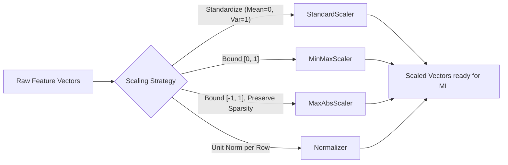

# Feature Scaling

**An essential preprocessing technique to standardize the range of independent variables or features of data.**

## Why It Matters
Feature scaling is absolutely critical in machine learning. Many algorithms—especially those relying on gradient descent (like Linear Regression, Logistic Regression, Neural Networks) and those based on distance calculations (like K-Nearest Neighbors, SVMs, and K-Means clustering)—are highly sensitive to the scale of the input data. If one feature (e.g., salary) ranges from 20,000 to 200,000, and another feature (e.g., age) ranges from 18 to 90, the algorithm will naturally place more weight on the larger feature simply because the numbers are bigger. Feature scaling levels the playing field, ensuring all features contribute proportionately, improving model accuracy and significantly speeding up convergence during training.

## How It Works
Spark MLlib provides several transformers for feature scaling:

1.  **StandardScaler**: Standardizes features by removing the mean and scaling to unit variance. It computes the summary statistics (mean and standard deviation) on the training set and transforms the data such that the resulting distribution has a mean of 0 and a standard deviation of 1.
    *   *Formula*: $z = (x - \mu) / \sigma$
2.  **MinMaxScaler**: Rescales features to lie within a specific range, usually between 0 and 1. This is useful when the data has hard boundaries or when you want to preserve zero entries in sparse data.
    *   *Formula*: $x_{scaled} = (x - x_{min}) / (x_{max} - x_{min})$
3.  **MaxAbsScaler**: Rescales features by dividing through the maximum absolute value in each feature. It scales data to the range [-1, 1]. It does not shift/center the data, making it ideal for sparse data (it preserves sparsity).
4.  **Normalizer**: Unlike the previous scalers which operate on columns (features), the Normalizer scales individual samples (rows) to have unit norm (e.g., L2 norm = 1). Useful in text classification or clustering.

The choice of scaler depends on the algorithm and the data distribution. `StandardScaler` is generally the default choice, but `MinMaxScaler` is preferred when you need strict bounds, and `MaxAbsScaler` is essential for SparseVectors.

## Flow Diagram


## Data Visualization
**Effect of Scaling on Age and Income**

| Original Age | Original Income | StandardScaler Age (approx) | StandardScaler Income (approx) |
| :--- | :--- | :--- | :--- |
| 25 | 40,000 | -1.2 | -0.8 |
| 45 | 80,000 | 0.4 | 0.2 |
| 65 | 150,000| 2.0 | 1.8 |

*Notice how both features are now on a comparable scale around 0, preventing Income from dominating Age.*

## Code Example
```python
from pyspark.ml.feature import StandardScaler, VectorAssembler
from pyspark.sql import SparkSession

spark = SparkSession.builder.appName("FeatureScaling").getOrCreate()

# Create dummy data
data = [(1, 25.0, 40000.0), (2, 45.0, 80000.0), (3, 65.0, 150000.0)]
df = spark.createDataFrame(data, ["id", "age", "income"])

# Assemble features into a vector
assembler = VectorAssembler(inputCols=["age", "income"], outputCol="features")
assembled_df = assembler.transform(df)

# Apply StandardScaler
scaler = StandardScaler(inputCol="features", outputCol="scaled_features", 
                        withStd=True, withMean=True)

# Fit on data (computes mean and std dev)
scaler_model = scaler.fit(assembled_df)

# Transform data (applies scaling)
scaled_df = scaler_model.transform(assembled_df)
scaled_df.select("features", "scaled_features").show(truncate=False)
```

## Common Pitfalls
*   **Scaling Sparse Data with Mean**: Using `StandardScaler(withMean=True)` on a SparseVector will convert it into a DenseVector, potentially causing immediate OutOfMemory errors on large datasets. Use `MaxAbsScaler` or `StandardScaler(withMean=False)` for sparse data.
*   **Data Leakage**: Fitting the scaler on the *entire* dataset (train + test) before splitting. You must fit the scaler *only* on the training data, and then apply that fitted scaler to both train and test sets to avoid leaking information about the test distribution into the training process.
*   **Forgetting to Scale**: The most common pitfall is simply forgetting to scale features before applying algorithms like Logistic Regression with regularization or K-Means, leading to poor model performance.

## Key Takeaway
Never feed raw, unscaled numerical features with vastly different ranges into distance-based or gradient-descent-based ML algorithms; always use transformers like StandardScaler to ensure equitable feature representation.
