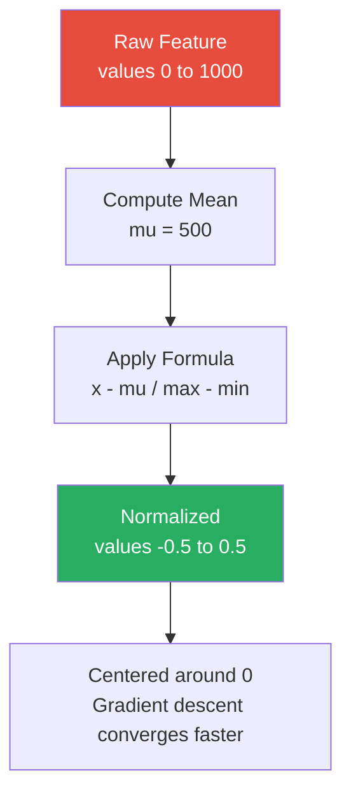

# Mean Normalization

**A data scaling technique that centers features around zero by subtracting the mean and dividing by the range.**

## Why It Matters
While StandardScaler (Standardization) is the most common scaling technique, Mean Normalization is a closely related alternative. It is particularly useful when you want to bound your data strictly (often between -1 and 1) while also centering it around zero. This centering is crucial for optimization algorithms like gradient descent. If all input features are strictly positive, the gradients will all have the same sign, forcing the algorithm to take a zigzag path towards the minimum, significantly slowing down convergence. Centering the data ensures a more direct path to the global minimum.

## How It Works
Mean Normalization transforms the data using the following formula:

$x' = \frac{x - \text{mean}(x)}{\max(x) - \min(x)}$

Here is how it compares to standard scaling:
*   **Standardization (Z-score)**: Subtracts the mean and divides by the *standard deviation*. The resulting data has a mean of 0 and a standard deviation of 1. It does not bound the data to a specific range (outliers remain outliers).
*   **Mean Normalization**: Subtracts the mean and divides by the *range* (max - min). The resulting data is centered at 0 and is strictly bounded between -1 and 1. 

**When to use which?**
*   Use **Standardization** (Spark's `StandardScaler`) as the default, especially if the data has extreme outliers, as dividing by standard deviation handles variance better than dividing by the range.
*   Use **Mean Normalization** when you specifically need the data to be centered at zero AND bounded within a known interval (e.g., in certain neural network architectures or signal processing tasks).

*Note*: Spark MLlib does not have a built-in `MeanNormalizer` class. To achieve this in Spark, you typically use an `SQLTransformer` or a custom combination of DataFrame operations, or apply a `StandardScaler` with `withMean=True` and `withStd=False` followed by a custom division by range.

## Flow Diagram


## Data Visualization
**Worked Example:**
Feature Values: `[10, 20, 30, 40, 50]`
*   Mean = 30
*   Min = 10, Max = 50, Range = 40

| Original (x) | x - mean | (x - mean) / Range |
| :--- | :--- | :--- |
| 10 | -20 | -0.5 |
| 20 | -10 | -0.25 |
| 30 | 0 | 0.0 |
| 40 | 10 | 0.25 |
| 50 | 20 | 0.5 |

## Code Example
```python
from pyspark.sql import SparkSession
import pyspark.sql.functions as F

spark = SparkSession.builder.appName("MeanNormalization").getOrCreate()

# Create dummy data
data = [(1, 10.0), (2, 20.0), (3, 30.0), (4, 40.0), (5, 50.0)]
df = spark.createDataFrame(data, ["id", "feature_x"])

# 1. Calculate Mean, Min, and Max
stats = df.select(
    F.mean("feature_x").alias("mean"),
    F.min("feature_x").alias("min"),
    F.max("feature_x").alias("max")
).collect()[0]

mean_val = stats["mean"]
range_val = stats["max"] - stats["min"]

# 2. Apply Mean Normalization using DataFrame operations
# (This is often faster than UDFs or complex pipeline components for simple math)
normalized_df = df.withColumn(
    "feature_x_normalized",
    (F.col("feature_x") - mean_val) / range_val
)

normalized_df.show()
```

## Common Pitfalls
*   **Outlier Sensitivity**: Because Mean Normalization divides by the range (max - min), a single extreme outlier will completely squash the rest of the data. If your max is 1,000,000 and the rest of the data is between 1 and 10, all normalized values will be extremely close to 0. Standardization is more robust to this.
*   **Applying to Sparse Data**: Centering data (subtracting the mean) destroys sparsity. If you have a SparseVector with 99% zeros, subtracting the mean turns it into a DenseVector where 99% of the values are now slightly negative. This will cause memory explosions.
*   **Missing Built-in Support**: Spending hours looking for `MeanNormalizer` in Spark's MLlib. It doesn't exist out of the box; you must implement it manually via DataFrame functions or custom Transformers.

## Key Takeaway
Mean normalization effectively centers and bounds data to speed up gradient descent, but it must be avoided for sparse datasets or data with extreme outliers.


---

## 🎓 Deep Learning Questions

### Q1: Why Was This Concept Introduced?
Before advanced scaling techniques, machine learning models trained on raw features often struggled with convergence. If a dataset had features with vastly different ranges (e.g., age from 0-100 and income from $0-$1,000,000), algorithms like gradient descent would spend an enormous amount of time oscillating because gradients are proportional to the input scales. Furthermore, if all features were positive, the gradients would share the same sign, forcing the optimizer into a slow, zigzag trajectory toward the global minimum. Mean Normalization was introduced to solve both problems simultaneously. By centering the features around zero (subtracting the mean), it balances the gradient signs. By scaling based on the total range, it bounds the data (usually between -1 and 1), ensuring that no single feature dominates the objective function, thereby leading to much faster and more stable model training.

### Q2: What Exactly Is This Concept and How Does It Work?
Mean Normalization is a feature scaling technique that modifies the values of a numeric column so that they have a mean of zero and are strictly bounded within a fixed interval based on their original range. 

**How it works mathematically:**
For every value $x$ in a feature column, the normalized value $x'$ is calculated as:
$x' = \frac{x - \mu}{x_{max} - x_{min}}$
Where $\mu$ is the mean of the feature, $x_{max}$ is the maximum value, and $x_{min}$ is the minimum value.

**Execution Flow in Spark:**
Since Spark MLlib does not have a native `MeanNormalizer` class, this process is usually executed using a two-pass approach over a DataFrame. The first pass aggregates the entire dataset to compute the mean, min, and max for the target columns. The second pass applies a mathematical transformation to every row in parallel using these broadcasted scalar values. This two-step process ensures distributed calculation without pulling large data to the driver, except for the final scalar aggregates.

### Q3: Where Should This Concept Be Used?
Mean Normalization is highly beneficial in specific production environments and algorithmic scenarios:
*   **Deep Learning & Neural Networks:** Neural networks (used heavily in Tech and Healthcare) often expect inputs centered around zero to initialize weights effectively and prevent vanishing/exploding gradients.
*   **Image & Signal Processing:** In media companies like Netflix or healthcare imaging, pixel intensities or signal frequencies are often mean-normalized to remove baseline brightness/noise.
*   **Collaborative Filtering:** When building recommendation systems (e.g., Amazon, Uber Eats), centering user ratings around zero helps the model easily distinguish between a user's "above average" (positive) and "below average" (negative) preferences.
*   **K-Means Clustering & KNN:** Distance-based algorithms perform better when all features are uniformly bounded, preventing features with large numeric ranges from disproportionately influencing the distance metric.

### Q4: Where Should This Concept NOT Be Used?
*   **Sparse Data Handling:** Mean Normalization subtracts a non-zero mean from every value. If applied to a highly sparse matrix (e.g., TF-IDF word counts in NLP), all the zeroes will become non-zero. This destroys sparsity, converting it into a dense matrix and causing catastrophic memory explosions (OOM errors) in Spark.
*   **Data with Extreme Outliers:** Because the denominator is the exact range ($Max - Min$), a single massive outlier will inflate the denominator. This squashes 99% of your legitimate data points into a tiny band near zero, destroying signal variance. Use Z-score Standardization or Robust Scaling instead.
*   **Tree-based Models:** Algorithms like Random Forests and Gradient Boosted Trees (XGBoost) split nodes based on order, not scale. Normalizing features wastes computation and adds unnecessary complexity to the pipeline.

### Q5: How Is This Concept Different from Hadoop?

| Aspect | Hadoop MapReduce | Apache Spark |
| :--- | :--- | :--- |
| **Architecture** | Requires writing custom Mapper and Reducer Java classes. | Handled easily via DataFrame API using `withColumn` and built-in aggregations. |
| **Performance** | Multi-pass algorithms (calculate stats, then apply) write to disk between Map/Reduce steps, causing massive IO bottlenecks. | Computes aggregates via memory and applies transformations dynamically in memory. |
| **Processing Model** | Batch-only, disk-backed. | In-memory DAG execution. |
| **Memory Usage** | Low, but slow due to constant disk spilling. | High, requires tuning for large datasets. |
| **Fault Tolerance** | Replicates data across HDFS nodes. | Uses RDD lineage to recompute lost partitions. |
| **Scalability** | Excellent for batch but painfully slow for ML pre-processing. | Industry standard for scalable ML pipelines. |
| **Ease of Development**| Very complex; manual implementation of math. | Simple SQL-like declarative syntax. |
| **Typical Use Cases** | Heavy batch ETL logs processing. | Machine Learning preprocessing, interactive analytics. |
| **Advantages** | Robust for long-running jobs. | Speed, conciseness, ML integration. |
| **Disadvantages** | Unsuitable for iterative ML tasks. | Can suffer from OOM if sparsity is destroyed. |

### Q6: How Can This Concept Be Related to a Traditional RDBMS?

| Aspect | Traditional RDBMS (SQL) | Apache Spark |
| :--- | :--- | :--- |
| **Execution** | Uses Window functions or scalar subqueries to compute min/max/avg and apply to rows. | Uses distributed aggregation (`F.mean()`) and lazy evaluation on DataFrames. |
| **Scale** | Limited to single-node resources (vertical scaling). | Distributed across thousands of worker nodes (horizontal scaling). |
| **Data Types** | Operates on primitive SQL types (INT, FLOAT). | Can operate on complex `Vector` types for ML pipelines using UDFs or VectorAssembler. |
| **Integration** | Requires moving data out of the DB to train ML models. | Data stays in the cluster; seamlessly integrates with Spark MLlib. |
| **Query Engine** | Standard SQL query planner. | Catalyst Optimizer optimizes physical execution plans for data transformations. |

### Q7: What Happens Behind the Scenes?
The process involves two main phases: Action (aggregation) and Transformation.

1.  **Driver Phase (Action):** The Spark Driver receives the code to compute `mean`, `min`, and `max`. 
2.  **DAG & Stages:** Catalyst Optimizer creates a physical plan consisting of an Exchange (Shuffle) to perform partial aggregations on Executors and a final aggregation.
3.  **Executors (Pass 1):** Tasks read partitions, calculate local sum, count, min, and max, and send results back to the driver. The driver computes the final global statistics.
4.  **Transformation (Pass 2):** The driver creates a new DataFrame lineage involving a `withColumn` operation. The calculated scalar values (`mean_val`, `range_val`) are embedded directly into the task closures.
5.  **Executors (Pass 2):** When a final action (like `.write` or `.show()`) is called, executors process partitions in parallel, applying the `(x - mean) / range` formula row-by-row in memory.

```text
[Driver] --> Extract Code
   |
   v
[DAG Scheduler] --> Create 2-stage Aggregation Plan
   |
   v
[Executors] --> Read Partitions --> Compute Local Min/Max/Sum (Stage 1)
   |
   v
[Shuffle] --> Aggregate Global Stats on Driver (Action)
   |
   v
[Driver] --> Inject Scalars into Formula --> Plan Pass 2
   |
   v
[Executors] --> Apply Formula (x - mu) / range row-by-row in memory (Stage 2)
```

### Q8: Performance Considerations, Best Practices, and Common Mistakes

| Category | Recommendation | Why It Matters |
| :--- | :--- | :--- |
| **Performance** | Avoid using Python UDFs to perform the mathematical scaling. | Native `pyspark.sql.functions` are optimized by Catalyst and run in the JVM without serialization overhead. |
| **Best Practice** | Cache the dataset if it's reused heavily before calculating stats. | Prevents Spark from re-reading the source data multiple times (once for stats, once for applying). |
| **Common Mistake** | Applying Mean Normalization to Sparse Vectors (like TF-IDF). | Destroys sparsity by turning zeroes into negative values, leading to instant memory explosion (OOM). |
| **Data Quality** | Perform outlier removal/clipping *before* Mean Normalization. | Because it divides by range, a single outlier compresses the rest of your data into a useless narrow band. |
| **Production Tip** | Save the calculated `mean`, `min`, and `max` values as metadata. | You must apply the exact same scaling parameters from the training set to your inference/test data. |

### Q9: Interview Questions

**Beginner**
1.  *What is the main goal of Mean Normalization?* 
    To center feature data around zero and bound it strictly based on the range to improve the convergence speed of gradient descent.
2.  *What is the formula for Mean Normalization?* 
    (Value - Mean) / (Max - Min).
3.  *Why doesn't Spark MLlib have a built-in `MeanNormalizer`?* 
    Because standardizing via Z-score (`StandardScaler` with mean and std) is far more common, but mean normalization can be easily constructed using basic DataFrame API operations.

**Intermediate**
1.  *Why is it dangerous to apply Mean Normalization to NLP TF-IDF data?* 
    TF-IDF data is highly sparse (mostly zeroes). Mean normalization subtracts the mean, turning all zeroes into non-zero floats, destroying the sparse matrix format and causing Memory/OOM errors.
2.  *How does Mean Normalization differ from Standardization (Z-score)?* 
    Standardization divides by standard deviation (unbounded, robust to outliers), while Mean Normalization divides by the range (strictly bounded, highly sensitive to outliers).
3.  *How would you implement this scaling in PySpark without a native MLlib class?* 
    By calculating global min, max, and mean using `pyspark.sql.functions`, fetching them to the driver with `.collect()`, and applying them via `withColumn`.

**Advanced**
1.  *How do you handle applying the same normalization parameters to streaming inference data?* 
    You cannot calculate min/max/mean on streaming batches effectively for global scaling. You must compute these statistics on the historical training data, persist them (e.g., in a DB or config), and inject them as constants in the streaming job's `withColumn` transformation.
2.  *Explain the Catalyst optimizer's role when executing your custom `withColumn` normalization.* 
    Catalyst evaluates the mathematical expression. Because the mean and range are passed as literal constants, Catalyst performs constant folding and generates optimized, unrolled JVM bytecode (Whole-Stage Code Generation) to process the rows incredibly fast.
3.  *If your data is strongly skewed, is Mean Normalization a good choice?* 
    No. The denominator (range) will be dominated by the long tail, squishing the dense part of your distribution to nearly a single value. Log transformation or RobustScaler is better for skewed data.

**Scenario-Based**
1.  *Your PySpark ML training pipeline is taking days to converge on a linear regression model. The features are raw integer counts (e.g., 0 to 50,000). What do you do?* 
    The differing scales are causing gradient descent to zigzag slowly. I would implement Mean Normalization (or Standardization) to center the data around zero and bound it, which smooths the gradient steps and accelerates convergence.
2.  *You normalized your data using `max - min`, but after training, the model performs terribly. Looking at the normalized data, almost all values are exactly 0.0001 or 0.0. What happened?* 
    You had massive outliers. If the max value is 10,000,000 but 99% of data is between 0-10, dividing by the range squashes the valid data into an incredibly small fraction. I should clip outliers before normalizing.

### Q10: Complete Real-World Example

**Business Problem:**
A streaming service (like Netflix) wants to build a collaborative filtering recommendation engine. User ratings range from 1 to 5 stars. However, some users are harsh critics (average rating 2), and some are generous (average rating 4.5). The data science team wants to "Mean Normalize" each user's ratings so that 0 represents their personal average, positive values represent above-average affinity, and negative values mean dislike.

**Sample Dataset:**
Users and their ratings for various movies.

**PySpark Code:**
```python
from pyspark.sql import SparkSession
import pyspark.sql.functions as F
from pyspark.sql.window import Window

# 1. Initialize Spark
spark = SparkSession.builder.appName("NetflixMeanNormalization").getOrCreate()

# 2. Sample User-Movie Ratings Data
data = [
    ("User_A", "Movie_1", 5.0), ("User_A", "Movie_2", 3.0), ("User_A", "Movie_3", 1.0),
    ("User_B", "Movie_1", 5.0), ("User_B", "Movie_4", 4.0), ("User_B", "Movie_5", 5.0)
]
df = spark.createDataFrame(data, ["user_id", "movie_id", "rating"])

# 3. Define a Window partitioned by user
# We are doing Mean Normalization per-user, not globally!
user_window = Window.partitionBy("user_id")

# 4. Calculate per-user statistics inline
df_stats = df.withColumn("user_mean", F.mean("rating").over(user_window)) \
             .withColumn("user_max", F.max("rating").over(user_window)) \
             .withColumn("user_min", F.min("rating").over(user_window))

# 5. Apply Mean Normalization Formula
# Edge case: If a user gave all movies the same rating, Max-Min = 0. We use a when/otherwise to avoid division by zero.
normalized_df = df_stats.withColumn(
    "rating_range", F.col("user_max") - F.col("user_min")
).withColumn(
    "normalized_rating",
    F.when(F.col("rating_range") == 0, 0.0) # If range is 0, centering to 0 is safest
     .otherwise((F.col("rating") - F.col("user_mean")) / F.col("rating_range"))
)

# 6. Show results
normalized_df.select("user_id", "movie_id", "rating", "normalized_rating").orderBy("user_id", "movie_id").show()
```

**Expected Output:**
```text
+-------+--------+------+-------------------+
|user_id|movie_id|rating|  normalized_rating|
+-------+--------+------+-------------------+
| User_A| Movie_1|   5.0|                0.5|
| User_A| Movie_2|   3.0|                0.0|
| User_A| Movie_3|   1.0|               -0.5|
| User_B| Movie_1|   5.0| 0.3333333333333333|
| User_B| Movie_4|   4.0|-0.6666666666666666|
| User_B| Movie_5|   5.0| 0.3333333333333333|
+-------+--------+------+-------------------+
```

**Performance Notes:**
Window functions can trigger heavy shuffles. If the dataset has billions of ratings, ensure `user_id` is properly salted or partitioned to avoid data skew (e.g., if one user has 100,000 ratings while others have 10). 

### 💡 Key Takeaways
- Mean Normalization centers data at 0 and strict bounds it based on the data's range.
- It is crucial for stabilizing and accelerating gradient descent in deep learning.
- PySpark lacks a built-in `MeanNormalizer` class, so developers use DataFrame API expressions.
- It destroys data sparsity; never use it on one-hot encoded or TF-IDF sparse matrices.
- Extreme outliers heavily distort the normalized results, requiring pre-processing (clipping).

### ⚠️ Common Misconceptions
- **"It's the same as Standardization"**: False. Standardization divides by standard deviation (unbounded), while this divides by range (bounded).
- **"Spark handles it natively in MLlib"**: False. You must manually orchestrate it using `withColumn` and aggregates or build a custom Transformer.
- **"It fixes skewed distributions"**: False. Normalization just linearly shifts and scales data; it does not change the shape of the distribution.

### 🔗 Related Spark Concepts
- StandardScaler (Spark MLlib)
- RobustScaler (Spark MLlib)
- MinMaxScaler (Spark MLlib)
- Custom MLlib Transformers
- Spark SQL Aggregation and Window Functions

### 📚 References for Further Reading
- Apache Spark Official Documentation
- Learning Spark (O'Reilly)
- Spark: The Definitive Guide (O'Reilly)
