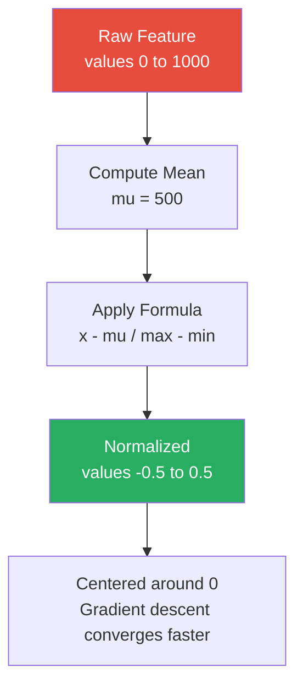

# Mean Normalization

**A data scaling technique that centers features around zero by subtracting the mean and dividing by the range.**

## Why It Matters
While StandardScaler (Standardization) is the most common scaling technique, Mean Normalization is a closely related alternative. It is particularly useful when you want to bound your data strictly (often between -1 and 1) while also centering it around zero. This centering is crucial for optimization algorithms like gradient descent. If all input features are strictly positive, the gradients will all have the same sign, forcing the algorithm to take a zigzag path towards the minimum, significantly slowing down convergence. Centering the data ensures a more direct path to the global minimum.

## How It Works
Mean Normalization transforms the data using the following formula:

$x' = \frac{x - \text{mean}(x)}{\max(x) - \min(x)}$

Here is how it compares to standard scaling:
*   **Standardization (Z-score)**: Subtracts the mean and divides by the *standard deviation*. The resulting data has a mean of 0 and a standard deviation of 1. It does not bound the data to a specific range (outliers remain outliers).
*   **Mean Normalization**: Subtracts the mean and divides by the *range* (max - min). The resulting data is centered at 0 and is strictly bounded between -1 and 1. 

**When to use which?**
*   Use **Standardization** (Spark's `StandardScaler`) as the default, especially if the data has extreme outliers, as dividing by standard deviation handles variance better than dividing by the range.
*   Use **Mean Normalization** when you specifically need the data to be centered at zero AND bounded within a known interval (e.g., in certain neural network architectures or signal processing tasks).

*Note*: Spark MLlib does not have a built-in `MeanNormalizer` class. To achieve this in Spark, you typically use an `SQLTransformer` or a custom combination of DataFrame operations, or apply a `StandardScaler` with `withMean=True` and `withStd=False` followed by a custom division by range.

## Flow Diagram


## Data Visualization
**Worked Example:**
Feature Values: `[10, 20, 30, 40, 50]`
*   Mean = 30
*   Min = 10, Max = 50, Range = 40

| Original (x) | x - mean | (x - mean) / Range |
| :--- | :--- | :--- |
| 10 | -20 | -0.5 |
| 20 | -10 | -0.25 |
| 30 | 0 | 0.0 |
| 40 | 10 | 0.25 |
| 50 | 20 | 0.5 |

## Code Example
```python
from pyspark.sql import SparkSession
import pyspark.sql.functions as F

spark = SparkSession.builder.appName("MeanNormalization").getOrCreate()

# Create dummy data
data = [(1, 10.0), (2, 20.0), (3, 30.0), (4, 40.0), (5, 50.0)]
df = spark.createDataFrame(data, ["id", "feature_x"])

# 1. Calculate Mean, Min, and Max
stats = df.select(
    F.mean("feature_x").alias("mean"),
    F.min("feature_x").alias("min"),
    F.max("feature_x").alias("max")
).collect()[0]

mean_val = stats["mean"]
range_val = stats["max"] - stats["min"]

# 2. Apply Mean Normalization using DataFrame operations
# (This is often faster than UDFs or complex pipeline components for simple math)
normalized_df = df.withColumn(
    "feature_x_normalized",
    (F.col("feature_x") - mean_val) / range_val
)

normalized_df.show()
```

## Common Pitfalls
*   **Outlier Sensitivity**: Because Mean Normalization divides by the range (max - min), a single extreme outlier will completely squash the rest of the data. If your max is 1,000,000 and the rest of the data is between 1 and 10, all normalized values will be extremely close to 0. Standardization is more robust to this.
*   **Applying to Sparse Data**: Centering data (subtracting the mean) destroys sparsity. If you have a SparseVector with 99% zeros, subtracting the mean turns it into a DenseVector where 99% of the values are now slightly negative. This will cause memory explosions.
*   **Missing Built-in Support**: Spending hours looking for `MeanNormalizer` in Spark's MLlib. It doesn't exist out of the box; you must implement it manually via DataFrame functions or custom Transformers.

## Key Takeaway
Mean normalization effectively centers and bounds data to speed up gradient descent, but it must be avoided for sparse datasets or data with extreme outliers.
