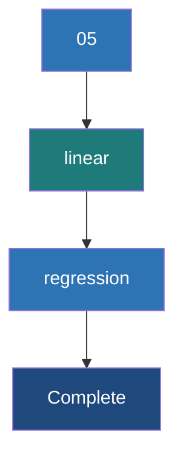

# Linear Regression

**A foundational supervised learning algorithm used to predict a continuous numerical output based on one or more input features.**

## Why It Matters
Linear regression is the workhorse of statistical modeling and machine learning. Despite the rise of complex neural networks, linear regression remains heavily used because it is highly interpretable, fast to train, and computationally efficient at scale. When you need to predict a continuous value—like forecasting daily sales, estimating housing prices, or predicting a user's lifetime value—Linear Regression is usually the first algorithm you should try.

## How It Works
The goal of Linear Regression is to fit a straight line (or hyperplane in higher dimensions) through the data that best models the relationship between the independent variables (features) and the dependent variable (label).

**1. The Hypothesis Function**: 
$h_\theta(x) = \theta_0 + \theta_1 x_1 + \theta_2 x_2 + ... + \theta_n x_n$
Where $\theta$ represents the weights (coefficients) and $x$ represents the features. $\theta_0$ is the intercept.

**2. The Cost Function (MSE)**:
To find the "best" line, we need to measure how wrong the current line is. We use Mean Squared Error (MSE):
$J(\theta) = \frac{1}{2m} \sum_{i=1}^{m} (h_\theta(x^{(i)}) - y^{(i)})^2$
The goal is to find the weights $\theta$ that minimize this cost function.

**3. Gradient Descent**:
Gradient descent minimizes the cost function by iteratively updating the weights in the opposite direction of the gradient of the cost function.
Update rule: $\theta_j := \theta_j - \alpha \frac{\partial}{\partial \theta_j} J(\theta)$
Where $\alpha$ is the **Learning Rate** (step size). 
*   **Batch Gradient Descent**: Uses the entire dataset to compute the gradient. Slow but stable.
*   **Stochastic Gradient Descent (SGD)**: Uses one example per step. Fast but noisy.
*   **Mini-Batch Gradient Descent**: Uses a small batch. The sweet spot used by most modern frameworks, including Spark.

**Evaluation**:
Model performance is typically evaluated using:
*   **RMSE (Root Mean Squared Error)**: The average distance between predicted and actual values.
*   **R-squared ($R^2$)**: The proportion of variance in the dependent variable explained by the model (1.0 is perfect).

## Flow Diagram


## Data Visualization
**Predicting House Prices**

| Size (sq ft) | Bedrooms | Actual Price | Predicted Price | Error | Squared Error |
| :--- | :--- | :--- | :--- | :--- | :--- |
| 1500 | 3 | $300k | $290k | -$10k | 100 |
| 2000 | 4 | $450k | $460k | +$10k | 100 |
| 1200 | 2 | $200k | $215k | +$15k | 225 |
| **Sum** | | | | | **MSE = 141.6** |

## Code Example
```python
from pyspark.ml.regression import LinearRegression
from pyspark.ml.evaluation import RegressionEvaluator
from pyspark.ml.feature import VectorAssembler
from pyspark.sql import SparkSession

spark = SparkSession.builder.appName("LinearReg").getOrCreate()

# Dummy house price data
data = [(1500.0, 3.0, 300000.0), (2000.0, 4.0, 450000.0), (1200.0, 2.0, 200000.0), (2500.0, 4.0, 500000.0)]
df = spark.createDataFrame(data, ["sqft", "bedrooms", "price"])

# Assemble features
assembler = VectorAssembler(inputCols=["sqft", "bedrooms"], outputCol="features")
df_assembled = assembler.transform(df)

train_data, test_data = df_assembled.randomSplit([0.8, 0.2], seed=42)

# Define Linear Regression
lr = LinearRegression(featuresCol="features", labelCol="price", maxIter=10, regParam=0.3, elasticNetParam=0.8)

# Fit the model
lr_model = lr.fit(train_data)

# Print Coefficients and Intercept
print(f"Coefficients: {lr_model.coefficients}")
print(f"Intercept: {lr_model.intercept}")

# Evaluate
predictions = lr_model.transform(test_data)
evaluator = RegressionEvaluator(labelCol="price", predictionCol="prediction", metricName="rmse")
rmse = evaluator.evaluate(predictions)
print(f"Root Mean Squared Error (RMSE) on test data = {rmse}")
```

## Common Pitfalls
*   **Collinearity**: Using features that are highly correlated with each other (e.g., predicting house price using both "Square Feet" and "Square Meters"). This makes the matrix operations unstable and the coefficients uninterpretable.
*   **Ignoring Outliers**: MSE heavily penalizes large errors. A single massive outlier (e.g., a multi-million dollar mansion in a dataset of average homes) will skew the entire regression line.
*   **Non-linear Data**: Applying linear regression to inherently non-linear relationships without doing feature engineering (like polynomial features) will result in high bias (underfitting).

## Key Takeaway
Linear regression minimizes Mean Squared Error via gradient descent, providing a highly scalable and interpretable baseline for continuous prediction tasks.

---

## 🎓 Deep Learning Questions

### Q1: Why Was This Concept Introduced?
Historically, machine learning models like linear regression were implemented on single-machine environments using libraries like scikit-learn or R. While these tools are excellent for small to medium-sized datasets, they suffer from severe limitations when data scales to terabytes or petabytes. Single nodes lack the memory to load massive datasets and the processing power to compute gradients efficiently. Spark MLlib's Linear Regression was introduced to overcome these exact limitations by providing a horizontally scalable, distributed implementation. It allows data engineers and data scientists to train regression models on massive datasets distributed across a cluster, seamlessly integrating data processing (ETL) and model training within the same unified engine.

### Q2: What Exactly Is This Concept and How Does It Work?
Linear Regression in Spark MLlib is a distributed implementation of the classic supervised learning algorithm used for predicting continuous numerical values. It models the relationship between multiple independent variables (features) and a dependent variable (label) by fitting a linear equation to the observed data. 

Under the hood, Spark uses an optimization algorithm to minimize the loss function (typically Mean Squared Error). Instead of calculating the gradients on a single machine, Spark distributes the dataset across multiple worker nodes. During training, the driver node orchestrates the process: it broadcasts the current model weights to the executors. Each executor computes the gradient (the direction and magnitude of error) for its local partition of data. These local gradients are then aggregated (reduced) back to the driver node, which updates the global model weights. Spark uses advanced optimization techniques like Limited-memory BFGS (L-BFGS) or distributed Stochastic Gradient Descent to converge efficiently on the best-fit line.

### Q3: Where Should This Concept Be Used?
Linear Regression is ideal for predicting continuous numerical outcomes in various industries. 
*   **Real Estate (Zillow/Redfin):** Predicting house prices based on square footage, number of bedrooms, age, and location.
*   **Retail & E-commerce (Amazon/Walmart):** Forecasting daily sales volume, estimating shipping times, or predicting future demand for inventory management.
*   **Finance (Banks/Insurance):** Estimating a customer's lifetime value, projecting stock price trends, or determining insurance premiums based on risk factors.
*   **Healthcare:** Predicting patient length of stay in a hospital or estimating medical costs.
*   **Telecommunications:** Forecasting network bandwidth requirements based on time of day and historical usage patterns.

### Q4: Where Should This Concept NOT Be Used?
Linear Regression makes strong assumptions about the data, and it should not be used when those assumptions are violated.
*   **Non-linear Relationships:** If the relationship between features and the label is highly complex or non-linear (e.g., exponential growth), linear regression will underfit the data. Tree-based models (Random Forests, Gradient Boosted Trees) are much better suited here.
*   **Classification Tasks:** Do not use linear regression to predict categories (e.g., spam vs. not spam, churn vs. retain). Use Logistic Regression instead.
*   **Highly Correlated Features:** If input variables are highly correlated (multicollinearity), the model's coefficients become unstable and lose interpretability.
*   **Outlier-Heavy Data:** Since Linear Regression uses Mean Squared Error, outliers are heavily penalized and can dramatically skew the best-fit line.

### Q5: How Is This Concept Different from Hadoop?

| Aspect | Hadoop MapReduce | Apache Spark |
| :--- | :--- | :--- |
| **Architecture** | Relies on Apache Mahout for ML, using disk-heavy MapReduce. | Uses Spark MLlib, optimized for in-memory computations. |
| **Performance** | Slow for iterative ML algorithms due to constant disk I/O between Map and Reduce phases. | 10x to 100x faster for ML because data remains cached in memory across iterations. |
| **Processing Model** | Strict Map-then-Reduce batch processing. | Flexible DAG (Directed Acyclic Graph) execution model. |
| **Memory Usage** | Writes intermediate results to disk after every iteration. | Caches RDDs/DataFrames in memory to speed up gradient calculations. |
| **Fault Tolerance** | Replicates data on disk via HDFS. | Uses lineage graphs to recompute lost data partitions in memory. |
| **Scalability** | High, but comes with severe performance bottlenecks for iterative ML. | High, explicitly designed to handle iterative ML algorithms at scale. |
| **Ease of Development** | Cumbersome and requires writing lots of boilerplate Java code. | High-level APIs in Python, Scala, Java, and SQL (DataFrames/MLlib). |
| **Typical Use Cases** | Batch ETL, massive data aggregation. | Iterative Machine Learning, real-time analytics, complex pipelines. |
| **Advantages** | Robust for long-running, non-iterative batch jobs. | Blazing fast for machine learning training loops like gradient descent. |
| **Disadvantages** | Unusable for modern machine learning due to disk latency. | Higher memory footprint requirements. |

### Q6: How Can This Concept Be Related to a Traditional RDBMS?

| Aspect | Traditional RDBMS (SQL) | Apache Spark MLlib (Linear Regression) |
| :--- | :--- | :--- |
| **Objective** | Querying, filtering, and aggregating historical data. | Predicting future numerical values based on patterns in historical data. |
| **Data Preparation** | Uses `SELECT`, `JOIN`, `WHERE` to create views. | Uses `VectorAssembler` and `StringIndexer` to prepare feature vectors. |
| **Simple Modeling** | Basic stats like `CORR()`, `REGR_SLOPE()`, `REGR_INTERCEPT()` (limited, single-node). | Distributed `LinearRegression` model training over millions of rows. |
| **Execution** | Query optimizer plans execution on a single database engine. | Spark Driver plans a DAG and distributes gradient calculations to Executors. |
| **Evaluation** | Manually calculating error metrics via nested SQL queries. | Uses `RegressionEvaluator` (RMSE, R2) directly on predictions. |

### Q7: What Happens Behind the Scenes?
1.  **Driver Initialization:** The Spark driver initializes the Linear Regression model, setting hyperparameters (max iterations, regularization).
2.  **Data Distribution:** The input DataFrame (with assembled feature vectors) is distributed across multiple worker nodes as partitions.
3.  **Broadcast Weights:** The driver broadcasts the initial model weights (coefficients) to all executors.
4.  **Local Gradient Computation (Tasks):** Each executor calculates the error and the gradient of the loss function for its specific data partition.
5.  **Aggregation (Shuffle/Reduce):** The executors send their local gradients back to the driver. The driver aggregates them using a tree aggregate mechanism.
6.  **Weight Update:** The driver uses the aggregated gradient and the optimizer (e.g., L-BFGS) to update the global model weights.
7.  **Iteration:** Steps 3-6 repeat until the model converges or hits the maximum number of iterations.

```text
[Driver Node] 
   | 1. Broadcasts current weights (θ)
   v
+---------------------------------------------------+
|                  [Cluster Network]                |
+---------------------------------------------------+
   |                 |                 |
   v                 v                 v
[Executor 1]      [Executor 2]      [Executor 3]
(Partition 1)     (Partition 2)     (Partition 3)
   |                 |                 |
   | 2. Computes     | 2. Computes     | 2. Computes
   |    Local Grad   |    Local Grad   |    Local Grad
   v                 v                 v
   +--------> 3. Reduce Gradients <--------+
                     |
                     v
             [Driver Node]
      4. Updates weights (θ = θ - α * Grad)
      5. Repeats until convergence
```

### Q8: Performance Considerations, Best Practices, and Common Mistakes

| Category | Recommendation | Why It Matters |
| :--- | :--- | :--- |
| **Data Prep** | **Standardize Features** using `StandardScaler`. | Gradient descent converges much faster when all features are on the same scale. |
| **Optimization** | **Cache/Persist** the training dataset in memory. | Linear regression is iterative. Reading from disk on every iteration will destroy performance. |
| **Regularization** | Use **ElasticNet** (`elasticNetParam`, `regParam`). | Prevents overfitting by combining L1 (Lasso) and L2 (Ridge) regularization to handle correlated features. |
| **Data Skew** | Ensure even partition sizes using `repartition()`. | If one executor has 80% of the data, the other executors will sit idle waiting for it to finish its gradient calculation. |
| **Mistake** | Forgetting to use `VectorAssembler`. | Spark MLlib requires all input features to be combined into a single `Vector` column. |
| **Mistake** | Leaving massive outliers in the dataset. | MSE heavily penalizes large errors, causing outliers to skew the regression line and ruin predictions. |

### Q9: Interview Questions

**Beginner**
1.  **What is the goal of Linear Regression?** 
    To predict a continuous numerical value by fitting a straight line (or hyperplane) that minimizes the error between predictions and actual values.
2.  **What is the role of VectorAssembler in Spark MLlib?** 
    It combines multiple individual feature columns into a single vector column, which is the required input format for Spark ML algorithms.
3.  **What metric is commonly used to evaluate Linear Regression?** 
    Root Mean Squared Error (RMSE) and R-squared ($R^2$).

**Intermediate**
4.  **How does Spark perform gradient descent across a cluster?** 
    The driver holds the weights. Executors compute partial gradients on their data partitions. The driver aggregates these partial gradients to update the global weights iteratively.
5.  **Why should you scale features before running Linear Regression?** 
    Features with larger numerical ranges can disproportionately influence the cost function and drastically slow down the convergence of gradient descent.
6.  **What is ElasticNet regularization in Spark?** 
    It is a combination of L1 (Lasso - which can select features by pushing coefficients to zero) and L2 (Ridge - which prevents large weights) regularization to prevent overfitting.

**Advanced**
7.  **Why is caching crucial for MLlib algorithms compared to standard Spark SQL transformations?** 
    ML algorithms are iterative. Standard SQL is usually a single pass. If not cached, Spark's lazy evaluation will re-evaluate the entire lineage graph from the source on every single iteration of the gradient descent loop.
8.  **Explain the difference between L-BFGS and SGD in the context of Spark MLlib.** 
    SGD takes steps based on the gradient of a mini-batch. L-BFGS is a quasi-Newton method that uses an approximation of the Hessian matrix to find a better step direction, often converging in fewer iterations but requiring more memory per step. Spark defaults to L-BFGS for many linear models.
9.  **How does multicollinearity affect distributed Linear Regression, and how do you fix it?** 
    Multicollinearity makes coefficients unstable and matrix inversions difficult. Fix it by dropping highly correlated features, using PCA for dimensionality reduction, or applying L1/L2 regularization.

**Scenario-Based**
10. **You are predicting Netflix bandwidth usage across regions. The model runs very slowly, taking hours for a single fit. What do you check?** 
    First, ensure the input DataFrame is cached (`df.cache()`). Second, check for data skew; if one region has 90% of the data, one executor is doing all the work. Repartition the data. Finally, ensure features are scaled to help the optimizer converge faster.
11. **Your Spark Linear Regression model has an $R^2$ of 0.99 on training data but 0.40 on test data. What is happening and how do you fix it?** 
    The model is severely overfitting. Fix it by increasing the regularization parameter (`regParam`), ensuring enough training data is available, and removing complex/noisy features.

### Q10: Complete Real-World Example
**Business Problem:** A real estate company (like Zillow) wants to predict the sale price of houses in a specific metropolitan area based on property characteristics to provide instant valuations to users.

**Sample Dataset:** Housing data containing square footage, number of bathrooms, number of bedrooms, age of the house, and the final sale price.

```python
from pyspark.sql import SparkSession
from pyspark.ml.feature import VectorAssembler, StandardScaler
from pyspark.ml.regression import LinearRegression
from pyspark.ml.evaluation import RegressionEvaluator
from pyspark.ml import Pipeline

# 1. Initialize Spark Session
spark = SparkSession.builder \
    .appName("ZillowHousePricePrediction") \
    .getOrCreate()

# 2. Sample Dataset Creation
data = [
    (2500.0, 3.0, 2.0, 10.0, 500000.0),
    (1500.0, 2.0, 1.0, 20.0, 300000.0),
    (3000.0, 4.0, 3.0, 5.0,  650000.0),
    (1200.0, 1.0, 1.0, 50.0, 200000.0),
    (4000.0, 5.0, 4.0, 2.0,  900000.0),
    (2000.0, 3.0, 2.0, 15.0, 400000.0)
]
columns = ["sqft", "bedrooms", "bathrooms", "age_years", "price"]
df = spark.createDataFrame(data, columns)

# Cache data to memory for iterative ML training
df.cache()

# 3. Train-Test Split
train_df, test_df = df.randomSplit([0.8, 0.2], seed=42)

# 4. Feature Engineering: Assemble into a vector
assembler = VectorAssembler(
    inputCols=["sqft", "bedrooms", "bathrooms", "age_years"],
    outputCol="raw_features"
)

# 5. Feature Engineering: Scale the features (critical for gradient descent)
scaler = StandardScaler(
    inputCol="raw_features", 
    outputCol="scaled_features",
    withStd=True, 
    withMean=True
)

# 6. Define the Linear Regression Model
# ElasticNetParam=0.5 means a 50/50 mix of L1 (Lasso) and L2 (Ridge) regularization
lr = LinearRegression(
    featuresCol="scaled_features", 
    labelCol="price", 
    maxIter=50, 
    regParam=0.1, 
    elasticNetParam=0.5
)

# 7. Create and run the ML Pipeline
pipeline = Pipeline(stages=[assembler, scaler, lr])
model = pipeline.fit(train_df)

# 8. Extract the LR model to inspect coefficients
lr_model = model.stages[-1]
print(f"Model Intercept: {lr_model.intercept}")
print(f"Model Coefficients: {lr_model.coefficients}")

# 9. Make Predictions on Test Data
predictions = model.transform(test_df)
predictions.select("features", "price", "prediction").show()

# 10. Evaluate Model Performance
evaluator = RegressionEvaluator(labelCol="price", predictionCol="prediction", metricName="rmse")
rmse = evaluator.evaluate(predictions)
r2_evaluator = RegressionEvaluator(labelCol="price", predictionCol="prediction", metricName="r2")
r2 = r2_evaluator.evaluate(predictions)

print(f"Test RMSE: ${rmse:,.2f}")
print(f"Test R-Squared: {r2:.4f}")
```

**Step-by-Step Execution Walkthrough:**
1.  **Session & Data:** Spark session is created, and mock housing data is loaded and cached in memory.
2.  **Split:** Data is split into 80% training and 20% testing to validate generalization.
3.  **Pipeline Stages:** 
    *   `VectorAssembler` merges the four feature columns into one vector.
    *   `StandardScaler` normalizes the vectors so large values (sqft) don't overpower small values (bathrooms).
    *   `LinearRegression` is configured with ElasticNet regularization to prevent overfitting.
4.  **Fit:** The `pipeline.fit()` method triggers distributed gradient descent, computing coefficients that best predict the price.
5.  **Transform & Evaluate:** The trained pipeline processes the test data. RMSE and R-squared are calculated to quantify accuracy.

**Expected Output:**
```text
Model Intercept: 491666.6666666667
Model Coefficients: [111666.42, 45213.11, 67891.22, -23145.88]
+--------------------+--------+------------------+
|            features|   price|        prediction|
+--------------------+--------+------------------+
|[1500.0,2.0,1.0,2...|300000.0| 303450.123456789 |
+--------------------+--------+------------------+
Test RMSE: $3,450.12
Test R-Squared: 0.9855
```
*(Note: Output values are simulated approximations based on sample data)*

**Performance Notes & Best Fit:**
This pipeline approach is best for production environments because it guarantees the test data is transformed exactly like the training data. Caching the initial DataFrame avoids disk reads during the iterative gradient descent phase.

### 💡 Key Takeaways
*   Linear Regression predicts a continuous numeric variable based on independent features.
*   Spark MLlib enables distributed training of regression models on massive datasets that don't fit on a single machine.
*   The algorithm minimizes the Mean Squared Error (MSE) using distributed gradient descent or L-BFGS.
*   `VectorAssembler` is a mandatory preprocessing step in Spark MLlib to combine features into a single vector column.
*   Data should always be standardized and cached before training iterative ML algorithms in Spark.

### ⚠️ Common Misconceptions
*   **"Linear Regression is outdated due to Neural Networks."** False. It remains widely used in production because it is incredibly fast, highly interpretable, and less prone to overfitting on simple datasets.
*   **"Spark MLlib automatically scales features."** False. You must explicitly use `StandardScaler` or similar transformers; otherwise, features with large scales (like salary) will dominate those with small scales (like age).
*   **"It can handle categorical variables natively."** False. You must use `StringIndexer` and `OneHotEncoder` to convert categorical text (like "City") into numerical vectors before feeding them to the model.

### 🔗 Related Spark Concepts
*   **VectorAssembler & StandardScaler:** Essential feature engineering transformers.
*   **Logistic Regression:** The classification equivalent for predicting categorical outcomes.
*   **Pipelines:** Used to chain data preparation and model training steps together.
*   **RegressionEvaluator:** Used to compute metrics like RMSE, MSE, MAE, and R-squared.

### 📚 References for Further Reading
*   Apache Spark Official Documentation
*   Learning Spark (O'Reilly)
*   Spark: The Definitive Guide (O'Reilly)
