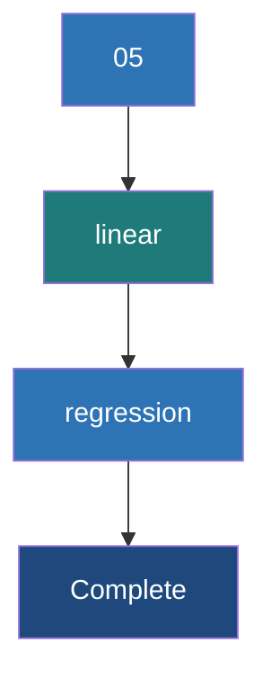

# Linear Regression

**A foundational supervised learning algorithm used to predict a continuous numerical output based on one or more input features.**

## Why It Matters
Linear regression is the workhorse of statistical modeling and machine learning. Despite the rise of complex neural networks, linear regression remains heavily used because it is highly interpretable, fast to train, and computationally efficient at scale. When you need to predict a continuous value—like forecasting daily sales, estimating housing prices, or predicting a user's lifetime value—Linear Regression is usually the first algorithm you should try.

## How It Works
The goal of Linear Regression is to fit a straight line (or hyperplane in higher dimensions) through the data that best models the relationship between the independent variables (features) and the dependent variable (label).

**1. The Hypothesis Function**: 
$h_\theta(x) = \theta_0 + \theta_1 x_1 + \theta_2 x_2 + ... + \theta_n x_n$
Where $\theta$ represents the weights (coefficients) and $x$ represents the features. $\theta_0$ is the intercept.

**2. The Cost Function (MSE)**:
To find the "best" line, we need to measure how wrong the current line is. We use Mean Squared Error (MSE):
$J(\theta) = \frac{1}{2m} \sum_{i=1}^{m} (h_\theta(x^{(i)}) - y^{(i)})^2$
The goal is to find the weights $\theta$ that minimize this cost function.

**3. Gradient Descent**:
Gradient descent minimizes the cost function by iteratively updating the weights in the opposite direction of the gradient of the cost function.
Update rule: $\theta_j := \theta_j - \alpha \frac{\partial}{\partial \theta_j} J(\theta)$
Where $\alpha$ is the **Learning Rate** (step size). 
*   **Batch Gradient Descent**: Uses the entire dataset to compute the gradient. Slow but stable.
*   **Stochastic Gradient Descent (SGD)**: Uses one example per step. Fast but noisy.
*   **Mini-Batch Gradient Descent**: Uses a small batch. The sweet spot used by most modern frameworks, including Spark.

**Evaluation**:
Model performance is typically evaluated using:
*   **RMSE (Root Mean Squared Error)**: The average distance between predicted and actual values.
*   **R-squared ($R^2$)**: The proportion of variance in the dependent variable explained by the model (1.0 is perfect).

## Flow Diagram


## Data Visualization
**Predicting House Prices**

| Size (sq ft) | Bedrooms | Actual Price | Predicted Price | Error | Squared Error |
| :--- | :--- | :--- | :--- | :--- | :--- |
| 1500 | 3 | $300k | $290k | -$10k | 100 |
| 2000 | 4 | $450k | $460k | +$10k | 100 |
| 1200 | 2 | $200k | $215k | +$15k | 225 |
| **Sum** | | | | | **MSE = 141.6** |

## Code Example
```python
from pyspark.ml.regression import LinearRegression
from pyspark.ml.evaluation import RegressionEvaluator
from pyspark.ml.feature import VectorAssembler
from pyspark.sql import SparkSession

spark = SparkSession.builder.appName("LinearReg").getOrCreate()

# Dummy house price data
data = [(1500.0, 3.0, 300000.0), (2000.0, 4.0, 450000.0), (1200.0, 2.0, 200000.0), (2500.0, 4.0, 500000.0)]
df = spark.createDataFrame(data, ["sqft", "bedrooms", "price"])

# Assemble features
assembler = VectorAssembler(inputCols=["sqft", "bedrooms"], outputCol="features")
df_assembled = assembler.transform(df)

train_data, test_data = df_assembled.randomSplit([0.8, 0.2], seed=42)

# Define Linear Regression
lr = LinearRegression(featuresCol="features", labelCol="price", maxIter=10, regParam=0.3, elasticNetParam=0.8)

# Fit the model
lr_model = lr.fit(train_data)

# Print Coefficients and Intercept
print(f"Coefficients: {lr_model.coefficients}")
print(f"Intercept: {lr_model.intercept}")

# Evaluate
predictions = lr_model.transform(test_data)
evaluator = RegressionEvaluator(labelCol="price", predictionCol="prediction", metricName="rmse")
rmse = evaluator.evaluate(predictions)
print(f"Root Mean Squared Error (RMSE) on test data = {rmse}")
```

## Common Pitfalls
*   **Collinearity**: Using features that are highly correlated with each other (e.g., predicting house price using both "Square Feet" and "Square Meters"). This makes the matrix operations unstable and the coefficients uninterpretable.
*   **Ignoring Outliers**: MSE heavily penalizes large errors. A single massive outlier (e.g., a multi-million dollar mansion in a dataset of average homes) will skew the entire regression line.
*   **Non-linear Data**: Applying linear regression to inherently non-linear relationships without doing feature engineering (like polynomial features) will result in high bias (underfitting).

## Key Takeaway
Linear regression minimizes Mean Squared Error via gradient descent, providing a highly scalable and interpretable baseline for continuous prediction tasks.
