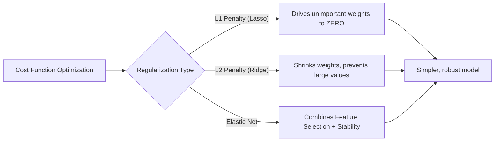

# Regularization

**A technique used to prevent machine learning models from overfitting by adding a penalty term to the cost function.**

## Why It Matters
When training models like Linear or Logistic Regression, the algorithm will try everything in its power to minimize the error on the training data. If you have many features, the model can become overly complex, learning the specific noise in the training set rather than the general underlying pattern. This is called overfitting. Regularization solves this by penalizing large weights. It forces the model to be simpler, which usually translates to better generalization on unseen test data.

## How It Works
Regularization adds a penalty term to the standard cost function (e.g., MSE). 
$Cost = \text{Original Cost} + \lambda \times \text{Penalty}$

The $\lambda$ (Lambda) is the **regularization parameter** (in Spark, it's called `regParam`). It controls how much we penalize the model. 
*   If $\lambda = 0$, we have standard, unregularized regression.
*   If $\lambda$ is very large, weights are driven to 0, leading to underfitting.

There are three main types of regularization:

1.  **L1 Regularization (Lasso)**: Penalizes the absolute value of the weights.
    *   *Penalty*: $\sum |\theta_i|$
    *   *Effect*: Can drive some weights exactly to zero. This acts as built-in **feature selection**, leaving only the most important features.
2.  **L2 Regularization (Ridge)**: Penalizes the squared value of the weights.
    *   *Penalty*: $\sum \theta_i^2$
    *   *Effect*: Shrinks weights towards zero, but rarely exactly to zero. It handles multicollinearity well and distributes weights more evenly.
3.  **Elastic Net**: A linear combination of L1 and L2. 
    *   In Spark MLlib, the `elasticNetParam` controls the mix. 
    *   `elasticNetParam = 1.0` -> Pure L1 (Lasso)
    *   `elasticNetParam = 0.0` -> Pure L2 (Ridge)
    *   `elasticNetParam = 0.5` -> 50% L1, 50% L2.

## Flow Diagram


## Data Visualization
**Effect of Regularization on Coefficients**

| Feature | No Regularization | L2 (Ridge) | L1 (Lasso) |
| :--- | :--- | :--- | :--- |
| Sq Ft | 150.5 | 120.3 | 145.0 |
| Age | -10.2 | -8.5 | -9.0 |
| Random Noise Feature 1| 45.3 | 5.1 | **0.0** |
| Random Noise Feature 2| -32.1 | -4.2 | **0.0** |

*Notice how L1 successfully eliminates the noise features by setting their coefficients to exactly zero.*

## Code Example
```python
from pyspark.ml.regression import LinearRegression

# 1. Pure L2 Regularization (Ridge)
ridge_lr = LinearRegression(
    featuresCol="features", 
    labelCol="label", 
    regParam=0.1,        # Lambda penalty strength
    elasticNetParam=0.0  # 0.0 means purely L2
)

# 2. Pure L1 Regularization (Lasso)
lasso_lr = LinearRegression(
    featuresCol="features", 
    labelCol="label", 
    regParam=0.1, 
    elasticNetParam=1.0  # 1.0 means purely L1
)

# 3. Elastic Net (Combination)
elastic_lr = LinearRegression(
    featuresCol="features", 
    labelCol="label", 
    regParam=0.1, 
    elasticNetParam=0.5  # 50% L1, 50% L2
)

# You would fit these models and compare their metrics (RMSE, R2) 
# and inspect their coefficients to see the sparsity induced by L1.
```

## Common Pitfalls
*   **Failing to Scale Features**: Regularization is highly sensitive to the scale of the features. Because it penalizes the magnitude of weights, a feature with a small numerical range will naturally get a large weight, and regularization will penalize it unfairly. **Always use StandardScaler before applying Regularization.**
*   **Setting Lambda ($\lambda$) Too High**: Cranking up `regParam` too high will squash all weights to near-zero, causing massive underfitting. The model will essentially just predict the mean of the training data.
*   **Not Tuning Hyperparameters**: You cannot guess the optimal `regParam` and `elasticNetParam`. You must use cross-validation (like Spark's `CrossValidator`) to find the best combination on a validation set.

## Key Takeaway
Regularization prevents overfitting by penalizing complex models; L1 (Lasso) performs feature selection by zeroing out weights, while L2 (Ridge) provides numerical stability.
