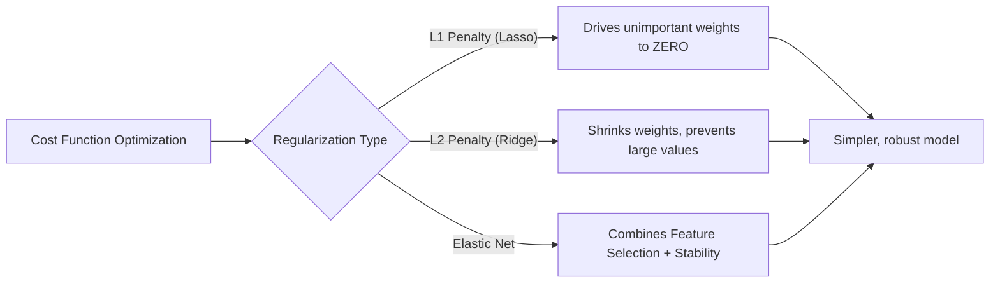

# Regularization

**A technique used to prevent machine learning models from overfitting by adding a penalty term to the cost function.**

## Why It Matters
When training models like Linear or Logistic Regression, the algorithm will try everything in its power to minimize the error on the training data. If you have many features, the model can become overly complex, learning the specific noise in the training set rather than the general underlying pattern. This is called overfitting. Regularization solves this by penalizing large weights. It forces the model to be simpler, which usually translates to better generalization on unseen test data.

## How It Works
Regularization adds a penalty term to the standard cost function (e.g., MSE). 
$Cost = \text{Original Cost} + \lambda \times \text{Penalty}$

The $\lambda$ (Lambda) is the **regularization parameter** (in Spark, it's called `regParam`). It controls how much we penalize the model. 
*   If $\lambda = 0$, we have standard, unregularized regression.
*   If $\lambda$ is very large, weights are driven to 0, leading to underfitting.

There are three main types of regularization:

1.  **L1 Regularization (Lasso)**: Penalizes the absolute value of the weights.
    *   *Penalty*: $\sum |\theta_i|$
    *   *Effect*: Can drive some weights exactly to zero. This acts as built-in **feature selection**, leaving only the most important features.
2.  **L2 Regularization (Ridge)**: Penalizes the squared value of the weights.
    *   *Penalty*: $\sum \theta_i^2$
    *   *Effect*: Shrinks weights towards zero, but rarely exactly to zero. It handles multicollinearity well and distributes weights more evenly.
3.  **Elastic Net**: A linear combination of L1 and L2. 
    *   In Spark MLlib, the `elasticNetParam` controls the mix. 
    *   `elasticNetParam = 1.0` -> Pure L1 (Lasso)
    *   `elasticNetParam = 0.0` -> Pure L2 (Ridge)
    *   `elasticNetParam = 0.5` -> 50% L1, 50% L2.

## Flow Diagram


## Data Visualization
**Effect of Regularization on Coefficients**

| Feature | No Regularization | L2 (Ridge) | L1 (Lasso) |
| :--- | :--- | :--- | :--- |
| Sq Ft | 150.5 | 120.3 | 145.0 |
| Age | -10.2 | -8.5 | -9.0 |
| Random Noise Feature 1| 45.3 | 5.1 | **0.0** |
| Random Noise Feature 2| -32.1 | -4.2 | **0.0** |

*Notice how L1 successfully eliminates the noise features by setting their coefficients to exactly zero.*

## Code Example
```python
from pyspark.ml.regression import LinearRegression

# 1. Pure L2 Regularization (Ridge)
ridge_lr = LinearRegression(
    featuresCol="features", 
    labelCol="label", 
    regParam=0.1,        # Lambda penalty strength
    elasticNetParam=0.0  # 0.0 means purely L2
)

# 2. Pure L1 Regularization (Lasso)
lasso_lr = LinearRegression(
    featuresCol="features", 
    labelCol="label", 
    regParam=0.1, 
    elasticNetParam=1.0  # 1.0 means purely L1
)

# 3. Elastic Net (Combination)
elastic_lr = LinearRegression(
    featuresCol="features", 
    labelCol="label", 
    regParam=0.1, 
    elasticNetParam=0.5  # 50% L1, 50% L2
)

# You would fit these models and compare their metrics (RMSE, R2) 
# and inspect their coefficients to see the sparsity induced by L1.
```

## Common Pitfalls
*   **Failing to Scale Features**: Regularization is highly sensitive to the scale of the features. Because it penalizes the magnitude of weights, a feature with a small numerical range will naturally get a large weight, and regularization will penalize it unfairly. **Always use StandardScaler before applying Regularization.**
*   **Setting Lambda ($\lambda$) Too High**: Cranking up `regParam` too high will squash all weights to near-zero, causing massive underfitting. The model will essentially just predict the mean of the training data.
*   **Not Tuning Hyperparameters**: You cannot guess the optimal `regParam` and `elasticNetParam`. You must use cross-validation (like Spark's `CrossValidator`) to find the best combination on a validation set.

## Key Takeaway
Regularization prevents overfitting by penalizing complex models; L1 (Lasso) performs feature selection by zeroing out weights, while L2 (Ridge) provides numerical stability.


---

## 🎓 Deep Learning Questions

### Q1: Why Was This Concept Introduced?
Regularization was introduced to combat the pervasive problem of **overfitting** in machine learning models. Before regularization, algorithms like linear or logistic regression would minimize the training error unconditionally. When applied to high-dimensional datasets or datasets with noise, the model would learn the exact noise patterns (high variance) rather than the generalized underlying trends. This resulted in models that performed exceptionally well on training data but failed miserably on unseen test data. Regularization introduces a mathematical constraint—a penalty on the magnitude of the model parameters (weights). By restricting how large the weights can grow, it overcomes the limitation of unconstrained optimization, forcing the model to remain simpler and more robust, thus generalizing significantly better to new data.

### Q2: What Exactly Is This Concept and How Does It Work?
Regularization is a technique that modifies the standard cost function (like Mean Squared Error or Log Loss) by adding a **penalty term**. The algorithm now optimizes for two things simultaneously: minimizing the prediction error AND minimizing the complexity of the weights.
In Spark MLlib, the mathematical execution involves gradient descent or L-BFGS solvers operating over distributed data partitions. 
- **L1 (Lasso)**: Adds a penalty proportional to the absolute value of the weights ($\sum |\theta|$). The geometry of L1 optimization inherently drives less important feature weights exactly to zero, effectively acting as an automated feature selector.
- **L2 (Ridge)**: Adds a penalty proportional to the square of the weights ($\sum \theta^2$). This shrinks all weights proportionally toward zero but rarely exactly to zero, distributing importance evenly among correlated features.
- **ElasticNet**: Combines L1 and L2 using a mixing parameter (`elasticNetParam` in Spark).

### Q3: Where Should This Concept Be Used?
Regularization should be used almost universally when training linear models, but it shines particularly in:
- **High-Dimensional Data**: Such as genomics or text classification (TF-IDF), where the number of features can exceed the number of observations. Here, L1 regularization easily zeroes out millions of irrelevant word tokens or genes.
- **Retail & Recommendation Systems**: When predicting customer churn or demand forecasting with highly correlated features (e.g., "items bought in last 7 days" vs "items bought in last 30 days"), L2 regularization keeps the correlated feature weights stable.
- **Financial Services**: Credit scoring models where interpretability is crucial. L1 regularization eliminates weak predictors, leaving a clean, explainable formula for regulators.

### Q4: Where Should This Concept NOT Be Used?
- **Highly Non-Linear Problems**: Regularization on linear models won't help if the underlying relationship is fundamentally non-linear; use tree-based models or neural networks instead.
- **Underfitting Scenarios**: If your model is already too simple and has high bias (poor training accuracy), adding regularization will only constrain it further, making the underfitting worse. 
- **Noise-Free, Simple Datasets**: If you have a massive amount of data, a tiny number of clean features, and no multicollinearity, the unregularized ordinary least squares (OLS) estimate is already optimal (Gauss-Markov theorem), and regularization might add unnecessary bias.

### Q5: How Is This Concept Different from Hadoop?

| Aspect | Hadoop MapReduce | Apache Spark |
| :--- | :--- | :--- |
| **Architecture** | Relied on Apache Mahout for ML, which wrote intermediate states to disk after every iteration. | Uses MLlib, holding iterative matrices and gradients in distributed RAM across the cluster. |
| **Performance** | Extremely slow for iterative optimization (gradient descent) due to disk I/O. | 10x-100x faster for training regularized models due to in-memory processing. |
| **Processing Model** | Map -> Shuffle -> Reduce (Disk-backed). | DAG of in-memory RDD/DataFrame transformations. |
| **Memory Usage** | Low memory footprint, high disk reliance. | High memory reliance for caching feature vectors and partial gradients. |
| **Fault Tolerance** | Replicated blocks on HDFS. | Lineage graphs recompute lost partitions on the fly. |
| **Scalability** | High, but impractical for iterative ML. | High, optimized for iterative machine learning tasks. |
| **Ease of Development** | Complex Java boilerplate for math logic. | Simple `LinearRegression(regParam=0.1)` API in PySpark/Scala. |
| **Typical Use Cases** | Batch ETL, counting, sorting. | Iterative ML, streaming, interactive data science. |
| **Advantages** | Can run on commodity hardware with tiny RAM. | Rapid hyperparameter tuning (GridSearch) for $\lambda$ penalty. |
| **Disadvantages** | Optimization takes hours/days. | High RAM cost; out-of-memory (OOM) errors during heavy shuffles. |

### Q6: How Can This Concept Be Related to a Traditional RDBMS?

| Spark MLlib Concept | Traditional RDBMS Concept | Explanation |
| :--- | :--- | :--- |
| **Unregularized Model** | **Unconstrained Table** | A table allowing any data format. The model allows weights to take any value to fit data. |
| **Regularization Penalty** | **CHECK Constraints / Triggers** | Rules preventing extreme data. Regularization prevents extreme parameter values. |
| **L1 (Feature Selection)** | **Dropping Irrelevant Columns** | L1 zeros out weights, practically dropping them, much like `ALTER TABLE DROP COLUMN`. |
| **L2 (Weight Shrinkage)** | **Index Tuning** | Distributing the load evenly across queries rather than over-relying on a single heavy index. |

### Q7: What Happens Behind the Scenes?
1. **Driver**: The MLlib Pipeline receives the `LinearRegression` estimator with `regParam` and `elasticNetParam`.
2. **DAG**: The driver translates the optimization problem into a DAG of RDD operations.
3. **Tasks & Executors**: The training data is split into partitions. On each executor, tasks compute the local gradient of the error function *plus the derivative of the regularization penalty*.
4. **Shuffle/Aggregation**: Local gradients are sent to the driver (using `treeAggregate`), which sums them to compute the global gradient.
5. **Optimization Step**: The driver updates the global weights, applying the L1/L2 penalty shrinkage. For L1, an optimizer like Orthogonal Matching Pursuit or specialized L-BFGS handles the non-differentiable zero points.
6. **Iteration**: This process repeats until the weights converge.

```text
[Driver (Initial Weights)]
       | (Broadcasts weights)
       v
[Executors (Partitions 1..N)] ---> Compute Local Gradients + Penalty 
       | (treeAggregate)
       v
[Driver (Global Gradient)] ---> Apply L1/L2 Shrinkage ---> [Updated Weights] --(Iterate)--> Converged!
```

### Q8: Performance Considerations, Best Practices, and Common Mistakes

| Category | Recommendation | Why It Matters |
| :--- | :--- | :--- |
| **Data Prep** | Always use `StandardScaler` first. | Regularization penalizes absolute magnitude. Unscaled features with large ranges will be unfairly penalized compared to small-range features. |
| **Hyperparameter** | Use `CrossValidator` with `ParamGridBuilder`. | You cannot guess the optimal `regParam`. Grid search is required to balance bias and variance perfectly. |
| **Performance** | Cache the preprocessed DataFrame before `fit()`. | Optimization is iterative. Spark will re-evaluate the entire pipeline DAG for every gradient step if data isn't cached. |
| **Mistake** | Setting `regParam` too high. | A massive penalty forces all weights to zero, causing severe underfitting (predicting the mean). |
| **Best Practice** | Use ElasticNet (`elasticNetParam` between 0 and 1). | Pure L1 can arbitrarily drop one of two highly correlated features. ElasticNet provides feature selection *and* stability. |

### Q9: Interview Questions

**Beginner**
1. **What is the primary goal of regularization?**
   To prevent overfitting by penalizing complex models and large weights, improving generalization on test data.
2. **What happens if you set the regularization parameter ($\lambda$) to zero?**
   The penalty vanishes, and you get standard, unregularized regression (Ordinary Least Squares).
3. **Which type of regularization performs feature selection?**
   L1 (Lasso) regularization, because it can drive less important feature weights to exactly zero.

**Intermediate**
4. **Why must you scale features before applying L1 or L2 regularization?**
   Because penalties are based on weight magnitudes. If features aren't on the same scale, a feature with naturally small numerical values will need a massive weight, triggering an unfair penalty.
5. **How does ElasticNet differ from pure Lasso or Ridge?**
   It combines both penalties using a mixing parameter, providing the feature-selection sparsity of L1 along with the correlated-feature stability of L2.
6. **If your model is underfitting the training data, should you increase or decrease regularization?**
   Decrease it. Underfitting means the model is too constrained; lowering the penalty gives it more freedom to learn.

**Advanced**
7. **Explain the geometric intuition behind why L1 yields sparse solutions while L2 does not.**
   L1's constraint space is shaped like a diamond (with sharp corners on the axes), while L2's is a circle. The loss function's elliptical contours are mathematically far more likely to intersect the L1 diamond at a corner (where one or more weights are exactly zero) than the smooth edge of the L2 circle.
8. **How does Spark MLlib optimize L1 regularization since the absolute value function is not differentiable at zero?**
   Spark uses algorithms like Orthogonal Matching Pursuit (OMP) or an adapted L-BFGS solver with orthant-wise pseudo-gradients (OWL-QN) to handle the non-differentiable points at zero.
9. **In a high-dimensional dataset where $p > n$ (more features than samples), which regularization technique is mandatory and why?**
   L1 (or ElasticNet) is required. OLS and pure L2 cannot produce a unique solution when $p > n$, but L1's sparsity constraint reduces the active feature space, making the matrix invertible.

**Scenario-Based**
10. **You built a Spark ML model to predict housing prices. You have 5,000 features, many of which are overlapping demographic metrics. Which regularization strategy do you use?**
    ElasticNet. L1 is needed to reduce the 5,000 features to a manageable subset, but because the demographic metrics are highly correlated, pure L1 might arbitrarily drop important ones. ElasticNet's L2 component keeps the correlated groups stable.
11. **Your Spark pipeline trains a Ridge regression model. The `CrossValidator` selects the smallest possible `regParam` in your grid (0.001). What does this indicate?**
    It indicates the model is likely underfitting or just perfectly fitting without needing constraints. You should expand your grid to include 0.0, and verify if a more complex model (like Random Forest) is needed to capture non-linear patterns.

### Q10: Complete Real-World Example

**Business Problem**: A telecommunications company (like AT&T or Verizon) wants to predict customer churn based on hundreds of usage metrics. Because many metrics are highly correlated (e.g., "total daytime minutes" and "total daytime charge"), they need a stable model. They also want to identify exactly which features actually matter (feature selection).

**Dataset**: Customer usage data with features like age, monthly charge, tenure, total calls, data usage, customer service calls, etc.

**PySpark Code**:
```python
from pyspark.sql import SparkSession
from pyspark.ml.feature import VectorAssembler, StandardScaler
from pyspark.ml.classification import LogisticRegression
from pyspark.ml.evaluation import BinaryClassificationEvaluator
from pyspark.ml.tuning import CrossValidator, ParamGridBuilder
from pyspark.ml import Pipeline

# 1. Initialize Spark
spark = SparkSession.builder.appName("ElasticNetChurnPrediction").getOrCreate()

# 2. Sample Dataset (Label: 1=Churn, 0=Stay)
data = spark.createDataFrame([
    (45.0, 150.2, 12.0, 5.0, 1),
    (22.0, 35.1, 1.0, 0.0, 0),
    (54.0, 105.0, 24.0, 1.0, 0),
    (31.0, 99.9, 3.0, 4.0, 1),
    (60.0, 110.5, 36.0, 0.0, 0)
], ["age", "monthly_charge", "tenure_months", "support_calls", "label"])

# 3. Assemble features into a vector
assembler = VectorAssembler(
    inputCols=["age", "monthly_charge", "tenure_months", "support_calls"], 
    outputCol="raw_features"
)

# 4. CRITICAL: Scale features to ensure fair regularization!
scaler = StandardScaler(
    inputCol="raw_features", 
    outputCol="features", 
    withStd=True, 
    withMean=True
)

# 5. Define Logistic Regression with ElasticNet
# We leave regParam and elasticNetParam empty to tune them via GridSearch
lr = LogisticRegression(featuresCol="features", labelCol="label")

# 6. Build the Pipeline
pipeline = Pipeline(stages=[assembler, scaler, lr])

# 7. Create Parameter Grid for Hyperparameter Tuning
# regParam: Penalty strength
# elasticNetParam: Mix (0.0 = Ridge/L2, 1.0 = Lasso/L1, 0.5 = ElasticNet)
paramGrid = ParamGridBuilder() \
    .addGrid(lr.regParam, [0.01, 0.1, 1.0]) \
    .addGrid(lr.elasticNetParam, [0.0, 0.5, 1.0]) \
    .build()

# 8. Setup CrossValidator
evaluator = BinaryClassificationEvaluator(metricName="areaUnderROC")
cv = CrossValidator(
    estimator=pipeline,
    estimatorParamMaps=paramGrid,
    evaluator=evaluator,
    numFolds=3 # In production, use 5 or 10
)

# 9. Fit the model (Behind the scenes: Spark runs L-BFGS optimization on the DAG)
cvModel = cv.fit(data)

# 10. Extract the best model parameters
best_lr_model = cvModel.bestModel.stages[-1]
print(f"Best regParam (Lambda): {best_lr_model.getOrDefault('regParam')}")
print(f"Best elasticNetParam: {best_lr_model.getOrDefault('elasticNetParam')}")
print(f"Model Coefficients: {best_lr_model.coefficients}")

# Example output might show zeroes for less important features due to L1 component!
```

### 💡 Key Takeaways
- Regularization is the standard antidote to model overfitting.
- L1 (Lasso) acts as an automatic feature selector by driving weights to zero.
- L2 (Ridge) prevents single features from dominating and handles correlated inputs smoothly.
- ElasticNet combines L1 and L2 and is easily controlled via `elasticNetParam` in Spark ML.
- Always use `StandardScaler` before applying regularized regression algorithms in Spark.

### ⚠️ Common Misconceptions
- **Regularization improves training accuracy.** False: It actually decreases training accuracy to improve test accuracy/generalization.
- **It should be used on all algorithms.** False: It applies mostly to parametric linear models, not natively to algorithms like Naive Bayes.
- **You can guess the right lambda penalty.** False: It absolutely must be tuned using Cross Validation.

### 🔗 Related Spark Concepts
- CrossValidator and TrainValidationSplit
- StandardScaler and MinMaxScaler
- LogisticRegression and LinearRegression
- Pipeline API

### 📚 References for Further Reading
- Apache Spark Official Documentation (MLlib Classification and Regression)
- Learning Spark (O'Reilly)
- Spark: The Definitive Guide (O'Reilly)
