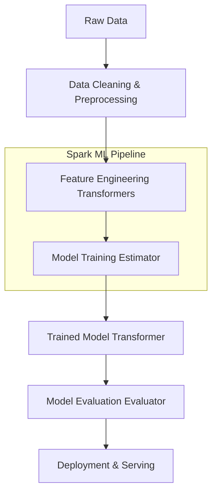

# Chapter 7: Getting Smart with MLlib Overview

**A comprehensive introduction to scalable machine learning using Apache Spark's MLlib, bridging theoretical concepts with distributed implementations.**

## Why It Matters
Machine learning in the modern era is characterized by massive datasets that exceed the memory and processing capabilities of single machines. Spark MLlib provides a robust, distributed framework for training and deploying machine learning models at scale. By understanding the core components of MLlib, data engineers and scientists can seamlessly transition from local, single-node prototyping (using tools like scikit-learn or pandas) to massive, multi-node production systems without sacrificing performance or accuracy. This chapter serves as the foundation for all subsequent advanced machine learning topics in the Spark ecosystem.

## How It Works
Spark MLlib operates on the concept of DataFrames (historically RDDs) and leverages lazy evaluation and catalyst optimization to perform distributed machine learning. The MLlib API is divided into two primary packages: `spark.mllib` (the older, RDD-based API) and `spark.ml` (the newer, DataFrame-based API). This chapter focuses entirely on the modern `spark.ml` API.

The workflow in Spark ML revolves around three main abstractions: Transformers, Estimators, and Evaluators. 
1. **Transformers**: Algorithms that can transform one DataFrame into another. For example, a feature scaler or a trained model.
2. **Estimators**: Algorithms that can be fit on a DataFrame to produce a Transformer. For example, a learning algorithm like LogisticRegression.
3. **Pipelines**: A mechanism to chain multiple Transformers and Estimators together to specify an ML workflow.

By standardizing these abstractions, Spark allows users to build complex ML pipelines that encapsulate data preprocessing, feature engineering, model training, and evaluation into a single, cohesive workflow. This pipeline can then be saved and deployed for serving.

## Flow Diagram


## Data Visualization
| Step | Data Representation | Schema Example |
|------|--------------------|----------------|
| Raw Data | CSV / Parquet | `age: Int, salary: Double, label: Int` |
| Vector Assembly | DataFrame with Vectors | `age: Int, salary: Double, features: Vector, label: Int` |
| Scaling | Scaled Vectors | `features: Vector, scaledFeatures: Vector, label: Int` |
| Prediction | DataFrame with Predictions | `features: Vector, label: Int, prediction: Double` |

## Code Example
```python
# Import necessary components
from pyspark.ml import Pipeline
from pyspark.ml.classification import LogisticRegression
from pyspark.ml.feature import VectorAssembler, StandardScaler

# 1. Prepare data
assembler = VectorAssembler(inputCols=["age", "salary"], outputCol="features")
scaler = StandardScaler(inputCol="features", outputCol="scaledFeatures")

# 2. Define estimator
lr = LogisticRegression(featuresCol="scaledFeatures", labelCol="label")

# 3. Create pipeline
pipeline = Pipeline(stages=[assembler, scaler, lr])

# 4. Train model (Fit the pipeline)
# model = pipeline.fit(trainingData)

# 5. Make predictions (Transform)
# predictions = model.transform(testData)
```

## Common Pitfalls
* **Mixing RDD and DataFrame APIs**: Using the old `spark.mllib` instead of the newer `spark.ml` API, leading to compatibility issues and missed optimizations.
* **Ignoring Data Partitions**: Failing to properly partition data before training, resulting in skewed tasks and stragglers.
* **Overcomplicating Pipelines**: Creating massive, monolithic pipelines that are difficult to debug instead of modularizing feature engineering steps.
* **Data Leakage**: Fitting Transformers (like StandardScaler) on the entire dataset instead of just the training set, causing information from the test set to leak into the training process.

## Key Takeaway
Mastering Spark's Pipeline API is the key to building scalable, reproducible, and robust distributed machine learning workflows.
