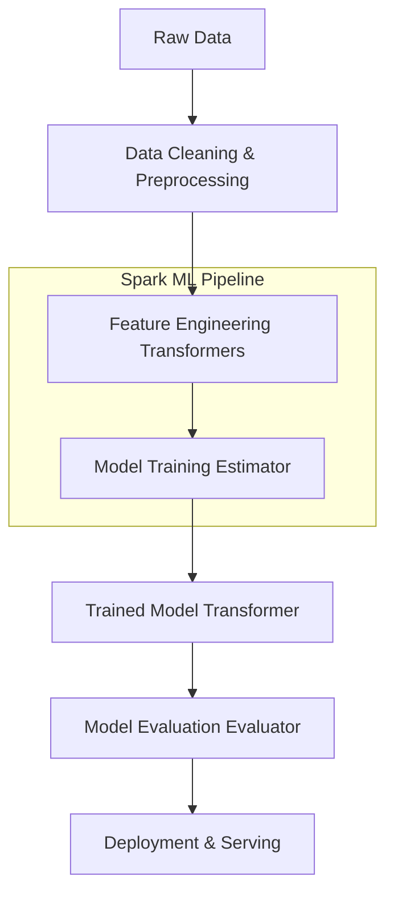

# Chapter 7: Getting Smart with MLlib Overview

**A comprehensive introduction to scalable machine learning using Apache Spark's MLlib, bridging theoretical concepts with distributed implementations.**

## Why It Matters
Machine learning in the modern era is characterized by massive datasets that exceed the memory and processing capabilities of single machines. Spark MLlib provides a robust, distributed framework for training and deploying machine learning models at scale. By understanding the core components of MLlib, data engineers and scientists can seamlessly transition from local, single-node prototyping (using tools like scikit-learn or pandas) to massive, multi-node production systems without sacrificing performance or accuracy. This chapter serves as the foundation for all subsequent advanced machine learning topics in the Spark ecosystem.

## How It Works
Spark MLlib operates on the concept of DataFrames (historically RDDs) and leverages lazy evaluation and catalyst optimization to perform distributed machine learning. The MLlib API is divided into two primary packages: `spark.mllib` (the older, RDD-based API) and `spark.ml` (the newer, DataFrame-based API). This chapter focuses entirely on the modern `spark.ml` API.

The workflow in Spark ML revolves around three main abstractions: Transformers, Estimators, and Evaluators. 
1. **Transformers**: Algorithms that can transform one DataFrame into another. For example, a feature scaler or a trained model.
2. **Estimators**: Algorithms that can be fit on a DataFrame to produce a Transformer. For example, a learning algorithm like LogisticRegression.
3. **Pipelines**: A mechanism to chain multiple Transformers and Estimators together to specify an ML workflow.

By standardizing these abstractions, Spark allows users to build complex ML pipelines that encapsulate data preprocessing, feature engineering, model training, and evaluation into a single, cohesive workflow. This pipeline can then be saved and deployed for serving.

## Flow Diagram


## Data Visualization
| Step | Data Representation | Schema Example |
|------|--------------------|----------------|
| Raw Data | CSV / Parquet | `age: Int, salary: Double, label: Int` |
| Vector Assembly | DataFrame with Vectors | `age: Int, salary: Double, features: Vector, label: Int` |
| Scaling | Scaled Vectors | `features: Vector, scaledFeatures: Vector, label: Int` |
| Prediction | DataFrame with Predictions | `features: Vector, label: Int, prediction: Double` |

## Code Example
```python
# Import necessary components
from pyspark.ml import Pipeline
from pyspark.ml.classification import LogisticRegression
from pyspark.ml.feature import VectorAssembler, StandardScaler

# 1. Prepare data
assembler = VectorAssembler(inputCols=["age", "salary"], outputCol="features")
scaler = StandardScaler(inputCol="features", outputCol="scaledFeatures")

# 2. Define estimator
lr = LogisticRegression(featuresCol="scaledFeatures", labelCol="label")

# 3. Create pipeline
pipeline = Pipeline(stages=[assembler, scaler, lr])

# 4. Train model (Fit the pipeline)
# model = pipeline.fit(trainingData)

# 5. Make predictions (Transform)
# predictions = model.transform(testData)
```

## Common Pitfalls
* **Mixing RDD and DataFrame APIs**: Using the old `spark.mllib` instead of the newer `spark.ml` API, leading to compatibility issues and missed optimizations.
* **Ignoring Data Partitions**: Failing to properly partition data before training, resulting in skewed tasks and stragglers.
* **Overcomplicating Pipelines**: Creating massive, monolithic pipelines that are difficult to debug instead of modularizing feature engineering steps.
* **Data Leakage**: Fitting Transformers (like StandardScaler) on the entire dataset instead of just the training set, causing information from the test set to leak into the training process.

## Key Takeaway
Mastering Spark's Pipeline API is the key to building scalable, reproducible, and robust distributed machine learning workflows.


---

## 🎓 Deep Learning Questions

### Q1: Why Was This Concept Introduced?
Before the advent of Apache Spark and its machine learning library, MLlib, data scientists were primarily working with tools like R, SAS, and scikit-learn. While exceptional for small to medium-sized datasets, these tools were designed to run on a single machine. As the era of Big Data emerged, the sheer volume of data generated by platforms like social media, IoT devices, and enterprise logs quickly outgrew single-node memory capacity (Out of Memory errors). 

Attempting to distribute machine learning using Hadoop MapReduce was incredibly inefficient due to its heavy reliance on disk I/O between processing steps. Machine learning algorithms, which are often iterative (e.g., gradient descent looping over the data multiple times), suffered severe performance degradation on MapReduce. 

Spark MLlib was introduced to solve this exact problem. By utilizing in-memory computing (Resilient Distributed Datasets and DataFrames), Spark keeps data cached in RAM across multiple iterations. This dramatically accelerates iterative machine learning algorithms. Furthermore, the introduction of the `spark.ml` API brought the Pipeline abstraction, enabling data scientists to build complex, scalable machine learning workflows (feature extraction, transformation, model training) that run seamlessly across thousands of nodes in a distributed cluster.

### Q2: What Exactly Is This Concept and How Does It Work?
Spark MLlib is Apache Spark's scalable machine learning library. Its core goal is to make practical machine learning scalable and easy. It consists of common learning algorithms and utilities, including classification, regression, clustering, collaborative filtering, dimensionality reduction, and underlying optimization primitives.

Under the hood, MLlib leverages Spark's distributed computation engine. Rather than pulling all data to a single driver node (which would crash the system), the ML algorithms are designed to push the computation to the worker nodes where the data resides. 

The execution flow relies on the unified high-level APIs built on DataFrames (`spark.ml`). 
1. **Transformers** apply deterministic transformations to a DataFrame, like converting text to vectors or standardizing features. They implement a `.transform()` method.
2. **Estimators** are learning algorithms that observe data and produce a model (which itself is a Transformer). They implement a `.fit()` method.
3. **Pipelines** chain these elements together. When a pipeline is fit to training data, it executes the stages in order, passing the transformed DataFrame from one stage to the next, ultimately returning a `PipelineModel`.

Because these algorithms are built using Spark's core DataFrame API, they benefit from the Catalyst Optimizer for query optimization and Tungsten for memory management and physical execution.

### Q3: Where Should This Concept Be Used?
Spark MLlib is indispensable whenever the dataset you need to train on or score against is too large to fit in the memory of a single machine. 

**Production Use Cases & Industries:**
* **Netflix (Recommendation Systems):** Using Alternating Least Squares (ALS) in MLlib to process petabytes of user viewing history and ratings to serve personalized movie recommendations at scale.
* **Uber (Dynamic Pricing & ETA Prediction):** Training regression models on massive streams of historical trip data, traffic patterns, and weather to predict accurate ETAs and calculate surge pricing globally.
* **Banking (Fraud Detection):** Analyzing billions of transaction records daily using distributed classification models (like Random Forests or Gradient-Boosted Trees) to detect fraudulent anomalies in near real-time.
* **Retail & E-commerce (Customer Segmentation):** Using K-Means clustering on massive customer behavioral datasets to group users for targeted marketing campaigns without down-sampling the data.
* **Healthcare (Genomics & Disease Prediction):** Processing massive genomic datasets using distributed machine learning to predict disease likelihood or classify genetic markers across millions of patient records.

### Q4: Where Should This Concept NOT Be Used?
While powerful, Spark MLlib is not a silver bullet. You should avoid it in the following scenarios:
* **Small Datasets:** If your data fits comfortably in the RAM of a single machine (e.g., < 10-20 GB), the overhead of Spark's distributed coordination and network shuffling will make it *slower* than local tools like scikit-learn, XGBoost, or pandas.
* **Deep Learning Tasks:** Spark MLlib focuses on traditional machine learning (regression, classification, clustering). For deep neural networks (CNNs, RNNs, LLMs), frameworks like TensorFlow, PyTorch, or specialized distributed frameworks like Horovod or Ray are far superior.
* **Complex Custom Algorithms:** If you need to implement highly specialized algorithms that are strictly sequential or require fine-grained low-level synchronization between nodes, Spark's coarse-grained data-parallel model may be overly restrictive.
* **Real-time Latency-critical Scoring:** While Spark Streaming can do near real-time scoring, if you need sub-millisecond predictions, it's often better to export the trained Spark model (e.g., via MLeap or ONNX) and serve it via a lightweight microservice.

### Q5: How Is This Concept Different from Hadoop?

| Aspect | Hadoop MapReduce (Mahout) | Apache Spark MLlib |
|--------|---------------------------|--------------------|
| **Architecture** | Disk-based. Reads from and writes to HDFS after every map/reduce step. | Memory-based. Caches intermediate data in RAM across iterations. |
| **Performance** | Extremely slow for iterative ML algorithms (10x - 100x slower). | Blazing fast for iterative algorithms due to in-memory processing. |
| **Processing Model** | Rigid Map and Reduce phases. Hard to express complex ML logic. | Flexible DAG (Directed Acyclic Graph) engine with high-level transformations. |
| **Memory Usage** | Low memory footprint (aggressively spills to disk). | High memory requirement (needs sufficient RAM to cache datasets). |
| **Fault Tolerance** | Recomputes from disk via HDFS replication. | Recomputes lost partitions dynamically using RDD/DataFrame lineage. |
| **Scalability** | High, scales well for massive batch ETL. | High, scales exceptionally well for massive iterative ML training. |
| **Ease of Development** | Very low. Requires hundreds of lines of complex Java code. | Very high. Concise APIs in Python, Scala, SQL, and R. |
| **Typical Use Cases** | Batch ETL, basic counting/aggregation. | Distributed ML training, advanced analytics, feature engineering. |
| **Advantages** | Robust for extremely large batch jobs with limited memory. | Speed, unified pipeline abstraction, interactive exploration. |
| **Disadvantages** | Unusable for modern machine learning workflows. | Memory tuning can be complex (OOM errors if misconfigured). |

### Q6: How Can This Concept Be Related to a Traditional RDBMS?

| Spark MLlib Concept | Traditional RDBMS / SQL Equivalent | Explanation |
|---------------------|------------------------------------|-------------|
| **DataFrame** | **Table / View** | The foundational dataset format. Just like a table, it has rows and typed columns. |
| **VectorAssembler** | **CONCAT() or Array Aggregation** | Combines multiple separate feature columns into a single Vector column required by ML algorithms. |
| **Transformer (`.transform()`)** | **SELECT with UDFs / Math Functions** | Applies a deterministic operation (like scaling or indexing) row by row to create a new column. |
| **Estimator (`.fit()`)** | **Stored Procedure / Analytical Model** | Analyzes the whole dataset to learn parameters (e.g., calculating the global mean and std dev for a scaler). |
| **Pipeline** | **Complex ETL Job / DAG of Views** | A sequenced set of transformations and model building steps executed in a specific order. |
| **Model Serving / Scoring** | **Trigger / Function on INSERT** | Taking new rows of data and running them through the mathematical equation learned during training to generate a prediction. |

### Q7: What Happens Behind the Scenes?

When you execute an MLlib pipeline, the process translates from high-level Python/Scala code into distributed physical execution on a cluster.

1. **Driver & Pipeline DAG:** The Spark Driver defines the Pipeline, which is a sequence of Estimators and Transformers. It compiles this logical plan.
2. **Fitting Estimators:** For each Estimator in the pipeline (e.g., StandardScaler or LogisticRegression), the Driver triggers a Spark Action (like `count()` or `reduce()`) to compute the necessary statistics or gradients from the distributed data.
3. **Execution Plan & Stages:** The Catalyst Optimizer plans the job, breaking it down into a DAG of Stages separated by Shuffle boundaries.
4. **Tasks & Executors:** The Scheduler distributes Tasks to Executors. Each task operates on a specific Partition of the data. 
5. **Iterative Processing:** For algorithms like Logistic Regression, the Driver orchestrates multiple iterations. In each iteration, Executors compute partial gradients on their partitions and send them back to the Driver (or via tree aggregation) to update the global model weights.
6. **Transformer Evaluation:** Once fit, the Estimator becomes a Transformer. The pipeline moves to the next stage, applying the transformation via lazy evaluation.

```text
+-------------------+      +-------------------------------------------------+
|   Spark Driver    |      |                 Spark Cluster                   |
|                   |      |                                                 |
| 1. Define         |      |   +-------------+       +-------------+         |
|    Pipeline       |      |   | Executor 1  |       | Executor 2  |         |
| 2. Trigger Action |----->|   | (Partition 1|       | (Partition 2|         |
|    (.fit())       |      |   | Data)       |       | Data)       |         |
| 3. Manage Gradient|      |   +-------------+       +-------------+         |
|    Updates        |<-----|        | Compute partial       |                |
|                   |      |        | gradients             |                |
+-------------------+      +--------|-----------------------|----------------+
                                    v                       v
                           [ Tree Aggregation / Shuffle to combine results ]
```

### Q8: Performance Considerations, Best Practices, and Common Mistakes

| Category | Recommendation | Why It Matters |
|----------|----------------|----------------|
| **Caching** | Cache datasets before calling `.fit()` on iterative models. | ML algorithms scan data multiple times. Caching prevents re-evaluating the entire DAG (and re-reading from disk) on every iteration. |
| **Vectorization** | Use `VectorAssembler` efficiently and avoid UDFs for simple math. | Spark ML requires features in a single Vector column. Using native Spark functions rather than Python UDFs leverages JVM optimizations and prevents serialization overhead. |
| **Data Partitioning** | Repartition data if partitions are heavily skewed or too few. | If one partition has 90% of the data, one Executor does all the work (straggler), bottlenecking the entire cluster. |
| **Pipeline Modularity** | Keep Pipelines focused. Fit scalers only on training data. | A common mistake is fitting a `StandardScaler` on the *entire* dataset before splitting, which causes data leakage (test data influences training). |
| **Algorithm Choice** | Prefer Tree-based models (Random Forest, GBT) for tabular data. | Tree models in MLlib are highly optimized, handle categorical variables natively without extensive one-hot encoding, and often yield better out-of-the-box accuracy. |
| **Parameter Tuning** | Use `CrossValidator` with a modest parameter grid. | An overly large grid search will explode cluster execution time. Spark trains each model independently, multiplying cluster workload. |

### Q9: Interview Questions

**Beginner:**
1. **What is the difference between an Estimator and a Transformer in Spark MLlib?**
   *Answer:* A Transformer converts one DataFrame into another (e.g., standardizing features, generating predictions) and uses the `.transform()` method. An Estimator is an algorithm that is trained on a DataFrame to produce a Transformer (the model) and uses the `.fit()` method.
2. **Why is `VectorAssembler` required in Spark ML?**
   *Answer:* Spark MLlib algorithms expect all input features to be combined into a single column of type `Vector`. `VectorAssembler` takes multiple separate columns (integers, doubles, etc.) and concatenates them into this single vector column.
3. **What is a Spark ML Pipeline?**
   *Answer:* A Pipeline is an API that allows you to chain multiple Transformers and Estimators together to specify a complete machine learning workflow, making it easier to manage, reuse, and deploy ML processes.

**Intermediate:**
4. **Why is caching critical when training models like Logistic Regression in Spark?**
   *Answer:* Logistic Regression uses optimization algorithms (like gradient descent) that are iterative. They read the same dataset repeatedly to update weights. If the data isn't cached in memory, Spark will re-read the data from the source and recompute the entire DAG for every single iteration, severely degrading performance.
5. **How does Spark handle categorical features in MLlib?**
   *Answer:* Categorical features must be converted into numerical formats. Typically, you use `StringIndexer` to convert string categories to numerical indices, followed by `OneHotEncoder` to convert those indices into binary vectors to prevent the model from inferring a false ordinal relationship.
6. **What is data leakage, and how do Spark Pipelines help prevent it?**
   *Answer:* Data leakage occurs when information from the test set is used to train the model (e.g., calculating the mean for scaling across the whole dataset). Pipelines prevent this because when you call `.fit(train_data)` on a pipeline, it computes statistics *only* on the training data, and then applies those exact statistics to the test data during `.transform(test_data)`.

**Advanced:**
7. **Explain the challenge of hyperparameter tuning in a distributed environment using `CrossValidator`.**
   *Answer:* `CrossValidator` performs an exhaustive grid search. If you have 3 parameters with 3 values each, and 3-fold cross-validation, Spark trains 3 * 3 * 3 = 27 separate distributed models. This can easily exhaust cluster resources. To optimize, you can increase `parallelism` in the `CrossValidator` to train multiple models concurrently if cluster capacity allows, rather than sequentially.
8. **How does tree aggregation work when calculating gradients in distributed Spark?**
   *Answer:* Instead of all Executors sending their partial gradients directly to the Driver (which could cause a network/memory bottleneck at the Driver), Spark uses `treeAggregate`. Executors combine results locally, then send them to intermediate nodes, forming a tree structure. This reduces the load on the Driver to $O(\log(\text{Executors}))$.
9. **How would you deploy a trained Spark ML model for real-time inference?**
   *Answer:* Spark's native batch nature isn't ideal for sub-millisecond single-record inference. Best practices involve exporting the Spark `PipelineModel` to formats like MLeap, PMML, or ONNX. These exported models can be loaded into lightweight Java/Python microservices or AWS Lambda functions for low-latency, real-time scoring without the Spark overhead.

**Scenario-Based:**
10. **Your Spark ML pipeline training job is failing with OutOfMemoryError on the Executors during a Random Forest training phase. What steps do you take?**
    *Answer:* I would first check `maxDepth` and `maxBins`. Deep trees require significantly more memory to store node statistics. I would decrease `maxDepth`. Second, I would ensure the data is properly partitioned and evenly distributed. Finally, I would consider increasing the `spark.executor.memory` or using a cluster with higher-memory worker nodes.
11. **You trained an MLlib model and it works perfectly in your notebook. When deploying, the data engineering team passes you a stream of raw JSON data. How do you integrate it?**
    *Answer:* Because I used the `Pipeline` API, the entire feature engineering process (parsing, assembling vectors, scaling) is saved within the `PipelineModel`. I can simply load the saved PipelineModel, read the raw JSON stream using Spark Structured Streaming, and call `model.transform(streaming_df)` to generate predictions on the fly with exactly the same preprocessing logic used during training.

### Q10: Complete Real-World Example

**Business Problem:**
A telecom company wants to predict which customers are likely to cancel their subscriptions (Churn Prediction). This is critical for targeting at-risk customers with retention offers.

**Sample Dataset:**
A massive Parquet table stored on Amazon S3 containing customer records.
Columns: `customer_id` (String), `tenure_months` (Int), `monthly_charges` (Double), `total_charges` (Double), `is_senior_citizen` (Int: 0/1), `churn` (String: "Yes"/"No").

**PySpark Code:**

```python
from pyspark.sql import SparkSession
from pyspark.ml import Pipeline
from pyspark.ml.feature import StringIndexer, VectorAssembler, StandardScaler
from pyspark.ml.classification import RandomForestClassifier
from pyspark.ml.evaluation import BinaryClassificationEvaluator

# Initialize Spark Session
spark = SparkSession.builder \
    .appName("Telecom Churn Prediction") \
    .getOrCreate()

# 1. Load Data
df = spark.read.parquet("s3a://telecom-data/customer_churn.parquet")

# 2. Preprocessing & Feature Engineering
# Convert target label "churn" ("Yes"/"No") to numeric indices (1.0/0.0)
label_indexer = StringIndexer(inputCol="churn", outputCol="label")

# Combine numerical features into a single Vector column
assembler = VectorAssembler(
    inputCols=["tenure_months", "monthly_charges", "total_charges", "is_senior_citizen"],
    outputCol="rawFeatures",
    handleInvalid="skip" # Safely drop rows with nulls in these columns
)

# Scale features to have zero mean and unit variance (good practice for many algorithms)
scaler = StandardScaler(inputCol="rawFeatures", outputCol="features")

# 3. Define the Estimator (Algorithm)
# Random Forest is robust and handles non-linear relationships well
rf = RandomForestClassifier(featuresCol="features", labelCol="label", numTrees=100)

# 4. Build the Pipeline
pipeline = Pipeline(stages=[label_indexer, assembler, scaler, rf])

# 5. Split Data (80% training, 20% testing)
train_data, test_data = df.randomSplit([0.8, 0.2], seed=42)

# VERY IMPORTANT: Cache training data since Random Forest is iterative
train_data.cache()

# 6. Train the Model
# This triggers the distributed execution DAG
print("Training model...")
model = pipeline.fit(train_data)

# 7. Make Predictions on Test Data
predictions = model.transform(test_data)

# 8. Evaluate the Model
evaluator = BinaryClassificationEvaluator(labelCol="label", rawPredictionCol="rawPrediction", metricName="areaUnderROC")
auc = evaluator.evaluate(predictions)
print(f"Model Area Under ROC: {auc:.4f}")

# 9. Save the Pipeline for Production
model.write().overwrite().save("s3a://telecom-models/churn_pipeline_model")
```

**Step-by-Step Execution Walkthrough:**
1. **Data Load:** Spark maps the Parquet files into a distributed DataFrame across the cluster.
2. **Pipeline Construction:** The stages are logically defined. No computation happens yet (lazy evaluation).
3. **Data Splitting & Caching:** The data is split. `train_data.cache()` marks the training set to be held in memory upon its first materialization.
4. **Pipeline Fit:** Spark executes the stages sequentially on `train_data`. 
   - `StringIndexer` scans the data to find unique labels ("Yes", "No") and assigns indices.
   - `VectorAssembler` transforms rows into vectors.
   - `StandardScaler` scans the vectors to compute the mean and std dev, then scales them.
   - `RandomForestClassifier` iteratively builds 100 decision trees in parallel across the executors using the cached, scaled features.
5. **Prediction:** The `.transform()` method applies the exact same index mapping and scaling parameters learned during training to the `test_data`, then outputs predictions.

**Expected Output:**
```text
Training model...
Model Area Under ROC: 0.8432
```

**Performance Notes:**
Caching `train_data` is crucial here. If we omitted `.cache()`, Spark would have to read from S3, parse the Parquet file, apply the splits, and recalculate feature scaling for every single tree depth iteration during the Random Forest training phase, increasing job time by hours.

**When This Approach is Best:**
This pattern is ideal for batch training on massive datasets (e.g., terabytes of customer history) where the pipeline needs to be strictly standardized and passed to an engineering team for deployment in a batch scoring pipeline.

### 💡 Key Takeaways
* **Pipeline Abstraction:** The `spark.ml` API uses Pipelines, standardizing ML workflows into Estimators (train) and Transformers (predict/modify).
* **Distributed Computation:** Algorithms push computation to the data on worker nodes, rather than pulling data to a single machine.
* **Vector Formatting:** All MLlib algorithms require input features to be consolidated into a single `Vector` column using tools like `VectorAssembler`.
* **Memory Management:** Iterative ML algorithms require data caching; failing to do so causes severe performance penalties.
* **Data Leakage Prevention:** By fitting transformations (like scalers) strictly inside a Pipeline on training data, you mathematically guarantee test data won't corrupt the training phase.

### ⚠️ Common Misconceptions
* **"Spark ML is faster than scikit-learn for everything."** False. For datasets that fit in RAM on a single machine, single-node libraries (pandas/scikit-learn) are almost always faster due to zero network overhead.
* **"I can just loop over rows to apply my custom model."** False. Looping over a DataFrame row-by-row on the driver defeats distributed computing. You must use UDFs or native Transformers.
* **"MLlib handles deep learning."** False. While you can do basic multi-layer perceptrons, Spark is not designed for modern deep learning. Use TensorFlow/PyTorch on Ray or Spark-Deep-Learning integrations instead.
* **"Data cleaning isn't part of the ML pipeline."** False. In Spark, it's highly recommended to include standard cleaning and feature engineering steps inside the Pipeline so they are perfectly reproduced in production.

### 🔗 Related Spark Concepts
* **Catalyst Optimizer:** The engine that plans the physical execution of DataFrame transformations before they hit the ML algorithms.
* **Resilient Distributed Datasets (RDDs):** The underlying abstraction of DataFrames, relevant if interacting with the legacy `spark.mllib` API.
* **Spark Structured Streaming:** Often combined with ML Pipelines for near real-time model inference.
* **Tungsten Engine:** Manages the off-heap memory that makes advanced vectorized operations fast in MLlib.

### 📚 References for Further Reading
* Apache Spark Official MLlib Guide
* Learning Spark (O'Reilly) - Chapter on Machine Learning
* Spark: The Definitive Guide (O'Reilly) - Part IV: Advanced Analytics and Machine Learning
