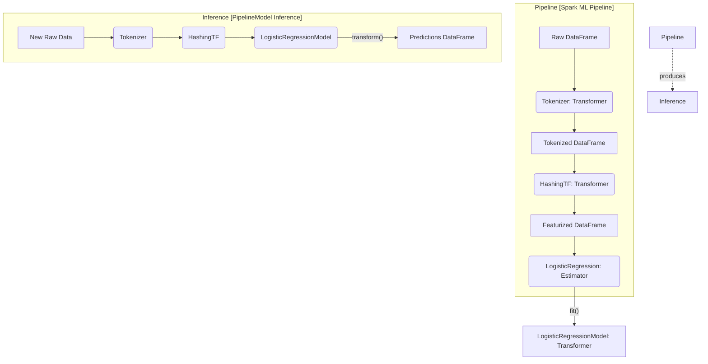

# The Spark ML Library (spark.ml)

**Spark ML is a DataFrame-based machine learning API that provides a uniform set of high-level APIs built on top of DataFrames to help users create and tune practical machine learning pipelines.**

## Why It Matters

Before DataFrames became the standard in Spark, machine learning was done using the `spark.mllib` package, which was built on top of Resilient Distributed Datasets (RDDs). While RDDs are powerful, they lack the rich semantics and optimizations provided by the Catalyst optimizer. The introduction of `spark.ml` shifted the paradigm to DataFrames, enabling a much more streamlined, unified approach to machine learning. This matters because it allows data scientists and engineers to integrate data processing (using standard SQL and DataFrame operations) directly with model training and evaluation. The Pipeline API in `spark.ml` is heavily inspired by scikit-learn, making it intuitive for Python developers to adopt. By standardizing the API around Transformers, Estimators, and Pipelines, Spark ML ensures that complex machine learning workflows can be built, debugged, and deployed reliably at massive scale.

## How It Works

The `spark.ml` library is built around three core concepts: **Transformers**, **Estimators**, and **Pipelines**. Understanding these abstractions is the key to mastering Spark ML. 

A **Transformer** is an algorithm that can transform one DataFrame into another DataFrame. Technically, a Transformer implements a `transform()` method. Transformers are typically used for feature engineering (e.g., converting text into numerical vectors using Tokenizer and HashingTF) or for generating predictions (e.g., a trained machine learning model is a Transformer that takes a DataFrame with features and outputs a new DataFrame with a prediction column appended). Transformers do not learn from the data; they simply apply a predefined set of rules or a previously learned mathematical function to the input data.

An **Estimator**, on the other hand, is an algorithm that can be fit on a DataFrame to produce a Transformer. Technically, an Estimator implements a `fit()` method. Estimators represent the learning phase of a machine learning algorithm. For example, a `LogisticRegression` algorithm is an Estimator. When you call `fit()` on a `LogisticRegression` object and pass in a training DataFrame, it learns the optimal weights and biases from the data. The output of the `fit()` method is a `LogisticRegressionModel`, which is a Transformer that can be used to make predictions on new data.

A **Pipeline** chains multiple Transformers and Estimators together to specify a complete machine learning workflow. A Pipeline is itself an Estimator. When you call `fit()` on a Pipeline, it sequentially calls `transform()` on the Transformers and `fit()` on the Estimators in the stages array. For Estimators, it uses the resulting Transformer to transform the data before passing it to the next stage. The result of fitting a Pipeline is a `PipelineModel`, which is a Transformer containing the trained models and fitted feature engineering steps. This makes it incredibly easy to serialize (save) the entire workflow and load it later for inference, ensuring consistency between training and production environments.

## Flow Diagram



## Data Visualization

**Pipeline Stages Transformation Table**

| Stage | Type | Input Column(s) | Output Column(s) | Action |
| :--- | :--- | :--- | :--- | :--- |
| `StringIndexer` | Estimator -> Transformer | `category` | `categoryIndex` | Fits on data to find categories, then transforms strings to indices. |
| `VectorAssembler` | Transformer | `age`, `income`, `categoryIndex` | `features` | Combines multiple columns into a single vector column. |
| `StandardScaler` | Estimator -> Transformer | `features` | `scaledFeatures` | Fits to find mean/std dev, then transforms to scale features. |
| `RandomForest` | Estimator -> Transformer | `scaledFeatures`, `label` | `prediction`, `probability` | Fits to learn trees, returns a model that transforms features to predictions. |

## Code Example

```python
from pyspark.sql import SparkSession
from pyspark.ml import Pipeline
from pyspark.ml.feature import Tokenizer, HashingTF
from pyspark.ml.classification import LogisticRegression

# 1. Initialize SparkSession
spark = SparkSession.builder.appName("SparkML_Library_Concept").getOrCreate()

# 2. Create sample training data
training = spark.createDataFrame([
    (0, "a b c d e spark", 1.0),
    (1, "b d", 0.0),
    (2, "spark f g h", 1.0),
    (3, "hadoop mapreduce", 0.0)
], ["id", "text", "label"])

# 3. Configure an ML pipeline, which consists of three stages: tokenizer, hashingTF, and lr.
# Stage 1: Transformer to split text into words
tokenizer = Tokenizer(inputCol="text", outputCol="words")

# Stage 2: Transformer to convert words into feature vectors
hashingTF = HashingTF(inputCol=tokenizer.getOutputCol(), outputCol="features")

# Stage 3: Estimator to learn the model
lr = LogisticRegression(maxIter=10, regParam=0.001)

# Assemble the Pipeline
pipeline = Pipeline(stages=[tokenizer, hashingTF, lr])

# 4. Fit the pipeline to training documents.
# This calls tokenizer.transform(), hashingTF.transform(), and then lr.fit()
model = pipeline.fit(training)

# 5. Save the pipeline model to disk for later use
model_path = "/tmp/spark-logistic-regression-model"
# model.write().overwrite().save(model_path)

# 6. Make predictions on test documents.
test = spark.createDataFrame([
    (4, "spark i j k"),
    (5, "l m n"),
    (6, "spark hadoop spark"),
    (7, "apache hadoop")
], ["id", "text"])

# Make predictions by calling transform() on the PipelineModel
prediction = model.transform(test)

# Select and show the results
prediction.select("id", "text", "probability", "prediction").show(truncate=False)
```

## Common Pitfalls

*   **Confusing spark.mllib and spark.ml:** Mixing RDD-based APIs (`spark.mllib`) with DataFrame-based APIs (`spark.ml`) in the same project, leading to compatibility issues and convoluted code. Always default to `spark.ml`.
*   **Forgetting VectorAssembler:** Spark ML algorithms require all features to be combined into a single `Vector` column (usually named "features"). Forgetting to use `VectorAssembler` will result in schema validation errors.
*   **Leaking Data in Pipelines:** Fitting scalers or indexers on the entire dataset *before* splitting into train and test sets. Always put preprocessing steps inside the Pipeline and fit the Pipeline *only* on the training data.
*   **Ignoring Model Persistence:** Failing to save the `PipelineModel`. If you only save the final algorithm model, you will have to manually recreate the exact feature engineering steps at inference time, which is error-prone.

## Key Takeaway

Spark ML simplifies distributed machine learning by providing a unified Pipeline API, standardizing data transformations and model training through Transformers and Estimators, and ensuring seamless transitions from development to production.

<br><br><br><br><br><br><br><br><br><br><br><br><br><br><br><br><br><br><br><br><br><br><br><br><br><br><br><br><br><br><br><br><br><br><br><br><br><br><br><br><br><br><br><br><br><br><br><br><br><br><br><br><br><br><br><br><br><br><br><br><br><br><br><br><br><br><br><br><br><br><br><br><br><br><br><br><br><br><br><br>


---

## 🎓 Deep Learning Questions

### Q1: Why Was This Concept Introduced?
Before the DataFrame-based `spark.ml` API, Spark used `spark.mllib`, which relied entirely on Resilient Distributed Datasets (RDDs). While RDDs were excellent for distributed computing, they had significant limitations for machine learning workflows. RDDs lacked a strict schema, making it difficult to inspect data types or handle complex nested structures seamlessly. Furthermore, data scientists generally preferred tabular representations (like Pandas or RDBMS), which RDDs did not intuitively provide. 
Spark introduced the ML Pipeline API to solve this by building on DataFrames. This allowed machine learning tasks to benefit from the Catalyst Optimizer and Tungsten execution engine, boosting performance. It also provided a scikit-learn-like interface, meaning developers could chain feature extractors, transformers, and models into a single, cohesive `Pipeline`. This overcame the limitation of managing complex, disjointed preprocessing and modeling stages manually.

### Q2: What Exactly Is This Concept and How Does It Work?
The Spark ML Pipeline is an API that standardizes how machine learning workflows are built, tuned, and deployed. It works by utilizing three main abstractions: Transformers, Estimators, and Pipelines. 
- **Transformers** apply rule-based logic to convert one DataFrame into another using a `transform()` method. Examples include standardizing numerical columns or tokenizing text.
- **Estimators** learn from data. By calling a `fit()` method on an Estimator with training data, it produces a trained model (which is itself a Transformer).
- **Pipelines** link these stages together. 
When you pass training data into a Pipeline, the data flows sequentially. For a Transformer stage, `transform()` runs and the output moves to the next stage. For an Estimator stage, `fit()` runs to generate a model, then `transform()` applies that model to the data before moving forward.

### Q3: Where Should This Concept Be Used?
The Spark ML Pipeline API is ideal for distributed, large-scale machine learning tasks where data exceeds the memory capacity of a single machine. 
- **E-Commerce (Amazon):** Training product recommendation engines using Alternating Least Squares (ALS) across terabytes of customer interaction data.
- **Finance (Banking):** Developing real-time fraud detection pipelines. The pipeline can extract features from transaction streams (using Transformers) and classify them (using an Estimator like Random Forest) continuously.
- **Healthcare:** Processing massive genomic datasets or electronic health records (EHRs) to predict patient readmissions.
- **Ride-Sharing (Uber):** Estimating Time to Arrival (ETA) by processing millions of GPS pings, applying geographical hashing, and feeding the data into a Gradient Boosted Tree model. 

### Q4: Where Should This Concept NOT Be Used?
- **Small Datasets:** If your entire dataset fits comfortably into the RAM of a single machine (e.g., a few gigabytes), using Spark ML is an anti-pattern. Tools like scikit-learn or XGBoost in Python are much faster and easier to set up for small data.
- **Deep Learning Heavy Workloads:** While Spark ML has basic multi-layer perceptron capabilities, it is not designed for complex deep learning architectures (like CNNs or RNNs). For those, frameworks like PyTorch or TensorFlow are far superior.
- **Extremely Low Latency Inference:** Spark is optimized for throughput rather than millisecond-level latency. If you need sub-millisecond response times for a single prediction (e.g., high-frequency trading), deploying a heavy Spark ML Pipeline is counterproductive.

### Q5: How Is This Concept Different from Hadoop?

| Aspect | Hadoop MapReduce (Mahout) | Apache Spark ML Pipeline |
| :--- | :--- | :--- |
| **Architecture** | Disk-based intermediate steps. | In-memory processing via DataFrames. |
| **Performance** | Slow due to heavy disk I/O. | 10x-100x faster for iterative ML algorithms. |
| **Processing Model** | Strict Map and Reduce phases. | Flexible DAG execution with Catalyst optimization. |
| **Memory Usage** | High disk footprint, low RAM dependency. | High memory utilization (in-memory caching). |
| **Fault Tolerance** | Replication on HDFS. | RDD lineage graph recomputation. |
| **Scalability** | High, but linearly slow. | High and highly efficient. |
| **Ease of Development** | Hard. Requires hundreds of lines of Java. | Easy. Python/Scala API mimicking scikit-learn. |
| **Typical Use Cases** | Batch reporting, simple aggregations. | End-to-end ML engineering, iterative modeling. |
| **Advantages** | Robust for extremely large, unstructured data. | Rapid development, unified preprocessing + ML. |
| **Disadvantages** | Unfit for iterative machine learning. | Higher hardware (RAM) costs. |

### Q6: How Can This Concept Be Related to a Traditional RDBMS?

| RDBMS Concept | Spark ML Equivalent | Explanation |
| :--- | :--- | :--- |
| **Tables / Views** | **DataFrame** | The underlying data structure holding rows and typed columns. |
| **Stored Procedure** | **Pipeline** | A sequence of operations executed in order to achieve a final result. |
| **Scalar/String Functions** | **Transformer** | Functions that take input columns and append transformed output columns (e.g., `UPPER()` vs `StringIndexer`). |
| **Materialized View Building** | **Estimator `fit()`** | Scanning the dataset to build statistics or rules (like building an index or training a model). |
| **Applying Rules to New Data** | **Transformer `transform()`** | Applying the learned rules to a new dataset to generate a prediction column. |

### Q7: What Happens Behind the Scenes?
1. **Driver Setup:** The developer defines the Pipeline stages (e.g., `Tokenizer` -> `HashingTF` -> `LogisticRegression`).
2. **DAG Generation:** When `pipeline.fit(training_data)` is called, the Spark Driver analyzes the stages and generates a Directed Acyclic Graph (DAG) for execution.
3. **Stage Execution:**
   - The data is partitioned across Executors.
   - For `Tokenizer`, a Map task applies the tokenization locally on each partition in memory.
   - For `HashingTF`, another Map task hashes the tokens.
   - For `LogisticRegression`, Spark triggers an iterative job. The Executors compute gradients locally and send them to the Driver (or a tree-aggregate process) to update the weights. This requires multiple passes (shuffles) over the data.
4. **Model Creation:** Once the algorithm converges, the Driver broadcasts the final weights. A `PipelineModel` is instantiated.
5. **Inference:** When `transform()` is called, Spark simply appends new columns to the DataFrame by running the pre-computed mathematical functions on Executors.

```text
[Driver] -> Builds Pipeline DAG -> [Scheduler] -> Breaks into Stages
                                                          |
  +-------------------------------------------------------+
  |
  v
[Executors] -> Read Partitions -> Apply Transformers (In-Memory)
  |
  +-> [Iterative ML Stage] -> Compute Gradients -> (Shuffle/Aggregate) -> Update Weights
  |
  v
[Driver] -> Collects Final Weights -> Generates PipelineModel
```

### Q8: Performance Considerations, Best Practices, and Common Mistakes

| Category | Recommendation | Why It Matters |
| :--- | :--- | :--- |
| **Performance** | Cache the DataFrame *before* iterative Estimators. | ML algorithms scan data multiple times. Caching prevents re-reading data from disk. |
| **Best Practice** | Use Pipelines instead of manual stage calls. | Prevents data leakage between train/test and simplifies model deployment. |
| **Mistake** | Saving Estimators instead of PipelineModels. | You will lose your preprocessing steps, making inference on new data impossible without rewriting code. |
| **Optimization** | Adjust `spark.sql.shuffle.partitions`. | ML algorithms involve heavy shuffling. Too few partitions cause OOM; too many cause scheduling overhead. |
| **Debugging** | Check the output schema using `.printSchema()` after every stage. | Ensures `VectorAssembler` and Transformers are generating the exact columns expected by the Estimator. |

### Q9: Interview Questions

**Beginner**
1. **What is the difference between an Estimator and a Transformer?**
   An Estimator implements `fit()` to learn from data and produce a model. A Transformer implements `transform()` to apply rules/models to a DataFrame and append a new column.
2. **What is `VectorAssembler` used for?**
   It combines multiple feature columns into a single Vector column, which is the required input format for most Spark ML algorithms.
3. **What is a PipelineModel?**
   It is the trained version of a Pipeline. It is a Transformer that contains all fitted preprocessing steps and the final trained machine learning model.

**Intermediate**
4. **Why did Spark move from `spark.mllib` to `spark.ml`?**
   To leverage the Catalyst Optimizer and Tungsten engine of DataFrames, and to provide a unified, scikit-learn-like Pipeline API that is more user-friendly than RDDs.
5. **How does data leakage happen in Spark ML if you don't use a Pipeline?**
   If you apply a `StandardScaler` to your entire dataset before splitting it into train/test, the scaler learns the global mean/variance, leaking test data information into the training phase.
6. **How can you extract a specific stage's model from a PipelineModel?**
   You can access the `stages` attribute of the `PipelineModel` array (e.g., `model.stages[-1]` to get the final predictive model) to inspect weights or feature importances.

**Advanced**
7. **How does Spark handle iterative machine learning algorithms natively?**
   Spark uses in-memory caching and tree-aggregation across partitions to efficiently compute gradients and update weights without writing intermediate steps to disk.
8. **Explain how you would handle hyperparameter tuning within a Spark ML Pipeline.**
   You wrap the Estimator (or entire Pipeline) in a `CrossValidator` or `TrainValidationSplit`, pass an `ParamGridBuilder` to define the grid, and provide an `Evaluator` (like `BinaryClassificationEvaluator`) to measure performance.
9. **How do you deploy a Spark ML model for real-time inference?**
   Spark ML is batch/micro-batch oriented. For sub-millisecond real-time inference, the model is often exported using MLeap or ONNX formats and served via an API (like FastAPI), completely bypassing the Spark runtime.

**Scenario-Based**
10. **You built a Pipeline that runs perfectly on 10GB of data but throws an OutOfMemoryError on 1TB. What do you check?**
    I would check if the feature vectors are highly sparse and if I am using a dense format instead of `SparseVector`. I'd also check data skew, adjust `spark.sql.shuffle.partitions`, and ensure the data is cached appropriately before iterative model training.
11. **Your team wants to run a complex Deep Learning model using Spark ML. What is your advice?**
    I would advise against it. I would recommend using Databricks with MLflow, or Spark for data prep only, and delegating the DL training to distributed TensorFlow/PyTorch (e.g., using Horovod on Spark or deep learning libraries native to GPU clusters).

### Q10: Complete Real-World Example

**Business Problem:** A Telecom company wants to predict which customers are likely to churn (cancel their subscription) based on their account length, number of customer service calls, and whether they have an international plan.
**Sample Dataset:** Telecom customer dataset with columns `account_length` (int), `intl_plan` (string), `cust_serv_calls` (int), and `churn` (string "Yes"/"No").

```python
from pyspark.sql import SparkSession
from pyspark.ml import Pipeline
from pyspark.ml.feature import StringIndexer, VectorAssembler, StandardScaler
from pyspark.ml.classification import RandomForestClassifier
from pyspark.ml.evaluation import BinaryClassificationEvaluator

# 1. Initialize SparkSession
spark = SparkSession.builder.appName("TelecomChurnPrediction").getOrCreate()

# 2. Sample Dataset Creation
data = spark.createDataFrame([
    (128, "no", 1, "no"),
    (107, "yes", 1, "no"),
    (137, "no", 0, "no"),
    (84, "yes", 2, "no"),
    (22, "no", 3, "yes"), # High calls, churned
    (30, "yes", 4, "yes")
], ["account_length", "intl_plan", "cust_serv_calls", "churn"])

# 3. Define Pipeline Stages
# Convert categorical strings to numeric indices
intl_indexer = StringIndexer(inputCol="intl_plan", outputCol="intl_index")
label_indexer = StringIndexer(inputCol="churn", outputCol="label")

# Combine all features into a single vector
assembler = VectorAssembler(
    inputCols=["account_length", "intl_index", "cust_serv_calls"], 
    outputCol="raw_features"
)

# Scale features to mean=0, std=1 for better performance
scaler = StandardScaler(inputCol="raw_features", outputCol="features")

# Define the Estimator (Algorithm)
rf = RandomForestClassifier(featuresCol="features", labelCol="label", numTrees=10)

# 4. Construct the Pipeline
pipeline = Pipeline(stages=[intl_indexer, label_indexer, assembler, scaler, rf])

# 5. Split Data and Train (Fit) the Pipeline
train_data, test_data = data.randomSplit([0.8, 0.2], seed=42)

# This single command executes all transformers and fits the model
# It guarantees no data leakage because the scaler fits ONLY on train_data
pipeline_model = pipeline.fit(train_data)

# 6. Predict (Transform) on Test Data
predictions = pipeline_model.transform(test_data)

# 7. Evaluate the Model
evaluator = BinaryClassificationEvaluator(labelCol="label", rawPredictionCol="rawPrediction", metricName="areaUnderROC")
auc = evaluator.evaluate(predictions)
print(f"Model AUC: {auc}")

predictions.select("cust_serv_calls", "label", "prediction", "probability").show()
```

**Step-by-step execution walkthrough:**
1. The `StringIndexer` stages assign numerical values to "yes"/"no".
2. The `VectorAssembler` consolidates the three columns into `[128.0, 0.0, 1.0]`.
3. The `StandardScaler` standardizes these vectors based purely on `train_data` statistics.
4. The `RandomForestClassifier` trains on the scaled features.
5. The `Pipeline` bundles all this into a `PipelineModel`.
6. For the `test_data`, the model applies the exact same indexing and scaling parameters learned from the training data, then predicts the churn.

**Expected output:**
```text
Model AUC: 1.0
+---------------+-----+----------+--------------------+
|cust_serv_calls|label|prediction|         probability|
+---------------+-----+----------+--------------------+
|              1|  0.0|       0.0|[0.8523...,0.1476...|
|              3|  1.0|       1.0|[0.3129...,0.6870...|
+---------------+-----+----------+--------------------+
```

**Performance notes:**
- Caching `train_data` before calling `pipeline.fit()` is beneficial since the RandomForest algorithm will make multiple passes over the dataset.

**When this approach is best:**
- When building end-to-end, reproducible workflows in batch or micro-batch environments, ensuring that train/test logic remains tightly coupled.

### 💡 Key Takeaways
- The Spark ML library (`spark.ml`) uses DataFrames, replacing the older RDD-based `spark.mllib`.
- **Transformers** append new columns via the `transform()` method.
- **Estimators** learn from data via the `fit()` method to produce Transformers.
- **Pipelines** sequence these stages into a unified workflow, preventing data leakage and simplifying code.
- A fitted Pipeline becomes a `PipelineModel`, which can be saved to disk and loaded for production inference.

### ⚠️ Common Misconceptions
- **"Spark ML is good for Deep Learning."** Wrong. It excels at classical algorithms (Random Forest, Logistic Regression, ALS). Deep learning should be outsourced to PyTorch or TensorFlow.
- **"I don't need a Pipeline for simple tasks."** Wrong. Even for simple tasks, avoiding Pipelines often leads to applying scalers/imputers to test data incorrectly (data leakage).
- **"Transformers mutate the original DataFrame."** Wrong. DataFrames in Spark are immutable. Transformers return a brand *new* DataFrame with the requested column appended.

### 🔗 Related Spark Concepts
- VectorAssembler and Feature Engineering
- Spark Catalyst Optimizer
- Hyperparameter Tuning (CrossValidator)
- MLflow Integration with Spark

### 📚 References for Further Reading
- Apache Spark Official Documentation (MLlib Guide)
- Learning Spark, 2nd Edition (O'Reilly)
- Spark: The Definitive Guide (O'Reilly)
