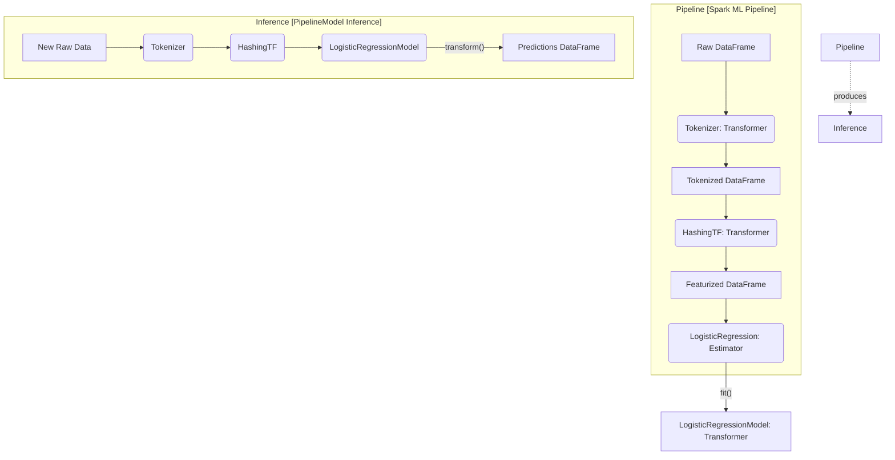

# The Spark ML Library (spark.ml)

**Spark ML is a DataFrame-based machine learning API that provides a uniform set of high-level APIs built on top of DataFrames to help users create and tune practical machine learning pipelines.**

## Why It Matters

Before DataFrames became the standard in Spark, machine learning was done using the `spark.mllib` package, which was built on top of Resilient Distributed Datasets (RDDs). While RDDs are powerful, they lack the rich semantics and optimizations provided by the Catalyst optimizer. The introduction of `spark.ml` shifted the paradigm to DataFrames, enabling a much more streamlined, unified approach to machine learning. This matters because it allows data scientists and engineers to integrate data processing (using standard SQL and DataFrame operations) directly with model training and evaluation. The Pipeline API in `spark.ml` is heavily inspired by scikit-learn, making it intuitive for Python developers to adopt. By standardizing the API around Transformers, Estimators, and Pipelines, Spark ML ensures that complex machine learning workflows can be built, debugged, and deployed reliably at massive scale.

## How It Works

The `spark.ml` library is built around three core concepts: **Transformers**, **Estimators**, and **Pipelines**. Understanding these abstractions is the key to mastering Spark ML. 

A **Transformer** is an algorithm that can transform one DataFrame into another DataFrame. Technically, a Transformer implements a `transform()` method. Transformers are typically used for feature engineering (e.g., converting text into numerical vectors using Tokenizer and HashingTF) or for generating predictions (e.g., a trained machine learning model is a Transformer that takes a DataFrame with features and outputs a new DataFrame with a prediction column appended). Transformers do not learn from the data; they simply apply a predefined set of rules or a previously learned mathematical function to the input data.

An **Estimator**, on the other hand, is an algorithm that can be fit on a DataFrame to produce a Transformer. Technically, an Estimator implements a `fit()` method. Estimators represent the learning phase of a machine learning algorithm. For example, a `LogisticRegression` algorithm is an Estimator. When you call `fit()` on a `LogisticRegression` object and pass in a training DataFrame, it learns the optimal weights and biases from the data. The output of the `fit()` method is a `LogisticRegressionModel`, which is a Transformer that can be used to make predictions on new data.

A **Pipeline** chains multiple Transformers and Estimators together to specify a complete machine learning workflow. A Pipeline is itself an Estimator. When you call `fit()` on a Pipeline, it sequentially calls `transform()` on the Transformers and `fit()` on the Estimators in the stages array. For Estimators, it uses the resulting Transformer to transform the data before passing it to the next stage. The result of fitting a Pipeline is a `PipelineModel`, which is a Transformer containing the trained models and fitted feature engineering steps. This makes it incredibly easy to serialize (save) the entire workflow and load it later for inference, ensuring consistency between training and production environments.

## Flow Diagram



## Data Visualization

**Pipeline Stages Transformation Table**

| Stage | Type | Input Column(s) | Output Column(s) | Action |
| :--- | :--- | :--- | :--- | :--- |
| `StringIndexer` | Estimator -> Transformer | `category` | `categoryIndex` | Fits on data to find categories, then transforms strings to indices. |
| `VectorAssembler` | Transformer | `age`, `income`, `categoryIndex` | `features` | Combines multiple columns into a single vector column. |
| `StandardScaler` | Estimator -> Transformer | `features` | `scaledFeatures` | Fits to find mean/std dev, then transforms to scale features. |
| `RandomForest` | Estimator -> Transformer | `scaledFeatures`, `label` | `prediction`, `probability` | Fits to learn trees, returns a model that transforms features to predictions. |

## Code Example

```python
from pyspark.sql import SparkSession
from pyspark.ml import Pipeline
from pyspark.ml.feature import Tokenizer, HashingTF
from pyspark.ml.classification import LogisticRegression

# 1. Initialize SparkSession
spark = SparkSession.builder.appName("SparkML_Library_Concept").getOrCreate()

# 2. Create sample training data
training = spark.createDataFrame([
    (0, "a b c d e spark", 1.0),
    (1, "b d", 0.0),
    (2, "spark f g h", 1.0),
    (3, "hadoop mapreduce", 0.0)
], ["id", "text", "label"])

# 3. Configure an ML pipeline, which consists of three stages: tokenizer, hashingTF, and lr.
# Stage 1: Transformer to split text into words
tokenizer = Tokenizer(inputCol="text", outputCol="words")

# Stage 2: Transformer to convert words into feature vectors
hashingTF = HashingTF(inputCol=tokenizer.getOutputCol(), outputCol="features")

# Stage 3: Estimator to learn the model
lr = LogisticRegression(maxIter=10, regParam=0.001)

# Assemble the Pipeline
pipeline = Pipeline(stages=[tokenizer, hashingTF, lr])

# 4. Fit the pipeline to training documents.
# This calls tokenizer.transform(), hashingTF.transform(), and then lr.fit()
model = pipeline.fit(training)

# 5. Save the pipeline model to disk for later use
model_path = "/tmp/spark-logistic-regression-model"
# model.write().overwrite().save(model_path)

# 6. Make predictions on test documents.
test = spark.createDataFrame([
    (4, "spark i j k"),
    (5, "l m n"),
    (6, "spark hadoop spark"),
    (7, "apache hadoop")
], ["id", "text"])

# Make predictions by calling transform() on the PipelineModel
prediction = model.transform(test)

# Select and show the results
prediction.select("id", "text", "probability", "prediction").show(truncate=False)
```

## Common Pitfalls

*   **Confusing spark.mllib and spark.ml:** Mixing RDD-based APIs (`spark.mllib`) with DataFrame-based APIs (`spark.ml`) in the same project, leading to compatibility issues and convoluted code. Always default to `spark.ml`.
*   **Forgetting VectorAssembler:** Spark ML algorithms require all features to be combined into a single `Vector` column (usually named "features"). Forgetting to use `VectorAssembler` will result in schema validation errors.
*   **Leaking Data in Pipelines:** Fitting scalers or indexers on the entire dataset *before* splitting into train and test sets. Always put preprocessing steps inside the Pipeline and fit the Pipeline *only* on the training data.
*   **Ignoring Model Persistence:** Failing to save the `PipelineModel`. If you only save the final algorithm model, you will have to manually recreate the exact feature engineering steps at inference time, which is error-prone.

## Key Takeaway

Spark ML simplifies distributed machine learning by providing a unified Pipeline API, standardizing data transformations and model training through Transformers and Estimators, and ensuring seamless transitions from development to production.

<br><br><br><br><br><br><br><br><br><br><br><br><br><br><br><br><br><br><br><br><br><br><br><br><br><br><br><br><br><br><br><br><br><br><br><br><br><br><br><br><br><br><br><br><br><br><br><br><br><br><br><br><br><br><br><br><br><br><br><br><br><br><br><br><br><br><br><br><br><br><br><br><br><br><br><br><br><br><br><br>
