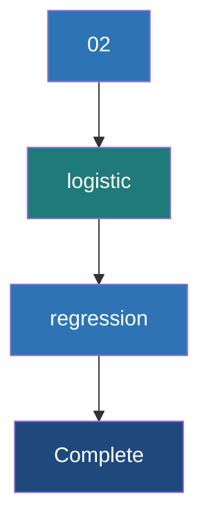

# Logistic Regression

**Logistic regression is a fundamental classification algorithm that models the probability of a discrete outcome given an input variable by applying the sigmoid function to a linear combination of features.**

## Why It Matters

Despite its name containing the word "regression," Logistic Regression is one of the most widely used *classification* algorithms in the world. It is the go-to baseline model for predicting binary outcomes: spam or not spam, click or no click, default or no default. It matters because it is highly interpretable, fast to train, and scales incredibly well across distributed clusters using Spark. Unlike black-box models, logistic regression provides explicit coefficients for each feature, allowing data scientists to explain exactly *why* a decision was made (e.g., "The model rejected the loan because the applicant's debt-to-income ratio coefficient is highly negative"). When working with massive datasets in Spark, establishing a strong, interpretable baseline with Logistic Regression is often the most critical first step before exploring more complex, computationally expensive algorithms.

## How It Works

At its core, Logistic Regression calculates a weighted sum of the input features, adding a bias term (the intercept). This is identical to linear regression. However, instead of outputting this continuous value directly, logistic regression passes it through a **sigmoid function** (also known as a logistic function). The sigmoid function, defined as $f(x) = 1 / (1 + e^{-x})$, has an S-shaped curve that maps any real-valued number into a value strictly between 0 and 1. This output is interpreted as the probability that the given instance belongs to the positive class.

The model defines a **decision boundary** to classify the outputs. By default, if the predicted probability is greater than or equal to 0.5, the model predicts the positive class (1). If the probability is less than 0.5, it predicts the negative class (0). This threshold can be adjusted depending on the specific use case—for instance, in medical diagnosis, you might lower the threshold to 0.1 to avoid missing potential cases of a disease (prioritizing recall over precision). Spark's `LogisticRegression` supports both binary classification and multinomial classification (where the target can have more than two categories).

Training the model involves finding the optimal weights (coefficients) that minimize the error between the predicted probabilities and the actual class labels. This is done using a cost function called **log-loss** (or cross-entropy loss). Log-loss heavily penalizes predictions that are confident but wrong. Spark optimizes this cost function using distributed optimization algorithms under the hood, such as Limited-memory BFGS (L-BFGS) or Iteratively Reweighted Least Squares (IRLS). Spark also allows for regularization (L1, L2, or ElasticNet) to prevent overfitting by penalizing large coefficient values.

## Flow Diagram



## Data Visualization

**Understanding the Sigmoid Transformation**

| Feature `X` (e.g., Credit Score) | Linear Output `z` (w*X + b) | Sigmoid Output `p` (Probability) | Prediction (Threshold=0.5) |
| :--- | :--- | :--- | :--- |
| 350 | -4.5 | 0.011 | 0 (Default) |
| 500 | -1.5 | 0.182 | 0 (Default) |
| 620 | 0.0 | 0.500 | 1 (Approve) |
| 750 | 2.5 | 0.924 | 1 (Approve) |
| 850 | 4.8 | 0.991 | 1 (Approve) |

*Notice how extreme negative values map close to 0, extreme positive values map close to 1, and exactly 0 maps to 0.5.*

## Code Example

```scala
// Scala example: Binary Classification with Logistic Regression using Spark ML
import org.apache.spark.sql.SparkSession
import org.apache.spark.ml.classification.LogisticRegression
import org.apache.spark.ml.feature.VectorAssembler
import org.apache.spark.ml.evaluation.BinaryClassificationEvaluator

// 1. Initialize SparkSession
val spark = SparkSession.builder()
  .appName("LogisticRegressionExample")
  .master("local[*]")
  .getOrCreate()

import spark.implicits._

// 2. Create sample data (Simulating a credit approval dataset)
// Columns: Income (thousands), Credit Score, Approved (Label)
val rawData = Seq(
  (50.0, 650.0, 0.0),
  (60.0, 700.0, 1.0),
  (40.0, 580.0, 0.0),
  (80.0, 750.0, 1.0),
  (120.0, 800.0, 1.0),
  (30.0, 600.0, 0.0)
).toDF("income", "credit_score", "label")

// 3. Assemble features into a single Vector column
val assembler = new VectorAssembler()
  .setInputCols(Array("income", "credit_score"))
  .setOutputCol("features")

val dataWithFeatures = assembler.transform(rawData)

// 4. Split data into training and test sets
val Array(trainingData, testData) = dataWithFeatures.randomSplit(Array(0.7, 0.3), seed = 1234L)

// 5. Instantiate and configure the Logistic Regression Estimator
val lr = new LogisticRegression()
  .setMaxIter(10)          // Maximum number of iterations for the solver
  .setRegParam(0.3)        // Regularization parameter
  .setElasticNetParam(0.8) // ElasticNet mixing parameter (0 for L2, 1 for L1)
  .setFeaturesCol("features")
  .setLabelCol("label")

// 6. Fit the model on the training data
val lrModel = lr.fit(trainingData)

// Print the coefficients and intercept
println(s"Coefficients: ${lrModel.coefficients} Intercept: ${lrModel.intercept}")

// 7. Make predictions on the test data
val predictions = lrModel.transform(testData)
predictions.select("features", "label", "rawPrediction", "probability", "prediction").show(truncate=false)

// 8. Evaluate the model using Area Under ROC
val evaluator = new BinaryClassificationEvaluator()
  .setLabelCol("label")
  .setRawPredictionCol("rawPrediction")
  .setMetricName("areaUnderROC")

val accuracy = evaluator.evaluate(predictions)
println(s"Area Under ROC = $accuracy")
```

## Common Pitfalls

*   **Multicollinearity:** Logistic regression assumes features are largely independent. Including highly correlated features can cause coefficients to fluctuate wildly, making the model unstable and uninterpretable.
*   **Scale Sensitivity:** Because logistic regression uses regularization by default in Spark, failing to scale features (e.g., using `StandardScaler`) will cause features with larger ranges to be penalized disproportionately.
*   **Imbalanced Classes:** If 99% of your labels are 0, a naive model predicting 0 all the time is 99% accurate. You must adjust class weights or use appropriate evaluation metrics (like PR-AUC) rather than raw accuracy.
*   **Non-linear Relationships:** Logistic regression assumes a linear boundary. If the relationship between features and the target is highly complex and non-linear, logistic regression will underfit unless you engineer complex polynomial features.

## Key Takeaway

Logistic regression provides a highly interpretable, fast-training, and mathematically sound baseline for classification tasks by mapping linear combinations of features to probabilities using the sigmoid function.

<br><br><br><br><br><br><br><br><br><br><br><br><br><br><br><br><br><br><br><br><br><br><br><br><br><br><br><br><br><br><br><br><br><br><br><br><br><br><br><br><br><br><br><br><br><br><br><br><br><br><br><br><br><br><br><br><br><br><br><br><br><br><br><br><br><br><br><br><br><br><br><br><br><br><br><br><br><br><br><br>
