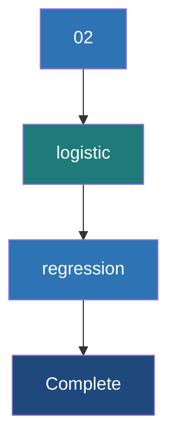

# Logistic Regression

**Logistic regression is a fundamental classification algorithm that models the probability of a discrete outcome given an input variable by applying the sigmoid function to a linear combination of features.**

## Why It Matters

Despite its name containing the word "regression," Logistic Regression is one of the most widely used *classification* algorithms in the world. It is the go-to baseline model for predicting binary outcomes: spam or not spam, click or no click, default or no default. It matters because it is highly interpretable, fast to train, and scales incredibly well across distributed clusters using Spark. Unlike black-box models, logistic regression provides explicit coefficients for each feature, allowing data scientists to explain exactly *why* a decision was made (e.g., "The model rejected the loan because the applicant's debt-to-income ratio coefficient is highly negative"). When working with massive datasets in Spark, establishing a strong, interpretable baseline with Logistic Regression is often the most critical first step before exploring more complex, computationally expensive algorithms.

## How It Works

At its core, Logistic Regression calculates a weighted sum of the input features, adding a bias term (the intercept). This is identical to linear regression. However, instead of outputting this continuous value directly, logistic regression passes it through a **sigmoid function** (also known as a logistic function). The sigmoid function, defined as $f(x) = 1 / (1 + e^{-x})$, has an S-shaped curve that maps any real-valued number into a value strictly between 0 and 1. This output is interpreted as the probability that the given instance belongs to the positive class.

The model defines a **decision boundary** to classify the outputs. By default, if the predicted probability is greater than or equal to 0.5, the model predicts the positive class (1). If the probability is less than 0.5, it predicts the negative class (0). This threshold can be adjusted depending on the specific use case—for instance, in medical diagnosis, you might lower the threshold to 0.1 to avoid missing potential cases of a disease (prioritizing recall over precision). Spark's `LogisticRegression` supports both binary classification and multinomial classification (where the target can have more than two categories).

Training the model involves finding the optimal weights (coefficients) that minimize the error between the predicted probabilities and the actual class labels. This is done using a cost function called **log-loss** (or cross-entropy loss). Log-loss heavily penalizes predictions that are confident but wrong. Spark optimizes this cost function using distributed optimization algorithms under the hood, such as Limited-memory BFGS (L-BFGS) or Iteratively Reweighted Least Squares (IRLS). Spark also allows for regularization (L1, L2, or ElasticNet) to prevent overfitting by penalizing large coefficient values.

## Flow Diagram



## Data Visualization

**Understanding the Sigmoid Transformation**

| Feature `X` (e.g., Credit Score) | Linear Output `z` (w*X + b) | Sigmoid Output `p` (Probability) | Prediction (Threshold=0.5) |
| :--- | :--- | :--- | :--- |
| 350 | -4.5 | 0.011 | 0 (Default) |
| 500 | -1.5 | 0.182 | 0 (Default) |
| 620 | 0.0 | 0.500 | 1 (Approve) |
| 750 | 2.5 | 0.924 | 1 (Approve) |
| 850 | 4.8 | 0.991 | 1 (Approve) |

*Notice how extreme negative values map close to 0, extreme positive values map close to 1, and exactly 0 maps to 0.5.*

## Code Example

```scala
// Scala example: Binary Classification with Logistic Regression using Spark ML
import org.apache.spark.sql.SparkSession
import org.apache.spark.ml.classification.LogisticRegression
import org.apache.spark.ml.feature.VectorAssembler
import org.apache.spark.ml.evaluation.BinaryClassificationEvaluator

// 1. Initialize SparkSession
val spark = SparkSession.builder()
  .appName("LogisticRegressionExample")
  .master("local[*]")
  .getOrCreate()

import spark.implicits._

// 2. Create sample data (Simulating a credit approval dataset)
// Columns: Income (thousands), Credit Score, Approved (Label)
val rawData = Seq(
  (50.0, 650.0, 0.0),
  (60.0, 700.0, 1.0),
  (40.0, 580.0, 0.0),
  (80.0, 750.0, 1.0),
  (120.0, 800.0, 1.0),
  (30.0, 600.0, 0.0)
).toDF("income", "credit_score", "label")

// 3. Assemble features into a single Vector column
val assembler = new VectorAssembler()
  .setInputCols(Array("income", "credit_score"))
  .setOutputCol("features")

val dataWithFeatures = assembler.transform(rawData)

// 4. Split data into training and test sets
val Array(trainingData, testData) = dataWithFeatures.randomSplit(Array(0.7, 0.3), seed = 1234L)

// 5. Instantiate and configure the Logistic Regression Estimator
val lr = new LogisticRegression()
  .setMaxIter(10)          // Maximum number of iterations for the solver
  .setRegParam(0.3)        // Regularization parameter
  .setElasticNetParam(0.8) // ElasticNet mixing parameter (0 for L2, 1 for L1)
  .setFeaturesCol("features")
  .setLabelCol("label")

// 6. Fit the model on the training data
val lrModel = lr.fit(trainingData)

// Print the coefficients and intercept
println(s"Coefficients: ${lrModel.coefficients} Intercept: ${lrModel.intercept}")

// 7. Make predictions on the test data
val predictions = lrModel.transform(testData)
predictions.select("features", "label", "rawPrediction", "probability", "prediction").show(truncate=false)

// 8. Evaluate the model using Area Under ROC
val evaluator = new BinaryClassificationEvaluator()
  .setLabelCol("label")
  .setRawPredictionCol("rawPrediction")
  .setMetricName("areaUnderROC")

val accuracy = evaluator.evaluate(predictions)
println(s"Area Under ROC = $accuracy")
```

## Common Pitfalls

*   **Multicollinearity:** Logistic regression assumes features are largely independent. Including highly correlated features can cause coefficients to fluctuate wildly, making the model unstable and uninterpretable.
*   **Scale Sensitivity:** Because logistic regression uses regularization by default in Spark, failing to scale features (e.g., using `StandardScaler`) will cause features with larger ranges to be penalized disproportionately.
*   **Imbalanced Classes:** If 99% of your labels are 0, a naive model predicting 0 all the time is 99% accurate. You must adjust class weights or use appropriate evaluation metrics (like PR-AUC) rather than raw accuracy.
*   **Non-linear Relationships:** Logistic regression assumes a linear boundary. If the relationship between features and the target is highly complex and non-linear, logistic regression will underfit unless you engineer complex polynomial features.

## Key Takeaway

Logistic regression provides a highly interpretable, fast-training, and mathematically sound baseline for classification tasks by mapping linear combinations of features to probabilities using the sigmoid function.

<br><br><br><br><br><br><br><br><br><br><br><br><br><br><br><br><br><br><br><br><br><br><br><br><br><br><br><br><br><br><br><br><br><br><br><br><br><br><br><br><br><br><br><br><br><br><br><br><br><br><br><br><br><br><br><br><br><br><br><br><br><br><br><br><br><br><br><br><br><br><br><br><br><br><br><br><br><br><br><br>


---

## 🎓 Deep Learning Questions

### Q1: Why Was This Concept Introduced?
Before logistic regression became a standard in machine learning libraries like Spark MLlib, dealing with binary classification problems using standard linear regression proved problematic. Linear regression predicts continuous numerical values, meaning predictions can easily exceed 1 or fall below 0. This makes interpreting the output as a probability mathematically incorrect and intuitively confusing. Logistic regression was introduced to solve this exact problem. It adapts the linear regression model by feeding the output of the linear equation into a sigmoid (logistic) function, effectively squishing the output between 0 and 1. Spark introduced Logistic Regression in its MLlib to provide a robust, distributed, and highly scalable algorithm for classification at scale. It overcomes the limitations of processing bottlenecks on single nodes by distributing the computation of the log-loss gradients across the cluster. 

### Q2: What Exactly Is This Concept and How Does It Work?
Logistic Regression is a statistical method for predicting a binary or multinomial outcome based on one or more predictor variables. It works by establishing a linear combination of the input features and their corresponding weights. This linear sum is then passed through a non-linear activation function—the sigmoid function for binary classification, or the softmax function for multinomial classification.

The sigmoid function $f(x) = \frac{1}{1 + e^{-x}}$ outputs a probability score between 0.0 and 1.0. During training, the algorithm iteratively adjusts the weights using an optimization technique like Limited-memory BFGS (L-BFGS) to minimize the log-loss (cross-entropy). The log-loss measures the discrepancy between the predicted probability and the actual class label. A threshold (typically 0.5) is then applied to the predicted probability to assign the final categorical class (e.g., probability > 0.5 becomes class 1, otherwise class 0).

### Q3: Where Should This Concept Be Used?
Logistic Regression shines in scenarios requiring high interpretability and baseline benchmarking. 
- **Banking:** Predicting credit card default or loan approval. Because it outputs feature coefficients, banks can mathematically explain why a loan was denied (e.g., to regulators).
- **Healthcare:** Diagnosing whether a tumor is malignant or benign based on cellular features, where understanding the risk probability is as critical as the final classification.
- **Retail & E-commerce:** Click-through rate (CTR) prediction for targeted advertising, classifying whether a user will click on an ad or not.
- **Spam Filtering:** Classifying emails as spam or ham based on word frequencies.

It should be used whenever you need a fast, simple, and explainable model running across billions of rows in a Spark cluster.

### Q4: Where Should This Concept NOT Be Used?
You should avoid Logistic Regression when the relationships between features and the target variable are highly non-linear or complex. If decision boundaries form circles or complex shapes, linear classifiers will fail to capture them without heavy feature engineering (like polynomial features).
- **Image Recognition:** It cannot capture spatial hierarchies in pixels; CNNs are preferred.
- **Deep NLP:** For complex language generation or understanding, transformer models outperform logistic regression.
- **High-Cardinality Categorical Features:** When dealing with thousands of sparse categorical variables without proper embedding, tree-based models like Random Forest or Gradient Boosted Trees often perform better without needing exhaustive one-hot encoding scaling.

### Q5: How Is This Concept Different from Hadoop?

| Aspect | Hadoop MapReduce | Apache Spark |
| :--- | :--- | :--- |
| **Architecture** | Disk-based intermediate stages. | In-memory distributed DAG execution. |
| **Performance** | Very slow for iterative algorithms like gradient descent. | 10x-100x faster for iterative ML algorithms due to memory caching. |
| **Processing Model** | Batch processing only. | Micro-batch, continuous processing, and interactive ML. |
| **Memory Usage** | Writes intermediate data to HDFS after every Map and Reduce. | Caches RDDs/DataFrames in memory for fast weight updates. |
| **Fault Tolerance** | Replication of data blocks on disk. | Lineage graphs recompute lost partitions dynamically. |
| **Scalability** | High, but bounded by disk I/O. | Extremely high, optimized by Catalyst optimizer and Tungsten. |
| **Ease of Development** | Complex Java boilerplate. | High-level APIs in Python, Scala, SQL, and R. |
| **Typical Use Cases** | Simple aggregations, heavy ETL. | Advanced machine learning (Logistic Regression, Trees, etc.). |
| **Advantages** | Can handle data larger than cluster memory natively. | Real-time analytics, rapid iterative model training. |
| **Disadvantages** | ML is impractically slow. | Can suffer OOM (Out Of Memory) if memory isn't tuned properly. |

### Q6: How Can This Concept Be Related to a Traditional RDBMS?
In a relational database, you typically rely on fixed business rules (e.g., `WHERE credit_score > 700 AND income > 50000`). Logistic Regression replaces rigid SQL logic with probabilistic learning.

| RDBMS Concept | Spark Logistic Regression Equivalent |
| :--- | :--- |
| `WHERE income > 50000 AND debt < 1000` (Hard Rules) | Learned decision boundary $w_1(income) + w_2(debt) + b > 0$ |
| Table Columns | Input Features (`VectorAssembler` output) |
| Target Column | Label Column (`label`) |
| `GROUP BY` Aggregations | Optimization loss gradients computed across data partitions |
| `UPDATE` table based on cases | Iterative weight updates via L-BFGS or gradient descent |

### Q7: What Happens Behind the Scenes?
When you call `lr.fit(trainingData)` in Spark, the following execution flow happens:
1. **Driver:** Initializes the LogisticRegression estimator, setting hyperparameters (max iterations, regularization).
2. **DAG Generation:** Spark generates a DAG for the iterative optimization process (e.g., L-BFGS).
3. **Tasks to Executors:** Spark distributes the `trainingData` DataFrame across worker nodes into partitions. 
4. **Gradient Computation:** Each executor computes the gradient of the log-loss function for its local partition of the data based on current weights.
5. **Aggregation (Shuffle/Reduce):** The partial gradients from executors are sent back to the driver or aggregated via a tree-reduce operation.
6. **Weight Update:** The driver updates the model's global weights based on the aggregated gradients.
7. **Iteration:** Steps 4-6 repeat until convergence or `maxIter` is reached.

```text
[Driver (Initial Weights)] 
       | (broadcasts weights)
       v
+-----------------------------+
|        Executors            |
| Partition 1 | Partition 2   |
| Calc gradients| Calc grads  |
+-----------------------------+
       | (Tree Aggregate)
       v
[Driver (Updates Weights via L-BFGS)] --> Repeat until Convergence
```

### Q8: Performance Considerations, Best Practices, and Common Mistakes

| Category | Recommendation | Why It Matters |
| :--- | :--- | :--- |
| **Data Preparation** | Use `StandardScaler` before training. | Regularization penalizes large weights. Unscaled features with large numerical ranges (e.g., salary vs. age) skew the penalization. |
| **Memory** | Cache the training dataset. | Logistic regression is iterative. Caching prevents re-reading data from disk on every optimization pass. |
| **Feature Engineering** | Avoid highly correlated features (Multicollinearity). | Correlated features make coefficients unstable and invalidate feature importance interpretations. |
| **Imbalanced Data** | Use `weightCol` for class weighting. | If positive classes are rare (1%), the model predicts 0 to achieve 99% accuracy. Weighting forces the model to care about minority cases. |
| **Regularization** | Tune `elasticNetParam` and `regParam`. | Prevents overfitting. Use L1 (1.0) for feature selection (sparsity) and L2 (0.0) for general weight decay. |

### Q9: Interview Questions

**Beginner**
1. **What is the difference between Linear and Logistic Regression?** Linear regression predicts continuous values using a straight line; logistic regression predicts probabilities using a sigmoid curve to classify data.
2. **Why do we use the Sigmoid function?** It squishes any real-valued number into a range between 0 and 1, allowing the output to be interpreted as a probability.
3. **What is the default classification threshold in Spark?** By default, Spark uses 0.5. Probabilities $\ge 0.5$ belong to the positive class (1).

**Intermediate**
4. **How does Spark optimize the weights for Logistic Regression in a distributed environment?** Spark uses iterative optimization algorithms like L-BFGS or IRLS, distributing the gradient calculations to executors and aggregating them on the driver to update weights.
5. **What does the `elasticNetParam` do in Spark's Logistic Regression?** It mixes L1 and L2 regularization. 0.0 means L2 (Ridge), 1.0 means L1 (Lasso), and a value in between blends both penalties.
6. **Why is scaling features important before fitting Logistic Regression?** Since Spark applies regularization by default, unscaled features will have heavily distorted penalties, leading to suboptimal convergence and incorrect feature importance.

**Advanced**
7. **How does multinomial logistic regression work in Spark?** Spark uses softmax regression (an extension of the sigmoid) to model probabilities across multiple classes, ensuring the sum of probabilities across all classes equals 1.
8. **Explain log-loss (cross-entropy) conceptually.** Log-loss measures the performance of a classification model by heavily penalizing false confidence. Predicting a probability of 0.99 for a class that is actually 0 results in a massive penalty.
9. **How do you handle highly imbalanced datasets in Spark Logistic Regression?** By setting a `weightCol` that assigns higher weight to minority class instances during the loss computation, or by using techniques like stratified sampling.

**Scenario-Based**
10. **Your model predicts everything as 'Class 0' and achieves 95% accuracy. What is wrong and how do you fix it?** The dataset is severely imbalanced. Accuracy is misleading. You should evaluate using the Area Under the Precision-Recall Curve (PR-AUC) and balance the classes using sample weights or SMOTE (via third-party libraries).
11. **You want to understand which features drive loan rejections. How do you extract this from Spark's Logistic Regression model?** You inspect the `lrModel.coefficients`. Large negative coefficients indicate features that drive the probability down towards class 0 (rejection), provided features were scaled properly.

### Q10: Complete Real-World Example

**Business Problem:** A telecom company (like Verizon or AT&T) wants to predict which customers are likely to churn (cancel their subscription) based on their monthly charges and customer tenure.

**Sample Dataset:** Telecom churn data with `tenure_months`, `monthly_charges`, and `churn_label` (1 = churned, 0 = stayed).

**Full working PySpark Code:**

```python
from pyspark.sql import SparkSession
from pyspark.ml.feature import VectorAssembler, StandardScaler
from pyspark.ml.classification import LogisticRegression
from pyspark.ml.evaluation import BinaryClassificationEvaluator
from pyspark.ml import Pipeline

# 1. Initialize SparkSession
spark = SparkSession.builder.appName("ChurnPrediction").getOrCreate()

# 2. Sample Dataset Creation
data = [
    (12.0, 75.5, 1.0),
    (48.0, 45.0, 0.0),
    (2.0, 85.0, 1.0),
    (60.0, 105.0, 0.0),
    (5.0, 50.0, 1.0),
    (72.0, 25.0, 0.0)
]
df = spark.createDataFrame(data, ["tenure_months", "monthly_charges", "label"])

# 3. Assemble features into a vector
assembler = VectorAssembler(
    inputCols=["tenure_months", "monthly_charges"], 
    outputCol="raw_features"
)

# 4. Scale features (Crucial for Logistic Regression with Regularization)
scaler = StandardScaler(
    inputCol="raw_features", 
    outputCol="scaled_features", 
    withStd=True, 
    withMean=False
)

# 5. Define Logistic Regression model
lr = LogisticRegression(
    featuresCol="scaled_features", 
    labelCol="label", 
    maxIter=10, 
    regParam=0.1
)

# 6. Build the ML Pipeline
pipeline = Pipeline(stages=[assembler, scaler, lr])

# 7. Train the model
model = pipeline.fit(df)

# 8. Make predictions on the training data (in reality, use test data)
predictions = model.transform(df)

# 9. Evaluate the model performance
evaluator = BinaryClassificationEvaluator(
    labelCol="label", 
    rawPredictionCol="rawPrediction", 
    metricName="areaUnderROC"
)
auc = evaluator.evaluate(predictions)
print(f"Area Under ROC: {auc}")

# 10. Extract Coefficients for Interpretability
lr_model = model.stages[-1]
print(f"Coefficients: {lr_model.coefficients}")
print(f"Intercept: {lr_model.intercept}")
```

**Step-by-step Execution Walkthrough:**
1. The `Pipeline` chains the `VectorAssembler`, `StandardScaler`, and `LogisticRegression`.
2. The `StandardScaler` normalizes the tenure and charges to have a standard deviation of 1.
3. The `LogisticRegression` estimator iteratively calculates the optimal weights (coefficients) to separate churners from non-churners using L-BFGS.
4. The model evaluates the ROC-AUC score, indicating the classifier's ability to distinguish between the two classes (values closer to 1.0 are better).
5. The extracted coefficients show which feature has a stronger push towards churn. 

**Performance Notes:** 
Pipelines ensure no data leakage between training and testing. Logistic Regression trains extremely fast here.

**When this approach is best:**
This approach is best when you need an interpretable, rapid-to-train model where stakeholders need to understand the explicit relationship between monthly charges, tenure, and churn risk.

### 💡 Key Takeaways
- Logistic regression predicts probabilities mapped between 0 and 1 using the sigmoid function.
- It is the standard baseline algorithm for binary classification tasks.
- Highly interpretable: model coefficients directly show feature importance and direction.
- Scaling features is critical because Spark applies regularization by default.
- Spark distributes optimization (L-BFGS) across executors for massive scale.

### ⚠️ Common Misconceptions
- **"It's a regression algorithm."** No, despite its name, it is fundamentally a classification algorithm.
- **"It can handle any data naturally."** False. It assumes linear separability. Highly non-linear boundaries require advanced feature engineering or different models.
- **"Accuracy is the best metric."** False. For imbalanced datasets (e.g., fraud detection), ROC-AUC or PR-AUC are far more reliable than raw accuracy.

### 🔗 Related Spark Concepts
- Spark ML Pipelines
- StandardScaler and VectorAssembler
- L-BFGS Optimization
- Linear Regression vs Logistic Regression

### 📚 References for Further Reading
- Apache Spark Official Documentation
- Learning Spark (O'Reilly)
- Spark: The Definitive Guide (O'Reilly)
